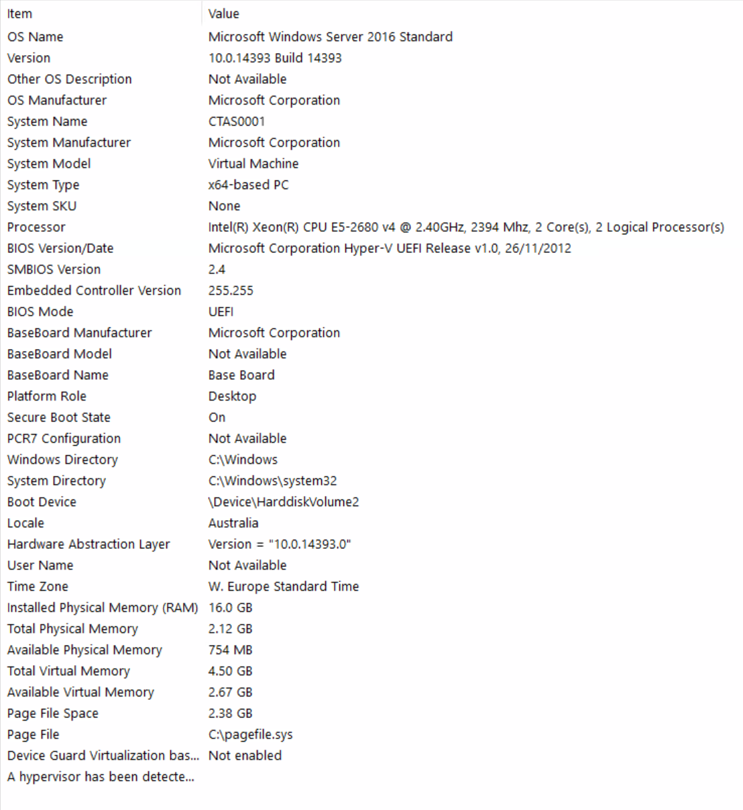
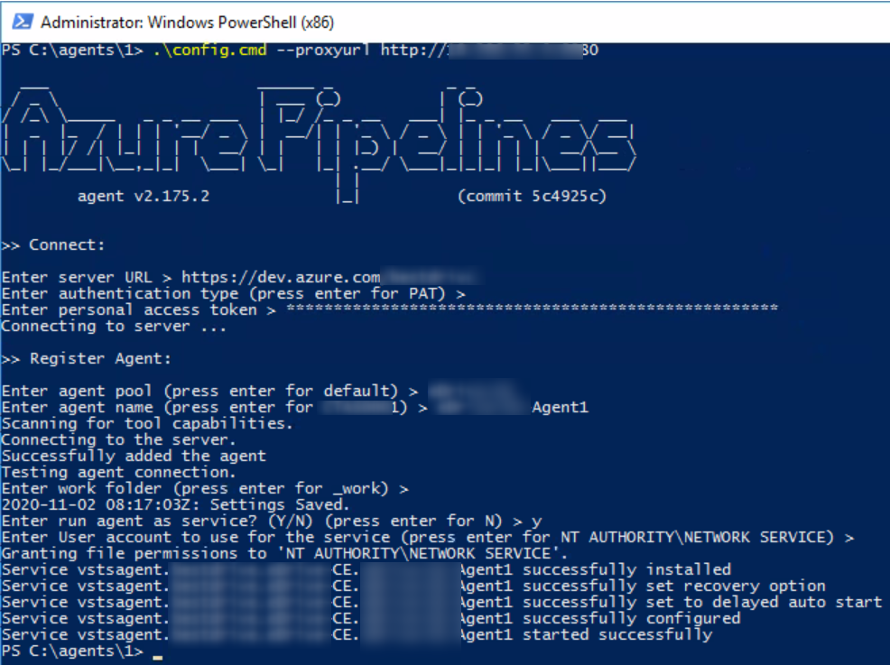
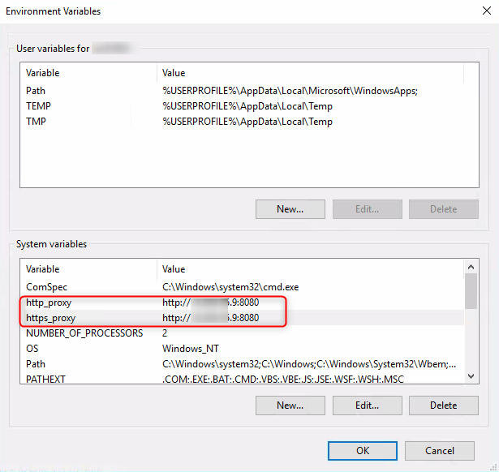

# Self Hosted Agent Setup

## Agent Hardware

The screen below shows a sample server running 2 Agents with BizApps Core Accelerator used by ~5 Developers/Consultants. The Deploy Pipeline is triggered for each Merge to Master and Guard Pipeline is triggered for each Push.

## Prerequisites

* Check the latest input from Microsoft planning your setup. [Link](<https://docs.microsoft.com/en-us/azure/devops/pipelines/agents/v2-windows?view=azure-devops#check-prerequisites>)
* If running behind a Proxy, check [Build Agent Connection Issues](../Troubleshooting/Build-Agent-Connection-Issues.md)
* PAT to access your Customer project
* Name of your Agent Pool (e.g. <projectname>-Pool)
* Name of your Agent(s) (e.g. <projectname-Agent1)
* Unzip the Agent (can be downloaed from DevOps) to c:\agents\_template

## Steps

* Copy the content of folder c:\agents\_template\vsts... into a new folder c:\agents\<new-number>.
* Open PowerShell as Administrator and navigate to the new folder c:\agents\<new-number>
* Run .\config.cmd --proxyurl http://XXX.XXX.XXX.XXX:XXXX (Note: `--proxyurl`only required if Proxy is used)
* Enter Server URL https://dev.azure.com/xxx
* Hit Enter so select PAT mechanism
* Enter PAT
* Enter Agent Pool name <projectname>-Pool
* Enter new Agent name <projectname>-CE-Agent6 (select correct number)
* Hit Enter to select default folder _work
* Select y to run agent as service
* Hit Enter to select AUTHORITY\NETWORK SERVICE as service account

## Proxy Handling

To allow the Build Agents to access the relevant sources (e.g. NuGet, NPM), the proxy must be defined as well as Environment Variables.

**Important:** Restart is required!

For most of the steps, the Proxy setting via Environment Variable should work. In case of issues, an option is to set Proxy userbased for the Networkservice. Before this is done, it must be verified that this cannot be sorted out by running `[System.Net.WebRequest]::DefaultWebProxy = new-object System.Net.WebProxy("http://XXX.XXX.XXX.XXX:XXXX")` in the required PowerShell script.
