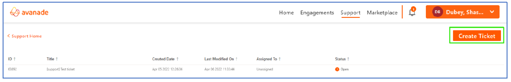
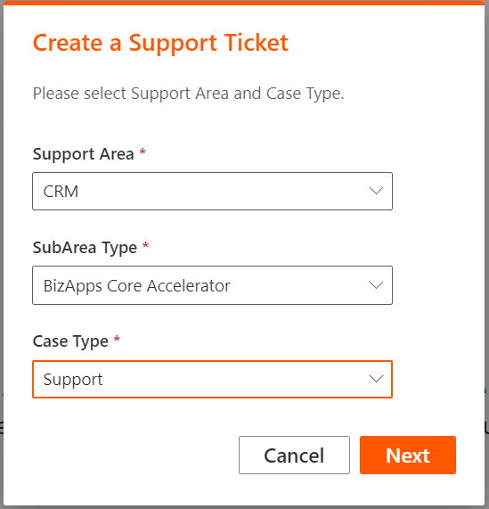
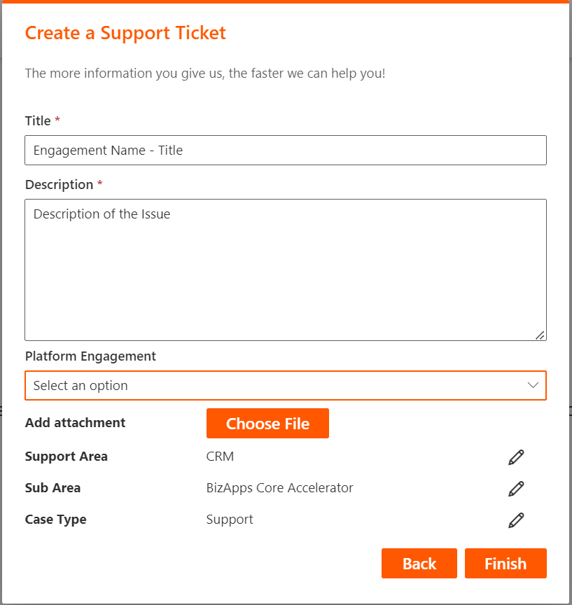
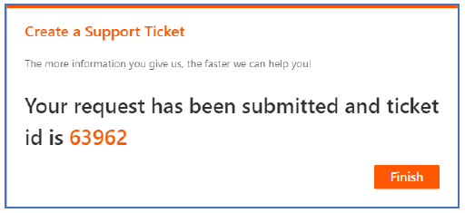
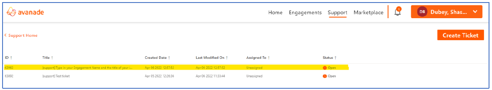
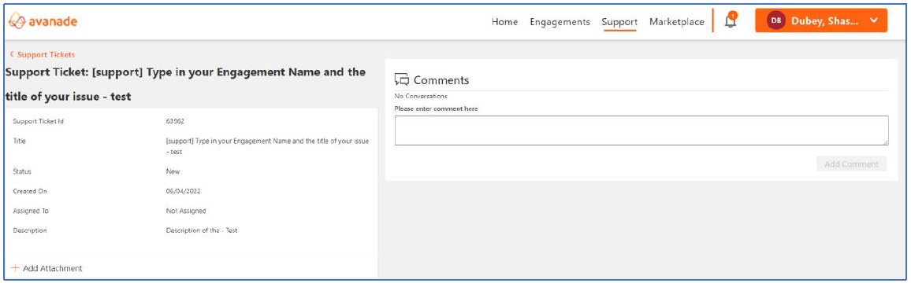

# Guide to create a support ticket

This page guides you how to create a support ticket for BCA related issues/sugesstions or feedbacks.

1. Log on to – [Avanade Platform](https://platform.avanade.com)
1. Click on the **Support** menu (highlighted in the below screenshot).
  
1. Click on the **View Support** button in the screen (highlighted below).
  
1. This screen will list all your tickets along with their status. Click on the **Create Ticket** button.
  
1. Fill in the details as per the below image. Select case type as per your need and click on **Next**.
  
1. Enter the details in below format. Title as – “Engagement Name – The title of the issue” and add the attachment if applicable. Post entring in the required fields, Click on **Finish** button.
  
1. Then a screen with the support ticket number will appear for future reference.
  
1. Later you may check the status of the ticket from the support dashboard.
  
1. To see or provide additional comments, you'll need to click on the ticket and post it in the comment section.
  
