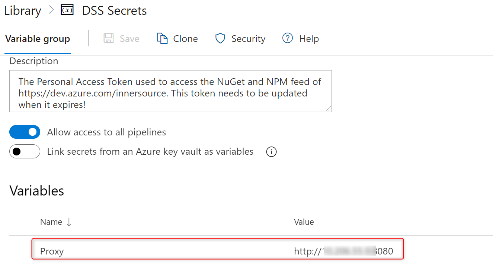
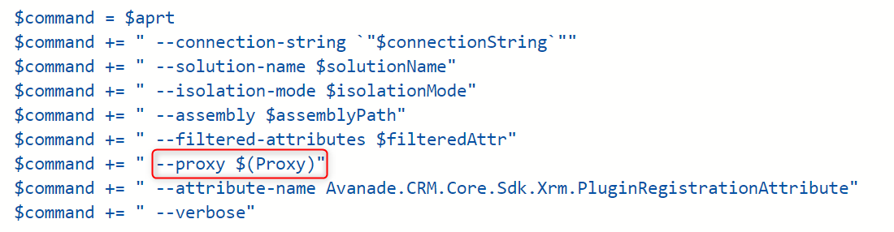
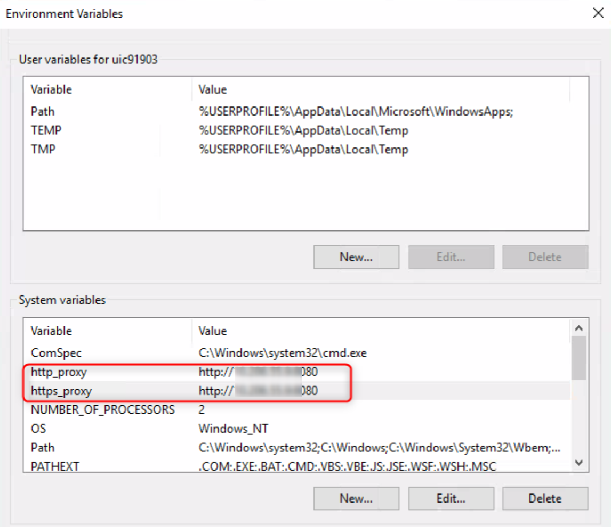

# Build Agent Connection Issues

When the build agent fails to connect to online services, such as Azure DevOps, Dataverse or NuGet, it might be related to an invalid proxy configuration. Depending on the used Service Account of the Agent (e.g. Network Service) and the Org settings of the customer, one or both of the below settings are required.

## Script based configuration

To fix this, make sure to include the following line at the top of every powershell script that needs to route traffic through the proxy.

```
[System.Net.WebRequest]::DefaultWebProxy = New-Object System.Net.WebProxy("http://10.1.1.1:8080") # Replace with the actual proxy ip and port
```
In case this is not sufficient (e.g. for some of the Avanade Toolings), also a Proxy Variable can be created int he Pipeline and can be set in the relevant calls.





## Environment based configuration

On Environment level, System Variables can be configured.
Restart after applying the settings is required.




