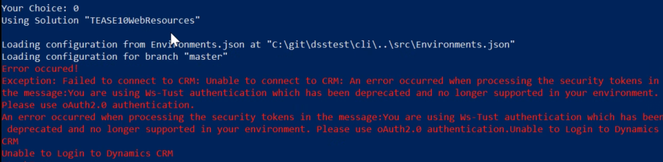

# Ws-Trust authentication has been deprecated

The error message can happen if your environment was created ~CW40. The Username and Passwort appraoch is not supported anymore. See also announcements of Microsoft:

* [Authenticate Office365 Deprecation](<https://docs.microsoft.com/en-us/powerapps/developer/common-data-service/authenticate-office365-deprecation>)
* [Deprecation of Office365 authentication type and OrganizationServiceProxy class for connecting to Common Data Service](<https://docs.microsoft.com/en-us/power-platform/important-changes-coming#deprecation-of-office365-authentication-type-and-environmentserviceproxy-class-for-connecting-to-common-data-service>)

If you see this error using the `dss-cli.ps1`, just change the ConnectionString for your environments in the Configuration.json to the oAuth format described in the [Microsoft documentation](<https://docs.microsoft.com/en-us/powerapps/developer/common-data-service/xrm-tooling/use-connection-strings-xrm-tooling-connect>).

`"ConnectionString": "AuthType=OAuth;  Username={{CustomizationMasterId}}; Password={{CustomizationMasterSecret}}; Integrated Security=true;  Url=https://YOURORG.dynamics.com;  AppId=51f81489-12ee-4a9e-aaae-a2591f45987d;  RedirectUri=app://58145B91-0C36-4500-8554-080854F2AC97;  TokenCacheStorePath=c:\\MyTokenCache;  LoginPrompt=Auto"` 

**Note:** The AppId and the RedirectUri can be used as it is. Just change the URL for your Organization accordingly.
