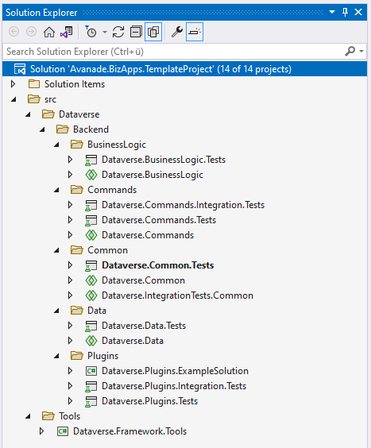

# Testing 101
Since the BizApps Core Accelerator promotes the usage of dependency injection and -inversion - testing any backend related code pieces can be done with minimal effort.

## Structure

Every Visual Studio solution contains test projects correlated to their respective domain. For instance Xrm.BusinessLogic.Tests contains tests targeting classes inside the Xrm.BusinessLogic project.



## Test class structure

An example test class looks like this:

```csharp
using Microsoft.VisualStudio.TestTools.UnitTesting;

namespace Avanade.DSS.TemplateProject.Xrm.BusinessLogic.Tests.Services
{
    [TestClass]
    public class MyServiceTests
    {
        [TestInitialize]
        public void SetUp()
        {

        }

        [TestMethod]
        public void TestSomething()
        {

        }
    }
}
```

Focus on the attributes above the class and its methods.

|Attribute|Description|
|----------|-------------|
|TestClass|The TestClass attribute denotes a class that contains unit tests|
|TestInitialize|This method is called once before each test after the constructor|
|TestMethod|The TestMethod attribute indicates a method is a test method|

There are more attributes which can be used but are typically not needed in standard test scenarios. You can view more options [here](https://www.meziantou.net/mstest-v2-test-lifecycle-attributes.htm) and some general introduction [here](https://channel9.msdn.com/Shows/On-NET/Writing-tests-with-MSTest-v2).

### Naming

#### Classes
The test class should have the same name as the class which gets tested + "Tests" as a suffix.

|Class|Test equivalent|
|-----|---------------|
|AccountValidator|AccountValidatorTests|
|UserTeamsMapping|UserTeamsMappingTests|
|PricingCalculator|PricingCalculatorTests|

#### Methods
Methods should comply to the following pattern: [StateUnderTest]_[ExpectedBehavior]. 

- ReturnsEmpyList_WhenUserIsMissingPrivileges()
- UpdatesPrimaryContact_WhenAccountHasDelegation()
- ThrowsException_WhenAccountIsMissingRevenueValue()

### AAA Pattern
A test method follows the AAA (Arrange, Act, Assert) pattern which is a common way of structuring unit test methods.

- The Arrange section of a unit test method initializes objects and sets the value of the data that is passed to the method under test.

- The Act section invokes the method under test with the arranged parameters.

- The Assert section verifies that the action of the method under test behaves as expected.

Please see the examples below where this pattern gets applied.

## Mocking

An object under test may have dependencies on other (complex) objects. To isolate the behavior of the object you want to replace the other objects by mocks that simulate the behavior of the real objects. This is useful if the real objects are impractical to incorporate into the unit test.

Services, which contain the actual business logic of the solution, contain references to other classes to fulfill their requirement. These references are hard dependencies which the service depends on. 

Since all dependencies should be abstracted away using interfaces - these interfaces are being used to mock/simulate any given behavior.

### NSubstitute
Although mock objects can be created manually this process takes a lot of effort and maintenance. Instead of that we're using NSubsitute to mock dependencies on the fly. Feel free to read [its documentation](https://nsubstitute.github.io/help/getting-started/). The reason why we've chosen NSubstitute is its simplistic and production code like syntax instead of Moq's lambda expression type of setup mechanism. This applies for any code - brain processing time matters.

All examples in this chapter will showcase how to mock objects using NSubstitute.

## Assertion

Assertions verify that a given action behaved or contains a value as expected.

Microsoft ships the ``` Assert ``` helper class with the testing framework. This class contains methods which provide numerous equality validations. The way how assertions are written and the way how errors are getting logged was the drive why we've chosen to utilize [Shouldly](https://docs.shouldly.io/) instead of Microsoft ``` Assert ``` class.

The old way:
```csharp
Assert.AreEqual(contestant.Points, 1337);
```

provides an output likes this:

```
Expected 1337 but was 0
```

Shouldly's way:
```csharp
contestant.Points.ShouldBe(1337);
```

which creates an output like this:
```
contestant.Points should be 1337 but was 0
```

As you can see above the example with Shouldly is simpler, terse and on point.