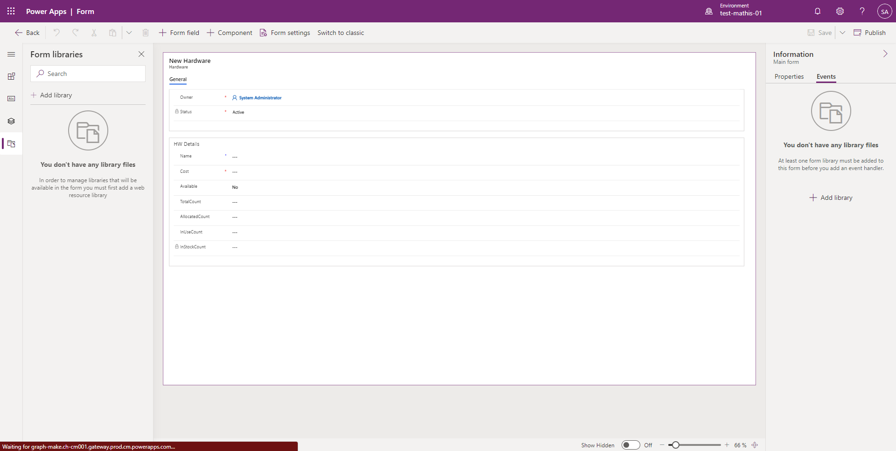
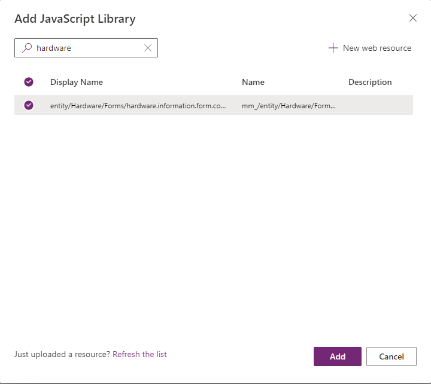
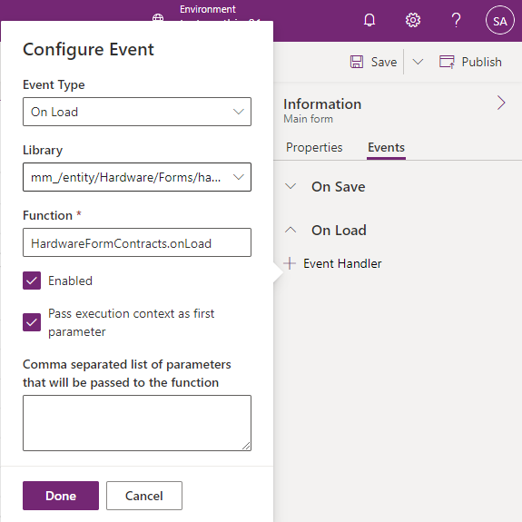

# Register Form Scripts

Registering the from scripts in a Model Driven App Form is pretty straight forward. This guide will shortly cover the process of the registration.

To register a form script, firstly make sure it's deployed to the Dataverse environment. You can either use the `Local.Deployment.CLI.ps1` script or use the CI/CD pipeline when you have set up an Azure DevOps environment. After this is done you can open the form customization, where you want to add your script. In this case I'm going to register a script on a custom Form called Hardware. In order to do so navigate to the Form you want to register the script to. On the right click on the **Event** tab within the Information panel.

Click on the **Add library** button to open the following dialog. Search for the script you want to register, select it and press to **Add** button. When you follow the default naming schema of the **BizApps Core Accelerator** the name of your resource will be `[EntityName].form.contract.js`, so in this case `hardware.information.contract.js`.

Then go ahead and add a **Event Handler** for the **On Load** event with the following details:

- **Library:** Select the library you registered in the **Form Libraries** section
- **Function**: Point to the `onLoad` function of your contract. In this case `HardwareFormContracts.onLoad`
- **Pass execution context as first parameter**: Select this checkbox

In the end it should look something like this:

In case you want to register an OnSave-Handler you can do this aswell. Simply point to the `HardwareFormContracts.onSave` instead of the `onLoad` function.