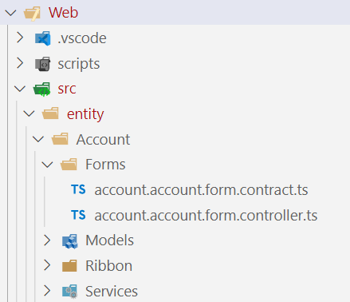

# Writing Form Scripts
## Structure

Form scripts written using the BizApps Core Accelerator can be written on a per model driven app form bases or can be made reusable for multiple forms.

Before digging into any details lets look at the basic folder structure of the web folder.



All form scripts related to a given entity and its respective forms are stored inside the following follow structure src -> entity -> Entity name -> Forms.

## Naming

Since form scripts are typical used on a per entity + form bases the name of the contract and controller files reflect exactly that and the format looks like this:

```[entity name].[form name].form.[contract/controller].ts```

So the example form script seen above is used for the entity account and the form with the name "account". If we would write a form script for the "Information Form" the files would be named like this:

```account.information.form.contract/controller.ts```

## Contract and Controller

The BizApps Core Accelerator uses two distinct files which serve different kinds of purposes.

### Contract

The *.contract.ts file serves two purposes:
- Enforcing a singleton pattern for the controller class living in the *.controller.ts file.
- Provide entry point methods which are being used for the registration of the form script. See [here](Register-Form-Scripts.md) on how to register form scripts.

The methods the contract provides are:

|Method|Purpose|
|------|-------|
|onLoad|Calls the ```.init``` method on the controller |
|onSave|Calls the ```.save``` method on the controller|

### Controller

The controller contains all high level form interaction like ```attribute.addOnChange(...)```. The default controller template contains just an ```.init``` method which, as stated above, gets called by the contract class.

#### Constructor

As described [here](../Early-Bound-Forms.md) the BizApps Core Accelerator provides Early Bound Forms. After generating the form as described in the Wiki entry you can simply create an instance off it in the controller's constructor like this:

```ts
    constructor(dynamicsContext: DynamicsContext) {
        this._dynamicsContext = dynamicsContext;
        this._formContext = dynamicsContext.formContext;

        this._form = new AccountFormObject(this._formContext);
    }
```

#### Added form/attribute scripts

The init method is being used to add all necessary attribute change handlers. For example:

```ts
    init() {
        this._form.PrimaryContactIdAttribute.addOnChange(async () => {
            await this._contactModel.loadData(this._form.PrimaryContactIdAttribute);
            this.fireContactModelChanged();
        });
        this._form.PrimaryContactIdAttribute.fireOnChange();

        this._form.CreditLimitAttribute.addOnChange(() => {
            this.creditLimitChanged();
        });
        this._form.CreditLimitAttribute.fireOnChange();
    }
```

As you can see the BizApps Core Accelerator provides the same interface as the CRM Sdk but instead of using ``` this._formContext.getAttribute("name").addOnChange(...)``` where depending on concrete attribute classes which are type aware and even take care of value adjustments when setting its value.