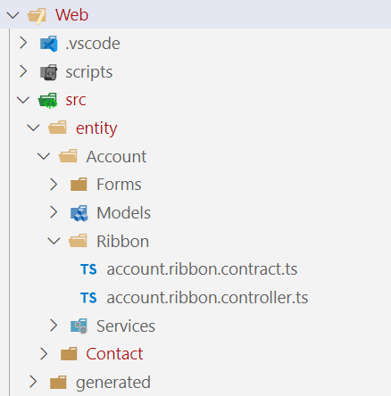

# Writing Ribbon Scripts

## Structure

The basic folder structure of the Visual Studio solution looks like this:



All ribbon scripts related to a given entity and its respective forms are stored inside the following follow structure src -> entity -> Entity name -> Ribbon. 

## Naming

Ribbon scripts are typical used on a per entity bases so the name of the contract and controller javascript file reflect exactly that and the format looks like this:

```[entity name].ribbon.[contract/controller].js```

So the example ribbon script seen above is used for the entity account so the files will look like this:

```account.ribbon.contract/controller.js```

## Contract and Controller

The BizApps Core Accelerator uses two distinct files which serve different kinds of purposes.

### Contract

The *.contract.ts file serves two purposes:
- Enforcing a singleton pattern for the controller class living in the *.controller.ts file.
- Provide entry point methods which are being used to register ribbon rules. See [here](Register-Ribbon-Rules-and-Actions.md) on how to register ribbon scripts.

The methods the contract provides are:

- executeAction
- executeRule

Both methods are dispatching individual executions, depending on the command id, to their respective controller methods.

To register a new action simply extend the switch block inside of the executeAction function like this:

```ts
    switch (ribbonContext.commandId) {
    case "MyCustomAction.OnClick":
        controller.doSomething();
        break;
    default:
        console.log(`"No action found with id ${ribbonContext.commandId}"`);
    }
```

A similar syntax can be used inside of the executeRule method' switch statement as well but it expects a return value (true/false):

```ts
    switch (ribbonContext.commandId) {
        case "Unsubscribe.IsEnabled":
            return controller.isMyCustomButtonEnabled();
        default:
            console.log(`"No rule found with id ${ribbonContext.commandId}"`);
            break;
    }
```

### Controller

The controller contains the actual implementation behind a given action/rule. The controller class will typically call another class to execute a wanted behavior/business logic.

Please look at the Typescript introduction page [here](../Typescript.md) to learn more about modules and extract business logic into distinct classes.