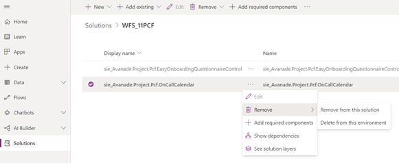
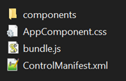
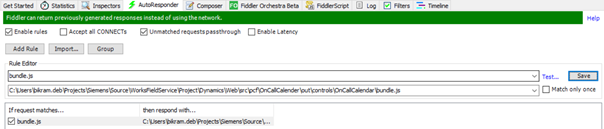
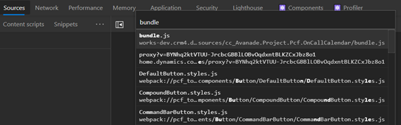

# PCF Guidelines

## How to Get Started with PCF

- Any new development involves a lot of time-consuming processes.
  Before taking decision in favor of developing a PCF component from
  scratch, take a look
  at [https://pcf.gallery](https://pcf.gallery/). There are
  numerous resources that can serve as inspiration.

**Please be aware that the use of third party controls is not recommended by Avanade as they introduce an additional layer of risk and require that the project go through a formal Open Source Software scan at a cost of roughly $1000 for each execution.**

- Go through
  Microsoft\'s standard [documentation](https://docs.microsoft.com/en-us/powerapps/developer/component-framework/implementing-controls-using-typescript) on
  how to start with PCF controls development and make yourself
  comfortable with frequently used below CLI commands.

- Basic steps:

  **Initialize a new PCF project**

  `pac pcf init --namespace SampleNamespace --name FirstPCFComponent --template field`

  **Install all npm dependencies**

  `npm install`

  **Build the PCF component**

  `npm run build`

  **Initialize an empty solution to package the PCF component**

  `pac solution init --publisher-name developer --publisher-prefix dev`

  **Add the PCF project to solution**

  `pac solution add-reference --path c:\\FirstPCFComponent`

  **Restore all nuget packages required for the solution**

  `msbuild /t:build /restore`

  **Build the solution package**

  `msbuild`

- PCF development demands prior understanding/experience of working
  with npm, TypeScript and React JS.

- If the project contract has scope for unit test coverage of client
  side code, developers need to understand the use of [Jest and
  Enzyme](https://enzymejs.github.io/enzyme/docs/guides/jest.html) as
  they play well together to test any React based code.

## Recommended Dev Tools & Technologies

- VS Code as editor

- VS Code extension \'Prettier\' for code formatting

- Fiddler AutoResponder for faster debugging of new code change

- npm

- React JS

- Optional: [Jest and
  Enzyme](https://enzymejs.github.io/enzyme/docs/guides/jest.html) node
  modules for JS unit testing

## Best Practices

### Coding Standards

- As TypeScript is used for PCF development, it supports modern
  programming concepts such as Interfaces, Generics, Inheritance
  etc. Make the best use of it.

- Follow [TypeScript coding
  guidelines](https://github.com/Microsoft/TypeScript/wiki/Coding-guidelines).

- [Enable Prettier in VS
  Code](https://marketplace.visualstudio.com/items?itemName=esbenp.prettier-vscode) to
  auto format the code on every save of a code file.

- Remove any leftover `debugger` and `console.log()` statements after
  their purpose is met.

- While writing a custom component, always use props to pass
  values from parent component to child component.

- To refresh rendering of a custom component, always
  use `setState()` method. Do not use DOM manipulation to update
  UI. This is because, since React runtime manages the lifecycle
  of a PCF component, manipulating the underlying browser DOM
  elements through JS code will break the intention behind the way
  React is meant to work. This might further introduce abnormal
  behavior and even make extension of the custom component
  difficult for new developers.

- Avoid applying fancy CSS styling on standard UI elements such as
  textbox, dropdownlist, label, button etc. Instead use the
  default styling that comes with
  the office-ui-fabric-react module. This will make sure PCF
  control\'s custom UI rendered by browser, has a similar look and
  feel to that of Dynamics UI.

### Deployment (in Dev environment)

Usually Dynamics development is done using unmanaged solution in Dev environment. If we follow the same approach to deploy unmanaged PCF solution in Dev environment, the changes don\'t reflect. Hence, before redeploying the updated PCF solution in Dev environment, below are steps to be followed.

- Remove the controls from wherever they are used like fields and
  views and publish.

- Go to Solutions section
  in [make.powerapps.com](https://make.powerapps.com/)

- Open the existing PCF solution, delete the respective control
  and publish.

  

- Import the newly build unmanaged PCF solution to Dev environment and
  reregister controls wherever they were registered before.

### Debugging & Troubleshooting

Assuming we are troubleshooting PCF component in Dynamics environment and not through local test harness, it can be really painful to follow all the steps above each time a Developer tries to deploy and test a new feature or troubleshoot a bug as there can be multiple deployments needed before achieving the desired behavior. The intermediate deployments can be avoided though by just building PCF control and loading the exact bundle.js that gets generated in \"out\" directory. Here are the steps those help in achieving this.

- After the code change, build the PCF component using the
  command `npm run build`.

- Go to the `out` directory where the control is built and
  bundled.

  

- Run Fiddler and setup its AutoResponder feature. The main intention
  here is to override the deployed version of bundle.js which gets
  downloaded when the PCF control loads, with the locally built
  version. Create and enable the rule that looks something like below.

  

- Use above approach to quickly load and test any css files if needed.

- Load the Dynamics form or view where the control is in use. This
  should load the debuggable version of local bundle.js and the
  standard browser DevTools can be used to debug the code.

  

### Deployment (in other environments)

To make sure PCF component changes are reflected in downstream environments post deployment,

- build the PCF package as managed solution

- upgrade the version of the component in the
  ControlManifest.Input.xml and the solution version in
  Solution.xml.

### Unit Testing

- For each class implemented in PCF component, implement and export its base Interface. This will help mocking instances of the said class.

- While loading and unit testing a component using Enzyme, prefer [shallow](https://enzymejs.github.io/enzyme/docs/api/shallow.html) mounting the component to avoid handling the exceptions caused by loading of child components.
