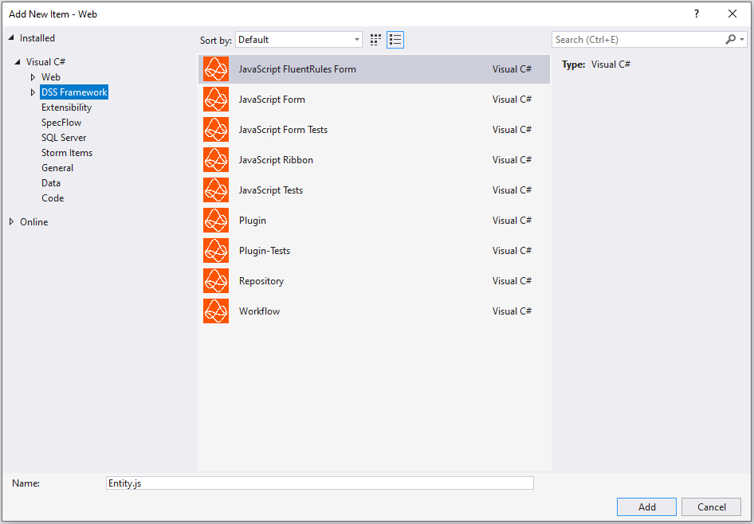
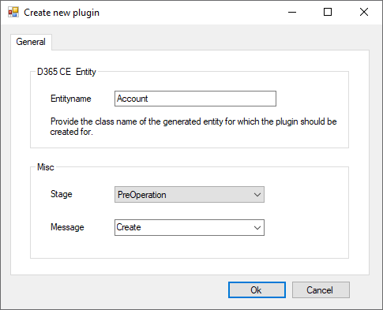

# Visual Studio Extension

## Introduction
To increase velocity and ease the learning process we've created a Visual Studio Extension which contains all templates used throughout the framework.
The templates are available after running the [Setup development machine](Setup-development-machine.md) via the DSS-CLI (dss-cli.ps1).

## Templates
These templates are being added to Visual Studio's Add -> New Item wizard under section "BizApps Core Accelerator".

Below is a list of all available templates:
- Backend
    - Plugin
    - Plugin-Tests
    - Workflow
    - Repository
- Frontend
    - Form-Script
    - Form-Script-Tests (jest)
    - Ribbon-Script
    - [Opt-In] FluentRules Form-Script

The list of available templates are depending on the project type itself. Backend projects (Plugins, Data, BusinessLogic) don't show Javascript related templates. Opening the Web project will show all (including .cs templates) because Web projects act as both Javascript & C#.

## Customization
Some templates prompt for additional information (e.g. Plugin) to pre-populate the resulting file with the right information. 

The above mentioned plugin wizard will ask for the entity for which the plugin will be used and the message for which the plugin should be executed.

## Filename
In the "New Item Wizard" you can specify a filename. This filename may sometimes not be used (e.g. Form-Scripts) because the to be created files are following a naming convention or multiple files are being created (e.g. Form-Scripts: xxx.contract.js & xxx.controller.js)

## Trouble Shooting
In case the setup via the script (cli) is not working and you cannot see the templates in the Visual Studio UI, you can install the extension manually.

- Close all Visual Studio instances on your machine
- Navigate to [Artifacts](<https://dev.azure.com/innersource/DSS-Framework/_packaging?_a=feed&feed=DSS>) in BizApps Core Accelerator
- Scroll down to `BizApps Core Accelerator.Extensions`
- Select `... --> Downlad <versionnumber>`
- Unzip the nupkg file
- Navigate to content folder
- Doubleclick `DSS%20Framework%20Extension.vsix`
- Confirm dialog by clicking `Install`

After starting Visual Studio again, the Context Menu is available.