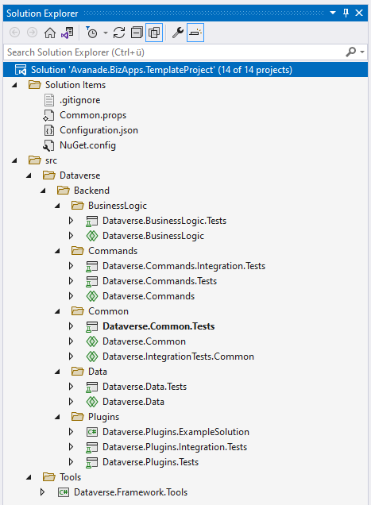

# Visual Studio Solution

{ align=right }

When opening up the Visual Studio solution in the root of your project, the solution structure should look like on the picture on the right side. There are quite a few projects in there, each with its own purpose that you need to understand. So let's break it down!

??? info "Your project structure might look different!"

    Depending on which modules you have selected during the creation with the **BizApps Platform**, you might be lacking different project in your solutions.

## Base Projects

- **Dataverse.Framework.Tools**  
    Empty project that only contains the NuGet references to the BizApps Core Accelerator tools.
    You can use the NuGet Package Manager from Visual Studio to update these tools.

- **Configuration.json**  
    Main configuration file for the framework. Contains information about the Dataverse environments, Solutions, Publisher Information, ...

## Backend Base Projects

- **Dataverse.Common**  
    The base project that contains common code. By default, it only consists of the [Early Bound Entities](../../development/Backend/Early-Bound-Entity-Classes.md), but it is the perfect place for you to put common code like extension methods, helper classes, etc.
- **Dataverse.Data**  
    Contains [Repositories](../../development/Backend/CRUD-operations.md) that allow you to interact with Tables in Dataverse.
- **Dataverse.BusinessLogic**  
    The location for all business logic, so your actual application code.
- **Dataverse.Plugins**  
    Contains all your Dataverse Plugins (`#!csharp IPlugin`).

!!! note "Test Projects are not listed"
    Note that for each project there is a dedicated unit test project that is not included in the list above.

## Backend Extension Projects

- **Dataverse.Commands**  
    Contains command definitions that are used by the frontend to execute specific actions in the backend.
- **Dataverse.Workflows**  
    (Optional - need to be installed separately) Contains custom workflow activities. Should not be used with cloud instances.

