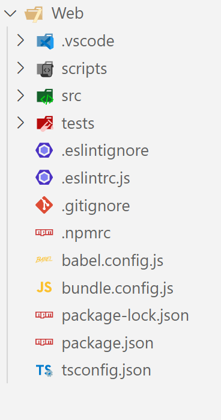
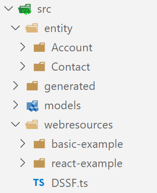

# Frontend Project

While it is possible to use the *Web* project in Visual Studio to develop frontend code, it is not recommended. Instead, Visual Studio Code should be used. Open the example-project.code-workspace file in VS Code (File -> Open Workspace from file). Afterwards, you will be presented with the below project structure.

## Project Structure

{ align=left style="width: 15rem" }

On the left hand side you can see the default structure of the web project. As usual with frontend projects, there are several configuration files required to make everything work. Fortunately, the template provides default values for all those configuration files, so you don't need to worry about them. Still, it is good to know about which configuration files exists and why, so please read through the list below.

### Configuration Files

| 
File Name
 | Area               | Description                                                                                                                               |
| ---------------------------------------- | ------------------ | ----------------------------------------------------------------------------------------------------------------------------------------- |
| `.eslintignore`                          | Linting            | Provides a list of files/folders to exclude from linting.                                                                                 |
| `.eslintrc.js`                           | Linting            | Configures your linting settings. Already comes pre-configures, but can be adjusted to your personal style.                               |
| `.gitignore`                             | Source Control     | Specifies files that are ignored and not controlled with git.                                                                             |
| `.npmrc`                                 | Package Management | Configures the package feeds for npm.                                                                                                     |
| `package.json`                           | Package Management | Contains all your dependencies and installed npm packages.                                                                                |
| `babel.config.js`                        | Bundling           | Controls the compilation settings of your project. Comes pre-configures and usually doesn't need to be adjusted.                          |
| `bundle.config.js`                       | Bundling           | Specifies which files need to be bundled and registered in the Customization Master (via the [deploy code pipeline](../../Pipelines/dataverse-deploy-code.md)). All new form scripts and web resources need to be added in here (see [here](../../development/Frontend/Bundling.md) for more information).  |
| `tsconfig.json`                          | Bundling           | Controls the Typescript settings for your project. Is pre-configured and usually doesn't need to be adjusted.                             |

In addition to the configuration files, there are three important folders left:

- **`scripts`**: Various scripts to build your web project. Comes fully setup and doesn't need to be touched.
- **`src`**: All your source code. It is explained in detail down below.
- **`tests`**: Your frontend unit tests.

### The `src` Folder

{ align=left style="width: 15rem" }

As explained above, the `src` folder contains all your frontend source code, so Form Scripts, Ribbon Scripts and Web Resources. It consists of four folders:

- **`entity`**: Form Scripts and Ribbon Scripts. For each entity a sub folder is created, as can be seen in the screenshot.
- **`generated`**: The Early Bound Entities and Forms for the frontend.
- **`models`**: Common models that are used by multiple forms, ribbon scripts and webresources.
- **`webresources`**: All Web Resources, which can either be plain HTML, CSS, JS/TS files or complete projects like React, Angular or Vuejs.