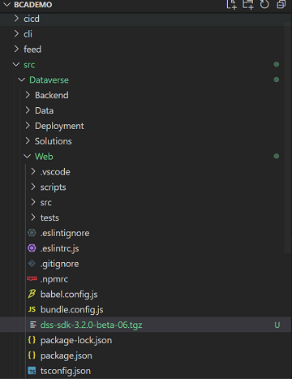
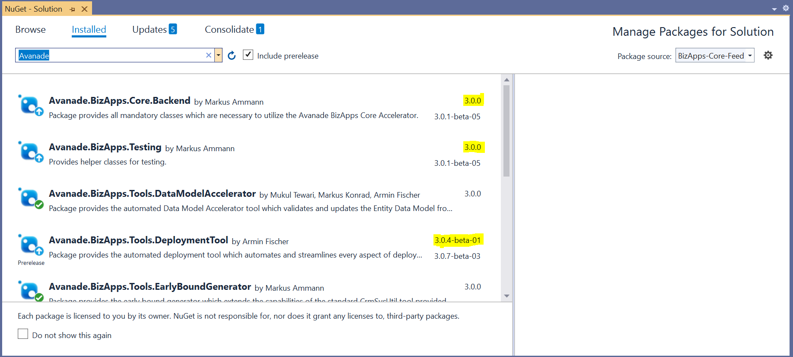
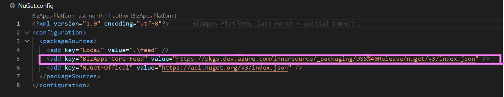

# Local Feed Setup

This page provides instructions to setup the BCA feeds in project repository to eliminate the dependency on innersource.

## Frontend Feed Setup

{ align=left }

*   Download the required version of **@avanade/dss-sdk** (mentioned in **package.json** file) from [BCA Feeds](https://dev.azure.com/innersource/DSS-Framework/_packaging?_a=feed&feed=DSS%40Release)
*	Place the package in the web folder (**src\Dataverse\Web**) as shown in the picture.

*	Open Command prompt in the web folder (**src\Dataverse\Web**) and install the package   
```npm install dss-sdk-3.2.0-beta-06.tgz```
*	Once the installation completes the **package.json** and **package-lock.json** files will be automatically modified to resolve the package from the file.
*	Delete {--.npmrc--} file in (**src\Dataverse\Web**)
*	Execute ```npm run build``` to verify the project builds successfuly.
    
*	Push the changes to the git repository

## Backend Feed Setup
1. Open the solution in Visual Studio
2. Identify the packages with specified version required for the projects by Navigating to **Tools** -> **Manage Nuget Packages** -> **Manage Nuget Packages for Solutions**

3. Download NuGet packages required for the backend projects from [BCA Feeds](https://dev.azure.com/innersource/DSS-Framework/_packaging?_a=feed&feed=DSS%40Release)
4. Place the downloaded Nuget packages in the **feed** folder of the project
5. Remove the reference of BCA feed from **Nuget.config** file

6. Build the solution to verify the success
7. Commit and push the changes to the repository