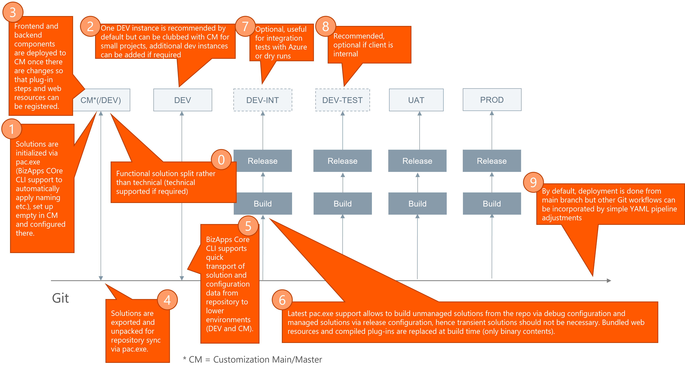

# Solution Flows 

This page lets you understand the general development and customizing flows supported by the **BizApps Core Accelerator** which is helpful to see the dependencies between the activities executed on the lower environments and how the results are automatically deployed through the upper environments.

The detailed step-by-step instructions are described later in sections contained in [A Day in the Life and Beyond](../../How-Tos/index.md).

!!! important
    
    As an important **"Step 0"**, plan your solution segmentation approach (see [DevOps Process Documentation](https://adf.avanade.com/display/FODG/%28CRM%29+Tooling+and+DevOps) chapter 4.9 for further information).

1. With outcome for step 0, set up target solutions by following the [New Solution](../../How-Tos/new-solution.md) instructions.
1. _Optional:_ If you develop any backend, frontend or PCF code, follow the instructions to develop in `Dev`:
    * [Develop and Deploy Backend Code](../../How-Tos/develop-deploy-backend.md)
    * [Develop and Deploy Frontend Code](../../How-Tos/develop-deploy-frontend.md)
    * [Develop and Deploy PCF ](../../How-Tos/Others/develop-deploy-pcf.md)
1. [Modify and Deploy Customizations](../../How-Tos/modify-deploy-customizations.md) and _optionally_ register plug-in steps, web resources or PCF components in `Customization Master`.
1. As part of the previous step, customizations are unpacked and stored in the repository alongside the code.
1. _Optional:_ As part of the CLI support to [Manage Lower Environments](../../How-Tos/Others/manage-local-dev-environment.md), you can transport solutions into `Dev` or perform a complete re-sync of `Dev`. This helps for example to quickly pull over latest customizations in the development (Dev) environment.
1. The generic YAML pipelines automatically deploys the solutions including customizations, code as well as data (see [Manage Data](../../How-Tos/manage-data.md)). Pre and post deployment steps can be completely automated (see [Automate Pre and Post Steps](../../How-Tos/automate-pre-post-steps.md)).
1. `Dev-Int` can be used optionally for integration tests
1. `Dev-Test` is mandatory for all Avanade projects to perform their internal tests (SIT/QA).
1. Since a Git repository is used, different workflows can be applied (as long as they work with the Dataverse limitations). For example, a release branch can be put in front of production.