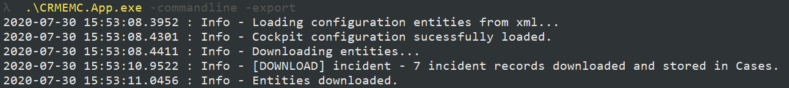
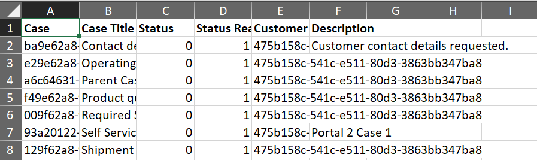
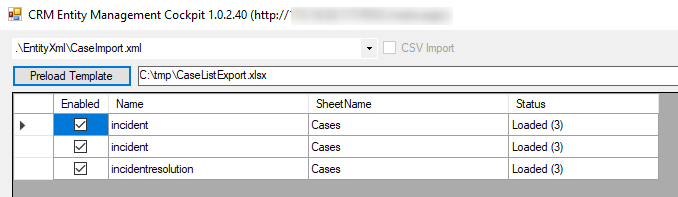
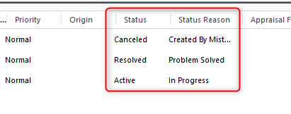

# Case Export - Import - State Change

The Scenario explains an export of incidents (cases) from system A and the import of this file into system B. Also Statecode and Statuscode changes incl. IncidentResolutions is included.

*Note: This approach is currently only working for Excel files (xlsx).*

## Initial Setup

* Get latest version of CRMEMC
* Update your connection string to system A in `CRMEMC.App.exe.config`
* Update the FetchXML in `/EntityXml/CaseExport.xml` (keep the columns for the first execution)
* Update the XML and Excel-String in `CRMEMC.App.exe.config` as described below
* Create folder `C:\tmp`

Select the export configuration (xml):

```xml
      <setting name="DefaultConfiguration" serializeAs="String">
        <value>Scenario1_CaseExport.xml</value>
      </setting>
```

Set your target file (xlsx) path:

```xml
      <setting name="DefaultTemplateLocation" serializeAs="String">
        <value>C:\tmp\Scenario1_CaseListExport.xlsx</value>
      </setting>
```

## Steps

### Export the records from system A

The export is only possible via the Command Line application. If you updated the config file correctly, you can run the following command.

```cmd
.\CRMEMC.App.exe -commandline -export
```



The result will be an excel sheet with your records named `Scenario1_CaseListExport.xlsx`



### Import and State Change

To re import the records you can use the User Interface of CRMEMC.
To select the target environment, configure the system url and credentials in `CRMEMC.App.exe.config`

Start the UI by doubleclick on `CRMEMC.App.exe`, afterwards select the `Scenario1_CaseImport.xml` template and click `Preload Template`.
The following screen should appear (amount of records depending on your export).



The reason why 3 entries are listed is, that the state handling of cases is more complex as for other entities. Main reason is the Incident Resolution which is always required if a case must be resolved.

* Entry 1 is just creating the records in CRM
* Entry 2 is updating the Case statuscode/statecode values for all statecodes except `Resolved`
* Entry 3 is updating the Case statuscode/statecode values for `Resolved` statecodes and also creates an IncidentResolution for the given case. For this sample, the subject (text) for the Incident Resolution is the same as the title of the Case. This can be updated in the Excel sheet.

Click `Update Entities`

## Expected Results

The records are getting created in CRM and the statuscode/statecode is set as defined in the export file.



### Expected Errors

You will find expected erros like the following in the logs:

#### Error Variant 1

`19.05.2020 11:01 : ERROR;[ABORT] ;incidentresolution;Failed to update item f0a40a38-da2e-ea11-8129-0034d8b71dec Error message: 1 is not a valid status code for state code IncidentState.Resolved on incident with Id 00000000-0000-0000-0000-000000000000. || System.ArgumentException: 1 is not a valid status code for state code IncidentState.Resolved on incident with Id 00000000-0000-0000-0000-000000000000.
Parameter name: statusCode`

`19.05.2020 11:31 : WARNING;;incident;Cannot set status for item. Item: "0026c3ca-544d-ea11-812c-0034d8b71dec" Error: This message can not be used to set the state of incident to Closed.  In order to set state of incident to Closed, use the CloseIncidentRequest message instead.`

The reason is, that in your file you are still having the records with active/closed statuscode which do not belong to the resolve scenario. You can avoid that by split up the file into 2 separate files.

* File A: Contains all "non-Resolved" cases
* File B: Contains all "Resolved" cases

#### Error Variant 2

`19.05.2020 11:31 : INFO;;incident;f0a40a38-da2e-ea11-8129-0034d8b71dec was not updated as field attributes have not changed.`

The reason for this info log is, that the statecode/statuscode change was not required (e.g. active case just created and not touched until it got exported).
