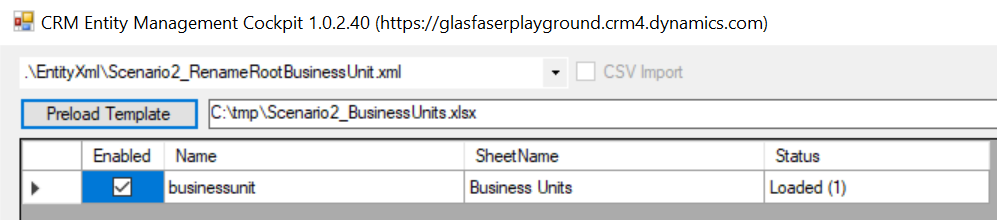
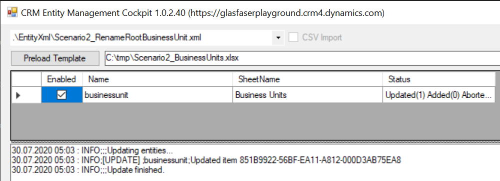
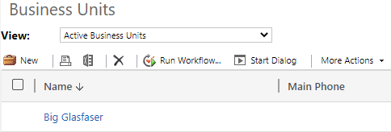
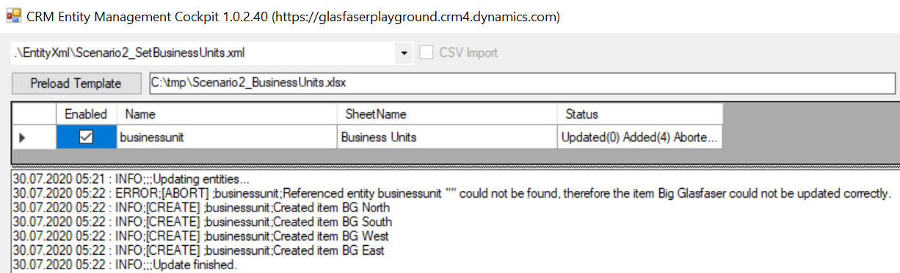
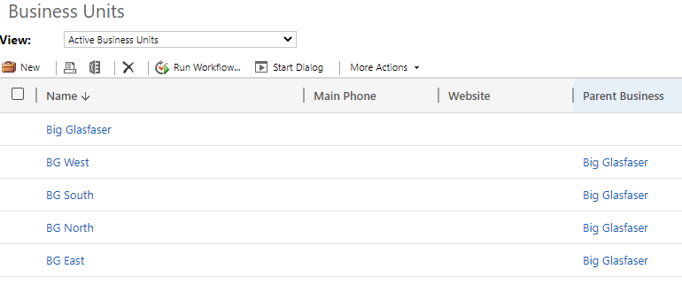

# Set Business Unit Structure

By default, the root Business Unit in your environment is called the same as your Organization (e.g. glasfaserplayground).

Let´s assume, you plan to create the following structure.

* Big Glasfaser (Root BU)
  * BG North
  * BG South
  * BG West
  * BG East

This means we must rename the Root BU to "Big Glasfaser" and create the 4 additional ones. Without API, Dataverse CE is not allowing the rename, since the Parent Business field is mandatory. So either you must configure the Form or you just use CRMEMC.

## Initial Setup

* Get latest version of CRMEMC
* Update your connection string to your system in `CRMEMC.App.exe.config`
* Update the XML and Excel-String in `CRMEMC.App.exe.config` as described below
* Create folder C:\tmp and copy the file `yourlocalfolder\CRMEMC.App\Scenarios\Scenario2_BusinessUnits.xlsx` into `C:\tmp`
* Get the Guid of your Root Businessunit. Just grab the full URL of your browser when opening the BU and remove the part between %7b and %7d (e.g. ...id=%7b`851B9922-56BF-EA11-A812-000D3AB75EA8`%7d)

Set source file (xlsx) path:

```xml
      <setting name="DefaultTemplateLocation" serializeAs="String">
        <value>C:\tmp\Scenario2_BusinessUnits.xlsx</value>
      </setting>
```

## Steps

### Update Name of Root Business Unit

Paste the Guid of the Root BU into the "Business Unit Id" Column line 2 (C2) in `C:\tmp\Scenario2_BusinessUnits.xlsx`

Start the UI by doubleclick on `CRMEMC.App.exe`, afterwards select the `Scenario2_RenameRootBusinessUnit.xml` template and click `Preload Template`.

The following screen should appear (The reason for having only one record is, that the first step is just updating the name of the Root BU).



Click `Update Entities`



Open Dataverse BU area and check that the renaming happened.



### Import Business Unit Child Structure

Start the UI by doubleclick on `CRMEMC.App.exe`, afterwards select the `Scenario2_SetBusinessUnits.xml` template and click `Preload Template`.

Click `Update Entities`



## Expected Results

The Business Unit structure is created and active in Dataverse.



## Automation

In case you don´t want to update this manually (e.g. you are running recurring copy processes of orgs), you can automate the process using the Deployment Tool Script ([Link](<https://dev.azure.com/innersource/DSS-Framework/_git/DeploymentTool?path=/DeploymentTool.Console/Xml/Examples/CrmStreamlining/Configuration/UpdateRootBusinessUnit.xml&version=GBmaster>)).