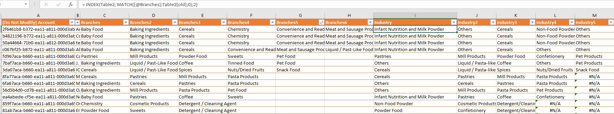
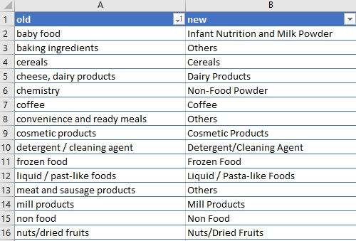
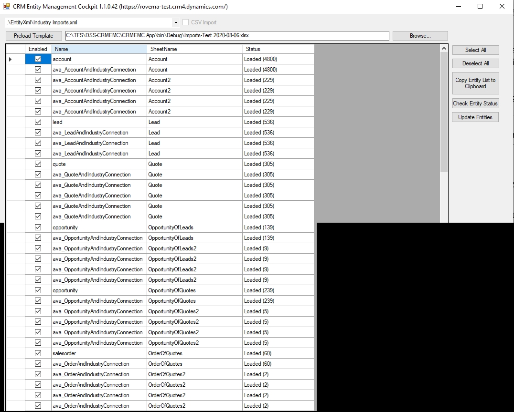
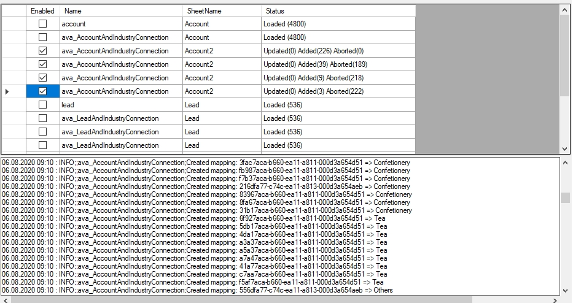

# Migrate MultiSelect OptionSet values into new Industry Relationship

In this scenario, we have the need to get values from an existing MultiSelect OptionSet field (named Branches) into a new 1:N Relationship for `Industries` with a new Lookup for the primary `Industry`.

Let´s assume, you have the following entities which need to be handled:

* Accounts/Leads/Quotes with existing MSOS (Branches)
  * 1:N Relationship for Industries (for all values from MSOS Branches)
  * Lookup for Primary Industry (for first value of MSOS Branches)
* Opportunity without an MSOS
  * 1:N Relationship + Lookup from Quote, if any exist
  * 1:N Relationship + Lookup from originating-Lead, if no Quote exist
* Order without an MSOS
  * 1:N Relationship + Lookup from Quote, if any exist


This means we have to get the MSOS values from the existing records, transform the values into columns in Excel and map them to new values for the import which can take most time in Excel.

## Initial Setup

* Get latest version of CRMEMC
* Update your connection string to your system in `CRMEMC.App.exe.config`
* Update the XML and Excel-String in `CRMEMC.App.exe.config` as described below
* Export Accounts/Leads/Quotes with the default export feature from Dataverse CRM with the MSOS field 
* Export Opportunities/Orders with the default export feature using any column (e.g. Name), as we only need the GUID from first (hidden) column, or use EMC for export (more details below)

Set source file (xlsx) path:

```xml
      <setting name="DefaultTemplateLocation" serializeAs="String">
        <value>C:\tmp\Scenario3_Relate_Industries.xlsx</value>
      </setting>
```
[Industry Imports.xml](./_assets/Industry Imports-74600b63-ff09-4e9c-ae44-c609ae596f88.xml)

## Steps
### Export Entity Records
Export Accounts/Leads/Quotes with the default export feature from Dataverse CRM with the MSOS field.
Open the downloaded file in Excel and un-hide the first columns (we need the GUID in the first column).

If you want to use the EMC Tool for export, note that MSOS fields are currently not supported, so you can only use the EMC Tool to export records without the MSOS (e.g. for getting Opportunities for the update step for later, as it has no MSOS field itself, but uses the value from Quote/Lead).

### Convert MSOS Column to multiple Columns
In Excel, select the Column holding the MSOS values (e.g. Branches) and use `Text to Columns` button to generate new Columns for each Value. (Decide how many columns you want to use, as you need to configure each column in the configuration xml)

### Map old MSOS Values to new Industry Values
In Excel, add a Column for each mapping of the MSOS columns previously generated (e.g. you could have 5 Branches converted to Columns, so you can map up to 5 Columns for the new Industry values).
You can use a formular like
```
= INDEX( Table2; MATCH( [@Branches]; Table2[old]; 0); 2)
```
This will try to find the old value in the column `Branches` in the Table2 column `old` and then use the column 2 of that Table2 (which is the new value) as the Value which is shown and used.

Image of the Excel Account Sheet with 6 Columns for old Branches MSOS and new Industry values:

Column C (Branches) originally hold the full set of MSOS values and were split into Columns C - H. 
Then the mapping formula for the new Industry values was used in the next 6 columns (I – M).

Image of the Excel mapping Sheet of old values to new Industry values:


### Run the EMC tool for import
Start the UI by doubleclick on `CRMEMC.App.exe`, afterwards select the `Scenario3_Relate_Industries.xml` template and click `Preload Template`.

The following screen should appear.

Select the Entity and Job you want to import.
In this config, we have one Update to the entity directly to set the primary Industry lookup and multiple relationships (N:N) for multiple values of the original MSOS field. 

Click `Update Entities` to start the process for the selected jobs


For simplification, we can split the multiple columns into different sheets, so you do not get too many “N/A” values if the next Branch/Industry columns has no value (e.g. 4800 Accounts have 1 value, but only 229 Accounts have 2 values or more).
In the image, you can see the total row count of the sheets (e.g. Account vs Account2 sheet). 
You can keep the N/A values, but the tool will abort the record, as there is no Industry record found with blank name. 

The result will look like this:

