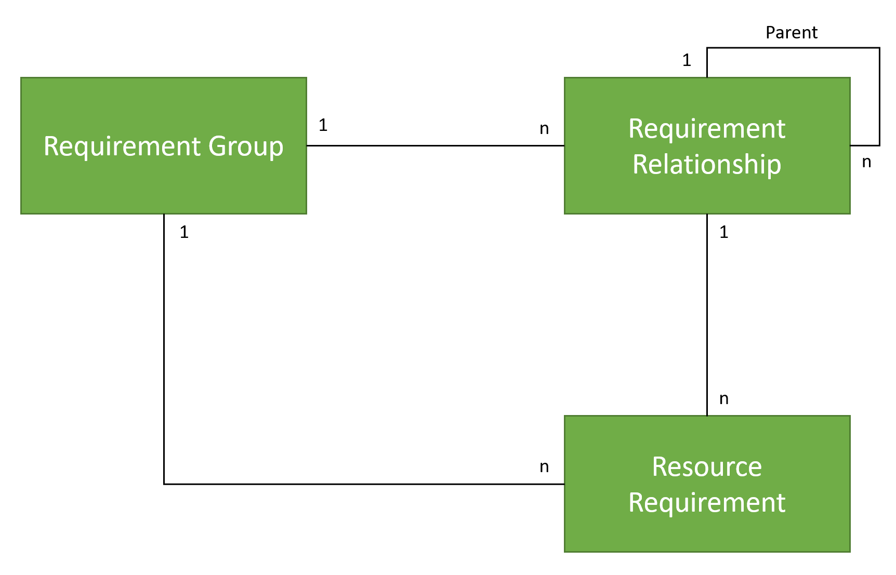
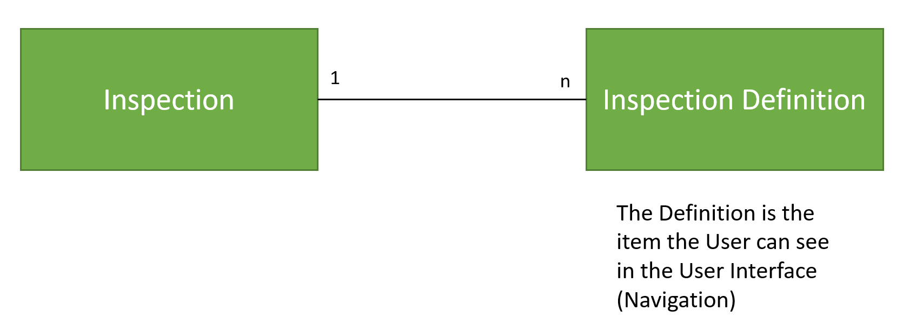

# Field Service Configuration

## Steps

In order to export and import Field Service data, use the [Template configuration](<https://dev.azure.com/innersource/DSS-Framework/_git/EntityManagementCockpit?path=/EntityManagementCockpit.App/EntityXml/Scenario5_FieldService.xml>) 

1. Run the EMC tool using this configuration to export the data (only the command-line version allows the export, for import you can also use the UI).

```
CRMEMC.App.exe -commandline -export -configuration:Scenario5_FieldService.xml -workbook:FieldServiceData.xlsx -connectionstring: "<Connection String Source System (see below)"
```

2. Check the data for completeness. If any data is missing, add the entities or fields to the XML configuration and run the export again.

3. (Optional) Format the Excel.

4. Get the data reviewed and make updates in the Excel as needed.

5. Import the data via the UI or command-line

```
CRMEMC.App.exe -commandline -configuration:Scenario5_FieldService.xml -workbook:FieldServiceData.xlsx -connectionstring: "<Connection String Target System (see below)>"
```

6. Verify the data in the target system.

### Connection String
Connection String (since abolishment of O365 connection strings with username and password):
`AuthType=OAuth; Username=me; Integrated Security=true; Url=https://{Orgname}.{Region}.dynamics.com;  AppId=51f81489-12ee-4a9e-aaae-a2591f45987d; RedirectUri=app://58145B91-0C36-4500-8554-080854F2AC97; TokenCacheStorePath=c:\\MyTokenCache; LoginPrompt=Auto`

## Data Model Details

### Requirement Groups and Resource Requirement



### Inspections


