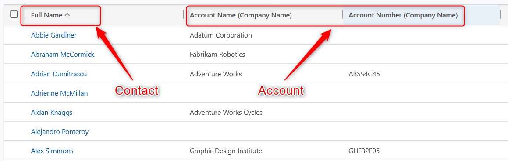
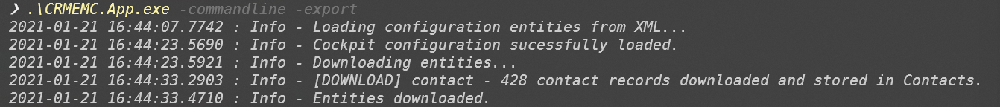
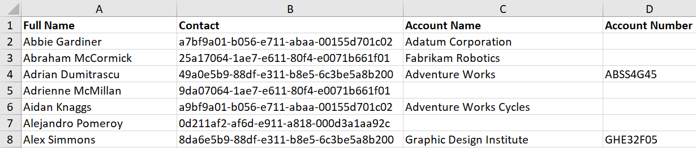

# Export of Linked Columns

The scenario describes the export of related (linked) columns. You can use it for example to export Account fields related to Contacts in one export. Also multiple hops are possible (e.g. Contact n:1 Account n:1 Currency) - See The linked Configuration file for the multi-hop scenario.

Configuration: [Link](<https://innersource.visualstudio.com/DSS-Framework/_git/EntityManagementCockpit?path=%2FCRMEMC.App%2FEntityXml>)



```xml
<fetch version="1.0" output-format="xml-platform" mapping="logical" distinct="false">
  <entity name="contact">
    <attribute name="fullname" />
    <attribute name="contactid" />
    <order attribute="fullname" descending="false" />
    <filter type="and">
      <condition attribute="lastname" operator="not-null" />
    </filter>
    <link-entity name="account" from="accountid" to="parentcustomerid" visible="false" link-type="outer" alias="a_account">
      <attribute name="name" />
      <attribute name="accountnumber" />
    </link-entity>
  </entity>
</fetch>
```

## Initial Setup

* Get latest version of CRMEMC
* Update your connection string to system A in `CRMEMC.App.exe.config`
* Update the XML and Excel-String in `CRMEMC.App.exe.config` as described below
* Create folder `C:\tmp` and copy `/EntityXml/Scenario7_LinkedColumnsExport.xml` into `C:\tmp`

Select the export configuration (xml):

```xml
      <setting name="DefaultConfiguration" serializeAs="String">
        <value>c:\tmp\Scenario7_LinkedColumnsExport.xml</value>
      </setting>
```

Set your target file (xlsx) path:

```xml
      <setting name="DefaultTemplateLocation" serializeAs="String">
        <value>C:\tmp\Scenario7_LinkedColumnsExport.xlsx</value>
      </setting>
```

## Steps

### Export the records including the related columns

The export is only possible via the Command Line application. If you updated the config file correctly, you can run the following command.

```cmd
.\CRMEMC.App.exe -commandline -export
```



## Expected Results

The records are getting exported to the Excel-File defined in the app.config.



