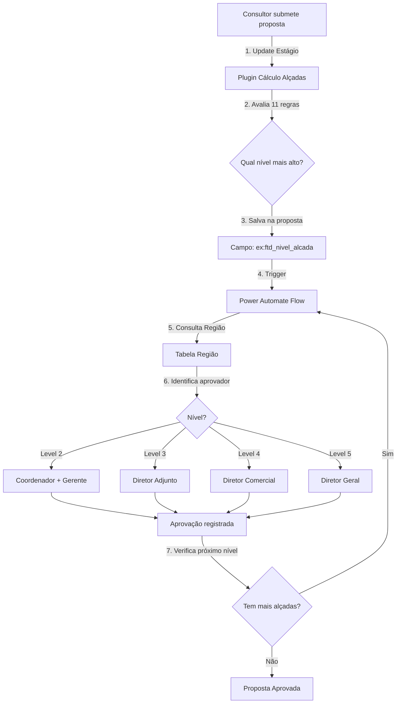
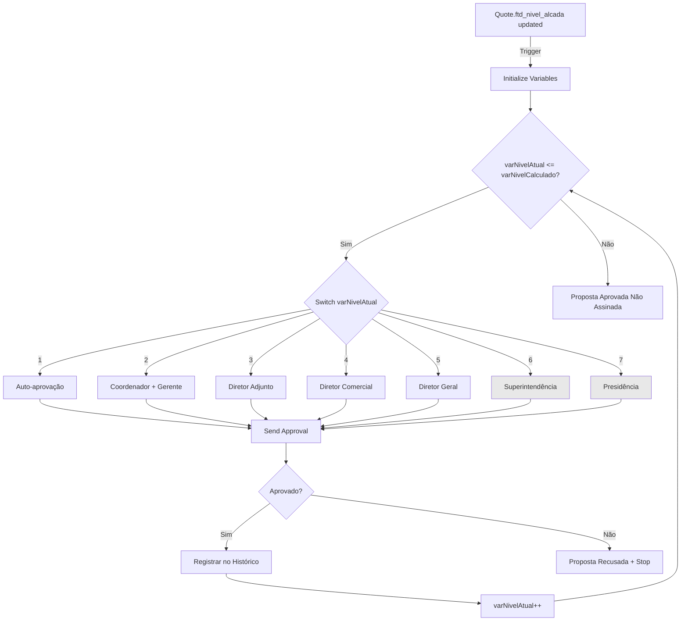

# Solução Técnica — Extensão Fluxo de Aprovação para Níveis 6 e 7
## VERSÃO RESUMIDA

| Campo | Valor |
|-------|-------|
| **Documento** | Solução Técnica — Extensão Aprovação Níveis 6-7 (RESUMO) |
| **Projeto** | FTD Educação — Transformação CX |
| **Data** | 20/Mar/2026 |
| **Autor** | Arquitetura Avanade |
| **Revisores** | Julio (FTD Tech Lead), Fernando (FTD Dev), Danilo (Avanade) |
| **Status** | Draft para Revisão |
| **Tipo** | Solução Técnica (Extensão de Sistema Existente) |

---

> ⚠️ **IMPORTANTE - Nomes de Campos**: Os nomes de campos customizados mencionados neste documento (ex: `ftd_nivel_alcada`, `ftd_manager`, `ftd_regiao_pai`, etc.) são **exemplos** baseados em padrões comuns do Dynamics 365. Os nomes reais (schema names) da solução FTD devem ser validados com o time técnico antes da implementação. Sempre que ver um nome de campo customizado prefixado com "ex:", considere como ilustrativo e confirme o nome correto no ambiente CRM.

---

## 📋 SUMÁRIO EXECUTIVO

### Contexto
O CRM FTD possui fluxo de aprovação de propostas funcional que opera com **5 níveis de alçada** (Consultor → Coordenador + Gerente → Diretor Adjunto → Diretor Comercial → Diretor Geral). A política comercial foi atualizada para incluir **2 novos níveis**: Superintendência (nível 6) e Presidência (nível 7), requeridos para propostas de alto valor (Royalties ≥ R$ 500K).

### Escopo da Solução
Estender a solução existente (plugin + Power Automate) para contemplar níveis 6-7, **sem refatoração** do motor atual. Implementação incremental com mínimo impacto.

### Abordagem
1. **Criar 2 novos registros de Região** — "Superintendência" e "Presidência" como pais da "Região Brasil" existente
2. **Validar/ajustar plugin** de cálculo de alçadas para contemplar até nível 7 (remover limitadores se houver)
3. **Estender Power Automate Flow** para navegar hierarquia até nível 7 (adicionar 2 níveis de navegação de Região Pai)
4. **Atualizar regras da política comercial** (adicionar regras níveis 6-7: Royalties ≥ R$ 500K e ≥ R$ 1M)

---

## 1. ANÁLISE DA SOLUÇÃO ATUAL (AS-IS)

### 1.1 Arquitetura Atual



### 1.2 Componentes Atuais

#### **1.2.1 Plugin de Cálculo de Alçadas**
- **Onde**: Backend C# (projeto `FTDPlugins` ou similar)
- **Trigger**: Update da Proposta, quando campo ex: `ftd_estagio` muda para "Em Aprovação"
- **Lógica**:
  - Avalia **11 regras** de política comercial (Royalties %, Royalties R$, Adiantamento %, Adiantamento R$, Patrocínio, Parcelamento, etc.)
  - Cada regra retorna um nível (1-5)
  - Nível final = **MAX(todos os níveis calculados)**
  - Salva resultado no campo ex: `ftd_nivel_alcada` da proposta
- **🔴 PONTO DE ATENÇÃO**: Verificar se há **limitador hardcoded** (ex: `if nivel > 5 then nivel = 5`)

#### **1.2.2 Tabela Região (Estrutura Hierárquica)**
- **Entidade**: ex: `ftd_regiao` (ou similar)
- **Campos-chave** (nomes são exemplos):
  - ex: `ftd_coordenador_comercial` (Lookup → SystemUser) — Aprovador Nível 2
  - ex: `ftd_manager` (Lookup → SystemUser) — Aprovador Nível 3
  - ex: `ftd_regiao_pai` (Self-Lookup → ftd_regiao) — Hierarquia de regiões
- **Hierarquia de Níveis**:
  ```
  Região (Conta vinculada)
    ├─ Coordenador + Gerente → Nível 2
    ├─ Diretor Adjunto → Nível 3
    └─ Região Pai
         ├─ Diretor Comercial → Nível 4
         └─ Região Pai (avô)
              └─ Diretor Geral → Nível 5
  ```

#### **1.2.3 Power Automate Flow (Orquestração)**
- **Trigger**: Campo ex: `ftd_nivel_alcada` da proposta atualizado
- **Lógica**:
  1. Identifica região da conta vinculada à proposta
  2. Loop de aprovações (nível atual = 1 até nível calculado):
     - **Nível 1**: Auto-aprovação do consultor (apenas registra)
     - **Nível 2**: Busca `Coordenador + Gerente` na região (ex: `ftd_coordenador_comercial` + ex: `ftd_manager`)
     - **Nível 3**: Busca `Diretor Adjunto` na região pai (ex: `ftd_manager`)
     - **Nível 4**: Busca `Diretor Comercial` na região pai (1 nível acima)
     - **Nível 5**: Busca `Diretor Geral` na região pai da pai (2 níveis acima)
  3. Envia notificação Email+Teams para aprovador
  4. Aguarda aprovação (Approval Connector ou Adaptive Card)
  5. Registra aprovação (criar registro em tabela de histórico)
  6. Verifica: `nivelAtual < nivelCalculado`?
     - **Se SIM**: Próxima iteração (nivelAtual++)
     - **Se NÃO**: Encerra flow, atualiza proposta para "Aprovada não assinada"

#### **1.2.4 Limitações Atuais**
| Componente | Limitação | Impacto Níveis 6-7 |
|------------|-----------|-------------------|
| Plugin cálculo | Pode ter limitador `max = 5` (a validar) | BLOQUEADOR se existir |
| Tabela Região | Sem campos para aprovadores 6-7 | BLOQUEADOR |
| Hierarquia Região | Profundidade máxima = 2 pais (5 níveis) | Precisa estender ou alternativa |
| Power Automate Flow | Hardcoded até nível 5 | Precisa adicionar cases 6-7 |
| Regras política comercial | Níveis 6-7 não existem | Precisa adicionar |

---

## 2. REQUISITOS DA MUDANÇA

### 2.1 Novos Níveis de Aprovação

| Nível | Cargo | Quando é Acionado | Aprovador |
|-------|-------|------------------|-----------|
| **6** | Superintendência | Royalties ≥ R$ 500K (mas < R$ 1M) | A DEFINIR (centralizado ou por região?) |
| **7** | Presidência | Royalties ≥ R$ 1M | A DEFINIR (provavelmente centralizado - 1 pessoa) |

### 2.2 Regras de Negócio Confirmadas
- Níveis 6-7 são **cumulativos** (precisam das aprovações 1-5 primeiro)
- Níveis 6-7 são acionados **principalmente por valor de Royalties** em R$ (não %)
- Hierarquia se mantém: Nível 7 só é acionado se Nível 6 também for necessário

### 2.3 Acceptance Criteria
- [ ] Plugin calcula corretamente nível 6 para Royalties ≥ R$ 500K
- [ ] Plugin calcula corretamente nível 7 para Royalties ≥ R$ 1M
- [ ] Flow identifica e notifica aprovador nível 6
- [ ] Flow identifica e notifica aprovador nível 7
- [ ] Aprovação nível 6 permite avançar para nível 7
- [ ] Aprovação nível 7 finaliza flow e marca proposta como "Aprovada não assinada"
- [ ] Todas as aprovações são registradas no histórico
- [ ] Níveis 1-5 continuam funcionando sem alteração

---

## 3. SOLUÇÃO TÉCNICA PROPOSTA

### 3.1 Visão Geral da Solução

**Princípio**: Extensão incremental com **mínimo impacto** nos componentes existentes.

**Estratégia**:
1. ✅ Manter estrutura existente (Plugin + Flow + Região)
2. ✅ Adicionar campos para aprovadores 6-7 (alternativa: tabela separada)
3. ✅ Estender plugin para calcular até nível 7
4. ✅ Estender Flow para orquestrar até nível 7

### 3.2 Design da Solução — Hierarquia de Região Estendida

**🎯 SOLUÇÃO ADOTADA: Extensão da Hierarquia de Região Existente**

✅ **Vantagens**:
- **Zero mudanças de schema** — usa tabela Região existente
- **Consistência total** — mesmo padrão de navegação para todos os níveis (2-7)
- **Implementação trivial** — apenas 2 novos registros + ajuste no Flow
- **Manutenção simples** — trocar aprovador = UPDATE de 1 registro

⚠️ **Considerações**:
- Hierarquia fica mais profunda (5 para 7 níveis de Região Pai)
- Aprovadores 6-7 são únicos (1 registro cada, não múltiplos)

#### **Hierarquia Atual (5 níveis)**
```
Região Brasil (nível 5)
  └─ Região Filial (nível 4)
      └─ Região Regional (nível 3)
          └─ Região Local (nível 2)
              └─ Consultor (nível 1)

Mapeamento de Aprovadores (nomes de campos são exemplos):
- Nível 2: Coordenador + Gerente → Região.ex:`ftd_coordenador_comercial` + Região.ex:`ftd_manager`
- Nível 3: Diretor Adjunto → Região.ex:`ftd_manager`
- Nível 4: Diretor Comercial → Região.Pai.ex:`ftd_manager` (1 nível acima)
- Nível 5: Diretor Geral → Região.Pai.Pai.ex:`ftd_manager` (2 níveis acima) ← Região Brasil
```

#### **Hierarquia Nova (7 níveis)**
```
Região Presidência (NOVO nível 7) ← ex:ftd_manager = Presidente
  └─ Região Superintendência (NOVO nível 6) ← ex:ftd_manager = Superintendente
      └─ Região Brasil (nível 5) ← ex:ftd_manager = Diretor Geral
          └─ Região Filial (nível 4) ← ex:ftd_manager = Diretor Comercial
              └─ Região Regional (nível 3) ← ex:ftd_manager = Diretor Adjunto
                  └─ Região Local (nível 2) ← Coordenador + Gerente
                      └─ Consultor (nível 1)

Mapeamento de Aprovadores ESTENDIDO (nomes de campos são exemplos):
- Nível 2: Coordenador + Gerente → Região.ex:`ftd_coordenador_comercial` + Região.ex:`ftd_manager`
- Nível 3: Diretor Adjunto → Região.ex:`ftd_manager`
- Nível 4: Diretor Comercial → Região.Pai.ex:`ftd_manager` (1 nível acima)
- Nível 5: Diretor Geral → Região.Pai.Pai.ex:`ftd_manager` (2 níveis acima) ← Região Brasil
- Nível 6: Superintendência → Região.Pai.Pai.Pai.ex:`ftd_manager` (3 níveis acima) ← NOVO: Região Superintendência
- Nível 7: Presidência → Região.Pai.Pai.Pai.Pai.ex:`ftd_manager` (4 níveis acima) ← NOVO: Região Presidência
```

### 3.3 Passos de Implementação

**Passo 1: Criar 2 Novos Registros de Região**
- Criar registro "Superintendência" (ex: `ftd_manager` = Superintendente, ex: `ftd_regiao_pai` = NULL)
- Criar registro "Presidência" (ex: `ftd_manager` = Presidente, ex: `ftd_regiao_pai` = Superintendência)
- Atualizar registro "Brasil" existente (ex: `ftd_regiao_pai` = Superintendência)

**Passo 2: Validar e Ajustar Plugin de Cálculo**
- Verificar se há limitador `if nivel > 5 then nivel = 5` → **REMOVER**
- Adicionar regras níveis 6-7:
  - Royalties R$ ≥ 500K → Nível 6
  - Royalties R$ ≥ 1M → Nível 7

**Passo 3: Estender Power Automate Flow**
- Adicionar **Case 6** no Switch: navegar 3 níveis de Região Pai → buscar ex: `ftd_manager`
- Adicionar **Case 7** no Switch: navegar 4 níveis de Região Pai → buscar ex: `ftd_manager`
- Adicionar validação: se Região Pai não existir, falhar flow com mensagem clara

---

## 4. DIAGRAMA DO FLOW ESTENDIDO



**Legenda:**
- ⚪ **Cinza Claro (Níveis 6-7)**: Novos níveis adicionados
- ⚪ **Branco (Níveis 1-5)**: Lógica existente mantida sem alteração

---

## 5. CENÁRIOS DE TESTE

| # | Cenário | Dados Entrada | Resultado Esperado |
|---|---------|---------------|-------------------|
| **T1** | Royalties R$ 600K | Royalties = R$ 600.000 | Nível calculado = **6** |
| **T2** | Royalties R$ 1.2M | Royalties = R$ 1.200.000 | Nível calculado = **7** |
| **T3** | Aprovação Nível 6 | 6 aprovações (1-6) | Notifica nível 7, proposta ainda "Em aprovação" |
| **T4** | Aprovação Final Nível 7 | 7ª aprovação concluída | Proposta → "Aprovada não assinada" |
| **T5** | Recusa Nível 6 | Aprovador 6 recusa | Proposta → "Recusada", notifica Consultor |
| **T6** | Nível 5 continua funcionando | Royalties = R$ 300K | Nível calculado = **5**, flow para no 5 |
| **T7** | Hierarquia incompleta | Nível = 6, mas Região Brasil sem parent | Flow falha com mensagem "Região nível 6 não encontrada" |

---

## 6. PRÓXIMOS PASSOS (AÇÕES IMEDIATAS)

**Responsável Avanade (Danilo):**
1. ✅ Agendar sessão técnica com Julio/Fernando (1h) — **Prazo: 21/Mar**
2. ✅ Solicitar identificação de aprovadores 6-7 para FTD Business — **Prazo: 21/Mar**
3. ⬜ Validar código do plugin atual (limitadores hardcoded?) — **Prazo: 22/Mar**

**Responsável FTD (Julio):**
1. ⬜ Compartilhar código do plugin de cálculo de alçadas — **Prazo: 21/Mar**
2. ⬜ Confirmar se regras estão em tabela ou hardcoded — **Prazo: 21/Mar**
3. ⬜ Validar impacto em outras features em dev — **Prazo: 22/Mar**
4. ⬜ Confirmar nome exato da Região nível 5 ("Brasil" ou outro?) — **Prazo: 21/Mar**

**Responsável FTD Business (Silvia/Mônica):**
1. ⬜ Identificar aprovadores níveis 6-7 (nomes + emails) — **Prazo: 21/Mar CRÍTICO**
   - **Superintendente**: Nome + Email + Security Role CRM
   - **Presidente**: Nome + Email + Security Role CRM
2. ⬜ Validar se estas pessoas já têm usuário ativo no CRM — **Prazo: 21/Mar**

---

## 📝 OBSERVAÇÕES FINAIS

**Decisões Arquiteturais Chave:**
1. ✅ Usar hierarquia de Região existente (zero mudanças de schema)
2. ✅ Aprovadores 6-7 são centralizados (1 registro cada)
3. ✅ Navegação por Região Pai estendida (3-4 níveis)
4. ✅ Mínimo impacto nos componentes existentes

**Pontos de Atenção:**
- ⚠️ Validar limitador hardcoded no plugin (bloqueador se existir)
- ⚠️ Confirmar usuários aprovadores 6-7 existem no CRM
- ⚠️ Testar regressão completa níveis 1-5 após mudanças

**Vantagens da Solução:**
- 🚀 Implementação simples e rápida
- 🛡️ Baixo risco (sem refatoração do motor)
- 🔧 Fácil manutenção (trocar aprovador = UPDATE 1 registro)
- 📊 Consistente com arquitetura atual

---

**Documento gerado em**: 20/Mar/2026  
**Versão**: 1.0 - Resumo Executivo
