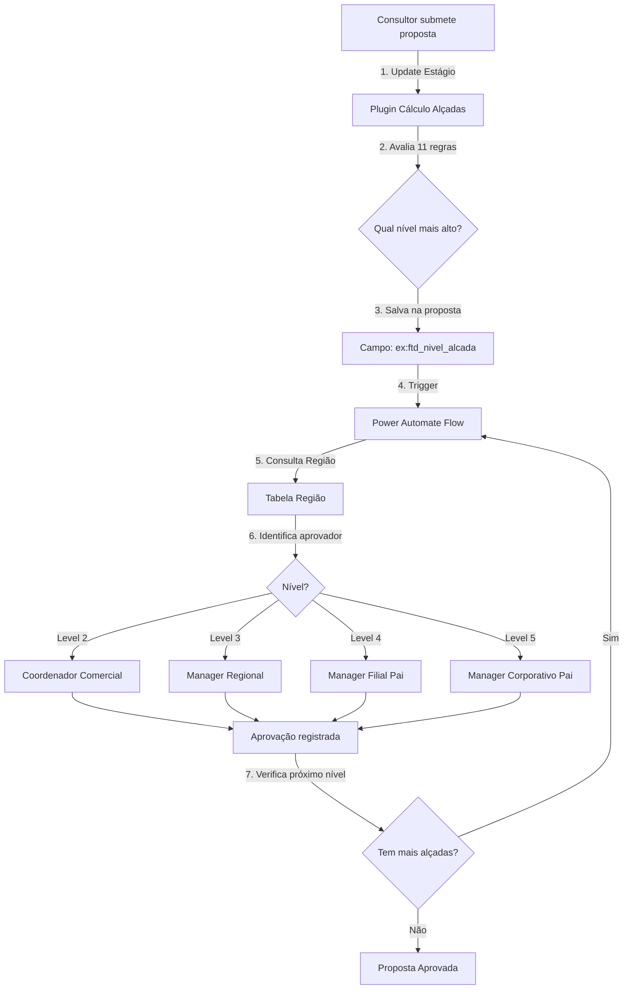
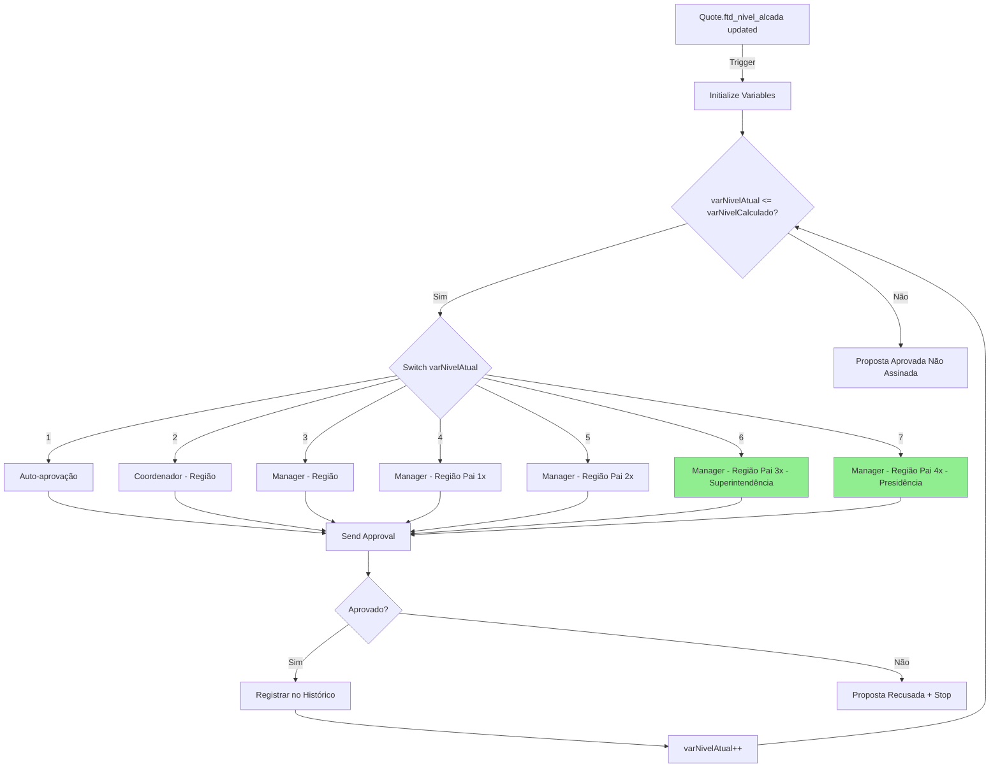

# Solução Técnica — Extensão Fluxo de Aprovação para Níveis 6 e 7

| Campo | Valor |
|-------|-------|
| **Documento** | Solução Técnica — Extensão Aprovação Níveis 6-7 |
| **Projeto** | FTD Educação — Transformação CX |
| **Data** | 20/Mar/2026 |
| **Autor** | Arquitetura Avanade |
| **Revisores** | Julio (FTD Tech Lead), Fernando (FTD Dev), Danilo (Avanade) |
| **Status** | Draft para Revisão |
| **Tipo** | Solução Técnica (Extensão de Sistema Existente) |

---

> ⚠️ **IMPORTANTE - Nomes de Campos**: Os nomes de campos customizados mencionados neste documento (ex: `ftd_nivel_alcada`, `ftd_manager`, `ftd_regiao_pai`, etc.) são **exemplos** baseados em padrões comuns do Dynamics 365. Os nomes reais (schema names) da solução FTD devem ser validados com o time técnico antes da implementação. Sempre que ver um nome de campo customizado prefixado com "ex:", considere como ilustrativo e confirme o nome correto no ambiente CRM.

---

## 📋 SUMÁRIO EXECUTIVO

### Contexto
O CRM FTD possui fluxo de aprovação de propostas funcional que opera com **5 níveis de alçada** (Consultor → Coordenador Comercial → Manager Regional → Manager Filial → Manager Corporativo). A política comercial foi atualizada para incluir **2 novos níveis**: Superintendência (nível 6) e Presidência (nível 7), requeridos para propostas de alto valor (Royalties ≥ R$ 500K).

### Escopo da Solução
Estender a solução existente (plugin + Power Automate) para contemplar níveis 6-7, **sem refatoração** do motor atual. Implementação incremental com mínimo impacto.

### Abordagem
1. **Criar 2 novos registros de Região** — "Superintendência" e "Presidência" como pais da "Região Brasil" existente
2. **Validar/ajustar plugin** de cálculo de alçadas para contemplar até nível 7 (remover limitadores se houver)
3. **Estender Power Automate Flow** para navegar hierarquia até nível 7 (adicionar 2 níveis de navegação de Região Pai)
4. **Atualizar regras da política comercial** (adicionar regras níveis 6-7: Royalties ≥ R$ 500K e ≥ R$ 1M)

### Estimativa
- **Análise + Validação**: 0.5 dia (sessão técnica com time FTD)
- **Implementação**: 1-2 dias (criar registros Região + ajustar Flow)
- **Testes**: 1-2 dias
- **Total**: **3-4 dias úteis** ✅ Solução mais simples que o previsto!

---

## 1. ANÁLISE DA SOLUÇÃO ATUAL (AS-IS)

### 1.1 Arquitetura Atual



### 1.2 Componentes Atuais

#### **1.2.1 Plugin de Cálculo de Alçadas**
- **Onde**: Backend C# (projeto `FTDPlugins` ou similar)
- **Trigger**: Update da Proposta, quando campo ex: `ftd_estagio` muda para "Em Aprovação"
- **Lógica**:
  - Avalia **11 regras** de política comercial (Royalties %, Royalties R$, Adiantamento %, Adiantamento R$, Patrocínio, Parcelamento, etc.)
  - Cada regra retorna um nível (1-5)
  - Nível final = **MAX(todos os níveis calculados)**
  - Salva resultado no campo ex: `ftd_nivel_alcada` da proposta
- **🔴 PONTO DE ATENÇÃO**: Verificar se há **limitador hardcoded** (ex: `if nivel > 5 then nivel = 5`)

#### **1.2.2 Tabela Região (Estrutura Hierárquica)**
- **Entidade**: ex: `ftd_regiao` (ou similar)
- **Campos-chave** (nomes são exemplos):
  - ex: `ftd_coordenador_comercial` (Lookup → SystemUser) — Aprovador Nível 2
  - ex: `ftd_manager` (Lookup → SystemUser) — Aprovador Nível 3
  - ex: `ftd_regiao_pai` (Self-Lookup → ftd_regiao) — Hierarquia de regiões
- **Hierarquia de Níveis**:
  ```
  Região (Conta vinculada)
    ├─ Coordenador Comercial → Nível 2
    ├─ Manager → Nível 3
    └─ Região Pai
         ├─ Manager → Nível 4
         └─ Região Pai (avô)
              └─ Manager → Nível 5
  ```

#### **1.2.3 Power Automate Flow (Orquestração)**
- **Trigger**: Campo ex: `ftd_nivel_alcada` da proposta atualizado
- **Lógica**:
  1. Identifica região da conta vinculada à proposta
  2. Loop de aprovações (nível atual = 1 até nível calculado):
     - **Nível 1**: Auto-aprovação do consultor (apenas registra)
     - **Nível 2**: Busca `Coordenador Comercial` na região (ex: `ftd_coordenador_comercial`)
     - **Nível 3**: Busca `Manager` na região (ex: `ftd_manager`)
     - **Nível 4**: Busca `Manager` na região pai (1 nível acima)
     - **Nível 5**: Busca `Manager` na região pai da pai (2 níveis acima)
  3. Envia notificação Email+Teams para aprovador
  4. Aguarda aprovação (Approval Connector ou Adaptive Card)
  5. Registra aprovação (criar registro em tabela de histórico)
  6. Verifica: `nivelAtual < nivelCalculado`?
     - **Se SIM**: Próxima iteração (nivelAtual++)
     - **Se NÃO**: Encerra flow, atualiza proposta para "Aprovada não assinada"

#### **1.2.4 Limitações Atuais**
| Componente | Limitação | Impacto Níveis 6-7 |
|------------|-----------|-------------------|
| Plugin cálculo | Pode ter limitador `max = 5` (a validar) | BLOQUEADOR se existir |
| Tabela Região | Sem campos para aprovadores 6-7 | BLOQUEADOR |
| Hierarquia Região | Profundidade máxima = 2 pais (5 níveis) | Precisa estender ou alternativa |
| Power Automate Flow | Hardcoded até nível 5 | Precisa adicionar cases 6-7 |
| Regras política comercial | Níveis 6-7 não existem | Precisa adicionar |

---

## 2. REQUISITOS DA MUDANÇA

### 2.1 Novos Níveis de Aprovação

| Nível | Cargo | Quando é Acionado | Aprovador |
|-------|-------|------------------|-----------|
| **6** | Superintendência | Royalties ≥ R$ 500K (mas < R$ 1M) | A DEFINIR (centralizado ou por região?) |
| **7** | Presidência | Royalties ≥ R$ 1M | A DEFINIR (provavelmente centralizado - 1 pessoa) |

### 2.2 Regras de Negócio Confirmadas
- Níveis 6-7 são **cumulativos** (precisam das aprovações 1-5 primeiro)
- Níveis 6-7 são acionados **principalmente por valor de Royalties** em R$ (não %)
- Hierarquia se mantém: Nível 7 só é acionado se Nível 6 também for necessário

### 2.3 Acceptance Criteria
- [ ] Plugin calcula corretamente nível 6 para Royalties ≥ R$ 500K
- [ ] Plugin calcula corretamente nível 7 para Royalties ≥ R$ 1M
- [ ] Flow identifica e notifica aprovador nível 6
- [ ] Flow identifica e notifica aprovador nível 7
- [ ] Aprovação nível 6 permite avançar para nível 7
- [ ] Aprovação nível 7 finaliza flow e marca proposta como "Aprovada não assinada"
- [ ] Todas as aprovações são registradas no histórico
- [ ] Níveis 1-5 continuam funcionando sem alteração

---

## 3. SOLUÇÃO TÉCNICA PROPOSTA

### 3.1 Visão Geral da Solução

**Princípio**: Extensão incremental com **mínimo impacto** nos componentes existentes.

**Estratégia**:
1. ✅ Manter estrutura existente (Plugin + Flow + Região)
2. ✅ Adicionar campos para aprovadores 6-7 (alternativa: tabela separada)
3. ✅ Estender plugin para calcular até nível 7
4. ✅ Estender Flow para orquestrar até nível 7

### 3.2 Design da Solução — Hierarquia de Região Estendida

**🎯 SOLUÇÃO ADOTADA: Extensão da Hierarquia de Região Existente**

✅ **Vantagens**:
- **Zero mudanças de schema** — usa tabela Região existente
- **Consistência total** — mesmo padrão de navegação para todos os níveis (2-7)
- **Implementação trivial** — apenas 2 novos registros + ajuste no Flow
- **Manutenção simples** — trocar aprovador = UPDATE de 1 registro

⚠️ **Considerações**:
- Hierarquia fica mais profunda (5 para 7 níveis de Região Pai)
- Aprovadores 6-7 são únicos (1 registro cada, não múltiplos)

#### **Hierarquia Atual (5 níveis)**
```
Região Brasil (nível 5)
  └─ Região Filial (nível 4)
      └─ Região Regional (nível 3)
          └─ Região Local (nível 2)
              └─ Consultor (nível 1)

Mapeamento de Aprovadores (nomes de campos são exemplos):
- Nível 2: Região.ex:`ftd_coordenador_comercial` + Região.ex:`ftd_manager`
- Nível 3: Região.ex:`ftd_manager`
- Nível 4: Região.Pai.ex:`ftd_manager` (1 nível acima)
- Nível 5: Região.Pai.Pai.ex:`ftd_manager` (2 níveis acima) ← Região Brasil
```

#### **Hierarquia Nova (7 níveis)**
```
Região Presidência (NOVO nível 7) ← ex:ftd_manager = Presidente
  └─ Região Superintendência (NOVO nível 6) ← ex:ftd_manager = Superintendente
      └─ Região Brasil (nível 5) ← ex:ftd_manager = Diretor Geral
          └─ Região Filial (nível 4) ← ex:ftd_manager = Diretor Comercial
              └─ Região Regional (nível 3) ← ex:ftd_manager = Diretor Adjunto
                  └─ Região Local (nível 2) ← Coordenador + Manager
                      └─ Consultor (nível 1)

Mapeamento de Aprovadores ESTENDIDO (nomes de campos são exemplos):
- Nível 2: Região.ex:`ftd_coordenador_comercial` + Região.ex:`ftd_manager`
- Nível 3: Região.ex:`ftd_manager`
- Nível 4: Região.Pai.ex:`ftd_manager` (1 nível acima)
- Nível 5: Região.Pai.Pai.ex:`ftd_manager` (2 níveis acima) ← Região Brasil
- Nível 6: Região.Pai.Pai.Pai.ex:`ftd_manager` (3 níveis acima) ← NOVO: Região Superintendência
- Nível 7: Região.Pai.Pai.Pai.Pai.ex:`ftd_manager` (4 níveis acima) ← NOVO: Região Presidência
```

---

## 4. DETALHAMENTO DA IMPLEMENTAÇÃO

### 4.1 Mudança 1: Criar Registros de Região para Níveis 6-7

#### **4.1.1 Criar Região "Superintendência" (Nível 6)**

**Via Interface CRM** (make.powerapps.com ou Dynamics 365):
```
Navegar para: Vendas → Configurações → Regiões (ou equivalente)

Ação: Criar Novo Registro

Campos (nomes são exemplos - validar schema real no CRM):
┌─────────────────────────┬────────────────────────────────────────────┐
│ Campo                   │ Valor                                      │
├─────────────────────────┼────────────────────────────────────────────┤
│ Nome (Name)             │ "Superintendência"                         │
│ ex: ftd_manager         │ [LOOKUP PARA USUÁRIO SUPERINTENDENTE]     │
│ ex: ftd_regiao_pai      │ NULL (sem parent - é o topo da hierarquia) │
│ ex: ftd_ativo           │ Sim                                        │
│ Descrição               │ "Nível 6 - Aprovação Superintendência"    │
└─────────────────────────┴────────────────────────────────────────────┘
```

**⚠️ AÇÃO REQUERIDA**: FTD precisa fornecer usuário (email) do Superintendente.

---

#### **4.1.2 Criar Região "Presidência" (Nível 7)**

```
Navegar para: Vendas → Configurações → Regiões

Ação: Criar Novo Registro

Campos (nomes são exemplos - validar schema real no CRM):
┌─────────────────────────┬────────────────────────────────────────────┐
│ Campo                   │ Valor                                      │
├─────────────────────────┼────────────────────────────────────────────┤
│ Nome (Name)             │ "Presidência"                              │
│ ex: ftd_manager         │ [LOOKUP PARA USUÁRIO PRESIDENTE]          │
│ ex: ftd_regiao_pai      │ [LOOKUP PARA REGIÃO "SUPERINTENDÊNCIA"]   │
│ ex: ftd_ativo           │ Sim                                        │
│ Descrição               │ "Nível 7 - Aprovação Presidência (topo)"  │
└─────────────────────────┴────────────────────────────────────────────┘
```

**⚠️ AÇÃO REQUERIDA**: FTD precisa fornecer usuário (email) do Presidente.

---

#### **4.1.3 Atualizar Região "Brasil" (Nível 5) — Adicionar Parent**

**CRÍTICO**: Região "Brasil" atual (nível 5) precisa apontar para "Superintendência" como pai.

```
Navegar para: Vendas → Configurações → Regiões

Buscar: Região "Brasil" (ou nome equivalente do registro nível 5 atual)

Ação: Editar Registro Existente

Campo a Alterar (nome do campo é exemplo - validar schema real no CRM):
┌─────────────────────────┬────────────────────────────────────────────┐
│ Campo                   │ Valor ATUAL → Valor NOVO                   │
├─────────────────────────┼────────────────────────────────────────────┤
│ ex: ftd_regiao_pai      │ NULL → [LOOKUP PARA REGIÃO "SUPERINTENDÊN..│
└─────────────────────────┴────────────────────────────────────────────┘
```

**Resultado**: Hierarquia completa:
```
Presidência (7)
  └─ Superintendência (6)
      └─ Brasil (5) ← ESTE FOI ATUALIZADO
          └─ Filiais (4)
              └─ Regionais (3)
                  └─ Locais (2)
```

---

#### **4.1.4 Diagrama Visual da Mudança**

**ANTES:**
```
[Região Brasil - Nível 5]
  └─ (sem parent)
```

**DEPOIS:**
```
[Região Presidência - Nível 7] ← NOVA
  └─ [Região Superintendência - Nível 6] ← NOVA
      └─ [Região Brasil - Nível 5] ← ATUALIZADA (parent mudou)
```
  - N:1 com SystemUser (ftd_usuario)
  - N:1 com SystemUser (ftd_substituto)

Views:
  - "Aprovadores Corporativos Ativos" (filtro ftd_ativo=Sim, ordenado por ftd_nivel)

Security:
  - Read: Todos usuários
  - Write: Somente Administradores CRM
```

#### **4.1.2 Dados Iniciais**
```csv
ftd_nivel|ftd_usuario|ftd_cargo|ftd_ativo|ftd_data_inicio
6|[EMAIL_SUPERINTENDENTE]|Superintendência|Sim|2026-04-01
7|[EMAIL_PRESIDENTE]|Presidência|Sim|2026-04-01
```

**⚠️ AÇÃO REQUERIDA**: FTD precisa fornecer emails dos aprovadores níveis 6-7.

---

### 4.2 Mudança 2: Validar e Ajustar Plugin de Cálculo

#### **4.2.1 Validação do Plugin Atual**

**Arquivo**: `src/Backend/Plugins/[Nome].cs` (ex: `CalcularAlcadaPlugin.cs`)

**Checklist de Validação**:
```csharp
// Nota: Nomes de campos e variáveis são exemplos - adaptar ao código real

// ✅ VERIFICAR 1: Limitador hardcoded
if (nivelCalculado > 5) 
{
    nivelCalculado = 5; // ⚠️ SE EXISTIR → REMOVER
}

// ✅ VERIFICAR 2: Regras até nível 7
// Confirmar que tabela de regras (ou switch/case) contempla:
// - Royalties R$ ≥ 500K → Nível 6
// - Royalties R$ ≥ 1M → Nível 7

// ✅ VERIFICAR 3: Campo ex: ftd_nivel_alcada suporta valores 6-7
// Tipo do campo: Whole Number (sem restrição de range)
// Validar nome real do campo no CRM
```

#### **4.2.2 Ajustes Necessários (Cenário Provável)**

**Cenário A: Regras estão em tabela de configuração**
```csharp
// Nota: Nomes de tabelas e campos são exemplos - adaptar ao schema real
// ADICIONAR 2 registros na tabela ex: ftd_regra_alcada (ou similar):
// INSERT INTO ftd_regra_alcada 
// (grupo, indicador, operador_min, operador_max, nivel_alcada)
// VALUES 
// ('ValorBruto', 'Royalties', 500000, 999999, 6),
// ('ValorBruto', 'Royalties', 1000000, NULL, 7);

// Plugin já busca dinamicamente da tabela → NENHUM ajuste de código necessário
```

**Cenário B: Regras estão hardcoded no plugin**
```csharp
// Nota: Variáveis e nomes de campos são exemplos - validar código real
// ADICIONAR ao switch de Royalties R$:
if (royaltiesReais >= 1000000) 
{
    nivelRoyaltiesReais = 7; // NOVO
}
else if (royaltiesReais >= 500000) 
{
    nivelRoyaltiesReais = 6; // NOVO
}
else if (royaltiesReais >= 250000) 
{
    nivelRoyaltiesReais = 5;
}
// ... resto do código existente
```

#### **4.2.3 Testes Unitários Necessários**
```csharp
// Nota: Nomes de classes, métodos e campos são exemplos - adaptar ao código real
[TestMethod]
public void CalcularAlcada_DeveRetornarNivel6_QuandoRoyaltiesIgual500K()
{
    // Arrange
    var proposta = new Quote { ftd_royalties_reais = 500000 }; // ex: ftd_royalties_reais
    var service = new AlcadaCalculationService();
    
    // Act
    var nivel = service.CalcularNivel(proposta);
    
    // Assert
    Assert.AreEqual(6, nivel);
}

[TestMethod]
public void CalcularAlcada_DeveRetornarNivel7_QuandoRoyaltiesIgual1M()
{
    // Arrange
    var proposta = new Quote { ftd_royalties_reais = 1000000 }; // ex: ftd_royalties_reais
    var service = new AlcadaCalculationService();
    
    // Act
    var nivel = service.CalcularNivel(proposta);
    
    // Assert
    Assert.AreEqual(7, nivel);
}
```

---

### 4.3 Mudança 3: Estender Power Automate Flow

#### **4.3.1 Estrutura do Flow Atual (Simplificada)**
```
// Nota: Nomes de campos são exemplos - validar no ambiente real
Trigger: When Quote.ex:ftd_nivel_alcada changes
│
├─ Initialize Variables
│  ├─ varNivelCalculado = Quote.ex:ftd_nivel_alcada
│  ├─ varNivelAtual = 1
│  └─ varRegiao = Quote.Account.ex:ftd_regiao
│
└─ Do Until (varNivelAtual > varNivelCalculado)
   │
   ├─ Switch (varNivelAtual)
   │  ├─ Case 1: Auto-aprovação consultor
   │  ├─ Case 2: Get Coordenador (Região.ex:ftd_coordenador_comercial)
   │  ├─ Case 3: Get Manager (Região.ex:ftd_manager)
   │  ├─ Case 4: Get Manager (Região.Pai.ex:ftd_manager)
   │  └─ Case 5: Get Manager (Região.Pai.Pai.ex:ftd_manager)
   │
   ├─ Send Approval (Email+Teams)
   │
   ├─ Wait for Approval Response
   │
   ├─ If Approved → Register in History
   │
   ├─ If Rejected → Stop Flow + Update Quote Status
   │
   └─ Increment varNivelAtual += 1
│
└─ Update Quote → "Aprovada não assinada"
```

#### **4.3.2 Ajustes Necessários**

**Adição 1: Novos Cases no Switch (Níveis 6-7)**
```
// Nota: Nomes de campos são exemplos - validar schema real no Power Automate
Switch (varNivelAtual)
  ├─ Case 1-5: [Código existente - não mexer]
  │
  ├─ Case 6: ⬅️ NOVO
  │  ├─ Get row (Região)
  │  │  └─ ID = varRegiao.Pai.Pai.Pai (3 níveis acima) ← Região Superintendência
  │  ├─ Set varAprovadorAtual = [Result].ex:ftd_manager
  │  └─ Set varCargoAtual = "Superintendência"
  │
  └─ Case 7: ⬅️ NOVO
     ├─ Get row (Região)
     │  └─ ID = varRegiao.Pai.Pai.Pai.Pai (4 níveis acima) ← Região Presidência
     ├─ Set varAprovadorAtual = [Result].ex:ftd_manager
     └─ Set varCargoAtual = "Presidência"
```

**Lógica de Navegação (Detalhamento):**
```
// Nota: Nomes de campos são exemplos - validar no Power Automate
Região da Conta (ponto de partida: varRegiao)
  └─ Pai (1x) = Região Regional (nível 3) ← ex:ftd_manager = Diretor Adjunto
      └─ Pai (2x) = Região Filial (nível 4) ← ex:ftd_manager = Diretor Comercial
          └─ Pai (3x) = Região Brasil (nível 5) ← ex:ftd_manager = Diretor Geral
              └─ Pai (4x) = Região Superintendência (nível 6) ⬅️ NOVO
                  └─ Pai (5x) = Região Presidência (nível 7) ⬅️ NOVO

Mapeamento Power Automate (campos customizados são exemplos):
- Nível 2: varRegiao.ex:ftd_coordenador + varRegiao.ex:ftd_manager
- Nível 3: varRegiao.ex:ftd_manager
- Nível 4: varRegiao.ex:ftd_regiao_pai.ex:ftd_manager (1 Pai)
- Nível 5: varRegiao.ex:ftd_regiao_pai.ex:ftd_regiao_pai.ex:ftd_manager (2 Pais)
- Nível 6: varRegiao.Pai.Pai.Pai.ex:ftd_manager (3 Pais) ← NOVO
- Nível 7: varRegiao.Pai.Pai.Pai.Pai.ex:ftd_manager (4 Pais) ← NOVO
```

**Adição 2: Tratamento de Região Não Encontrada (Validação)**
```
After Get row (Região) para níveis 6-7:
│
├─ Condition: Result é NULL?
│  ├─ True: 
│  │  ├─ Send Email to Admin: "Região nível X não encontrada. Hierarquia incompleta."
│  │  └─ Terminate Flow (Failed)
│  └─ False: Continue
│
└─ Condition: ex:ftd_manager é NULL? (validar nome do campo)
   ├─ True:
   │  ├─ Send Email to Admin: "Aprovador nível X não configurado na Região {Nome}"
   │  └─ Terminate Flow (Failed)
   └─ False: Continue
```

**Adição 3: Atualizar Template de Notificação**
```json
// Adaptive Card para Níveis 6-7:
{
  "type": "TextBlock",
  "text": "Proposta {QuoteNumber} requer aprovação nível {varNivelAtual} - {varCargoAtual}",
  "weight": "Bolder"
},
{
  "type": "FactSet",
  "facts": [
    {"title": "Escola", "value": "{AccountName}"},
    {"title": "Receita Bruta", "value": "R$ {RevenueFormatted}"},
    {"title": "Royalties R$", "value": "R$ {RoyaltiesFormatted}"},
    {"title": "Aprovações Pendentes", "value": "{varNivelCalculado - varNivelAtual + 1}"}
  ]
}
```

#### **4.3.3 Diagrama do Flow Estendido**


---

### 4.4 Mudança 4: Testes End-to-End

#### **4.4.1 Cenários de Teste Obrigatórios**

| # | Cenário | Dados Entrada | Resultado Esperado |
|---|---------|---------------|-------------------|
| **T1** | Royalties R$ 600K | Royalties = R$ 600.000 | Nível calculado = **6** |
| **T2** | Royalties R$ 1.2M | Royalties = R$ 1.200.000 | Nível calculado = **7** |
| **T3** | Aprovação Nível 6 | 6 aprovações (1-6) | Notifica nível 7, proposta ainda "Em aprovação" |
| **T4** | Aprovação Final Nível 7 | 7ª aprovação concluída | Proposta → "Aprovada não assinada" |
| **T5** | Recusa Nível 6 | Aprovador 6 recusa | Proposta → "Recusada", notifica Consultor |
| **T6** | Nível 5 continua funcionando | Royalties = R$ 300K | Nível calculado = **5**, flow para no 5 |
| **T7** | Hierarquia incompleta | Nível = 6, mas Região Brasil sem parent | Flow falha com mensagem "Região nível 6 não encontrada" |

#### **4.4.2 Plano de Testes**

**Fase 1: Testes Unitários (DEV)**
- [ ] Plugin: Calcular nível 6 para R$ 500K ≤ Royalties < R$ 1M
- [ ] Plugin: Calcular nível 7 para Royalties ≥ R$ 1M
- [ ] Plugin: Níveis 1-5 continuam funcionando

**Fase 2: Testes de Integração (OAT)**
- [ ] Flow identifica aprovador nível 6 corretamente
- [ ] Flow identifica aprovador nível 7 corretamente
- [ ] Notificações Email+Teams enviadas para níveis 6-7
- [ ] Aprovação nível 6 avança para nível 7
- [ ] Aprovação nível 7 finaliza flow
- [ ] Histórico de aprovações registrado

**Fase 3: Testes de Regressão (OAT)**
- [ ] Proposta nível 1-5 continua funcionando sem alteração
- [ ] Recusa em qualquer nível marca proposta como "Recusada"
- [ ] Campos de auditoria (quem aprovou, quando) preenchidos

**Fase 4: Testes de Aceitação (RC/PROD)**
- [ ] Stakeholders (Alisson, Quintela, Superintendente, Presidente) testam aprovação real
- [ ] Validar experiência de aprovação (Adaptive Card, email, notificação Teams)

---

## 5. PLANO DE IMPLEMENTAÇÃO

### 5.1 Cronograma Proposto (SIMPLIFICADO)

```
Dia 1: Análise + Setup (0.5 dia)
├─ Sessão técnica com Julio/Fernando (2h)
│  ├─ Validar estrutura do plugin atual
│  ├─ Confirmar se regras estão em tabela ou hardcoded
│  └─ Identificar aprovadores níveis 6-7 (emails)
│
└─ Preparação ambiente DEV
   └─ Criar branch `feature/aprovacao-nivel-6-7`

Dia 2: Implementação (1 dia)
├─ Manhã: Criar registros de Região
│  ├─ Criar Região "Superintendência" (ftd_manager = Superintendente)
│  ├─ Criar Região "Presidência" (ftd_manager = Presidente)  
│  └─ Atualizar Região "Brasil" (ftd_regiao_pai = Superintendência)
│
├─ Tarde: Ajustar Plugin (se necessário)
│  ├─ Adicionar/validar regras níveis 6-7
│  ├─ Remover limitadores hardcoded (se houver)
│  └─ Testes unitários
│
└─ Noite: Estender Power Automate Flow
   ├─ Adicionar Cases 6-7 no Switch (navegação 3-4 Pais)
   ├─ Validação de Região não encontrada
   └─ Testar flow completo DEV

Dia 3: Testes OAT (1 dia)
├─ Deploy para OAT
├─ Executar cenários T1-T7
├─ Validação por QA (Carla)
└─ Correções se necessário

Dia 4: Homologação + PROD (1 dia)
├─ Manhã: Homologação com Stakeholders
│  ├─ Apresentar solução para Alisson, Quintela
│  ├─ Teste guiado com aprovadores 6-7
│  └─ Aprovação formal
│
└─ Tarde: Deploy PROD
   ├─ GMUD aprovada
   ├─ Deploy via pipeline (criar 2 regiões + atualizar 1 + ajustar Flow)
   ├─ Smoke tests em PROD
   └─ Monitoramento Day 1
```

**Total**: **3-4 dias úteis** ✅ Solução muito mais rápida que estimativa original!

---

### 5.2 Dependências e Bloqueadores

| # | Dependência | Responsável | Prazo Estimado | Risco |
|---|-------------|-------------|----------------|-------|
| **D1** | Identificar aprovadores níveis 6-7 (emails) | FTD Business (Silvia/Mônica) | **IMEDIATO** | 🔴 CRÍTICO |
| **D2** | Validação código plugin atual (limitadores?) | Julio/Fernando | 0.5 dia | 🟡 MÉDIO |
| **D3** | Onboarding aprovadores CRM (security roles) | FTD IT | Paralelo | 🟢 BAIXO |
| **D4** | GMUD PROD | Change Management | 1 semana | 🟡 MÉDIO |

---

## 6. RISCOS E MITIGAÇÕES

### 6.1 Riscos Técnicos

| Risco | Probabilidade | Impacto | Mitigação |
|-------|--------------|---------|-----------|
| **R1**: Plugin tem lógica complexa hardcoded, difícil de estender | 30% | Alto | Sessão técnica prévia + refactoring se necessário (adiciona 2 dias) |
| **R2**: Flow tem limitações de performance (loops até 7 níveis) | 10% | Médio | Validar performance com 7 iterações em OAT |
| **R3**: Aprovadores níveis 6-7 não têm acesso CRM | 40% | Alto | Onboarding paralelo + validar security roles |
| **R4**: Conflito com features em desenvolvimento (outros times) | 20% | Médio | Comunicação prévia + merge strategy |
| **R5**: Regras de negócio níveis 6-7 mudam durante implementação | 15% | Médio | Regras parametrizadas (tabela, não hardcode) |

### 6.2 Riscos de Negócio

| Risco | Probabilidade | Impacto | Mitigação |
|-------|--------------|---------|-----------|
| **R6**: Aprovadores não sabem que precisarão aprovar propostas | 50% | Alto | Change management + treinamento prévio |
| **R7**: Delay na identificação de aprovadores 6-7 | 40% | Alto | Escalação imediata se não resolver em 2 dias |
| **R8**: Proposta em andamento quando deploy acontece | 30% | Médio | Deploy fora de horário comercial + validar propostas "travadas" |

---

## 7. ALTERNATIVAS CONSIDERADAS E DESCARTADAS

### 7.1 Alternativa A: Usar Nível 5 como "Aprovação Colegiada"
❌ **Descartada**  
**Ideia**: Níveis 6-7 seriam aprovados simultaneamente por grupo, sem sequência.  
**Por que não**: Não reflete hierarquia real, compromete auditoria e rastreabilidade.

### 7.2 Alternativa B: Criar Plugin para Orquestrar Aprovações
❌ **Descartada**  
**Ideia**: Substituir Power Automate por plugin C# que orquestra tudo.  
**Por que não**: Retrabalho alto (Flow funciona bem), perda de visibilidade (Flow mais fácil de debugar), notificações complexas em plugin.

### 7.3 Alternativa C: Usar Business Process Flows (BPF)
❌ **Descartada**  
**Ideia**: Criar BPF para representar etapas de aprovação 1-7.  
**Por que não**: BPF não suporta aprovações dinâmicas baseadas em cálculo, UX não é ideal para aprovadores.

---

## 8. ROLLBACK PLAN

### 8.1 Estratégia de Rollback

**Cenário 1: Bug crítico descoberto em PROD (Day 1)**
1. ✅ Desativar trigger do Flow estendido
2. ✅ Reativar Flow antigo (níveis 1-5)
3. ✅ Propostas com nível 6-7 ficam "travadas" → tratar manualmente
4. ✅ Correção em DEV/OAT → redeploy em 24-48h

**Cenário 2: Plugin causa erro em massa**
1. ✅ Desativar plugin via Plugin Registration Tool
2. ✅ Propostas não calculam alçada → consultor seleciona manualmente (workaround temporário)
3. ✅ Correção urgente + hotfix

**Cenário 3: Aprovadores não conseguem aprovar**
1. ✅ Admin aprova manualmente via CRM (bypass do Flow)
2. ✅ Investigação de security roles/permissões
3. ✅ Correção de roles + reprocessamento de notificações

### 8.2 Critérios de Rollback

**Executar rollback SE**:
- ❌ > 3 propostas falham ao calcular alçada em 1 hora
- ❌ Flow falha em > 50% das execuções
- ❌ Aprovadores não recebem notificações em > 30 minutos
- ❌ Stakeholder C-Level não consegue aprovar (zero tolerância)

---

## 9. MONITORAMENTO E MÉTRICAS

### 9.1 Métricas de Sucesso (Day 1, Week 1, Month 1)

| Métrica | Target | Como Medir |
|---------|--------|------------|
| **Propostas com nível 6-7 calculadas corretamente** | 100% | Query no CRM: `ftd_nivel_alcada IN (6,7)` |
| **Aprovações nível 6-7 notificadas** | 100% | Logs do Flow + confirmação de aprovadores |
| **Tempo médio de aprovação nível 6-7** | < 24h | Timestamp submissão → aprovação final |
| **Erros no Flow** | 0 | Application Insights + Flow Run History |
| **Regressão níveis 1-5** | 0 propostas afetadas | Comparar volume aprovações pré vs. pós deploy |

### 9.2 Dashboard de Monitoramento

**Power BI Dashboard (criar)**:
- Volume de propostas por nível de alçada (1-7) — gráfico de barras
- Tempo médio de aprovação por nível — linha do tempo
- Taxa de recusa por nível — %
- Propostas "travadas" (Em Aprovação > 72h) — alerta

---

## 10. DOCUMENTAÇÃO E KNOWLEDGE TRANSFER

### 10.1 Documentos a Atualizar/Criar

- [ ] **Guia do Aprovador** (Superintendência e Presidência)
  - Como acessar proposta
  - O que avaliar antes de aprovar
  - Como aprovar/recusar via Teams Adaptive Card
- [ ] **Runbook de Suporte**
  - Como identificar proposta travada
  - Como reprocessar aprovação manualmente
  - Como cadastrar novo aprovador nível 6-7
- [ ] **Documentação Técnica**
  - Diagrama de arquitetura atualizado
  - Regras de negócio níveis 6-7
  - Schema da tabela ftd_aprovador_corporativo

### 10.2 Treinamento

**Público-alvo**: Aprovadores Nível 6-7, Consultores, Suporte CRM

**Conteúdo**:
- 📹 Vídeo de 5 min: "Como aprovar proposta nos novos níveis"
- 📄 FAQ: Perguntas frequentes sobre níveis 6-7
- 🧪 Ambiente de treinamento: Propostas fictícias para prática

---

## 11. SIGN-OFF E APROVAÇÕES

| Papel | Nome | Aprovação | Data |
|-------|------|-----------|------|
| **Arquiteto Técnico** | Wilson (Avanade) | ⬜ Pendente | ___/___/2026 |
| **Tech Lead FTD** | Julio | ⬜ Pendente | ___/___/2026 |
| **Product Owner** | Kevellin | ⬜ Pendente | ___/___/2026 |
| **Business Sponsor** | Silvia Lima (FTD) | ⬜ Pendente | ___/___/2026 |
| **QA Lead** | Carla (Avanade) | ⬜ Pendente | ___/___/2026 |

---

## 12. PRÓXIMOS PASSOS (AÇÕES IMEDIATAS)

**Responsável Avanade (Danilo):**
1. ✅ Agendar sessão técnica com Julio/Fernando (1h) — **Prazo: 21/Mar**
2. ✅ Solicitar identificação de aprovadores 6-7 para FTD Business — **Prazo: 21/Mar**
3. ⬜ Validar código do plugin atual (limitadores hardcoded?) — **Prazo: 22/Mar**

**Responsável FTD (Julio):**
1. ⬜ Compartilhar código do plugin de cálculo de alçadas — **Prazo: 21/Mar**
2. ⬜ Confirmar se regras estão em tabela ou hardcoded — **Prazo: 21/Mar**
3. ⬜ Validar impacto em outras features em dev — **Prazo: 22/Mar**
4. ⬜ Confirmar nome exato da Região nível 5 ("Brasil" ou outro?) — **Prazo: 21/Mar**

**Responsável FTD Business (Silvia/Mônica):**
1. ⬜ Identificar aprovadores níveis 6-7 (nomes + emails) — **Prazo: 21/Mar CRÍTICO**
   - **Superintendente**: Nome + Email + Security Role CRM
   - **Presidente**: Nome + Email + Security Role CRM
2. ⬜ Validar se estas pessoas já têm usuário ativo no CRM — **Prazo: 21/Mar**

---

## ANEXOS

### Anexo A: Exemplo de Adaptive Card para Nível 6-7
```json
{
  "$schema": "http://adaptivecards.io/schemas/adaptive-card.json",
  "type": "AdaptiveCard",
  "version": "1.4",
  "body": [
    {
      "type": "TextBlock",
      "text": "⚡ Aprovação de Proposta - Nível 6 (Superintendência)",
      "weight": "Bolder",
      "size": "Large",
      "color": "Accent"
    },
    {
      "type": "ColumnSet",
      "columns": [
        {
          "type": "Column",
          "width": "auto",
          "items": [
            {"type": "TextBlock", "text": "Proposta:", "weight": "Bolder"}
          ]
        },
        {
          "type": "Column",
          "width": "stretch",
          "items": [
            {"type": "TextBlock", "text": "{QuoteNumber}"}
          ]
        }
      ]
    },
    {
      "type": "FactSet",
      "facts": [
        {"title": "🏫 Escola", "value": "{AccountName}"},
        {"title": "💰 Receita Bruta", "value": "R$ {RevenueFormatted}"},
        {"title": "📊 Royalties R$", "value": "R$ {RoyaltiesFormatted}"},
        {"title": "📈 Adiantamento", "value": "R$ {AdiantamentoFormatted}"},
        {"title": "✅ Aprovações Concluídas", "value": "Níveis 1-5"},
        {"title": "⏳ Aprovações Pendentes", "value": "Níveis 6-7"}
      ]
    },
    {
      "type": "TextBlock",
      "text": "[Ver Proposta Completa no CRM]({QuoteURL})",
      "wrap": true
    }
  ],
  "actions": [
    {
      "type": "Action.Submit",
      "title": "✅ Aprovar",
      "style": "positive",
      "data": {
        "action": "approve",
        "nivel": 6
      }
    },
    {
      "type": "Action.Submit",
      "title": "❌ Recusar",
      "style": "destructive",
      "data": {
        "action": "reject",
        "nivel": 6
      }
    }
  ]
}
```

### Anexo B: Query para Validar Hierarquia de Regiões Criada
```sql
-- Verificar se Regiões níveis 6-7 foram criadas corretamente e hierarquia está completa
SELECT 
    R.ftd_name AS NomeRegiao,
    R.ftd_manager AS Manager,
    U.fullname AS NomeManager,
    U.internalemailaddress AS EmailManager,
    PARENT.ftd_name AS RegiãoPai,
    R.ftd_ativo AS Ativo
FROM 
    ftd_regiao R
LEFT JOIN 
    systemuser U ON R.ftd_manager = U.systemuserid
LEFT JOIN
    ftd_regiao PARENT ON R.ftd_regiao_pai = PARENT.ftd_regiaoïd
WHERE 
    R.ftd_name IN ('Superintendência', 'Presidência', 'Brasil')
ORDER BY 
    CASE R.ftd_name 
        WHEN 'Presidência' THEN 1
        WHEN 'Superintendência' THEN 2  
        WHEN 'Brasil' THEN 3
    END;

-- Resultado esperado:
-- NomeRegiao          | Manager (GUID) | NomeManager   | EmailManager       | RegiãoPai           | Ativo
-- Presidência         | [GUID]         | [Presidente]  | presidente@ftd...  | Superintendência    | Sim
-- Superintendência    | [GUID]         | [Superinten.] | superintend@ftd... | NULL                | Sim
-- Brasil              | [GUID]         | [Dir. Geral]  | dg@ftd...          | Superintendência    | Sim

-- ✅ VALIDAÇÃO DE SUCESSO:
--    1. "Superintendência" existe com ftd_manager preenchido
--    2. "Presidência" existe com ftd_manager preenchido E ftd_regiao_pai = Superintendência
--    3. "Brasil" tem ftd_regiao_pai = Superintendência (foi atualizada)
```

### Anexo C: Script para Reverter Alterações (Rollback)
```sql
-- ROLLBACK: Remover níveis 6-7 e restaurar Brasil como topo da hierarquia

-- 1. Restaurar Região Brasil (remover parent)
UPDATE ftd_regiao
SET ftd_regiao_pai = NULL
WHERE ftd_name = 'Brasil';

-- 2. Desativar Região Superintendência (não deletar - mantém histórico)
UPDATE ftd_regiao
SET ftd_ativo = 0
WHERE ftd_name = 'Superintendência';

-- 3. Desativar Região Presidência (não deletar - mantém histórico)
UPDATE ftd_regiao
SET ftd_ativo = 0
WHERE ftd_name = 'Presidência';

-- ✅ Após rollback: Sistema volta a funcionar com 5 níveis
-- ⚠️ IMPORTANTE: Propostas em aprovação níveis 6-7 precisam reprocessamento manual
```

---

**FIM DO DOCUMENTO**

**Versão**: 1.0  
**Última Atualização**: 20/Mar/2026  
**Próxima Revisão**: Após sessão técnica (21/Mar/2026)
