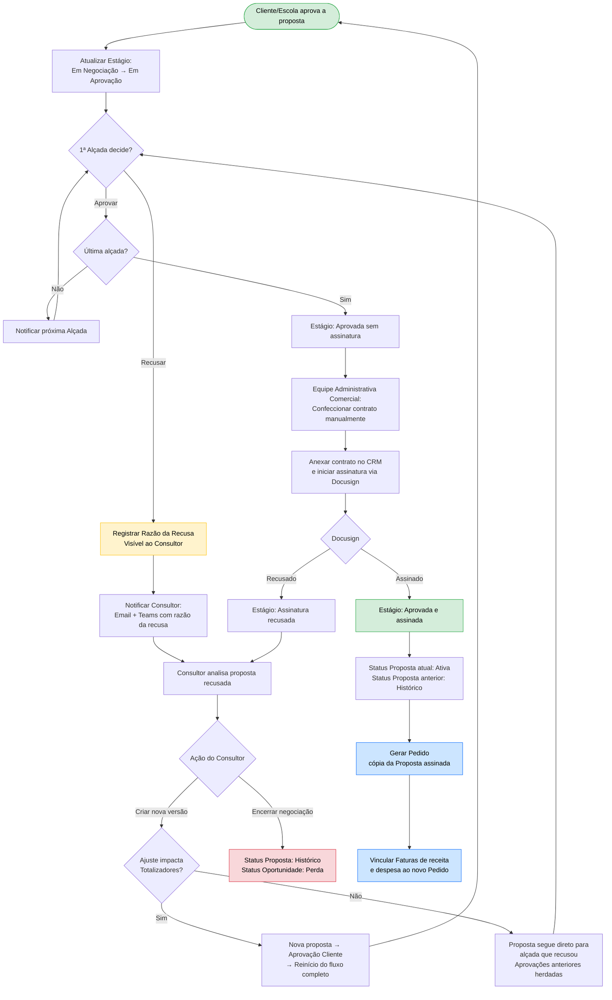

# Documento: Especificação - Aprovação de Propostas

| Campo | Valor |
|-------|-------|
| Attendees | Oscar |
| Data Início | 2 de março de 2026 → 31 de março de 2026 |
| Status | Doing |
| Type | Execution |

> **Fonte Notion**: https://reflective-leotard-9f0.notion.site/Documento-Especifica-o-Aprova-o-de-Propostas-319df3bf541580729988d7ba629e72f3
> **Extraído em**: 17 Março 2026 (versão completa com toggles expandidos)

---

# Identificação

| Campo | Descrição |
|-------|-----------|
| Status | Em desenvolvimento |
| Iniciativa Relacionada | Transformação CX |
| Nome da Funcionalidade | Aprovação de Propostas (Motor de Alçadas e Fluxo) |
| Área / Jornada Impactada | Jornada Comercial |
| Áreas Impactadas | Governança e Processos, CRM, Tecnologia |
| Responsável de Negócio | Silvia Lima |
| Responsável de CX | Oscar de Rooij |
| Product Owner | Kevellin |
| Responsável Tecnologia | Avanade |

---

# Contexto e Problema (AS-IS)

O processo de aprovação de negociações comerciais complexas (que envolvem adiantamentos, royalties, doações e patrocínios) é atualmente difuso e carente de governança sistêmica. Uma ineficiência crítica é a dupla aprovação necessária, uma no CRM e outra no Vulcano para que uma proposta seja oficialmente aprovada.

Como resultado, as propostas tramitam por e-mail, WhatsApp, reuniões informais e obrigatoriamente pelo Vulcano, exigindo que as equipes comerciais e financeiras saltem entre múltiplas plataformas e dupliquem a inserção de dados. O CRM acaba por ser utilizado apenas para "formalização" tardia, quando a negociação já está acordada nas outras vias.

Esta dinâmica gera gargalos significativos. Os gestores e diretores não possuem uma interface consolidada e rápida para analisar o impacto financeiro (margem) da negociação antes de aprovar. Além disso, recusas e pedidos de ajuste não ficam registrados de forma estruturada, o que impede a rastreabilidade das decisões e a geração de inteligência sobre os motivos de perda ou retrabalho.

## Dores Mapeadas

- **Dor 1**: Processos em múltiplos sistemas (CRM, TOTVS e Vulcano), gerando ineficiência e erros.
- **Dor 2**: Duplicidade de aprovações entre Vulcano e CRM, causando retrabalho.
- **Dor 3**: Validação com base em informações fragmentadas, parte no CRM parte no simulador em Excel que foi anexado à proposta.
- **Dor 4**: Aprovadores (níveis gerenciais e diretoria) têm dificuldade em visualizar rapidamente os indicadores críticos (descontos, royalties, adiantamentos) para tomada de decisão.
- **Dor 5**: O tempo de aprovação é longo e o consultor não tem visibilidade de "onde" e "com quem" a proposta está parada (falta de rastreabilidade entre o CRM e o Vulcano).
- **Dor 6**: As regras de alçadas dependem do conhecimento tácito ou de consulta manual a tabelas de regras de negócio.

---

# Objetivo e Valor para o Negócio (TO-BE)

O objetivo é automatizar 100% do fluxo de aprovações comerciais dentro do CRM, implementando um motor de alçadas dinâmico que avalie instantaneamente o impacto da proposta e direcione para os aprovadores corretos.

Com o redesenho desta jornada, o sistema Vulcano será completamente eliminado do fluxo de aprovações de propostas. A funcionalidade transformará o CRM num orquestrador ativo e centralizado da governança comercial. A interface de aprovação será dentro do Simulador Comercial, com interface moderna e mobile, permitindo que a liderança bata o martelo com segurança, baseada em informações compiladas para responder as principais perguntas de cada alçada de aprovação.

## Valor Esperado

Após a entrega de todo o escopo desta funcionalidade, espera-se:

### Para aprovadores
- **Aprovação de propostas em um único sistema**: Eliminação definitiva do Vulcano no processo de aprovação de propostas, transferindo toda responsabilidade de aprovação para o CRM.
- **Eficiência**: Redução no tempo de trâmite das aprovações (lead time de aprovação).
- **Experiência**: Painel unificado para o gestor/diretor aprovar ou solicitar ajustes com um clique, visualizando os principais números da proposta em um único lugar.

### Para consultores
- **Política Comercial Clara**: Regras da política comercial que culminam em diferentes alçadas estarão claras para os consultores em tempo de negociação de propostas.
- **Acompanhamento**: Rastreabilidade completa das aprovações (quem aprovou o que e quando).

---

# Escopo da Funcionalidade – Entregáveis

## Alçadas de Aprovação no CRM

Ao centralizar todas aprovações no CRM precisamos configurar novas alçadas de aprovação e realizar o onboarding de novos usuários.

### Definição das Alçadas

Descrição dos novos níveis de aprovação e Cargos responsáveis pela aprovação. Os níveis descritos abaixo são os atuais.

- **Nível 1** → A submissão do Consultor é suficiente;
- **Nível 2** → Aprovação do Nível 1 + a do Coordenador e Gerente é necessária;
- **Nível 3** → Aprovação do Nível 2 + Diretor Adjunto é necessária;
- **Nível 4** → Aprovação do Nível 3 + Diretor Comercial é necessária;
- **Nível 5** → Aprovação do Nível 4 + Diretor Geral é necessária;
- **Nível 6** → Aprovação do Nível 5 + Superintendência é necessária;
- **Nível 7** → Aprovação do Nível 6 + Presidência é necessária;

**Requisitos**
- A estrutura de alçadas do CRM atual deve ser atualizada para contemplar essas novas alçadas de aprovação.
- O fluxo de aprovação de propostas deve ser atualizado para contemplar esses níveis (atualmente ele chega apenas até o Diretor Comercial).

### Política Comercial - Gatilho das Alçadas

Abaixo seguem os 5 grupos de critérios com suas respectivas informações:

#### Regras Percentuais
- **Royalties**
  - Menor ou igual a 50% → Nível 2
  - Maior que 50%, menor igual a 70% → Nível 3
  - Maior que 70% → Nível 4
- **Adiantamento**
  - Menor que 50% → Nível 4
  - Maior ou igual a 50% → Nível 4
- **Patrocínio**
  - Não tem patrocínio → Nível 1
  - Menor ou igual 3% → Nível 2
  - Maior que 3% → Nível 3
- **Taxa de Administração**
  - Menor que 5% → Nível 4
  - Maior igual a 5%, menor igual a 20% → Nível 1
  - Maior que 20% → Nível 2
- **Resultado**: O nível mais alto das análises acima define quem são os aprovadores com relação às regras percentuais.

#### Regras de Valores Brutos
- **Adiantamento**
  - Não tem adiantamento → Nível 1
  - Menor ou igual a R$100K → Nível 4
  - Maior ou igual a R$100K → Nível 5
- **Royalties**
  - Não tem Royalties → Nível 1
  - Menor que R$50K → Nível 2
  - Maior ou igual R$50K → Nível 4
  - Maior ou igual R$250K → Nível 5
  - Maior ou igual R$500K → Nível 6
  - Maior ou igual R$1M → Nível 7
- **Resultado**: O nível mais alto das 2 análises define quem são os aprovadores com relação às regras de valores brutos.

#### Regras de Formas de Pagamento
- **Parcelamento**
  - Até 6 parcelas → Nível 1
  - Acima ou igual a 7 parcelas → Nível 4
- **Resultado**: O nível mais alto define quem são os aprovadores com relação às regras de parcelamento.

#### Regra de desconto de produto
- Funcionalidade já existe no CRM, fora de escopo desse documento.

#### Regra de existência de contrato
- Funcionalidade já existe no CRM, fora de escopo desse documento.

**Requisitos**
- As regras acima devem ser visualizadas pelos Consultores durante a construção da proposta no Simulador Comercial (funcionalidade descrita na Especificação do Simulador Comercial).
- As alçadas de aprovação também devem ser visualizadas pelos Consultores no mesmo local.

### Manutenção da Política Comercial

- Seja por ticket via um ajuste técnico ou por interface para que o próprio gestor possa alterar os valores de uma regra, o gestor deve poder ajustar os valores das regras definidas. Seria necessário um novo desenvolvimento se a nova regra não encaixasse na estrutura desenvolvida para esse projeto.

---

## Novos usuários que precisarão de acesso ao CRM

Ao trazer o fluxo de aprovações para o CRM, precisaremos trazer também as equipes que consumiam informações das propostas por meio do Vulcano. São elas:

- A identificar (pendente levantamento)

---

## Fluxo de Aprovação

O fluxo de aprovação inicia automaticamente após aprovação da proposta por parte do Cliente/Escola. Nesse momento, a proposta que estava com `Status = Aberta`, `Estágio = Em Negociação` agora muda para `Estágio = Em aprovação`.

- O fluxo de aprovação representa as aprovações internas da FTD (alçadas)
- Quem deve aprovar depende diretamente das condições comerciais negociadas e dos gatilhos de alçada que foram acionados (vide Política Comercial - Gatilho das Alçadas)
- A aprovação da primeira alçada leva para a segunda e assim sucessivamente
- Aprovadores são notificados por email e Teams sobre uma nova proposta para ser revisada e aprovada. O link leva direto para o Simulador Comercial, especificamente a Etapa 6 onde apresentamos todas informações necessárias para tomada de decisão
- A recusa por qualquer das alçadas exige o preenchimento da "Razão da Recusa", informação que é guardada e apresentada ao Consultor para que ajuste o que for necessário
- Propostas ajustadas não necessariamente precisam reiniciar as aprovações do zero:
  - Se a nova versão da proposta **impactar os Totalizadores**, a proposta deverá ser aprovada novamente pelo Cliente antes de ser encaminhada para o fluxo de aprovação, desde o começo
  - Se a nova versão da proposta **não impactar os Totalizadores**, a proposta deve ser encaminhada diretamente para a alçada que a recusou. Justificativa: mudanças que não impactam os totalizadores são de cunho operacional e não demandam uma nova rodada de aprovações completa
    - No caso da proposta não passar por todas aprovações novamente, a nova proposta deve apresentar no fluxo de aprovações que a aprovação de quem foi "pulado" foi capturada na proposta anterior
- A última aprovação altera o Estágio da Proposta para `Aprovada sem assinatura`, etapa onde a equipe administrativa comercial agora deve confeccionar o contrato manualmente
- A equipe administrativa comercial deve anexar o contrato e iniciar processo de assinatura pelo CRM. Quando a assinatura é recebida o estágio da proposta é alterado automaticamente para `Aprovada e assinada`, último estágio da proposta. Como consequência, o Status da proposta também é alterado para `Ativa` e a proposta vigente anterior tem seu status alterado para `Histórico`
- Um novo registro de `Pedido` (uma cópia do que é a `Proposta`) é criado para representar o que foi assinado em contrato e que passa a ser vigente. `Faturas` de receita e despesas serão vinculadas a esse novo contrato a partir de agora
- Na mesma interface de aprovação (Etapa 6 do Simulador Comercial) usuários podem acompanhar todo fluxo de aprovações (quem já aprovou, quem recusou, quem falta aprovar)

### Requisitos Estruturantes

#### Cadeia de Propostas (vínculo entre propostas)

As propostas contam uma história do que foi negociado com o cliente e, por isso, é fundamental o encadeamento delas (vínculo da atual com a anterior). Esse encadeamento é natural em uma proposta com múltiplas versões, mas ele também deve acontecer entre propostas de anos-safra diferentes.

Essa cadeia é especialmente importante para automação do que deve ser feito quando uma proposta é finalmente aprovada e assinada, onde a proposta atual tem seu status alterado para `Ativa` e a anterior alterada para `Histórico`.

Especificamente sobre a relação de uma proposta de um ano safra com a de outro ano safra, a relação só é necessária para que o consultor possa utilizar a funcionalidade "copiar proposta anterior" na preparação para o ano-safra seguinte.

**Exemplo:**
- Proposta 1.0, recusada - Safra 2024
  - Revisão 1.1, recusada (vínculo com Proposta 1.0)
  - Revisão 1.2, recusada (vínculo com Proposta 1.1)
  - Revisão 1.3, recusada (vínculo com Proposta 1.2)
  - Revisão 1.4, **aprovada** (vínculo com Proposta 1.3)
- Proposta 2.0, recusada - Safra 2025 (vínculo com Proposta 1.4)
  - Revisão 2.1, aprovada (vínculo com Proposta 2.0)

**Requisitos:**
- Novas propostas devem ser vinculadas a uma proposta anterior.
- Exceção é se o cliente não tiver uma proposta anterior.

### Início do Fluxo

#### Aprovação do Cliente

A aprovação de uma versão de proposta pelo cliente dá início ao fluxo de aprovação.

**Requisitos:**
- O Status da Proposta se mantém inalterado: `Aberta`
- O Estágio da Proposta que estava `Em negociação`, muda para `Em aprovação`
- A etapa da Oportunidade segue a proposta e muda para `Em aprovação`
- As alçadas de aprovação são calculadas a partir das políticas comerciais
- O CRM identifica o primeiro aprovador
- O CRM notifica por Email e por Teams que essa proposta está disponível para aprovação

#### Notificação de Propostas para Aprovação

A notificação atual leva muitas informações para o aprovador. A forma não está adequada e não facilita a decisão dos aprovadores.

**Requisitos:**
- A notificação é enviada para o Aprovador da alçada em vigor, por Email e Teams com título dando ênfase na **aprovação pendente** e um link para a proposta
- O link leva para Etapa 6 da proposta em questão dentro do Simulador Comercial (interface que consolida todos os números relevantes para tomada de decisão)

#### Análise de Propostas - Aprovação ou Recusa

Ao acessar o link da Notificação, aprovador chega à interface do Simulador que apresenta os principais números da proposta para tomada de decisão (localizados na Etapa 6).

**Requisitos (Aprovação):**
- Sistema registra a aprovação com `usuário` e `timestamp`
- Toda aprovação gera uma *Notificação de Aprovação Parcial* para acompanhamento do Consultor responsável
- Se o aprovador é o último, Estágio da Proposta é atualizado para `Aprovada não assinada`. Nesse estágio equipe administrativa comercial pode criar o contrato que será enviado para assinatura.
- Se ainda existir outros aprovadores pendentes, CRM avança para o próximo aprovador e envia *Notificação de Proposta para Aprovação* como foi feito na primeira vez.

### Tratativa de Propostas Recusadas

#### Usuário Recusa proposta

Ao acessar o link da Notificação, aprovador chega à interface do Simulador (Etapa 6). Sua decisão é de Recusar.

**Requisitos:**
- Usuário aprovador escreve um comentário justificando a recusa
- Sistema registra a recusa com `usuário`, `timestamp` e `justificativa da recusa`
- Sistema atualiza Estágio da Proposta para `Recusada`
- CRM notifica consultor por Email e Teams sobre a recusa

#### Notificação de Proposta Recusada

**Requisitos:**
- A notificação é enviada para o Consultor responsável pela proposta, por Email e Teams com título dando ênfase na **recusa**, um link para a proposta, o nome de quem recusou e a razão da recusa
- O link levará o Consultor para a **interface de leitura** da proposta atual (ID Proposta e versão de Revisão)

#### Análise de uma proposta Recusada

Consultor acessa a proposta recusada pelo próprio CRM ou pela notificação recebida. A interface inicial é aquela de leitura da proposta que foi recusada. Nessa tela tem fácil acesso à razão da recusa, quem recusou e todo conteúdo da proposta (réplica da interface de criação, mas sem possibilidade de edição).

Nesse momento o Consultor tem duas ações possíveis: (1) Criar nova versão de proposta, (2) Encerrar negociação.

**Requisitos:**
- A interface apresenta a razão de recusa e quem recusou
- A interface apresenta a proposta em sua totalidade com todos os campos em modo somente leitura
- A interface apresenta fácil navegação para outras versões da proposta que já foram recusadas anteriormente
- A interface apresenta as duas ações possíveis: (1) Criar nova versão de proposta, (2) Encerrar negociação

#### Criar nova versão de proposta (a partir de uma Recusada)

Na tela de leitura de uma proposta recusada o Consultor conclui que precisa iniciar uma nova versão. Ao clicar nessa opção o sistema deve criar uma nova proposta vinculada à anterior, com ID de revisão novo e copiar todos os dados daquela que foi recusada.

**Requisitos:**
- Alterar Status da Proposta recusada de `Aberta` para `Histórico`
- Criar nova Proposta com Status de Proposta `Aberta` e Estágio da Proposta `Rascunho`
- Metadados devem refletir o timestamp de criação, ID Proposta deve ser o mesmo da proposta recusada, ID de revisão deve ser atualizado
- Conteúdo da proposta deve ser copiado em sua totalidade
- Usuário deve receber uma tela de edição de proposta inteiramente pronta para edição
- A tela de edição dessa proposta deve apresentar claramente a razão de recusa, que o ajuda a lembrar exatamente o que deve alterar. No caso de contratos recusados, a "razão de recusa" não estará preenchida pois não recebemos essa informação do Docusign.

#### Reenvio de proposta recusada para aprovação

Uma proposta recusada pode precisar de ajustes que **não necessariamente** impactam os Totalizadores (receita, condições comerciais, descontos, etc). Quando os Totalizadores são iguais ao da proposta anterior, a proposta deve "pegar um atalho" e ser encaminhada diretamente para quem recusou.

**Requisitos:**
- A comparação entre versão nova da proposta (corrente) e a proposta anterior é fundamental nesse processo
- Se Totalizadores da versão atual forem **diferentes** dos da versão anterior (`Receita Bruta`, `Receita após Benefícios e Patrocínios`, `Total Investido na Escola`, `Adiantamento`, `Parcelas`):
  - Totalizadores, Adiantamento e Parcelamento são as variáveis de maior impacto no negócio e, portanto, demandam um novo ciclo de aprovações desde o início
- Se Totalizadores da versão atual forem **iguais** aos da versão anterior:
  - Se Estágio da Proposta Anterior for `Recusada`:
    - A recusa aconteceu no fluxo interno de aprovação, antes da última alçada. O ajuste solicitado foi operacional e não impactou os Totalizadores.
    - Nesse cenário assumimos a aprovação de todos que já aprovaram e a proposta inicia o Fluxo de Aprovação diretamente em quem recusou a proposta anterior.
    - Os aprovadores que serão "pulados" nessa versão devem ser marcados "Aprovação na proposta anterior" junto do Timestamp da aprovação anterior.
  - Se Estágio da Proposta anterior for `Assinatura recusada`:
    - Nesse caso a recusa aconteceu após uma aprovação completa, durante a assinatura do contrato.
    - A mudança solicitada **não impactou** os Totalizadores (ex: mudança de configuração de loja ou de cláusula contratual).
    - Nesse cenário assumimos a aprovação de todos ("Aprovação na proposta anterior" junto do timestamp de aprovação).
    - Consultor, junto do time Administrativo Comercial e Jurídico deve ajustar o que for necessário para o reenvio do contrato via Docusign.

#### Encerrar uma negociação (Perda)

Na tela de leitura de uma proposta recusada o Consultor conclui que precisa encerrar a negociação (desistir). Ao clicar nessa opção o sistema deve prontificar o usuário com a razão da perda e atualizar os registros.

**Requisitos:**
- Prontificar o usuário com a Razão da Perda e atualizar o campo na Oportunidade relacionada. Opções:
  - Preço / Condições Comerciais
  - Logística
  - Plataforma eCommerce
  - Plataforma educacional
  - Atendimento Pedagógico
  - Qualidade dos materiais didáticos
  - Escola não se adaptou ao material didático
  - Mudança de mantenedora / decisão da rede
  - Uso de material próprio
  - Escola encerrou atividades
  - Outros (especificar)
- Alterar o Status da Proposta para `Histórico`
- Alterar o Status da Oportunidade relacionada para `Perda`
- Enviar *Notificação de Oportunidade Perdida*

#### Notificação de Oportunidade Perdida

**Requisitos:**
- A notificação é enviada para o Coordenador e Gerente responsável pela filial, por Email e Teams com título dando ênfase na **perda**, um link para a proposta e a razão da perda
- O link levará o Consultor para a **interface de leitura** da proposta em questão

### Tratativa de Propostas Aprovadas

#### Usuário Aprova a proposta

Ao acessar o link da Notificação, aprovador chega à interface do Simulador (Etapa 6). A decisão é de Aprovar.

**Requisitos:**
- Sistema registra a aprovação com `usuário` e `timestamp`
- Toda aprovação gera uma *Notificação de Aprovação Parcial* para acompanhamento do Consultor responsável
- Se Usuário Aprovador é o último das alçadas de aprovação:
  - Estágio da Proposta é atualizado para `Aprovada não assinada`
  - Envia *Notificação de Proposta Aprovada*
  - Nesse estágio equipe administrativa comercial pode criar o contrato que será enviado para assinatura
- Senão:
  - Se ainda existir outros aprovadores pendentes, CRM avança para o próximo aprovador
  - Envia *Notificação de Proposta para Aprovação* como foi feito na primeira vez

#### Notificação de Proposta Aprovada Parcial

Quando um aprovador não é o último, chamamos de Aprovação Parcial.

**Requisitos:**
- A notificação é enviada para o Consultor responsável pela proposta, por Email e Teams com título dando ênfase na **aprovação parcial**, nome de quem aprovou, quem é o próximo aprovador e um link para a página de leitura dessa proposta

#### Notificação de Proposta Aprovada

**Requisitos:**
- A notificação é enviada para o Consultor, Coordenador e Gerente de Filial por Email e Teams com título dando ênfase na **aprovação final**, nome de quem aprovou e um link para a proposta

### Tratativa de Assinaturas

#### Proposta assinada no Docusign e criação do Pedido

Quando a proposta é assinada no Docusign, o CRM recebe a informação por meio de integração existente.

**Requisitos:**
- Status da Proposta **anterior** é atualizado de `Ativa` para `Histórico`
- Status da Proposta recém assinada é atualizada de `Aberta` para `Ativa`
- Estágio da Proposta recém assinada é atualizado de `Aprovada não assinada` para `Aprovada e assinada`
- Um Pedido é criado com todas informações da Proposta (uma cópia, inclusive com o contrato que foi assinado)
- Envia *Notificação de Proposta Assinada*
- **Observação**: Mais adiante no roadmap, utilizaremos "Invoices" para receber receitas e despesas do TOTVS e vincular ao Pedido, garantindo rastreio completo de mudanças de receita/faturamento com mudanças contratuais.

#### Notificação de Proposta Assinada

**Requisitos:**
- A notificação é enviada por Email e Teams com título dando ênfase na **assinatura da proposta**, um conteúdo celebrativo e um link para a proposta no Simulador

#### Proposta recusada no Docusign

Quando a proposta é recusada no Docusign, o CRM recebe a informação por meio de integração existente. Consultor recebe a notificação da recusa da assinatura e entra em contato com a escola para entender o que aconteceu.

O Consultor tem 2 ações possíveis: (1) Encerrar negociação, (2) Criar nova versão de proposta.

**Requisitos:**
- Estágio da Proposta é atualizado de `Aprovada não assinada` para `Assinatura recusada`
- Envia *Notificação de Assinatura Recusada* para o Consultor, Coordenador e Gerente da Filial responsável
- **Opção 1: Encerrar negociação** — Mesmo comportamento descrito em "Encerrar uma negociação (Perda)" acima
- **Opção 2: Criar nova versão** — Ao criar uma nova versão o sistema prevê dois cenários possíveis descritos em "Reenvio de proposta recusada para aprovação" acima. A necessidade de criação de uma nova versão de proposta existe mesmo que todos valores do CRM sejam iguais (no caso de uma mudança de cláusula)

---

# Métricas de Performance

| Pilar de Performance | Descrição | Performance Atual | Performance Desejada |
|----------------------|-----------|-------------------|----------------------|
| Growth | Velocidade do fluxo de aprovação | Tempo médio total até assinatura (fluxo completo com contrato) | - |
| Growth | Velocidade do fluxo de aprovação | Tempo médio de aprovação de propostas (fluxo interno) | - |
| Growth | Velocidade do fluxo de aprovação | Tempo médio de aprovação de cada alçada | - |
| Organizational Effectiveness | Velocidade de decisão | Tempo médio que um aprovador demora para entender a proposta para tomada de decisão | - |

---

# Fluxograma Funcional

| Processo | Objetivo | Link MIRO (Ref) |
|----------|----------|-----------------|
| Fluxo de Aprovação de Propostas | Receber uma Proposta acordada com o Cliente e submeter para todas aprovações internas. Entregar uma Proposta aprovada para confecção do contrato e envio para assinatura formal do cliente. | Miro: Aprovação de Propostas |

### Diagrama do Fluxo de Aprovação

**Contexto do Fluxo:**
- Fluxo cobre aprovações internas (alçadas) da FTD
- Quem aprova depende dos gatilhos de alçada definidos nas condições comerciais

**Transparência do Fluxo (visível na interface Etapa 6):**
- Mostrar quem já aprovou (com timestamp)
- Mostrar quem falta aprovar
- Mostrar aprovações "herdadas" de versão anterior (quando totalizadores não mudaram)

---

# Fora de Escopo

- **Aprovação do Cliente**: A jornada do cliente recebendo, visualizando e aprovando a proposta via link externo faz parte da especificação "Simulador Comercial".
- **Geração de Contratos (PDF)**: A geração do documento jurídico com as cláusulas finais não será englobada neste épico de aprovação comercial.
- **Aprovação de pagamento de Adiantamento/Patrocínio/Royalties**: Estes continuam dependendo do Vulcano e serão endereçados em um outro momento.

---

# Observações Finais

- Esse escopo depende de toda estrutura desenvolvida na [Especificação do Simulador Comercial](especificacao-simulador-notion.md)
- Esse escopo é base para futura automação para criação de Contratos
- Esse escopo é base para futuro workflow automatizado para Pagamento de Royalties, Pagamento de Adiantamento e Pagamento de Patrocínios.

  AI Instructions (do not edit or change)
  This register belongs to the Project Management portfolio from ‣ a register in Projects table. AI requests performed within this project and inside table entries related to this project (identified by the relation attribute Project ) should only be based on content related to this project. Never should it use information from other projects inside ‣.
Full guidelines for the AI Assistent are here: ‣
