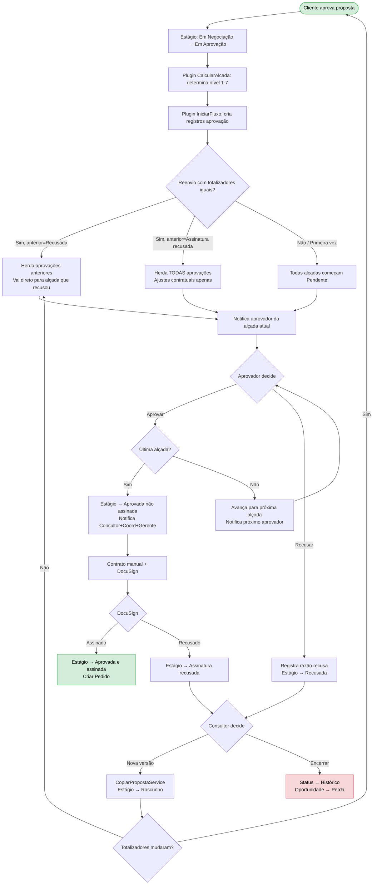

# PRD-D365-2026-03-001 — Refinamento de Processo FTD Educação

| Campo | Valor |
|-------|-------|
| **Document ID** | PRD-D365-2026-03-001 |
| **Título** | Modernização CRM — Aprovação de Propostas + Revisão Estrutural |
| **Versão** | 1.0 |
| **Status** | Draft |
| **Data de Criação** | 17/Mar/2026 |
| **D365 Module** | Sales (Cross-module: Sales + CS) |
| **Solution** | FTDSales, FTDPlugins, FTDCore |
| **Autor** | João PM (Avanade Method) |
| **Fontes** | Refinamento 16/Mar/2026, especificacao-aprovacao-notion.md, especificacao-simulador-notion.md, ftd-discovery.md, ftd-knowledge-base.md |
| **Backlog Ref** | ftd-stories-refinamento.md (6 épicos, 22 stories, 104 tasks) |

---

## Sumário

1. [Executive Summary](#1-executive-summary)
2. [Dataverse Model](#2-dataverse-model)
3. [Business Logic — Plugins & Custom APIs](#3-business-logic)
4. [Automação — Power Automate](#4-automação)
5. [UI Components](#5-ui-components)
6. [Integração](#6-integração)
7. [Security Model](#7-security-model)
8. [ALM & Deployment](#8-alm--deployment)
9. [Data Migration](#9-data-migration)
10. [Métricas de Performance](#10-métricas-de-performance)
11. [Fora de Escopo](#11-fora-de-escopo)
12. [Referência Cruzada — Stories](#12-referência-cruzada)
13. [Apêndices](#13-apêndices)

---

## 1. Executive Summary

### 1.1 Problema

O processo de aprovação de propostas comerciais da FTD Educação é hoje fragmentado entre CRM, Vulcano (aprovação via PDF/print), e-mail e WhatsApp. As dores principais são:

- **Dupla aprovação**: CRM + Vulcano, gerando retrabalho e inconsistência
- **Fragmentação de decisão**: aprovadores enxergam informações parciais, sem painel consolidado
- **Sem rastreabilidade**: recusas e ajustes não ficam registrados de forma estruturada
- **Sem governança sistêmica**: regras de alçada dependem de conhecimento tácito
- **Lead time alto**: consultor não sabe "onde" e "com quem" a proposta está parada
- **Estrutura cadastral deficiente**: 1.283 produtos sem metadados, 12+ tabelas de preço, categorização de contas misturando conceitos

### 1.2 Solução Proposta

Automatizar 100% do fluxo de aprovações dentro do CRM D365 CE, implementando:

1. **Motor de alçadas dinâmico** — 7 níveis, 5 grupos de gatilho, parametrizável sem deploy
2. **Fluxo de aprovação sequencial** — com avanço automático, atalho inteligente em reenvios e notificações Email+Teams
3. **Cadeia de propostas** — versionamento com vínculo anterior/posterior, incluindo cross ano-safra
4. **Interface de aprovação** — Big numbers na Etapa 6 do Simulador com Aprovar/Recusar em 1 clique
5. **Eliminação do Vulcano** — 100% das aprovações de propostas migram para CRM
6. **Revisão cadastral** (Blocos 2-6) — produtos, preços, contas, oportunidades e relatórios

### 1.3 Impacto Esperado

| Indicador | Antes (As-Is) | Depois (To-Be) |
|-----------|---------------|-----------------|
| Sistemas para aprovar proposta | 3 (CRM + Vulcano + WhatsApp/Email) | 1 (CRM via Simulador) |
| Rastreabilidade de aprovações | Inexistente | 100% — quem, quando, justificativa |
| Tempo de decisão do aprovador | Alto (PDF sem contexto) | Baixo (big numbers consolidados, 1 clique) |
| Parametrização de regras | Deploy técnico obrigatório | Gestor altera pela interface |
| Versões de proposta vinculadas | Parcial/manual | Automático (cadeia completa) |

### 1.4 Abordagem D365

| Tipo | % Estimado | Escopo |
|------|-----------|--------|
| Configuration (OOB) | 15% | Views, formulários, optionsets, business rules simples, dashboards |
| Low-code (Power Automate) | 20% | Notificações Email+Teams, Adaptive Cards, orquestração de alertas |
| Pro-code (Plugins/Azure Functions/TS) | 65% | Motor de alçadas, fluxo sequencial, comparação de totalizadores, cadeia de propostas, form scripts, integração DocuSign |

---

## 2. Dataverse Model

### 2.1 Novas Tabelas

#### 2.1.1 `ftd_alcada_aprovacao` — Estrutura de Alçadas
> **Stories**: 1.1

| Campo | Nome Lógico | Tipo | Obrigatório | Descrição |
|-------|-------------|------|:-----------:|-----------|
| Nível | `ftd_nivel` | Whole Number (1-7) | ✅ | Nível da alçada (1=Consultor, 7=Presidência) |
| Cargo | `ftd_cargo` | Text (100) | ✅ | Cargo responsável pela aprovação |
| Descrição | `ftd_descricao` | Text (500) | ❌ | Descrição detalhada da alçada |
| Ativo | `ftd_ativo` | Two Options | ✅ | Se a alçada está ativa |
| Ordem de Sequência | `ftd_ordem_sequencia` | Whole Number | ✅ | Ordem de processamento no fluxo |

- **Ownership**: Organization
- **Primary Column**: `ftd_cargo`
- **Audit**: Habilitado

#### 2.1.2 `ftd_aprovador` — Aprovadores por Alçada e Filial
> **Stories**: 1.1, 1.11

| Campo | Nome Lógico | Tipo | Obrigatório | Descrição |
|-------|-------------|------|:-----------:|-----------|
| Usuário | `ftd_usuario` | Lookup → SystemUser | ✅ | Aprovador do sistema |
| Alçada | `ftd_alcada` | Lookup → ftd_alcada_aprovacao | ✅ | Nível de alçada vinculado |
| Estabelecimento | `ftd_estabelecimento` | Lookup → Account (Filial) | ✅ | Filial onde atua como aprovador |
| Ativo | `ftd_ativo` | Two Options | ✅ | Se está ativo como aprovador |

- **Ownership**: Organization
- **Primary Column**: Auto-name (Usuário + Alçada)

#### 2.1.3 `ftd_regra_alcada` — Regras da Política Comercial
> **Stories**: 1.2, 1.12

| Campo | Nome Lógico | Tipo | Obrigatório | Descrição |
|-------|-------------|------|:-----------:|-----------|
| Grupo | `ftd_grupo` | Choice | ✅ | Percentual / Valor Bruto / Pagamento |
| Tipo de Indicador | `ftd_tipo_indicador` | Choice | ✅ | Royalties / Adiantamento / Patrocínio / Taxa Admin / Parcelamento |
| Operador Mínimo | `ftd_operador_min` | Decimal | ✅ | Valor mínimo do range (inclusive) |
| Operador Máximo | `ftd_operador_max` | Decimal | ✅ | Valor máximo do range (exclusive ou inclusive conforme regra) |
| Nível Alçada Resultado | `ftd_nivel_alcada` | Whole Number (1-7) | ✅ | Nível de alçada resultante desta regra |
| Ativo | `ftd_ativo` | Two Options | ✅ | Se a regra está ativa |
| Descrição | `ftd_descricao` | Text (500) | ❌ | Descrição textual da regra |

- **Ownership**: Organization
- **Primary Column**: Auto-name (Grupo + Indicador + Range)
- **Audit**: Habilitado (controle de alterações na Política Comercial)

**Dados Iniciais — Regras Percentuais:**

| Indicador | Condição | Nível |
|-----------|----------|:-----:|
| Royalties % | ≤ 50% | 2 |
| Royalties % | > 50% e ≤ 70% | 3 |
| Royalties % | > 70% | 4 |
| Adiantamento % | < 50% | 4 |
| Adiantamento % | ≥ 50% | 4 |
| Patrocínio % | = 0 (sem) | 1 |
| Patrocínio % | ≤ 3% | 2 |
| Patrocínio % | > 3% | 3 |
| Taxa Admin % | < 5% | 4 |
| Taxa Admin % | ≥ 5% e ≤ 20% | 1 |
| Taxa Admin % | > 20% | 2 |

**Dados Iniciais — Regras de Valores Brutos:**

| Indicador | Condição | Nível |
|-----------|----------|:-----:|
| Adiantamento R$ | R$ 0 (sem) | 1 |
| Adiantamento R$ | ≤ R$ 100K | 4 |
| Adiantamento R$ | ≥ R$ 100K | 5 |
| Royalties R$ | R$ 0 (sem) | 1 |
| Royalties R$ | < R$ 50K | 2 |
| Royalties R$ | ≥ R$ 50K | 4 |
| Royalties R$ | ≥ R$ 250K | 5 |
| Royalties R$ | ≥ R$ 500K | 6 |
| Royalties R$ | ≥ R$ 1M | 7 |

**Dados Iniciais — Regras de Pagamento:**

| Indicador | Condição | Nível |
|-----------|----------|:-----:|
| Parcelamento | ≤ 6 parcelas | 1 |
| Parcelamento | ≥ 7 parcelas | 4 |

#### 2.1.4 `ftd_aprovacao_historico` — Histórico de Aprovações
> **Stories**: 1.3, 1.5, 1.6, 1.10, 6.3

| Campo | Nome Lógico | Tipo | Obrigatório | Descrição |
|-------|-------------|------|:-----------:|-----------|
| Proposta | `ftd_proposta` | Lookup → Quote | ✅ | Proposta em aprovação |
| Aprovador | `ftd_aprovador` | Lookup → SystemUser | ✅ | Usuário responsável pela decisão |
| Nível Alçada | `ftd_nivel_alcada` | Whole Number (1-7) | ✅ | Nível da alçada deste registro |
| Decisão | `ftd_decisao` | Choice | ✅ | Pendente / Aprovado / Recusado / Herdada |
| Timestamp Decisão | `ftd_timestamp_decisao` | DateTime | ❌ | Momento da decisão (preenchido automaticamente) |
| Justificativa | `ftd_justificativa` | Text (2000) | ❌ | Razão da recusa (obrigatória em Recusa) |
| Versão Proposta | `ftd_versao_proposta` | Whole Number | ❌ | ID Revisão da proposta no momento da decisão |
| Proposta Origem Aprovação | `ftd_proposta_origem` | Lookup → Quote | ❌ | Referência à proposta anterior (para decisões "Herdada") |
| Timestamp Aprovação Original | `ftd_timestamp_original` | DateTime | ❌ | Timestamp da aprovação na proposta anterior (para "Herdada") |

- **Ownership**: Organization
- **Primary Column**: Auto-name (Proposta + Nível + Decisão)

### 2.2 Tabelas Modificadas

#### 2.2.1 `quote` (Proposta) — Novos Campos
> **Stories**: 1.2, 1.5, 1.6, 1.7, 1.8, 1.13

| Campo | Nome Lógico | Tipo | Obrigatório | Descrição |
|-------|-------------|------|:-----------:|-----------|
| Estágio da Proposta | `ftd_estagio_proposta` | Choice (8 valores) | ✅ | Rascunho, Em Negociação, Avaliação Cliente, Em Aprovação, Recusada, Aprovada não assinada, Assinatura recusada, Aprovada e assinada |
| Nível Alçada Calculado | `ftd_nivel_alcada_calculado` | Whole Number | ❌ | Resultado final do motor de alçadas |
| Nível Percentual | `ftd_nivel_percentual` | Whole Number | ❌ | Resultado do grupo Regras Percentuais |
| Nível Valor Bruto | `ftd_nivel_valor_bruto` | Whole Number | ❌ | Resultado do grupo Valores Brutos |
| Nível Pagamento | `ftd_nivel_pagamento` | Whole Number | ❌ | Resultado do grupo Pagamento |
| Razão da Recusa | `ftd_razao_recusa` | Text (2000) | ❌ | Razão da última recusa |
| Recusado Por | `ftd_recusado_por` | Lookup → SystemUser | ❌ | Quem recusou pela última vez |
| Data da Recusa | `ftd_data_recusa` | DateTime | ❌ | Quando foi recusada |
| Proposta Anterior | `ftd_proposta_anterior` | Lookup → Quote (self) | ❌ | Vínculo com proposta que originou esta |
| Proposta Posterior | `ftd_proposta_posterior` | Lookup → Quote (self) | ❌ | Vínculo com proposta que substituiu esta |
| ID Proposta | `ftd_id_proposta` | Text (50) | ✅ | Identificador da cadeia de propostas |
| ID Revisão | `ftd_id_revisao` | Whole Number | ✅ | Número de revisão dentro da cadeia (auto-increment) |
| Razão de Perda | `ftd_razao_perda` | Choice (11 valores) | ❌ | Motivo do encerramento da negociação |
| Razão de Perda Detalhe | `ftd_razao_perda_detalhe` | Text (500) | ❌ | Detalhe quando razão = "Outros" |

**Choice: `ftd_estagio_proposta` (8 valores)**
1. Rascunho
2. Em Negociação
3. Avaliação Cliente
4. Em Aprovação
5. Recusada
6. Aprovada não assinada
7. Assinatura recusada
8. Aprovada e assinada

**Choice: `ftd_razao_perda` (11 valores)**
1. Preço / Condições Comerciais
2. Logística
3. Plataforma eCommerce
4. Plataforma educacional
5. Atendimento Pedagógico
6. Qualidade dos materiais didáticos
7. Escola não se adaptou ao material didático
8. Mudança de mantenedora / decisão da rede
9. Uso de material próprio
10. Escola encerrou atividades
11. Outros (especificar)

**Choice: `ftd_decisao_aprovacao` (4 valores)**
1. Pendente
2. Aprovado
3. Recusado
4. Herdada

#### 2.2.2 `opportunity` (Oportunidade) — Alterações
> **Stories**: 1.3, 1.8, 5.3

| Alteração | Detalhe |
|-----------|---------|
| Estágio acompanha Proposta | Plugin atualiza estágio da Oportunidade em sincronia com Proposta |
| Status "Perda" | Atualizado automaticamente ao encerrar negociação |
| Razão de Perda | Lookup do `ftd_razao_perda` da proposta |
| Campos duplicados | Ocultos do formulário (mantidos no banco — lista a definir com Oscar) |

### 2.3 Views

| Tabela | Nome da View | Tipo | Colunas | Filtros | Ordenação |
|--------|-------------|------|---------|---------|-----------|
| `ftd_aprovacao_historico` | Aprovações Pendentes | System | Proposta, Aprovador, Nível, Decisão, Timestamp | Decisão = Pendente | Timestamp ASC |
| `ftd_aprovacao_historico` | Histórico de Aprovação (por Proposta) | System | Nível, Aprovador, Decisão, Timestamp, Justificativa | Proposta = {contexto} | Nível ASC |
| `ftd_regra_alcada` | Política Comercial — Todas Regras | System | Grupo, Indicador, Min, Max, Nível, Ativo | Ativo = Sim | Grupo, Indicador |
| `ftd_regra_alcada` | Regras por Grupo | System | Indicador, Min, Max, Nível | Agrupado por Grupo | Indicador, Min |
| `ftd_alcada_aprovacao` | Alçadas Ativas | System | Nível, Cargo, Descrição | Ativo = Sim | Nível ASC |
| `ftd_aprovador` | Aprovadores por Filial | System | Usuário, Alçada, Estabelecimento | Ativo = Sim | Alçada, Estabelecimento |
| `quote` | Propostas Pendentes Minha Aprovação | System | Escola, ID Proposta, Receita Bruta, Estágio | Estágio = Em Aprovação, Aprovador = Mim | Data Criação DESC |
| `quote` | Cadeia de Propostas | System | ID Proposta, ID Revisão, Estágio, Status, Data | Proposta Anterior = {contexto} | ID Revisão ASC |

### 2.4 Forms

#### 2.4.1 Form: Proposta — Aprovação (Main Form Tab)
> **Stories**: 1.10

| Seção | Campos |
|-------|--------|
| **Header** | Status, Estágio, Escola (Account), Consultor Responsável |
| **Tab: Big Numbers** | Receita Bruta, Receita após Benefícios, Total Investido, Adiantamento, Parcelas, Análise por Linha de Negócio |
| **Tab: Aprovação** | Subgrid `ftd_aprovacao_historico` (histórico completo), Comparativo proposta anterior (Quick View) |
| **Tab: Cadeia de Propostas** | Proposta Anterior (lookup), Proposta Posterior (lookup), Subgrid cadeia completa |
| **Tab: Detalhes do Cálculo** | Nível Calculado, Nível Percentual, Nível Valor Bruto, Nível Pagamento |

**Business Rules (Form-level):**

| Nome | Condição | Ação |
|------|----------|------|
| BR_OcultarBotoesSeNaoAprovador | Usuário logado ≠ Aprovador da alçada atual | Ocultar botões Aprovar/Recusar |
| BR_ObrigarJustificativaRecusa | Decisão = Recusar | Tornar campo Justificativa obrigatório |
| BR_BloquearEdicaoEmAprovacao | Estágio = Em Aprovação | Bloquear edição de todos campos comerciais |
| BR_MostrarRazaoRecusa | Estágio = Recusada | Mostrar seção com razão da recusa e quem recusou |

#### 2.4.2 Form: Manutenção da Política Comercial
> **Stories**: 1.12

- **Tabela**: `ftd_regra_alcada`
- **Tipo**: Main Form com grid editável
- **Layout**: Agrupado por Grupo → Indicador → Lista de ranges
- **Validação**: Business Rule para impedir overlap de ranges

#### 2.4.3 Quick View Form: Comparativo de Proposta
> **Stories**: 1.10

- **Tabela**: `quote`
- **Lookup source**: `ftd_proposta_anterior`
- **Campos**: Receita Bruta, Receita após Benefícios, Total Investido, Adiantamento, Parcelas
- **Propósito**: Exibir lado a lado os totalizadores da versão anterior

---

## 3. Business Logic

### 3.1 Plugins

#### 3.1.1 Motor de Cálculo de Alçadas
> **Stories**: 1.2

| Propriedade | Valor |
|-------------|-------|
| **Name** | `FTD.Plugins.Quote.CalcularAlcadaPlugin` |
| **Entity** | `quote` |
| **Message** | Update |
| **Stage** | Pre-Operation (20) |
| **Execution** | Synchronous |
| **Filtering Attributes** | `ftd_estagio_proposta` |
| **Trigger** | `ftd_estagio_proposta` muda para "Em Aprovação" |

**Lógica:**
1. Consulta todas regras ativas em `ftd_regra_alcada` via `AlcadaRegrasRepository`
2. Avalia campos da proposta contra cada grupo de regras:
   - Grupo Percentual: avalia Royalties%, Adiantamento%, Patrocínio%, Taxa Admin%
   - Grupo Valor Bruto: avalia Adiantamento R$, Royalties R$
   - Grupo Pagamento: avalia Parcelamento (nº de parcelas)
3. Para cada grupo, determina o nível mais alto
4. Resultado final = `MAX(nível_percentual, nível_valor_bruto, nível_pagamento)`
5. Persiste em `ftd_nivel_alcada_calculado`, `ftd_nivel_percentual`, `ftd_nivel_valor_bruto`, `ftd_nivel_pagamento`

**Padrão BCA**: `Plugin<T>` → `AlcadaCalculationService` → `AlcadaRegrasRepository : IRepository<ftd_regra_alcada>`

**Acceptance Criteria:**
- GIVEN proposta com Royalties 60%, Adiantamento R$120K e 8 parcelas WHEN submetida para aprovação THEN nível final = 5 (MAX(3, 5, 4))
- GIVEN proposta onde todos indicadores = 0 WHEN submetida THEN nível = 1
- GIVEN regras desativadas WHEN motor roda THEN regras inativas são ignoradas

#### 3.1.2 Início do Fluxo de Aprovação
> **Stories**: 1.3, 1.6

| Propriedade | Valor |
|-------------|-------|
| **Name** | `FTD.Plugins.Quote.IniciarFluxoAprovacaoPlugin` |
| **Entity** | `quote` |
| **Message** | Update |
| **Stage** | Post-Operation (40) |
| **Execution** | Synchronous |
| **Filtering Attributes** | `ftd_estagio_proposta` |
| **Trigger** | `ftd_estagio_proposta` muda para "Em Aprovação" (após CalcularAlcada) |

**Lógica:**
1. Lê `ftd_nivel_alcada_calculado` da proposta
2. **Verifica se é reenvio** (proposta tem `ftd_proposta_anterior` com Estágio = Recusada ou Assinatura recusada):
   - Chama `ComparadorTotalizadoresService` para comparar totalizadores
   - Se totalizadores **diferentes**: cria registros de aprovação do nível 1 até o nível calculado, todos com decisão = Pendente
   - Se totalizadores **iguais** e anterior = "Recusada": herda aprovações anteriores (decisão = Herdada), cria registros Pendente a partir da alçada que recusou
   - Se totalizadores **iguais** e anterior = "Assinatura recusada": herda todas aprovações anteriores (decisão = Herdada)
3. **Se não é reenvio**: cria registros do nível 1 ao nível calculado, todos Pendente
4. Define primeiro aprovador ativo com base no nível, filial do consultor e entidade `ftd_aprovador`
5. Dispara notificação para o primeiro aprovador (via `NotificacaoAprovacaoService`)

**Padrão BCA**: `Plugin<T>` → `FluxoAprovacaoService` → `ComparadorTotalizadoresService` + `NotificacaoAprovacaoService`

#### 3.1.3 Registrar Aprovação e Avançar Alçada
> **Stories**: 1.3

| Propriedade | Valor |
|-------------|-------|
| **Name** | `FTD.Plugins.AprovacaoHistorico.RegistrarAprovacaoPlugin` |
| **Entity** | `ftd_aprovacao_historico` |
| **Message** | Update |
| **Stage** | Post-Operation (40) |
| **Execution** | Synchronous |
| **Filtering Attributes** | `ftd_decisao` |
| **Trigger** | `ftd_decisao` muda para "Aprovado" |

**Lógica:**
1. Registra `ftd_timestamp_decisao` = DateTime.UtcNow
2. Verifica se é última alçada (`VerificarUltimaAlcada()`)
3. Se **é última**: atualiza Estágio Proposta → "Aprovada não assinada", dispara Notificação Proposta Aprovada
4. Se **não é última**: identifica próximo aprovador, dispara Notificação Proposta para Aprovação
5. Atualiza Estágio da Oportunidade para acompanhar a Proposta

#### 3.1.4 Registrar Recusa de Proposta
> **Stories**: 1.5

| Propriedade | Valor |
|-------------|-------|
| **Name** | `FTD.Plugins.AprovacaoHistorico.RecusarPropostaPlugin` |
| **Entity** | `ftd_aprovacao_historico` |
| **Message** | Update |
| **Stage** | Post-Operation (40) |
| **Execution** | Synchronous |
| **Filtering Attributes** | `ftd_decisao` |
| **Trigger** | `ftd_decisao` muda para "Recusado" |

**Lógica:**
1. Valida que `ftd_justificativa` está preenchida (obrigatório em recusa)
2. Registra `ftd_timestamp_decisao`
3. Atualiza Proposta: Estágio → "Recusada", `ftd_razao_recusa`, `ftd_recusado_por`, `ftd_data_recusa`
4. Dispara Notificação Proposta Recusada para o consultor

#### 3.1.5 Cadeia de Propostas — Pre-Create
> **Stories**: 1.7

| Propriedade | Valor |
|-------------|-------|
| **Name** | `FTD.Plugins.Quote.CadeiaPropostaPreCreatePlugin` |
| **Entity** | `quote` |
| **Message** | Create |
| **Stage** | Pre-Operation (20) |
| **Execution** | Synchronous |
| **Filtering Attributes** | — |

**Lógica:**
1. Se `ftd_proposta_anterior` está preenchida:
   - Gera `ftd_id_revisao` = proposta_anterior.ftd_id_revisao + 1
   - Copia `ftd_id_proposta` da proposta anterior
   - Atualiza `ftd_proposta_posterior` da proposta anterior com referência à nova
2. Se `ftd_proposta_anterior` não está preenchida (primeira proposta):
   - Gera `ftd_id_proposta` (formato a definir: ex. "PROP-{CNPJ}-{Safra}")
   - Define `ftd_id_revisao` = 0

#### 3.1.6 Transição de Estágio — Máquina de Estados
> **Stories**: 1.13

| Propriedade | Valor |
|-------------|-------|
| **Name** | `FTD.Plugins.Quote.TransicaoEstagioPlugin` |
| **Entity** | `quote` |
| **Message** | Update |
| **Stage** | Pre-Validation (10) |
| **Execution** | Synchronous |
| **Filtering Attributes** | `ftd_estagio_proposta` |

**Transições Válidas:**

```
Rascunho → Em Negociação
Em Negociação → Avaliação Cliente
Avaliação Cliente → Em Aprovação
Em Aprovação → Aprovada não assinada
Em Aprovação → Recusada
Aprovada não assinada → Assinatura recusada
Aprovada não assinada → Aprovada e assinada
Recusada → (nova proposta via CopiarPropostaService)
Assinatura recusada → (nova proposta via CopiarPropostaService)
```

Qualquer transição não listada é bloqueada com InvalidPluginExecutionException.

#### 3.1.7 Validação de Exclusão de Alçada
> **Stories**: 1.1

| Propriedade | Valor |
|-------------|-------|
| **Name** | `FTD.Plugins.AlcadaAprovacao.ValidarExclusaoPlugin` |
| **Entity** | `ftd_alcada_aprovacao` |
| **Message** | Delete |
| **Stage** | Pre-Validation (10) |
| **Execution** | Synchronous |

**Lógica:** Verifica se existem registros em `ftd_aprovacao_historico` ou `ftd_regra_alcada` vinculados. Se sim, bloqueia exclusão.

#### 3.1.8 Integração DocuSign — Pós-Assinatura
> **Stories**: 1.9

| Propriedade | Valor |
|-------------|-------|
| **Name** | `FTD.Plugins.Quote.PosAssinaturaPlugin` |
| **Entity** | `quote` |
| **Message** | Update |
| **Stage** | Post-Operation (40) |
| **Execution** | Synchronous |
| **Filtering Attributes** | `ftd_estagio_proposta` |
| **Trigger** | Estágio muda para "Aprovada e assinada" ou "Assinatura recusada" |

**Lógica (Aprovada e assinada):**
1. Status da proposta assinada → "Ativa"
2. Se existe proposta anterior com Status "Ativa": Status anterior → "Histórico"
3. Cria registro de Pedido (Order) via `PosAssinaturaService.CriarPedido()` com cópia completa da proposta (cabeçalho, produtos, benefícios, contrato anexado)
4. Dispara Notificação Proposta Assinada (celebrativa)

**Lógica (Assinatura recusada):**
1. Dispara Notificação Assinatura Recusada para Consultor, Coordenador e Gerente

### 3.2 Custom APIs

#### 3.2.1 `CriarNovaVersaoProposta`
> **Stories**: 1.5, 1.6

| Propriedade | Valor |
|-------------|-------|
| **Name** | `ftd_CriarNovaVersaoProposta` |
| **Description** | Cria nova versão de proposta a partir de uma recusada, copiando todos dados |
| **Is Function** | No (Action) |

**Request Parameters:**

| Nome | Tipo | Descrição |
|------|------|-----------|
| `PropostaOrigem` | EntityReference (quote) | Referência à proposta recusada |

**Response Properties:**

| Nome | Tipo | Descrição |
|------|------|-----------|
| `NovaProposta` | EntityReference (quote) | Referência à nova proposta criada |
| `FluxoReinicio` | Boolean | True se totalizadores mudaram (requer aprovação cliente) |

**Lógica:**
1. Altera Status da proposta origem: "Aberta" → "Histórico"
2. Chama `CopiarPropostaService.Copiar()` — duplica cabeçalho, produtos, benefícios, patrocínios, configuração de vendas
3. Nova proposta: Status = "Aberta", Estágio = "Rascunho", ftd_id_revisao incrementado
4. Define `ftd_proposta_anterior` + atualiza `ftd_proposta_posterior` da origem
5. Copia `ftd_razao_recusa` para referência do consultor

#### 3.2.2 `EncerrarNegociacao`
> **Stories**: 1.8

| Propriedade | Valor |
|-------------|-------|
| **Name** | `ftd_EncerrarNegociacao` |
| **Description** | Encerra negociação marcando oportunidade como perdida |

**Request Parameters:**

| Nome | Tipo | Descrição |
|------|------|-----------|
| `Proposta` | EntityReference (quote) | Proposta a encerrar |
| `RazaoPerda` | Int | Valor do optionset ftd_razao_perda |
| `RazaoPerdaDetalhe` | String | Texto livre (obrigatório se Razão = Outros) |

**Lógica:**
1. Status Proposta → "Histórico"
2. Status Oportunidade → "Perda"
3. Popula `ftd_razao_perda` + `ftd_razao_perda_detalhe` na Proposta e Oportunidade
4. Dispara Notificação Oportunidade Perdida para Coordenador e Gerente

### 3.3 Services (Padrão BCA)

| Service | Responsabilidade |
|---------|-----------------|
| `AlcadaCalculationService` | Avaliação dos 5 grupos de gatilho, determinação do nível máximo |
| `FluxoAprovacaoService` | Orquestração do fluxo: IniciarFluxo(), AvancarAlcada(), RegistrarAprovacao(), VerificarUltimaAlcada() |
| `ComparadorTotalizadoresService` | Compara 5 campos entre proposta atual e anterior: `ftd_receita_bruta`, `ftd_receita_apos_beneficios`, `ftd_total_investido_escola`, `ftd_adiantamento`, `ftd_parcelas` |
| `CopiarPropostaService` | Duplica proposta completa: cabeçalho + produtos + benefícios + patrocínios + configuração de vendas |
| `NotificacaoAprovacaoService` | Métodos para cada tipo de notificação (7 tipos) |
| `PosAssinaturaService` | Criação de Pedido, atualização de status pós-assinatura |

### 3.4 Repositories (Padrão BCA)

| Repository | Interface | Responsabilidade |
|-----------|-----------|-----------------|
| `AlcadaRegrasRepository` | `IRepository<ftd_regra_alcada>` | Consulta de regras ativas por grupo/indicador |
| `AprovadorRepository` | `IRepository<ftd_aprovador>` | Consulta de aprovadores por filial e alçada |
| `AprovacaoHistoricoRepository` | `IRepository<ftd_aprovacao_historico>` | CRUD de registros de aprovação |

---

## 4. Automação

### 4.1 Cloud Flows — Notificações

#### 4.1.1 FTD — Aprovação — Notificar Pendente — Dataverse Update
> **Stories**: 1.4

| Propriedade | Valor |
|-------------|-------|
| **Trigger** | Dataverse: Row added or modified em `ftd_aprovacao_historico` com `ftd_decisao` = Pendente |
| **Ações** | 1. Obter dados da proposta + dados do aprovador <br> 2. Enviar Email (template "Proposta Pendente de Aprovação") <br> 3. Enviar Adaptive Card no Teams (com botão "Abrir no Simulador") |
| **Link** | URL do Power Pages → Etapa 6: `{PowerPagesURL}/proposta/{quoteId}/etapa6` |
| **Error Handling** | Try-Catch scope, log em tabela de logs de integração |

#### 4.1.2 FTD — Aprovação — Notificar Aprovação Parcial — Dataverse Update
> **Stories**: 1.4

| Propriedade | Valor |
|-------------|-------|
| **Trigger** | Dataverse: Row modified em `ftd_aprovacao_historico` com `ftd_decisao` = Aprovado e última alçada = Não |
| **Destinatário** | Consultor responsável pela proposta |
| **Conteúdo** | Nome do aprovador, próximo aprovador, link para proposta |

#### 4.1.3 FTD — Aprovação — Notificar Proposta Aprovada — Dataverse Update
> **Stories**: 1.4

| Propriedade | Valor |
|-------------|-------|
| **Trigger** | Dataverse: Row modified em `quote` com `ftd_estagio_proposta` = "Aprovada não assinada" |
| **Destinatários** | Consultor + Coordenador + Gerente de Filial |
| **Conteúdo** | Nome do último aprovador, link para proposta |

#### 4.1.4 FTD — Aprovação — Notificar Recusa — Dataverse Update
> **Stories**: 1.4

| Propriedade | Valor |
|-------------|-------|
| **Trigger** | Dataverse: Row modified em `ftd_aprovacao_historico` com `ftd_decisao` = Recusado |
| **Destinatário** | Consultor responsável |
| **Conteúdo** | Nome de quem recusou, razão da recusa, link para proposta (leitura) |

#### 4.1.5 FTD — Aprovação — Notificar Perda — Dataverse Update
> **Stories**: 1.8

| Propriedade | Valor |
|-------------|-------|
| **Trigger** | Dataverse: Row modified em `opportunity` com Status = "Perda" |
| **Destinatários** | Coordenador + Gerente de Filial |
| **Conteúdo** | Razão da perda, link para proposta |

#### 4.1.6 FTD — Assinatura — Notificar Proposta Assinada — Dataverse Update
> **Stories**: 1.9

| Propriedade | Valor |
|-------------|-------|
| **Trigger** | Dataverse: Row modified em `quote` com `ftd_estagio_proposta` = "Aprovada e assinada" |
| **Destinatários** | Consultor, Coordenador, Gerente |
| **Conteúdo** | Celebrativo, link para proposta |

#### 4.1.7 FTD — Assinatura — Notificar Assinatura Recusada — Dataverse Update
> **Stories**: 1.9

| Propriedade | Valor |
|-------------|-------|
| **Trigger** | Dataverse: Row modified em `quote` com `ftd_estagio_proposta` = "Assinatura recusada" |
| **Destinatários** | Consultor, Coordenador, Gerente |
| **Conteúdo** | Link para proposta, opções disponíveis |

### 4.2 Templates de Email (7 templates D365)

| # | Nome do Template | Tipo | Destinatário |
|:-:|-----------------|------|-------------|
| 1 | Proposta Pendente de Aprovação | Email + Teams Adaptive Card | Aprovador da alçada em vigor |
| 2 | Aprovação Parcial | Email + Teams | Consultor responsável |
| 3 | Proposta Aprovada | Email + Teams | Consultor + Coordenador + Gerente |
| 4 | Proposta Recusada | Email + Teams | Consultor responsável |
| 5 | Oportunidade Perdida | Email + Teams | Coordenador + Gerente |
| 6 | Proposta Assinada | Email + Teams (celebrativo) | Consultor + Coordenador + Gerente |
| 7 | Assinatura Recusada | Email + Teams | Consultor + Coordenador + Gerente |

---

## 5. UI Components

### 5.1 Ribbon Buttons

| Botão | Localização | Visibilidade | Ação |
|-------|------------|-------------|------|
| **Aprovar** | Command Bar — Proposta | Estágio = "Em Aprovação" AND Usuário = Aprovador da alçada atual | Registra decisão "Aprovado" em `ftd_aprovacao_historico` |
| **Recusar** | Command Bar — Proposta | Estágio = "Em Aprovação" AND Usuário = Aprovador da alçada atual | Abre dialog de justificativa, registra "Recusado" |
| **Criar Nova Versão** | Command Bar — Proposta | Estágio = "Recusada" OR "Assinatura recusada" AND Usuário = Consultor | Chama Custom API `ftd_CriarNovaVersaoProposta` |
| **Encerrar Negociação** | Command Bar — Proposta | Estágio = "Recusada" OR "Assinatura recusada" AND Usuário = Consultor | Abre dialog com Razão de Perda, chama `ftd_EncerrarNegociacao` |

### 5.2 Web Resources (TypeScript)

#### 5.2.1 `ftd_/scripts/aprovacao/AprovacaoPropostaContract.ts`
> **Stories**: 1.10

**Padrão BCA**: Contract/Controller pattern

```typescript
// Contract: define interface dos campos e eventos do form
interface AprovacaoPropostaContract {
  estagioProposta: Xrm.Attributes.OptionSetAttribute;
  nivelAlcadaCalculado: Xrm.Attributes.NumberAttribute;
  receitaBruta: Xrm.Attributes.NumberAttribute;
  receitaAposBeneficios: Xrm.Attributes.NumberAttribute;
  totalInvestido: Xrm.Attributes.NumberAttribute;
  adiantamento: Xrm.Attributes.NumberAttribute;
  parcelas: Xrm.Attributes.NumberAttribute;
  razaoRecusa: Xrm.Attributes.StringAttribute;
  propostaAnterior: Xrm.Attributes.LookupAttribute;
}
```

#### 5.2.2 `ftd_/scripts/aprovacao/AprovacaoPropostaController.ts`
> **Stories**: 1.10

**Eventos registrados**: OnLoad, OnChange(ftd_estagio_proposta)

**Lógica:**
- OnLoad: verifica se usuário é aprovador da alçada atual → mostra/oculta botões Aprovar/Recusar
- OnLoad: se Estágio = "Recusada" → exibe seção de razão da recusa
- OnLoad: se existe `ftd_proposta_anterior` → carrega Quick View com comparativo
- Fluent Rules: validar campos obrigatórios antes de ação de Aprovar/Recusar

### 5.3 Model-driven App Views

| App | View/Área | Descrição |
|-----|-----------|-----------|
| Spartan | Dashboard "Política Comercial" | Grid editável de `ftd_regra_alcada` para gestores |
| Spartan | View "Minhas Propostas Pendentes de Aprovação" | Propostas onde sou aprovador da alçada em vigor |
| Spartan | Dashboard "Performance de Aprovações" | KPIs: tempo médio, taxa de recusa, propostas paradas |

### 5.4 Power Pages (Simulador — Etapa 6)
> **Stories**: 1.10

A interface de aprovação no Simulador (Power Pages) é detalhada na especificação do Simulador e será desenvolvida em conjunto. O escopo deste PRD cobre os **componentes D365 que alimentam** a Etapa 6:

- Views/APIs para alimentar big numbers
- Subgrid de `ftd_aprovacao_historico` (quem aprovou, quem falta, quem recusou)
- Campos de comparativo com proposta anterior
- Endpoints para botões Aprovar/Recusar (Custom API ou plugin)
- Deep links: `{PowerPagesURL}/proposta/{quoteId}/etapa6`

---

## 6. Integração

### 6.1 DocuSign (Existente — Atualização)
> **Stories**: 1.9

| Propriedade | Valor |
|-------------|-------|
| **Sistema** | DocuSign (migração de Adobe Sign em andamento) |
| **Tipo** | Plugin existente + webhooks |
| **Atualização** | Processar novos Estágios: "Aprovada e assinada" e "Assinatura recusada" |
| **Fluxo (assinado)** | DocuSign webhook → Plugin → PosAssinaturaService → Criar Pedido |
| **Fluxo (recusado)** | DocuSign webhook → Plugin → Atualizar Estágio → Notificação |

### 6.2 Power Pages ↔ CRM (Etapa 6)
> **Stories**: 1.10

| Propriedade | Valor |
|-------------|-------|
| **Tipo** | Dataverse Web API (de Power Pages para CRM) |
| **Operações** | Read: big numbers, histórico de aprovação, comparativo. Write: Aprovar/Recusar (via Custom API ou direct update) |
| **Auth** | Entra ID (usuários internos com licença D365) |

### 6.3 Microsoft Teams (Notificações)

| Propriedade | Valor |
|-------------|-------|
| **Tipo** | Power Automate → Teams connector → Adaptive Card |
| **Card** | Título, resumo de big numbers, botão "Abrir no Simulador" |
| **Destino** | Chat 1:1 com aprovador (não canal) |

### 6.4 TOTVS/Datasul (Existente — Sem Alteração)

| Propriedade | Valor |
|-------------|-------|
| **Pattern** | ETL bidirecional 1x/dia 6h |
| **Impacto deste PRD** | Nenhum — fluxo de aprovação é independente de TOTVS |
| **Futuro** | Pedido criado após assinatura será sincronizado com TOTVS (escopo de integração existente) |

---

## 7. Security Model

### 7.1 Security Roles

#### 7.1.1 FTD Aprovador (Novo)
> **Stories**: 1.11

| Tabela | Create | Read | Write | Delete | Append | Append To |
|--------|:------:|:----:|:-----:|:------:|:------:|:---------:|
| `quote` | None | BU | None | None | None | None |
| `ftd_aprovacao_historico` | None | BU | User | None | None | BU |
| `ftd_alcada_aprovacao` | None | Org | None | None | None | None |
| `ftd_aprovador` | None | Org | None | None | None | None |
| `ftd_regra_alcada` | None | Org | None | None | None | None |
| `account` | None | BU | None | None | None | None |
| `opportunity` | None | BU | None | None | None | None |

**Base**: Salesperson (read-only para maioria das entidades)

#### 7.1.2 FTD Aprovador Executivo (Novo) — Níveis 5-7
> **Stories**: 1.11

| Tabela | Create | Read | Write | Delete | Append | Append To |
|--------|:------:|:----:|:-----:|:------:|:------:|:---------:|
| `quote` | None | Org | None | None | None | None |
| `ftd_aprovacao_historico` | None | Org | User | None | None | Org |
| `ftd_alcada_aprovacao` | None | Org | None | None | None | None |
| `account` | None | Org | None | None | None | None |
| `opportunity` | None | Org | None | None | None | None |

**Diferença**: Read = Org (veem **todas** as propostas, não apenas da BU/filial)

#### 7.1.3 FTD Gestor Política Comercial (Novo)
> **Stories**: 1.12

| Tabela | Create | Read | Write | Delete | Append | Append To |
|--------|:------:|:----:|:-----:|:------:|:------:|:---------:|
| `ftd_regra_alcada` | Org | Org | Org | None | Org | Org |
| `ftd_alcada_aprovacao` | Org | Org | Org | None | Org | Org |

**Propósito**: Permite alterar regras e alçadas sem escalar para TI.

#### 7.1.4 Roles Existentes — Ajustes

| Role | Ajuste |
|------|--------|
| FTD Consultor (existente) | Adicionar Read em `ftd_alcada_aprovacao`, `ftd_regra_alcada` (scope Org), `ftd_aprovacao_historico` (scope BU). Adicionar Create/Write em `ftd_aprovacao_historico` (para consultor registrar ação). |
| FTD Coordenador (existente) | Mesmos ajustes do Consultor + Read scope = BU para `ftd_aprovacao_historico` |

### 7.2 Field Security Profiles

| Profile | Campos Protegidos | Read | Write | Create |
|---------|-------------------|:----:|:-----:|:------:|
| Aprovação Somente Leitura | `ftd_nivel_alcada_calculado`, `ftd_nivel_percentual`, `ftd_nivel_valor_bruto`, `ftd_nivel_pagamento` | ✅ | ❌ | ❌ |

Campos de cálculo de alçada são **somente leitura** para todos os perfis — preenchidos exclusivamente por plugin.

### 7.3 Business Units

O modelo de BU existente (1 BU por filial/estabelecimento) é reutilizado. Não há criação de novas BUs para este PRD.

---

## 8. ALM & Deployment

### 8.1 Solutions Impactadas

| Solution | Tipo | Componentes deste PRD |
|----------|------|-----------------------|
| **FTDCore** | Core | Novas tabelas (`ftd_alcada_aprovacao`, `ftd_aprovador`, `ftd_regra_alcada`, `ftd_aprovacao_historico`), optionsets globais, security roles |
| **FTDSales** | Module | Formulários e views de `quote`, business rules, ribbon buttons, dashboards |
| **FTDPlugins** | Code | 8 plugins, 2 Custom APIs, assemblies C# |
| **FTDIntegration** | Integration | Ajustes na integração DocuSign |

### 8.2 Ambientes

| Ambiente | URL | Pipeline | Uso |
|----------|-----|----------|-----|
| **DEV** | FTD-Dev | Plugin deploy manual | Desenvolvimento e testes unitários |
| **OAT** | FTD-OAT | Pipeline automático | UAT / Validação funcional |
| **PROD** | FTD-Prod | Pipeline + GMUD (SMAX) | Produção |

### 8.3 Plano de Deploy

| Step | Ação | Responsável |
|:----:|------|-------------|
| 1 | Desenvolvimento em DEV (plugins, forms, views, flows) | Avanade Dev |
| 2 | Export unmanaged de DEV | Avanade Dev |
| 3 | Build managed via pipeline Azure DevOps | Pipeline automático |
| 4 | Import managed em OAT | Pipeline automático |
| 5 | Validação funcional em OAT (PO + QA) | Kevellin + Carla QA |
| 6 | Abertura de GMUD no SMAX | Giselle (FTD Infra) |
| 7 | Import managed em PROD | Pipeline + aprovação GMUD |
| 8 | Smoke tests em PROD | Avanade + FTD |
| 9 | Popular dados iniciais (alçadas, regras, aprovadores) via EMC | Avanade + Oscar |

### 8.4 Padrões de Código (BCA v3)

| Aspecto | Padrão |
|---------|--------|
| **Backend** | `Plugin<T>` → Service → Repository com DI (Unity). `[PluginRegistration]` attribute. Early Bound obrigatório. |
| **Frontend** | TypeScript obrigatório. Contract/Controller pattern. Fluent Rules. Early Bound Forms. |
| **Testing** | MSTest + NSubstitute (C#), Jest (TS). Coverage mínima 80% plugins, 70% PCF. |
| **Naming** | Publisher prefix: `ftd`. Namespace: `FTD.Plugins.*`. Web resources: `ftd_/scripts/`. Flows: `FTD - [Module] - [Ação]`. |
| **Branching** | Feature branches a partir de `dev`. PR com code review obrigatório. |

---

## 9. Data Migration

### 9.1 Dados Iniciais (Épico 1 — Aprovação)

| Entidade | Registros | Origem | Método |
|----------|:---------:|--------|--------|
| `ftd_alcada_aprovacao` | 7 | Especificação aprovada | EMC (manual pela equipe) |
| `ftd_regra_alcada` | ~22 | Especificação aprovada (tabelas de regras da seção 2) | EMC |
| `ftd_aprovador` | ~50-100 (estimativa) | Levantamento com Kevellin/Oscar | EMC ou script PowerShell |

### 9.2 Migração de Status/Estágio de Propostas Existentes
> **Stories**: 1.13

| De (campo legado) | Para (campo novo) | Regra |
|-------------------|-------------------|-------|
| Status = Rascunho | Estágio = Rascunho, Status = Aberto | — |
| Status = Ativo/Em Aprovação | Estágio = Em Negociação, Status = Aberto | Pendente definição detalhada com Oscar |
| Status = Ativo Aprovado | Estágio = Aprovada e assinada, Status = Ativo | — |
| Status = Fechado Perdido | Estágio = (manter legado), Status = Histórico | — |
| Status = Cancelado | Status = Histórico | — |

**Estratégia**: Script de migração em C# (Console App ou Azure Function one-shot), executado em janela de manutenção.

### 9.3 Blocos 2-6 — Migração de Dados (PENDENTE DISCOVERY)

> ⚠️ **As migrações abaixo dependem de resultados de Discovery em andamento. As estimativas são preliminares.**

| Área | Volume Estimado | Estratégia | Status |
|------|:--------------:|-----------|--------|
| Produtos (metadados) | 1.283 registros | Enriquecimento massivo + script | 🟡 Pendente reunião ISA/TOTVS |
| Séries (padronização) | ~17 valores padronizados | Novo optionset + script migração | 🟡 Pendente definição valores |
| Tabelas de Preço (12→5) | 12+ Price Lists | Migração de Price List Items + desativação legadas | 🟡 Pendente consultoria pricing |
| Categorização de Contas | 101.000 contas (recorte 2025-2026) | Novos campos + script migração massiva | 🟡 Pendente definição com Oscar |
| Mantenedora vs. Parceiro | ~101.000 contas | Auditoria + separação de dados | 🟡 Pendente |
| Oportunidades | TBD | Criação massiva com vínculo a propostas | 🟡 Pendente |

---

## 10. Métricas de Performance

### 10.1 Métricas Operacionais (Aprovação)

| Métrica | Descrição | Cálculo | Meta |
|---------|-----------|---------|------|
| Tempo médio do fluxo de aprovação (interno) | Do estágio "Em Aprovação" até "Aprovada não assinada" | AVG(timestamp última aprovação - timestamp primeira pendente) | A definir (baseline As-Is não existe) |
| Tempo médio de aprovação por alçada | Tempo que cada alçada leva para decidir | AVG(timestamp_decisao - timestamp_criacao) por nível | A definir |
| Tempo médio total até assinatura | Do envio ao cliente até "Aprovada e assinada" | AVG(timestamp assinada - timestamp avaliação cliente) | A definir |
| Tempo de decisão do aprovador | Quanto tempo o aprovador leva para entender e agir | AVG(timestamp_decisao - notificação recebida) | Reduzir vs. Vulcano |
| Taxa de recusa por motivo | % de recusas por categoria | COUNT por razão / COUNT total recusas | Identificar padrões |
| Número médio de versões por contrato ganho | Quantidade de revisões até assinatura | AVG(ftd_id_revisao da proposta assinada) | Tendência de queda |

### 10.2 Métricas Técnicas

| Métrica | Meta | Validação |
|---------|------|-----------|
| Plugin execution time | < 2.000ms | Tracing + Application Insights |
| Flow execution success rate | > 99% | Power Automate Analytics |
| Notificações entregues | 100% | Log em tabela de integração |
| Disponibilidade fluxo de aprovação | 99.9% | Monitoring Datadog |

### 10.3 Métricas de Negócio (Onda 1 Pós-MVP)

| Métrica | Descrição |
|---------|-----------|
| Horas economizadas por proposta | Baseline As-Is (até 3h) vs. To-Be |
| Taxa de retrabalho | % propostas que retornam para correção |
| Forecast accuracy | Variação entre receita prevista e real |
| Funil de conversão | % avanço entre estágios |

---

## 11. Fora de Escopo

| Item | Justificativa |
|------|--------------|
| Aprovação do cliente (jornada externa) | Coberto na especificação do Simulador Comercial |
| Geração de contratos (PDF/Word) | Processo manual subsiste — automatização em outro épico |
| Aprovação de pagamento de Adiantamento/Patrocínio/Royalties | Continua no Vulcano para esses fluxos (não é proposta) |
| Comissionamento do consultor | Pós-venda, fase futura |
| IA em propostas | Maturidade de dados insuficiente |
| Power BI / relatórios avançados | Épico 6 com detalhamento posterior |
| Modularização de contratos Word | Depende de revisão jurídica |
| Integração ISA redesenhada | Dependente de reunião ISA/TOTVS |

---

## 12. Referência Cruzada

### Stories por Seção do PRD

| Seção PRD | Stories Cobertas | Épico |
|-----------|-----------------|-------|
| 2.1.1-2.1.2 Alçadas + Aprovadores | 1.1 | 1 |
| 2.1.3 Regras de Alçada | 1.2, 1.12 | 1 |
| 2.1.4 Histórico Aprovação | 1.3, 1.5, 1.6 | 1 |
| 2.2.1 Proposta — Novos Campos | 1.2, 1.5, 1.7, 1.8, 1.13 | 1 |
| 3.1.1 Plugin CalcularAlcada | 1.2 | 1 |
| 3.1.2 Plugin IniciarFluxo | 1.3, 1.6 | 1 |
| 3.1.3 Plugin RegistrarAprovacao | 1.3 | 1 |
| 3.1.4 Plugin RecusarProposta | 1.5 | 1 |
| 3.1.5 Plugin CadeiaProposta | 1.7 | 1 |
| 3.1.6 Plugin TransicaoEstagio | 1.13 | 1 |
| 3.1.8 Plugin PosAssinatura | 1.9 | 1 |
| 3.2.1 API CriarNovaVersao | 1.5, 1.6 | 1 |
| 3.2.2 API EncerrarNegociacao | 1.8 | 1 |
| 4.1.1-4.1.7 Flows Notificação | 1.4 | 1 |
| 5.1 Ribbon Buttons | 1.10 | 1 |
| 5.2 Web Resources | 1.10 | 1 |
| 6.1 DocuSign | 1.9 | 1 |
| 7.1 Security Roles | 1.11 | 1 |
| 9.2 Migração Status | 1.13 | 1 |

### Épicos 2-6 — Resumo e Status

| Épico | Título | Prioridade | Stories | Status PRD |
|:-----:|--------|:----------:|:-------:|:----------:|
| 2 | Revisão Cadastro de Produtos | 🟠 Should | 2.1–2.4 | PENDENTE DISCOVERY |
| 3 | Consolidação Tabelas de Preço | 🟡 Could | 3.1–3.2 | PENDENTE PRICING |
| 4 | Categorização de Contas | 🟠 Should | 4.1–4.3 | PENDENTE DISCOVERY |
| 5 | Higienização + Oportunidades Massivas | 🟠 Should | 5.1–5.3 | PENDENTE DIAGNÓSTICO |
| 6 | Relatórios de Gestão — Onda 1 | 🟠 Should | 6.1–6.3 | DEPENDENTE 2-5 |

---

## 13. Apêndices

### Apêndice A — Diagrama do Fluxo de Aprovação



### Apêndice B — Níveis de Alçada

| Nível | Cargo Aprovador | Cumulativo |
|:-----:|-----------------|:----------:|
| 1 | Consultor (auto-aprovação) | — |
| 2 | Coordenador + Gerente | + N1 |
| 3 | Diretor Adjunto | + N1 + N2 |
| 4 | Diretor Comercial | + N1 + N2 + N3 |
| 5 | Diretor Geral | + N1 + N2 + N3 + N4 |
| 6 | Superintendência | + N1 a N5 |
| 7 | Presidência | + N1 a N6 |

### Apêndice C — Glossário

| Termo | Significado |
|-------|-------------|
| Alçada | Nível de aprovação necessário, baseado nas condições comerciais |
| Vulcano | Sistema legado de aprovação (PDF com prints manuais) — será eliminado |
| Safra | Ano letivo/comercial (ex: Safra 2026) |
| Totalizadores | Campos-chave da proposta: Receita Bruta, Receita após Benefícios, Total Investido, Adiantamento, Parcelas |
| Simulador | Interface Power Pages para criação e gestão de propostas |
| Etapa 6 | Revisão e Compartilhamento — tela de Big Numbers e aprovação |
| Big Numbers | Indicadores consolidados para decisão rápida do aprovador |
| EMC | Entity Management Cockpit — ferramenta para carga de dados |
| BCA | Best Current Architecture — framework de padrões Avanade |

### Apêndice D — Épico 2: Revisão Cadastro de Produtos (PENDENTE DISCOVERY)

> **Status**: Aguardando resultado de reunião ISA/TOTVS e brainstorm com Júlio/Fernando/Mônica.

**Escopo resumido:**
- **Story 2.1**: Nova taxonomia de Linha de Negócio (eliminar anomalias como FC Zoom, Dicionário, Agenda como LN separada)
- **Story 2.2**: Conceito de Variação de Produto (Ponto e Ponto 4/8, Trilhas maiúscula/minúscula)
- **Story 2.3**: Metadados estruturantes (Linha de Negócio, Componente Curricular, Coleção, Variação, Série — para reduzir 1283→17)
- **Story 2.4**: Padronização de Séries (EI 1-5, EFAI 1-5, EFAF 6-9, EM 1-3 — limpar duplicados)

**Entidades impactadas**: `product`, `ftd_variacao_produto` (nova), `ftd_linha_negocio` (nova ou optionset)

### Apêndice E — Épico 3: Consolidação Tabelas de Preço (PENDENTE PRICING)

> **Status**: Consultoria de pricing em andamento, resultado esperado final de março/2026.

**Escopo resumido:**
- **Story 3.1**: Racionalizar 12+→5 tabelas (Escola Privado, Livreiro Privado, Escola Público, E-commerce, Customizados)
- **Story 3.2**: Recorte automático de tabela de preço por contexto da proposta (mercado + tipo cliente)

### Apêndice F — Épico 4: Categorização de Contas (PENDENTE DISCOVERY)

> **Status**: Oscar recebeu primeira versão da hierarquia. Em revisão com equipe comercial.

**Escopo resumido:**
- **Story 4.1**: Nova categorização em 3 níveis hierárquicos (substituir campo `tipo_de_instituicao` que mistura conceitos)
- **Story 4.2**: Separar Mantenedora vs. Parceiro Comercial (campo reaproveitado atualmente para 3 finalidades)
- **Story 4.3**: Cadastrar Livreiros como contas no CRM (migrar do "Pede Livreiro")

**Entidades impactadas**: `account` (novos campos: `ftd_categoria_nivel1/2/3`, `ftd_key_account`, `ftd_parceiro_comercial`), `ftd_escola_parceiro` (N:N nova)

### Apêndice G — Épico 5: Higienização e Oportunidades (PENDENTE DIAGNÓSTICO)

> **Status**: Julio já iniciou diagnóstico. Reunião com comercial 17/Mar para definir recorte.

**Escopo resumido:**
- **Story 5.1**: Diagnóstico quantitativo da qualidade da base de contas (recorte 2025-2026)
- **Story 5.2**: Criação massiva de oportunidades vinculadas a propostas existentes
- **Story 5.3**: Simplificação de campos da Oportunidade (eliminar duplicação com Proposta)

### Apêndice H — Épico 6: Relatórios de Gestão (DEPENDENTE DE 2-5)

> **Status**: Objetivo declarado da Onda 1: "entregar pela primeira vez na história da FTD relatórios de gestão confiáveis para 2025-2026."

**Escopo resumido:**
- **Story 6.1**: Funil de Oportunidades (dashboard D365)
- **Story 6.2**: Desempenho por Linha de Negócio (comparativo safra anterior vs. atual)
- **Story 6.3**: Performance de Aprovação (tempo médio, taxa de recusa, gargalos)

---

## Histórico de Revisões

| Versão | Data | Autor | Mudança |
|:------:|------|-------|---------|
| 1.0 | 17/Mar/2026 | João PM (Avanade) | Criação inicial — baseada em Refinamento 16/Mar e especificações aprovadas |
