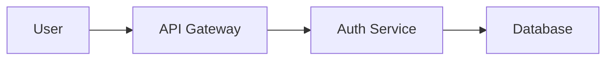

---

## ?? O que é este Artefato?

Este é o **guia definitivo de padrões de documentação** para criar docs consistentes, acessíveis e úteis. Cobre:
- ?? **Writing Style**: Tom, voz, perspectiva, linguagem
- ?? **Formatting**: Markdown, headings, code blocks, lists
- ? **Accessibility**: WCAG compliance, inclusive language
- ?? **Content Types**: Guides, tutorials, references, API docs
- ? **Quality Gates**: Checklists e validação

---

## ?? Quando Usar

### ? USE para:
- Criar qualquer documentação técnica (guides, tutorials, API docs)
- Revisar documentação existente (editorial review)
- Onboarding de novos technical writers
- Definir Definition of Done para documentation tasks

### ? NÃO USE para:
- Documentação interna de código (code comments - use language-specific guides)
- PRDs/specs (use AVANADE_PRD_TEMPLATE_YAML)
- Marketing content (diferente audience/tone)

---

## ?? SECTION 1: WRITING STYLE

### 1.1 Voice & Tone

**Voice** (consistente sempre):
- **Professional**: Confiável, preciso, bem-informado
- **Friendly**: Acolhedor, não intimidante
- **Clear**: Direto ao ponto, sem jargão desnecessário

**Tone** (adapta ao contexto):

| Context | Tone | Example |
|---------|------|---------|
| **Tutorial** | Encouraging, patient | "Let's walk through this step-by-step..." |
| **Reference** | Neutral, factual | "The `connect()` method accepts..." |
| **Troubleshooting** | Empathetic, solution-focused | "If you're seeing this error, try..." |
| **Warning** | Serious, direct | "?? This action is irreversible." |

**Examples:**
```markdown
? GOOD (Friendly Professional):
"Welcome! This guide will help you set up authentication in under 10 minutes."

? BAD (Too casual):
"Hey there! Let's get this auth thing sorted, yeah?"

? BAD (Too formal):
"This document shall herein provide instructions for the establishment of authentication protocols."
```

---

### 1.2 Grammar & Syntax

#### Active Voice (Preferred)
```markdown
? GOOD: "Click the Save button to save your changes."
? BAD: "Your changes can be saved by clicking the Save button."

? GOOD: "The system validates the input before processing."
? BAD: "The input is validated by the system before it is processed."
```

#### Present Tense (Preferred)
```markdown
? GOOD: "When you click Save, the system validates the data."
? BAD: "When you click Save, the system will validate the data."

Exception: Future tense OK para consequências futuras
? ACCEPTABLE: "After deployment, users will see the new interface."
```

#### Second Person ("You")
```markdown
? GOOD: "You can configure the settings in the dashboard."
? BAD: "One can configure the settings..." (too formal)
? BAD: "We configure the settings..." (confusing - who is "we"?)

Exception: Use "we" para ações do sistema/product team
? ACCEPTABLE: "We recommend using HTTPS in production."
```

#### Parallel Structure
```markdown
? GOOD:
To install the package:
1. Download the installer
2. Run the setup wizard
3. Configure your settings

? BAD:
To install the package:
1. Download the installer
2. You should run the setup wizard
3. Configuration of your settings
```

---

### 1.3 Word Choice

#### Use Simple Words
| Instead of... | Use... |
|---------------|--------|
| utilize | use |
| terminate | end, stop |
| initiate | start |
| subsequent | next |
| prior to | before |
| in order to | to |

#### Be Specific
```markdown
? GOOD: "The API returns a 404 error if the resource doesn't exist."
? BAD: "The API might return an error in some cases."

? GOOD: "Processing takes 2-5 seconds for files under 10MB."
? BAD: "Processing is usually fast."
```

#### Avoid Jargon (Unless Necessary)
```markdown
? GOOD: "The system checks the data before saving it (validation)."
? BAD: "The system performs idempotent validation leveraging schema contracts."

When jargon is necessary:
? GOOD: "The API uses OAuth 2.0 for authentication (a secure industry-standard protocol)."
```

---

## ?? SECTION 2: FORMATTING STANDARDS

### 2.1 Markdown Basics

#### Headings (Semantic Hierarchy)
```markdown
# Document Title (H1 - only ONE per document)

## Major Section (H2)

### Subsection (H3)

#### Minor Heading (H4 - use sparingly)

RULES:
- Never skip levels (H1 ? H3 without H2)
- Max depth: H4 (deeper = poor structure)
- Use sentence case ("How to configure" not "How To Configure")
```

#### Emphasis
```markdown
**Bold** - Important terms, UI elements, warnings
*Italic* - Slight emphasis, first use of new terms
`Code` - Commands, code elements, file names

? GOOD: "Click the **Save** button to save changes."
? GOOD: "The *validation* process checks data integrity."
? GOOD: "Run `npm install` to install dependencies."

? BAD: "Click the *save* button to **save** changes." (inconsistent)
```

---

### 2.2 Code Blocks

#### Always Specify Language
```markdown
? GOOD:
```python
def hello(name):
    return f"Hello, {name}!"
```

? BAD (no language tag):
```
def hello(name):
    return f"Hello, {name}!"
```
```

#### Line Length (80 characters max)
```markdown
? GOOD:
```python
# Short, readable lines
result = calculate_total(
    subtotal=100,
    tax_rate=0.08,
    discount=10
)
```

? BAD (too long):
```python
result = calculate_total(subtotal=100, tax_rate=0.08, discount=10, shipping=5, handling=2)
```
```

#### Include Comments for Non-Obvious Code
```markdown
? GOOD:
```javascript
// Retry failed requests up to 3 times with exponential backoff
const maxRetries = 3;
for (let i = 0; i < maxRetries; i++) {
    try {
        return await fetchData();
    } catch (error) {
        await sleep(Math.pow(2, i) * 1000);  // 1s, 2s, 4s
    }
}
```

? BAD (no explanation):
```javascript
const maxRetries = 3;
for (let i = 0; i < maxRetries; i++) {
    try {
        return await fetchData();
    } catch (error) {
        await sleep(Math.pow(2, i) * 1000);
    }
}
```
```

---

### 2.3 Lists

#### Unordered Lists (Use `-` not `*`)
```markdown
? GOOD:
- First item
- Second item
  - Nested item (2 spaces indent)
- Third item

? BAD (inconsistent bullets):
* First item
- Second item
+ Third item
```

#### Ordered Lists (Sequential Steps)
```markdown
? GOOD (parallel structure):
1. Download the installer
2. Run the setup wizard
3. Configure your settings
4. Start the application

? BAD (not parallel):
1. Download the installer
2. You should run the setup wizard
3. Settings configuration
4. Starting the app
```

#### When to Use Which
```markdown
Unordered (no specific order):
- Features: Cross-platform, fast, secure
- Benefits: Saves time, reduces errors

Ordered (sequence matters):
1. Steps in a tutorial
2. Troubleshooting checklist (try A, then B, then C)
```

---

### 2.4 Links

#### Descriptive Link Text
```markdown
? GOOD: "See the [authentication guide](auth.md) for setup instructions."
? BAD: "Click [here](auth.md) for more info."

? GOOD: "Learn more about [OAuth 2.0](https://oauth.net/2/)."
? BAD: "Learn more at https://oauth.net/2/"
```

#### Relative vs Absolute Paths
```markdown
Internal links (same repo):
? GOOD: [Setup Guide](./setup.md)
? BAD: [Setup Guide](https://example.com/docs/setup.md)

External links:
? GOOD: [GitHub Docs](https://docs.github.com)
```

---

### 2.5 Images & Diagrams

#### Alt Text (Always!)
```markdown
? GOOD:


? BAD (no alt text):


? BAD (not descriptive):

```

#### Image File Naming
```markdown
? GOOD: dashboard-analytics-view.png
? BAD: Screenshot 2025-02-03.png
? BAD: IMG_1234.png
```

#### Prefer Diagrams Over Screenshots
```markdown
? BEST (Mermaid - text-based, editable):


? ACCEPTABLE (Screenshot - use only if Mermaid não adequado):


WHY? Mermaid is:
- Version-controlled (text)
- Easy to update (no image editing)
- Accessible (can be read by screen readers with proper alt text)
```

---

### 2.6 Tables

#### Use for Structured Data
```markdown
? GOOD:
| HTTP Method | Endpoint | Description |
|-------------|----------|-------------|
| GET | /users | List all users |
| POST | /users | Create new user |
| DELETE | /users/:id | Delete user |

? BAD (should be table):
GET /users - List all users
POST /users - Create new user
DELETE /users/:id - Delete user
```

#### Keep Tables Simple
```markdown
? GOOD (3-4 columns max):
| Name | Type | Required |
|------|------|----------|
| email | string | Yes |
| age | integer | No |

? BAD (too many columns - hard to read):
| Name | Type | Required | Default | Min | Max | Pattern | Example |
|------|------|----------|---------|-----|-----|---------|---------|
| ... (8 columns is too much) ...

SOLUTION: Split into multiple tables or use description list
```

---

## ? SECTION 3: ACCESSIBILITY

### 3.1 WCAG 2.1 Level AA Compliance

#### Color Contrast (4.5:1 minimum for text)
```markdown
? GOOD: Dark text (#333) on light background (#FFF)
? BAD: Light gray text (#AAA) on white background (#FFF)

Test contrast: https://webaim.org/resources/contrastchecker/
```

#### Semantic HTML (Use Headings Correctly)
```markdown
? GOOD:
# Main Title (H1)
## Section 1 (H2)
### Subsection 1.1 (H3)
## Section 2 (H2)

? BAD:
# Main Title (H1)
#### Subsection (H4 - skipped H2 and H3!)
```

#### Keyboard Navigation
```markdown
For interactive docs (web):
- All interactive elements must be keyboard accessible (Tab, Enter, Escape)
- Focus indicators must be visible
- Logical tab order (top to bottom, left to right)
```

---

### 3.2 Inclusive Language

#### Gender-Neutral Terms
| Instead of... | Use... |
|---------------|--------|
| guys, manpower | team, folks, everyone, people |
| man-hours | person-hours, work hours |
| he/she | they (singular) |

#### Avoid Ableist Language
| Instead of... | Use... |
|---------------|--------|
| sanity check | quick check, validation |
| dummy value | placeholder value, sample value |
| crippled | limited, restricted |

#### Avoid Master/Slave Terminology
| Instead of... | Use... |
|---------------|--------|
| master/slave | primary/replica, leader/follower |
| whitelist/blacklist | allowlist/denylist |

---

## ?? SECTION 4: CONTENT TYPES

### 4.1 Tutorials (Step-by-Step)

**Goal**: Teach user how to complete a specific task

**Structure**:
```markdown
# Tutorial Title (Task-oriented)

**Time**: ~10 minutes
**Difficulty**: Beginner | Intermediate | Advanced

## What You'll Learn
- Bullet list of outcomes

## Prerequisites
- What user needs before starting (tools, knowledge, access)

## Step 1: [Action Verb]
Clear instruction with context.

```code
example code
```

**Expected result**: What user should see after this step.

## Step 2: [Next Action]
...

## Next Steps
- What to do after completing tutorial
- Links to related guides
```

**Example**:
```markdown
# How to Set Up Authentication

**Time**: ~15 minutes
**Difficulty**: Beginner

## What You'll Learn
- Install authentication library
- Configure OAuth 2.0
- Protect your first route

## Prerequisites
- Node.js 16+ installed
- Basic Express.js knowledge

## Step 1: Install Dependencies
Install the `passport` authentication library:

```bash
npm install passport passport-oauth2
```

**Expected result**: You should see `passport` in your `package.json`.

## Step 2: Configure Strategy
...
```

---

### 4.2 Reference Docs (API, Configuration)

**Goal**: Provide complete technical details for lookup

**Structure**:
```markdown
# API Reference: [Resource Name]

## Overview
Brief description of what this resource does.

## Endpoints

### GET /resource
Brief description.

**Parameters:**
| Name | Type | Required | Description |
|------|------|----------|-------------|
| id | string | Yes | Resource ID |

**Response:**
```json
{
  "id": "123",
  "name": "Example"
}
```

**Status Codes:**
- `200 OK` - Success
- `404 Not Found` - Resource doesn't exist

**Example Request:**
```bash
curl -X GET https://api.example.com/resource/123 \
  -H "Authorization: Bearer YOUR_TOKEN"
```
```

---

### 4.3 How-To Guides (Task-Focused)

**Goal**: Help user accomplish a specific goal

**Structure**:
```markdown
# How to [Accomplish Goal]

**Context**: When you need to [scenario].

## Quick Summary
TL;DR - one sentence solution.

## Detailed Steps
1. Do this
2. Then do that
3. Finally this

## Example
Real-world example showing complete flow.

## Troubleshooting
Common issues and solutions.
```

---

### 4.4 Conceptual Docs (Explanations)

**Goal**: Explain how something works (no tutorial)

**Structure**:
```markdown
# Understanding [Concept]

## What is [Concept]?
High-level definition.

## Why Use It?
Benefits and use cases.

## How It Works
Technical explanation with diagrams.

## When to Use
Scenarios where this applies.

## Related Concepts
Links to related docs.
```

---

## ? SECTION 5: QUALITY GATES

### 5.1 Pre-Publication Checklist

#### Content Quality
- [ ] **Title is task-oriented** (How to..., Guide to..., Understanding...)
- [ ] **Introduction explains purpose** (<2 sentences, clear value prop)
- [ ] **Prerequisites listed** (tools, knowledge, access required)
- [ ] **Steps are sequential** (1, 2, 3 - logical flow)
- [ ] **Code examples tested** (run code in clean environment)
- [ ] **Expected results shown** (what user should see after each step)

#### Formatting
- [ ] **H1 heading (only one)**
- [ ] **No skipped heading levels** (H1 ? H2 ? H3, not H1 ? H3)
- [ ] **Code blocks have language tags** (```python, not ```)
- [ ] **Lists use consistent bullets** (all `-` or all `1.`)
- [ ] **Links have descriptive text** (not "click here")
- [ ] **Images have alt text**

#### Accessibility
- [ ] **Color contrast 4.5:1 minimum** (test with tool)
- [ ] **Inclusive language** (no master/slave, sanity check, guys)
- [ ] **Semantic headings** (H1 ? H2 ? H3 hierarchy)

#### Completeness
- [ ] **All placeholders replaced** (no [TODO], [TBD])
- [ ] **Links tested** (no 404s)
- [ ] **Code runs without errors** (tested in clean environment)
- [ ] **Next steps provided** (what to do after reading)

---

### 5.2 Editorial Review Checklist

Use **${AVANADE_TASK_EDITORIAL_REVIEW_PROSE}** para prose review e **${AVANADE_TASK_EDITORIAL_REVIEW_STRUCTURE}** para structure review.

---

## ?? SECTION 6: DOCUMENT TEMPLATES

### Template: Tutorial
```markdown
# How to [Complete Specific Task]

**Time**: ~[X] minutes  
**Difficulty**: [Beginner | Intermediate | Advanced]

## What You'll Learn
- [Outcome 1]
- [Outcome 2]

## Prerequisites
- [Requirement 1]
- [Requirement 2]

## Step 1: [Action Verb]
[Clear instruction]

```[language]
[code example]
```

**Expected result**: [What user should see]

## Step 2: [Next Action]
...

## Troubleshooting
**Issue**: [Common problem]  
**Solution**: [How to fix]

## Next Steps
- [Related guide 1]
- [Related guide 2]
```

---

### Template: API Reference
```markdown
# API Reference: [Resource Name]

## Overview
[Brief description of resource]

## Base URL
```
https://api.example.com/v1
```

## Authentication
[How to authenticate - API key, OAuth, etc.]

## Endpoints

### GET /resource/:id
[Description]

**Parameters:**
| Name | Type | Required | Description |
|------|------|----------|-------------|
| id | string | Yes | [Description] |

**Response (200 OK):**
```json
{
  "id": "123",
  "name": "Example"
}
```

**Error Responses:**
- `404 Not Found` - [When this happens]
- `401 Unauthorized` - [When this happens]

**Example:**
```bash
curl -X GET https://api.example.com/v1/resource/123 \
  -H "Authorization: Bearer YOUR_TOKEN"
```

---

### POST /resource
[Repeat for each endpoint]

## Rate Limiting
[Limits and how to handle]

## Changelog
[Version history]
```

---

## ?? Integração com Outros Artefatos

- **${AVANADE_MEMORY_TECH_WRITER_PAIGE}**: Armazena project-specific docs standards
- **${AVANADE_TASK_EDITORIAL_REVIEW_PROSE}**: Valida prose contra estes standards
- **${AVANADE_TASK_EDITORIAL_REVIEW_STRUCTURE}**: Valida estrutura contra templates
- **${AVANADE_COMMONMARK_TEMPLATE_MD}**: CommonMark spec para Markdown válido
- **${AVANADE_MERMAID_LIBRARY_MD}**: Diagram patterns para documentação visual

---
