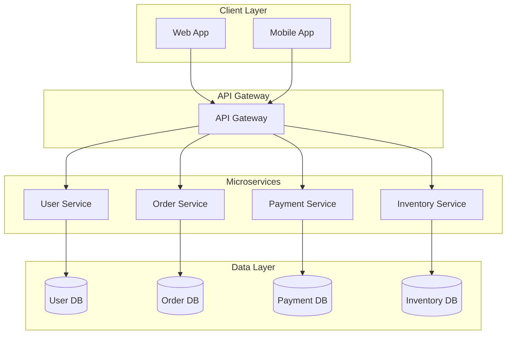

---

## 📋 O que é este Artefato?

Este é o **template para documentos explicativos** (conceptual docs) que respondem "Como funciona?" e "Por que?". Diferente de tutorials (passo-a-passo) ou references (lookup), explanations constroem compreensão profunda.

**Tipos de conteúdo:**
- 🧠 **Conceptual**: O que é X? Como funciona?
- 🎯 **Architectural**: Por que escolhemos Y? Quais trade-offs?
- 📚 **Educational**: Entenda Z antes de usar

---

## 🎯 Quando Usar

### ✅ USE Explanation Docs para:
- Explicar conceitos complexos (OAuth, microservices, CAP theorem)
- Documentar decisões arquiteturais (por que escolhemos X)
- Onboarding de novos desenvolvedores (background knowledge)
- Responder "Por que fazemos assim?" (não apenas "Como fazer")

### ❌ NÃO USE para:
- Step-by-step tutorials (use tutorial template)
- API reference (use reference template)
- Quick how-tos (use guide template)

---

## 📄 TEMPLATE COMPLETO

```markdown
# Understanding [Concept Name]

**Audience**: [Beginner | Intermediate | Advanced]  
**Reading Time**: ~[X] minutes  
**Prerequisites**: [List required knowledge]

---

## TL;DR (Quick Summary)

[2-3 sentences explaining the concept at highest level]

**Key takeaways:**
- [Main point 1]
- [Main point 2]
- [Main point 3]

---

## Table of Contents

- [What is [Concept]?](#what-is-concept)
- [Why Does It Matter?](#why-does-it-matter)
- [How It Works](#how-it-works)
- [Key Components](#key-components)
- [Common Misconceptions](#common-misconceptions)
- [When to Use](#when-to-use)
- [Trade-offs](#trade-offs)
- [Real-World Examples](#real-world-examples)
- [Next Steps](#next-steps)

---

## What is [Concept]?

### High-Level Definition

[1-2 paragraphs explaining concept in simple terms, avoiding jargon]

**Analogy**: [Real-world analogy to make concept relatable]

Example:
> Think of [concept] like [everyday analogy]. Just as [analogy continues], [concept] works by [technical explanation].

### Formal Definition

[Technical definition for readers who want precision]

**In academic terms**: [Formal definition with precise terminology]

---

## Why Does It Matter?

### The Problem It Solves

[Describe the problem that existed before this concept/technology]

**Before [Concept]:**
- ❌ Problem 1
- ❌ Problem 2
- ❌ Problem 3

**After [Concept]:**
- ✅ Solution 1
- ✅ Solution 2
- ✅ Solution 3

### Business Value

[Explain tangible benefits in business terms]

**Metrics Impact:**
- [Metric 1]: [How it improves]
- [Metric 2]: [How it improves]

---

## How It Works

### Core Mechanism

[Step-by-step explanation of how the concept functions]

**Visual Representation:**

```mermaid
[Diagram showing how concept works]
```

*Figure 1: [Diagram description]*

### Detailed Breakdown

#### Step 1: [First Stage]

[Explain what happens in first stage]

**Example:**
```[language]
[Code example if applicable]
```

#### Step 2: [Second Stage]

[Continue for each stage]

---

## Key Components

### Component 1: [Name]

**Purpose**: [What this component does]  
**Responsibility**: [Specific role in system]  
**Interacts With**: [Other components]

[Detailed explanation]

### Component 2: [Name]

[Repeat for each component]

---

## Common Misconceptions

### Misconception 1: [False Belief]

❌ **Myth**: [Common false belief]  
✅ **Reality**: [Actual truth]

**Why this matters**: [Consequences of misunderstanding]

### Misconception 2: [Another False Belief]

[Repeat pattern]

---

## When to Use

### Ideal Use Cases

✅ **Use [Concept] when:**
1. [Scenario 1] - [Why it fits]
2. [Scenario 2] - [Why it fits]
3. [Scenario 3] - [Why it fits]

### When NOT to Use

❌ **Avoid [Concept] when:**
1. [Scenario 1] - [Why it doesn't fit]
2. [Scenario 2] - [Better alternative]

---

## Trade-offs

### Advantages

| Advantage | Description | Impact |
|-----------|-------------|--------|
| [Pro 1] | [Explanation] | [High/Medium/Low] |
| [Pro 2] | [Explanation] | [High/Medium/Low] |

### Disadvantages

| Disadvantage | Description | Mitigation |
|--------------|-------------|------------|
| [Con 1] | [Explanation] | [How to address] |
| [Con 2] | [Explanation] | [How to address] |

### Comparison with Alternatives

| Feature | [Concept] | [Alternative 1] | [Alternative 2] |
|---------|-----------|-----------------|-----------------|
| [Feature 1] | ✅ | ❌ | ⭕ |
| [Feature 2] | ⭕ | ✅ | ❌ |

Legend: ✅ Excellent | ⭕ Adequate | ❌ Poor

---

## Real-World Examples

### Example 1: [Industry/Company]

**Context**: [Background of scenario]  
**Challenge**: [Problem they faced]  
**Solution**: [How they used this concept]  
**Result**: [Outcome with metrics if available]

**Key Learnings:**
- [Learning 1]
- [Learning 2]

### Example 2: [Another Example]

[Repeat pattern]

---

## Related Concepts

### Closely Related

- **[Related Concept 1]**: [How it relates] - [Link to doc]
- **[Related Concept 2]**: [How it relates] - [Link to doc]

### See Also

- [Resource 1]: [Why relevant]
- [Resource 2]: [Why relevant]

---

## Next Steps

### For Beginners

1. [Recommended action 1] - [Link to tutorial]
2. [Recommended action 2] - [Link to guide]

### For Advanced Users

1. [Advanced topic 1] - [Link]
2. [Advanced topic 2] - [Link]

### Further Reading

- **Books**: [Recommended books]
- **Papers**: [Academic papers if applicable]
- **Videos**: [Video resources]

---

## Glossary

| Term | Definition |
|------|------------|
| [Term 1] | [Clear definition] |
| [Term 2] | [Clear definition] |

---

## Changelog

| Version | Date | Changes | Author |
|---------|------|---------|--------|
| 1.0 | YYYY-MM-DD | Initial release | [Name] |

---

**Last Updated**: YYYY-MM-DD  
**Maintained By**: [Team/Person]  
**Feedback**: [Link to feedback form/issue tracker]
```

---

## 📚 EXAMPLE: Filled Template

### Example: Understanding Microservices Architecture

```markdown
# Understanding Microservices Architecture

**Audience**: Intermediate  
**Reading Time**: ~12 minutes  
**Prerequisites**: Basic understanding of web applications, APIs

---

## TL;DR (Quick Summary)

Microservices is an architectural style where applications are built as a collection of small, independent services that communicate via APIs. Each service owns its data and can be deployed independently.

**Key takeaways:**
- Services are small, focused on single business capability
- Independent deployment and scaling
- Technology diversity (each service can use different tech stack)

---

## What is Microservices?

### High-Level Definition

Microservices architecture breaks down large applications into smaller, independent services. Each service runs its own process, manages its own database, and communicates with other services through lightweight APIs (usually HTTP/REST or message queues).

**Analogy**: Think of microservices like a restaurant kitchen. Instead of one chef doing everything (monolith), you have specialized stations: appetizers, mains, desserts, drinks. Each station (microservice) has its own chef (service), tools (database), and menu (API). They coordinate through a ticket system (message queue) but can work independently.

### Formal Definition

**In academic terms**: Microservices is a variant of service-oriented architecture (SOA) where applications are composed of fine-grained, loosely coupled services organized around business capabilities, with decentralized data management and automated deployment infrastructure.

---

## Why Does It Matter?

### The Problem It Solves

Traditional monolithic applications become unwieldy as they grow:

**Before Microservices (Monolith):**
- ❌ Single codebase becomes massive (100k+ lines)
- ❌ Small change requires full redeployment (risky)
- ❌ Scaling entire app even if only one feature needs it (wasteful)
- ❌ Technology lock-in (stuck with initial tech choices)
- ❌ Team coordination nightmare (20+ devs in same codebase)

**After Microservices:**
- ✅ Small, manageable codebases (5k-10k lines each)
- ✅ Independent deployment (update one service without touching others)
- ✅ Targeted scaling (scale only bottleneck services)
- ✅ Technology freedom (use best tool for each job)
- ✅ Team autonomy (each team owns specific services)

### Business Value

**Metrics Impact:**
- **Deployment Frequency**: 10x increase (from monthly to daily deployments)
- **Mean Time to Recovery**: 5x faster (rollback single service vs entire app)
- **Developer Productivity**: 30% improvement (less coordination overhead)

---

## How It Works

### Core Mechanism

Each microservice is an independent application with:
1. **Own codebase** (separate Git repo)
2. **Own database** (data isolation)
3. **Own deployment** (Docker container, K8s pod)
4. **API contract** (REST, gRPC, events)

**Visual Representation:**



*Figure 1: Microservices Architecture Overview*

---

## Common Misconceptions

### Misconception 1: "Microservices = Small Code Files"

❌ **Myth**: Breaking monolith into multiple files/modules makes it microservices  
✅ **Reality**: Microservices require independent **deployment**, **data**, and **lifecycle**

**Why this matters**: If you can't deploy services independently, you have a distributed monolith (worst of both worlds).

### Misconception 2: "More Services = Better"

❌ **Myth**: Maximum granularity is always better (100 microservices for small app)  
✅ **Reality**: Too many services creates operational complexity (network latency, debugging, distributed transactions)

**Why this matters**: Start with fewer, larger services. Split only when needed (team size, scaling, deployment independence).

---

## When to Use

### Ideal Use Cases

✅ **Use Microservices when:**
1. **Large teams** (>20 developers) - Enables team autonomy
2. **Different scaling needs** - Some features need 10x more capacity
3. **Technology diversity needed** - ML service in Python, API in Node.js

### When NOT to Use

❌ **Avoid Microservices when:**
1. **Small team** (<5 devs) - Operational overhead outweighs benefits
2. **Greenfield project** - Start monolith, extract services later (better alternative: modular monolith)
3. **Tight coupling** - Services communicate excessively (distributed monolith)

---

## Trade-offs

### Advantages

| Advantage | Description | Impact |
|-----------|-------------|--------|
| Independent Deployment | Deploy services without affecting others | High - Faster releases |
| Technology Diversity | Choose best tool per service | Medium - Innovation |
| Fault Isolation | One service crash doesn't kill entire app | High - Reliability |

### Disadvantages

| Disadvantage | Description | Mitigation |
|--------------|-------------|------------|
| Distributed Complexity | Network calls, eventual consistency | Service mesh (Istio), circuit breakers |
| Operational Overhead | Deploy/monitor 20 services vs 1 | Container orchestration (Kubernetes) |
| Testing Complexity | Integration tests across services | Contract testing (Pact), E2E in staging |

---

## Real-World Examples

### Example 1: Netflix

**Context**: Streaming platform with 200M+ users globally  
**Challenge**: Monolithic app couldn't scale for global growth  
**Solution**: Decomposed into 700+ microservices (Recommendation, Playback, Billing, etc.)  
**Result**: 
- 99.99% uptime despite continuous deployments
- Teams deploy 1000+ times/day independently
- Can scale specific services (Playback 10x during peak hours)

**Key Learnings:**
- Invest heavily in automation (CI/CD, monitoring)
- Service mesh (Zuul gateway) critical for routing
- Chaos engineering (Chaos Monkey) ensures resilience

---

## Next Steps

### For Beginners

1. **Start with Modular Monolith** - [Link to guide]
2. **Learn Docker & Kubernetes** - [Link to tutorial]
3. **Read "Building Microservices" by Sam Newman** - [Book link]

### For Advanced Users

1. **Implement Event-Driven Architecture** - [Link]
2. **Service Mesh Deep Dive** - [Link]
3. **Distributed Tracing with Jaeger** - [Link]

---

**Last Updated**: 2025-02-03  
**Maintained By**: Paige (Technical Writer)
```

---

## ✅ WRITING CHECKLIST

### Content Quality

- [ ] **TL;DR present** - Readers can get gist in 30 seconds
- [ ] **Analogy used** - Complex concept related to everyday experience
- [ ] **Diagrams included** - Visual explanation complements text
- [ ] **Misconceptions addressed** - Common false beliefs corrected
- [ ] **Real examples** - Concrete cases, not just theory
- [ ] **Trade-offs discussed** - Honest about pros AND cons

### Structure

- [ ] **Logical flow** - Builds from simple to complex
- [ ] **Scannable** - Headings, bullets, tables for skimming
- [ ] **Self-contained** - Can be read standalone (not just chapter 5 of 10)
- [ ] **Next steps clear** - Reader knows what to do after reading

### Accessibility

- [ ] **Diagrams have alt text** - Screen reader friendly
- [ ] **Jargon defined** - Glossary for technical terms
- [ ] **Multiple learning styles** - Text, diagrams, examples

---

## 🔗 Integração com Outros Artefatos

- **${AVANADE_DOC_STANDARDS_MD}**: Segue writing style e formatting
- **${AVANADE_MERMAID_LIBRARY_MD}**: Usa diagrams para explicações visuais
- **${AVANADE_COMMONMARK_TEMPLATE_MD}**: Markdown formatting válido
- **${AVANADE_MEMORY_TECH_WRITER_PAIGE}**: Armazena explanation patterns

---