---

## 📋 O que é este Artefato?

Esta é a **biblioteca de patterns Mermaid** para criar diagramas text-based em documentação. Mermaid permite diagramas versionáveis, editáveis e acessíveis.

**Por que Mermaid?**
- ✅ **Text-based**: Versionável em Git (não binário)
- ✅ **Fácil edição**: Mude código, não imagem
- ✅ **Renderização universal**: GitHub, GitLab, Docusaurus, VS Code
- ✅ **Acessível**: Can be narrated by screen readers

---

## 🎯 Quando Usar

### ✅ USE Mermaid para:
- Architecture diagrams (system, component)
- Sequence diagrams (API flows, authentication)
- Flowcharts (decision trees, processes)
- Entity-Relationship Diagrams (database schemas)
- State diagrams (workflows, state machines)
- Gantt charts (project timelines)

### ❌ NÃO USE Mermaid para:
- Wireframes/mockups (use Figma, Excalidraw)
- Detailed UI designs (use design tools)
- Complex diagrams com >20 nodes (too messy)

---

## 🎨 DIAGRAM TYPE 1: FLOWCHARTS

### Basic Flowchart (Top to Bottom)

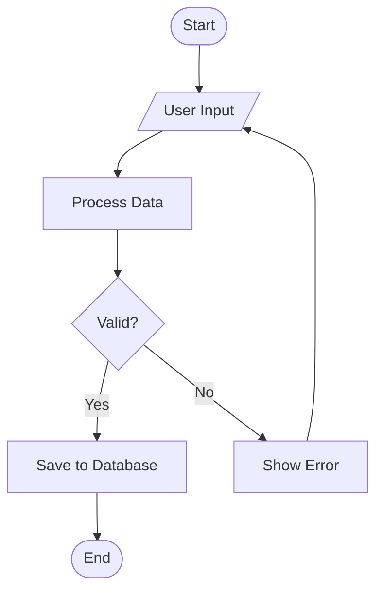

**Code:**
````markdown

````

**When to use**: Process flows, decision trees, algorithm visualization

---

### Flowchart (Left to Right) - Preferred for Wide Diagrams

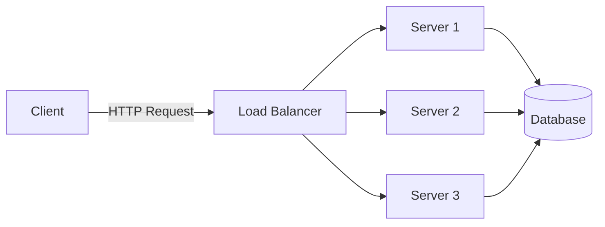

**Code:**
````markdown

````

**When to use**: Architecture overviews, horizontal data flows

---

### Node Shapes Reference

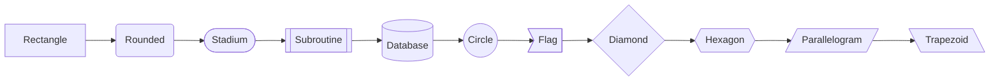

**Code Syntax:**
```
[Text]       - Rectangle
(Text)       - Rounded rectangle
([Text])     - Stadium (pill shape)
[[Text]]     - Subroutine
[(Text)]     - Database (cylinder)
((Text))     - Circle
>Text]       - Flag
{Text}       - Diamond (decision)
{{Text}}     - Hexagon
[/Text/]     - Parallelogram (input/output)
[\Text\]     - Trapezoid
```

---

### Arrow Types

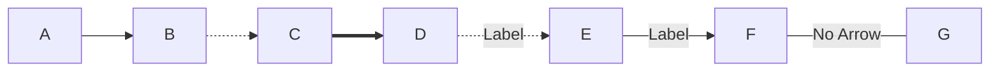

**Code:**
```
-->   Normal arrow
-.->  Dotted arrow
==>   Thick arrow
---   Line (no arrow)
```

---

### Flowchart with Subgraphs

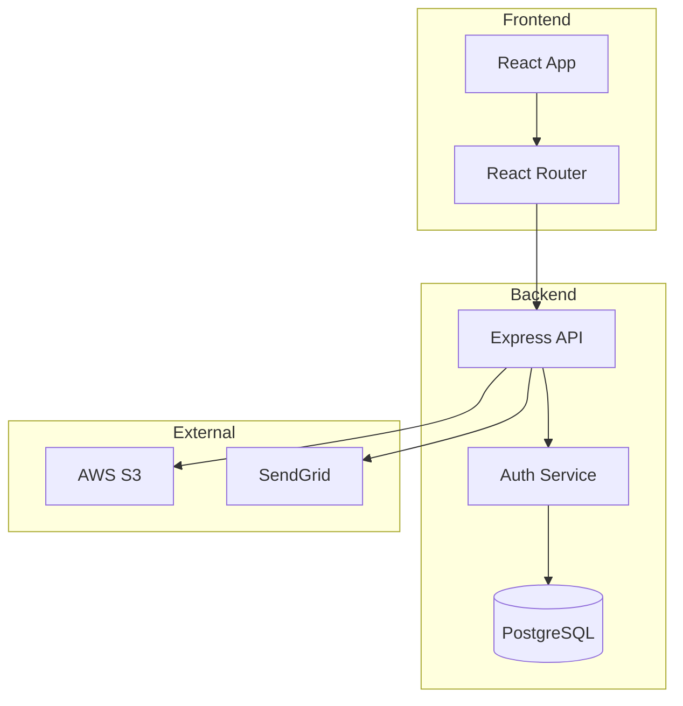

**When to use**: System architecture, microservices, layered architectures

---

## 🔄 DIAGRAM TYPE 2: SEQUENCE DIAGRAMS

### Basic Sequence (API Request Flow)

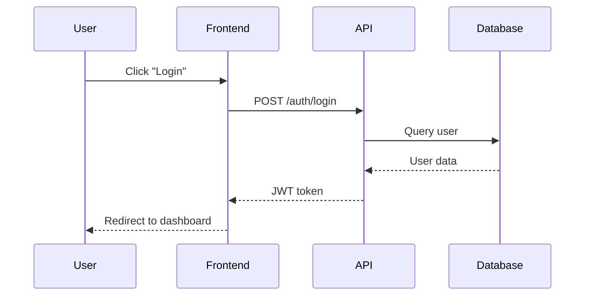

**Code:**
````markdown

````

**When to use**: API documentation, authentication flows, user journeys

---

### Sequence with Activation Boxes

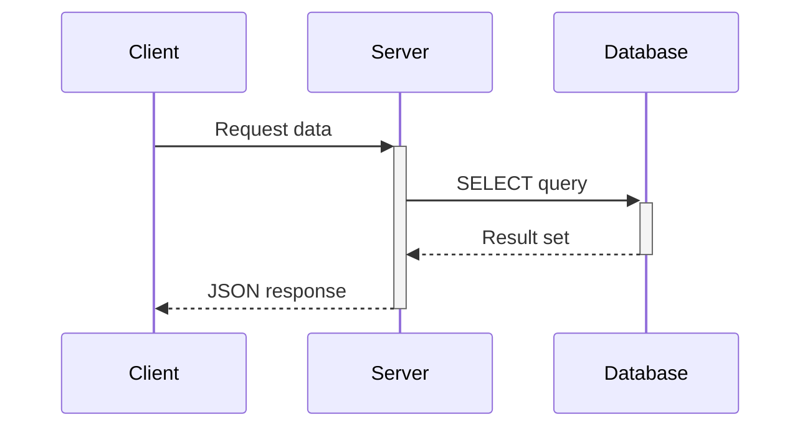

**Syntax:**
```
->>+   Activate (start processing)
-->>-  Deactivate (end processing)
```

---

### Sequence with Alt/Opt/Loop

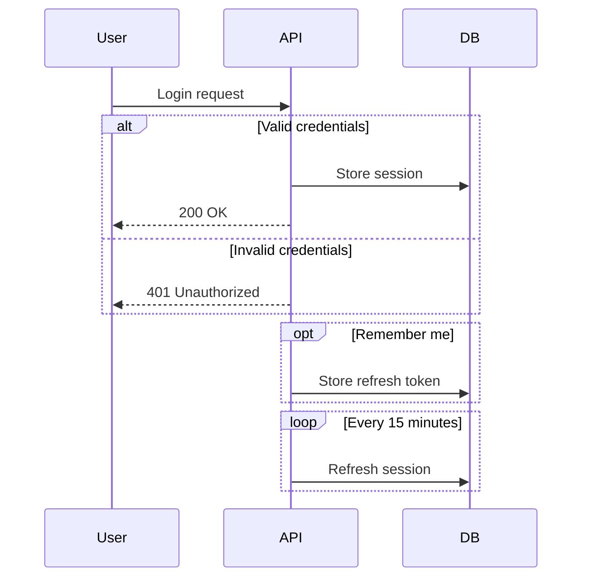

**When to use**: Complex flows with conditional logic, retry mechanisms

---

### Sequence with Notes

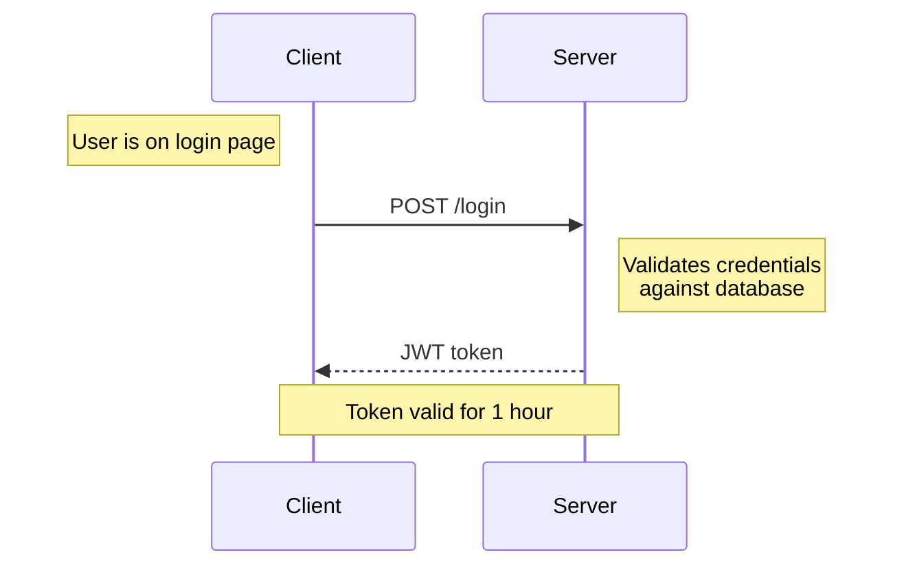

**Syntax:**
```
Note left of Actor: Text
Note right of Actor: Text
Note over Actor1,Actor2: Text
```

---

## 📊 DIAGRAM TYPE 3: CLASS/ER DIAGRAMS

### Entity Relationship Diagram (Database Schema)

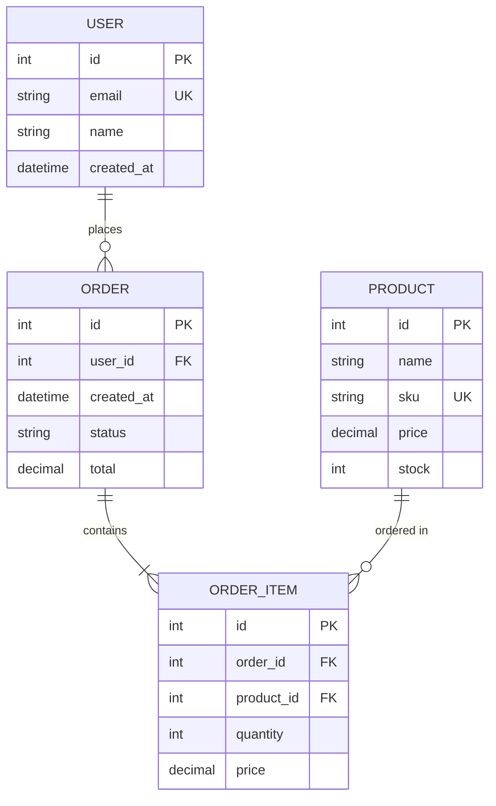

**Relationship Types:**
```
||--||  One to one
||--o{  One to many
}o--o{  Many to many
||--|{  One to one or more
}o--||  Many to one
```

**When to use**: Database design docs, data modeling

---

### Class Diagram (OOP)

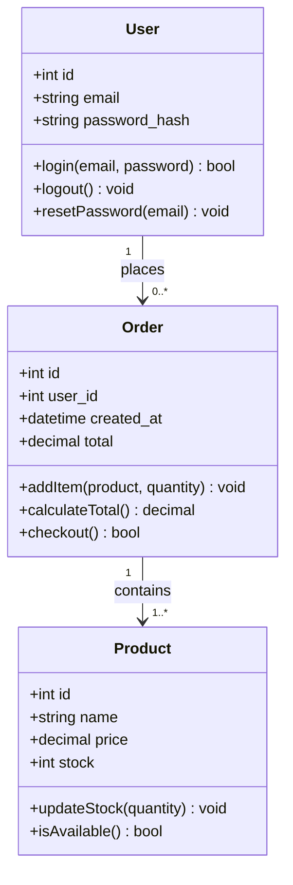

**When to use**: Software architecture docs, OOP design

---

## 🎯 DIAGRAM TYPE 4: STATE DIAGRAMS

### Order Status State Machine

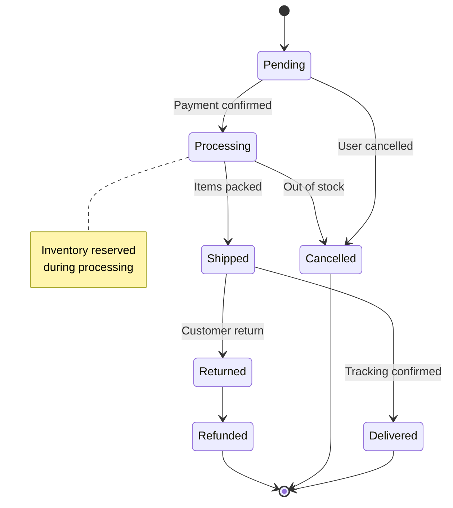

**When to use**: Workflow documentation, status transitions, FSMs

---

### State with Composite States

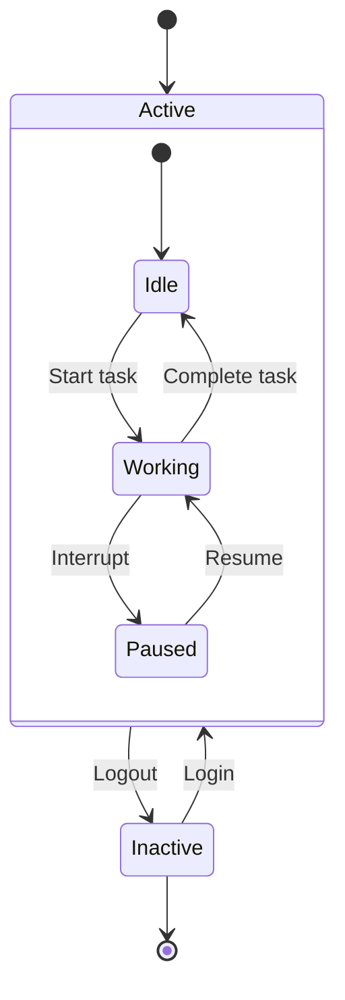

---

## 📅 DIAGRAM TYPE 5: GANTT CHARTS

### Project Timeline

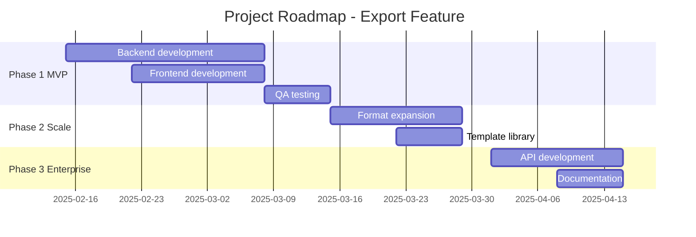

**When to use**: Project planning docs, roadmap visualization

---

## 🏗️ DIAGRAM TYPE 6: ARCHITECTURE DIAGRAMS

### Microservices Architecture

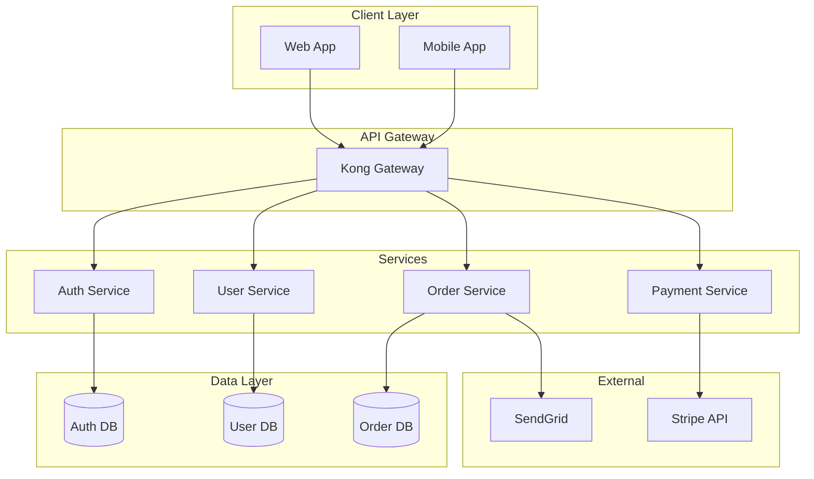

---

### C4 Model - System Context

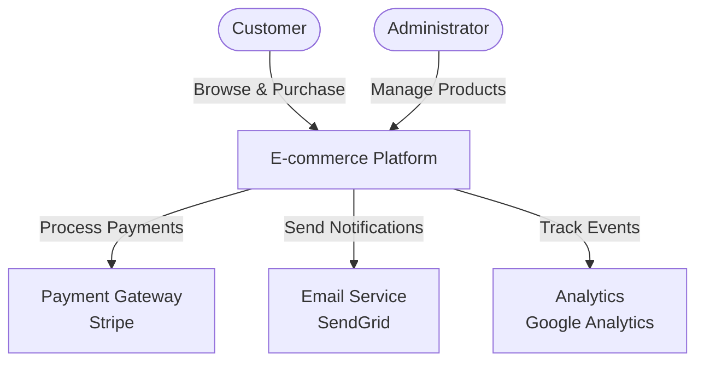

**When to use**: High-level system overviews, stakeholder communication

---

## 🎨 STYLING & CUSTOMIZATION

### Basic Styling

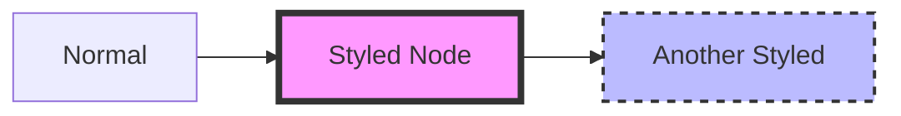

**Code:**
```
style NodeID fill:#color,stroke:#color,stroke-width:4px
```

---

### Class-Based Styling

```mermaid
flowchart LR
    A[Success]:::successClass
    B[Error]:::errorClass
    C[Warning]:::warningClass
    
    classDef successClass fill:#90EE90,stroke:#006400
    classDef errorClass fill:#FFB6C1,stroke:#8B0000
    classDef warningClass fill:#FFD700,stroke:#FF8C00
```

---

## 🔧 BEST PRACTICES

### 1. Keep Diagrams Simple
```
✅ GOOD: 5-15 nodes, clear flow
❌ BAD: 30+ nodes, spaghetti connections
```

### 2. Use Descriptive Labels
```
✅ GOOD: "User Authentication Service"
❌ BAD: "Service 1"
```

### 3. Direction Matters
```
TB (Top to Bottom) - Process flows, hierarchies
LR (Left to Right) - Data flows, timelines
```

### 4. Consistent Naming
```
Use quotes for labels with spaces:
A["User Service"] --> B["Order Service"]
```

### 5. Line Breaks in Text
```
Use <br/> for multi-line labels:
A["User Service<br/>(Authentication)"]
```

---

## 📚 TEMPLATE LIBRARY

### Template 1: API Documentation Flow

````markdown
```mermaid
sequenceDiagram
    participant Client
    participant API
    participant DB
    
    Client->>API: POST /endpoint
    Note right of API: Validate request
    alt Valid
        API->>DB: Query/Insert
        DB-->>API: Success
        API-->>Client: 200 OK
    else Invalid
        API-->>Client: 400 Bad Request
    end
```
````

---

### Template 2: Deployment Architecture

````markdown
```mermaid
flowchart TB
    subgraph "Production Environment"
        LB[Load Balancer]
        subgraph "App Servers"
            App1[Server 1]
            App2[Server 2]
        end
        subgraph "Data Layer"
            Primary[(Primary DB)]
            Replica[(Read Replica)]
        end
    end
    
    Users[Users] --> LB
    LB --> App1
    LB --> App2
    App1 --> Primary
    App2 --> Primary
    Primary --> Replica
```
````

---

### Template 3: Error Handling Flow

````markdown
```mermaid
flowchart TD
    Start([API Request]) --> Validate{Valid?}
    Validate -->|No| Error400[Return 400]
    Validate -->|Yes| Auth{Authenticated?}
    Auth -->|No| Error401[Return 401]
    Auth -->|Yes| Process[Process Request]
    Process --> Success{Success?}
    Success -->|No| Error500[Return 500]
    Success -->|Yes| Return200[Return 200]
    
    Error400 --> Log[Log Error]
    Error401 --> Log
    Error500 --> Log
    Log --> End([End])
    Return200 --> End
```
````

---

## ✅ DIAGRAM CHECKLIST

### Before Publishing

- [ ] **Clarity**: Diagram é self-explanatory?
- [ ] **Labels**: Todos nodes têm labels descritivos?
- [ ] **Flow**: Direção do fluxo é clara (arrows)?
- [ ] **Complexity**: <20 nodes (split se muito complexo)?
- [ ] **Legend**: Precisa de legend? (add como note)
- [ ] **Rendering**: Testa em target platform (GitHub, GitLab)?
- [ ] **Alt text**: Markdown tem descrição do diagram?

### Accessibility

```markdown
✅ GOOD:
**Figure 1: User Authentication Flow**
```mermaid
sequenceDiagram
    ...
```
*This diagram shows the authentication process...*

❌ BAD:
```mermaid
sequenceDiagram
    ...
```
(No context, no description)
```

---

## 🔗 Integração com Outros Artefatos

- **${AVANADE_DOC_STANDARDS_MD}**: Mermaid patterns seguem doc standards
- **${AVANADE_COMMONMARK_TEMPLATE_MD}**: Mermaid em fenced code blocks
- **${AVANADE_MEMORY_TECH_WRITER_PAIGE}**: Diagram patterns library (Section 3)
- **${AVANADE_EXPLANATION_TEMPLATE_MD}**: Use diagramas para explicar conceitos

---

## 📖 REFERENCES

- **Mermaid Docs**: <https://mermaid.js.org/>
- **Mermaid Live Editor**: <https://mermaid.live/>
- **GitHub Mermaid Support**: <https://github.blog/2022-02-14-include-diagrams-markdown-files-mermaid/>

---