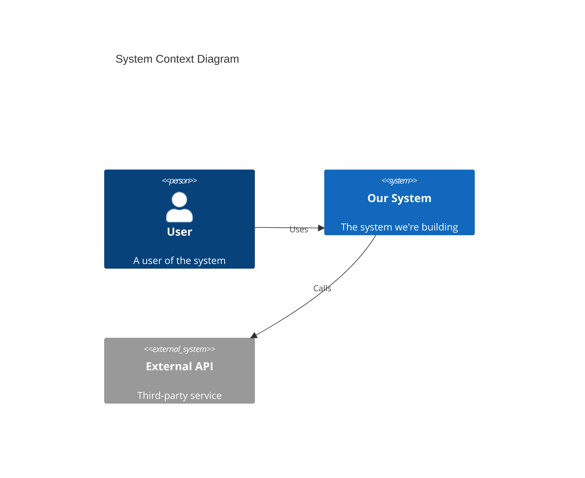

---

## ?? Objetivo

Template padronizado para documentação de arquitetura de software. Baseado no modelo C4 e arc42, adaptado para projetos Avanade.

---

## ?? Architecture Document Template

```yaml
# Architecture Document

## Metadata
document_id: "ARCH-[PROJECT]-[VERSION]"
project: "[Nome do Projeto]"
version: "1.0"
status: "[Draft | Review | Approved | Deprecated]"
created_by: "[Architect Name]"
created_at: "[YYYY-MM-DD]"
updated_at: "[YYYY-MM-DD]"
reviewers:
  - name: "[Reviewer 1]"
    role: "[Role]"
    approved: false
  - name: "[Reviewer 2]"
    role: "[Role]"
    approved: false

---

## 1. Executive Summary

### 1.1 Purpose
# Propósito deste documento e do sistema sendo arquitetado
purpose: |
  [Descrever o propósito em 2-3 parágrafos]

### 1.2 Scope
scope:
  in_scope:
    - "[Funcionalidade/componente incluído]"
    - "[Funcionalidade/componente incluído]"
  out_of_scope:
    - "[Funcionalidade/componente excluído]"
    - "[Funcionalidade/componente excluído]"

### 1.3 Key Decisions Summary
key_decisions:
  - decision: "[Decisão arquitetural importante]"
    rationale: "[Justificativa breve]"
    adr_ref: "[ADR-XXX se existir]"

---

## 2. Context

### 2.1 Business Context
business_context:
  problem_statement: |
    [Problema de negócio que o sistema resolve]
  
  stakeholders:
    - name: "[Stakeholder Group]"
      role: "[Role]"
      concerns: "[Suas preocupações/necessidades]"
  
  business_goals:
    - "[Goal 1]"
    - "[Goal 2]"

### 2.2 System Context (C4 Level 1)
system_context:
  description: |
    [Descrição do sistema e seu ambiente]
  
  external_systems:
    - name: "[Sistema Externo 1]"
      type: "[API | Database | Service | etc]"
      interaction: "[Como interage com nosso sistema]"
      owner: "[Quem é dono]"
  
  users:
    - persona: "[Tipo de usuário]"
      actions: "[O que fazem no sistema]"
      volume: "[Estimativa de usuários/requests]"

  # Diagrama C4 Context
  diagram: |
    [Link para diagrama ou Mermaid code]

---

## 3. Solution Architecture

### 3.1 Container Diagram (C4 Level 2)
containers:
  - name: "[Container Name]"
    type: "[Web App | API | Database | etc]"
    technology: "[Tech stack]"
    description: "[Responsabilidade]"
    
  # Diagrama C4 Container
  diagram: |
    [Link para diagrama ou Mermaid code]

### 3.2 Component Diagram (C4 Level 3)
# Para containers críticos, detalhar componentes
components:
  container: "[Nome do container]"
  components:
    - name: "[Component Name]"
      responsibility: "[O que faz]"
      technology: "[Framework/library]"
      interfaces:
        - "[Interface exposta]"

### 3.3 Data Architecture
data_architecture:
  data_stores:
    - name: "[Database Name]"
      type: "[SQL | NoSQL | Cache | etc]"
      technology: "[PostgreSQL | MongoDB | Redis | etc]"
      purpose: "[Para que é usado]"
      
  data_flows:
    - from: "[Origem]"
      to: "[Destino]"
      data: "[Tipo de dados]"
      mechanism: "[Sync | Async | Event | etc]"

---

## 4. Technical Decisions

### 4.1 Technology Stack
technology_stack:
  frontend:
    framework: "[React | Vue | Angular | etc]"
    language: "[TypeScript | JavaScript]"
    styling: "[CSS Modules | Tailwind | etc]"
    state_management: "[Redux | Zustand | etc]"
    
  backend:
    framework: "[Node.js | .NET | Java | etc]"
    language: "[TypeScript | C# | Java | etc]"
    api_style: "[REST | GraphQL | gRPC]"
    
  database:
    primary: "[Technology]"
    cache: "[Technology]"
    search: "[Technology if applicable]"
    
  infrastructure:
    cloud: "[Azure | AWS | GCP]"
    container: "[Docker | Kubernetes]"
    ci_cd: "[GitHub Actions | Azure DevOps | etc]"

### 4.2 Architecture Decision Records (ADRs)
adrs:
  - id: "ADR-001"
    title: "[Título da decisão]"
    status: "[Proposed | Accepted | Deprecated]"
    link: "[Link para ADR completo]"
    
# Referência: ${AVANADE_ADR_TEMPLATE}

---

## 5. Non-Functional Requirements

### 5.1 Performance
performance:
  response_time:
    target: "[e.g., p95 < 500ms]"
    measurement: "[Como medir]"
  throughput:
    target: "[e.g., 1000 req/s]"
  scalability:
    approach: "[Horizontal | Vertical]"
    max_capacity: "[Estimativa]"

### 5.2 Security
security:
  authentication:
    method: "[OAuth2 | JWT | etc]"
    provider: "[Azure AD | Auth0 | etc]"
  authorization:
    model: "[RBAC | ABAC | etc]"
  data_protection:
    encryption_at_rest: "[Yes/No + method]"
    encryption_in_transit: "[TLS version]"
  compliance:
    - "[GDPR | LGPD | SOC2 | etc]"

### 5.3 Reliability
reliability:
  availability_target: "[e.g., 99.9%]"
  rto: "[Recovery Time Objective]"
  rpo: "[Recovery Point Objective]"
  backup_strategy: "[Descrição]"
  disaster_recovery: "[Estratégia]"

### 5.4 Observability
observability:
  logging:
    platform: "[ELK | Azure Monitor | etc]"
    retention: "[Duration]"
  metrics:
    platform: "[Prometheus | Azure Monitor | etc]"
    key_metrics:
      - "[Metric 1]"
      - "[Metric 2]"
  tracing:
    platform: "[Jaeger | Azure App Insights | etc]"
  alerting:
    platform: "[PagerDuty | Azure Alerts | etc]"

---

## 6. Deployment Architecture

### 6.1 Environments
environments:
  - name: "Development"
    purpose: "[Para desenvolvedores]"
    infra: "[Descrição breve]"
  - name: "Staging"
    purpose: "[Pre-production testing]"
    infra: "[Descrição breve]"
  - name: "Production"
    purpose: "[Live system]"
    infra: "[Descrição breve]"

### 6.2 CI/CD Pipeline
cicd:
  source_control: "[GitHub | Azure Repos | etc]"
  build: "[GitHub Actions | Azure Pipelines | etc]"
  stages:
    - name: "Build"
      actions: "[Compile, test, lint]"
    - name: "Deploy to Staging"
      actions: "[Deploy, smoke test]"
    - name: "Deploy to Production"
      actions: "[Deploy, health check]"

### 6.3 Infrastructure as Code
iac:
  tool: "[Terraform | Bicep | Pulumi | etc]"
  repository: "[Link]"

---

## 7. Risks & Mitigations

risks:
  - id: "RISK-001"
    description: "[Descrição do risco]"
    probability: "[High | Medium | Low]"
    impact: "[High | Medium | Low]"
    mitigation: "[Estratégia de mitigação]"
    owner: "[Responsável]"

---

## 8. Appendices

### 8.1 Glossary
glossary:
  - term: "[Termo]"
    definition: "[Definição]"

### 8.2 References
references:
  - "[Link para documentação relacionada]"
  - "[Link para ADRs]"
  - "[Link para diagramas externos]"
```

---

## ?? Diagrama C4 Example (Mermaid)



---

## ?? Relacionamentos

- **ADR Template**: ${AVANADE_ADR_TEMPLATE}
- **Usado por**: ${AVANADE_MEMORY_ARCHITECT_WILSON}
- **Workflow**: ${AVANADE_WORKFLOW_GUIDE_CREATE_ARCHITECTURE}
