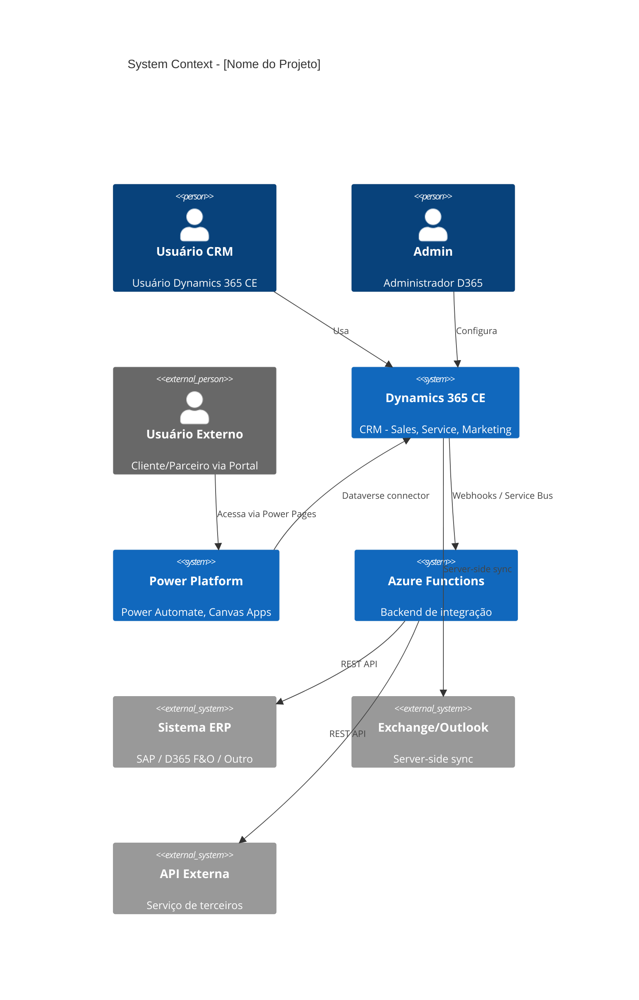
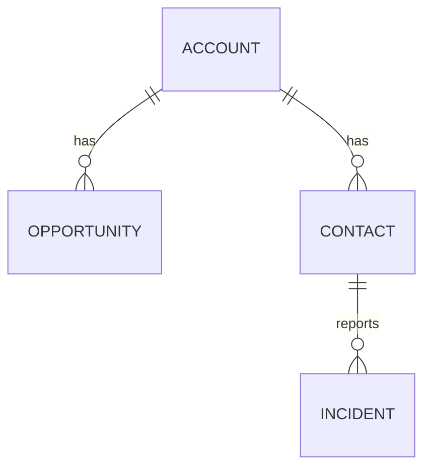
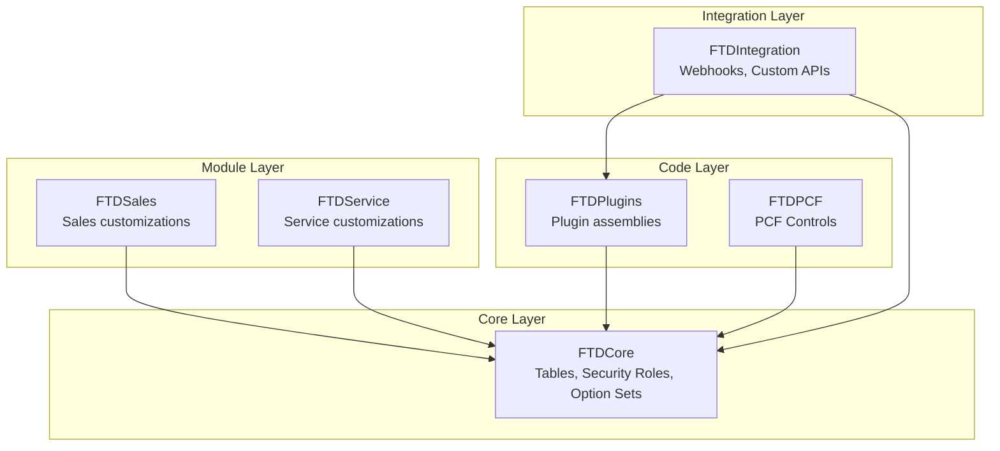
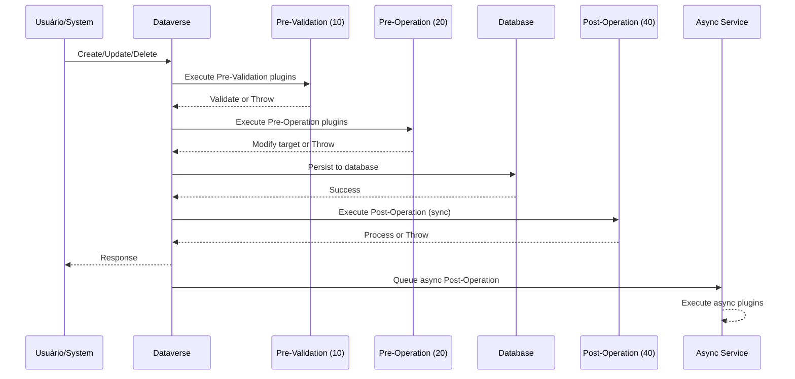
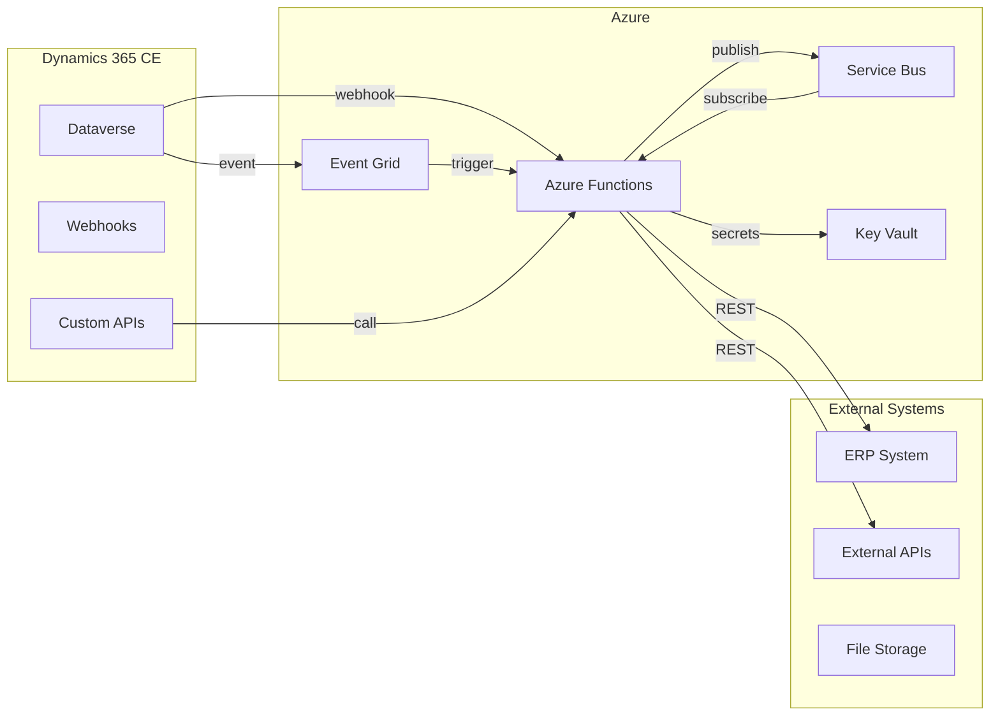
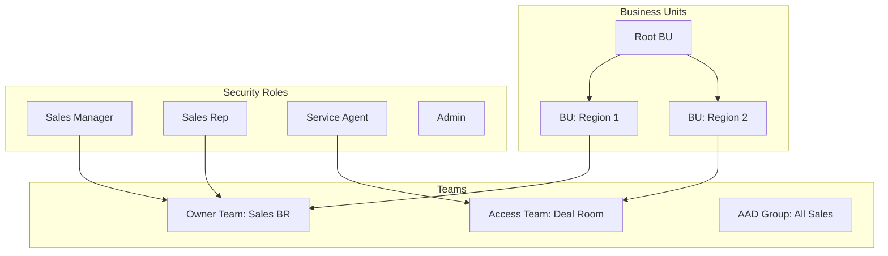
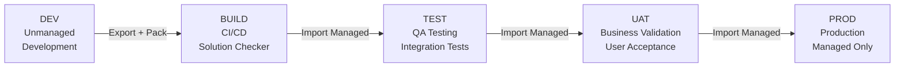

# ============================================================
# D365 ARCHITECTURE TEMPLATE - Avanade Method v4.29.0
# ============================================================
# Template Owner: Wilson Architect
# Extends: architecture-template.md com seções D365-specific

# USAGE: Documento de arquitetura para customizações D365 CE.
# Inclui Dataverse model, solution architecture, integration e security.

---

# 🏗️ Arquitetura - [Nome do Projeto/Feature]

## 1. Executive Summary

| Item | Valor |
|------|-------|
| **Projeto** | [Nome] |
| **Módulos D365** | [Sales, Service, Marketing, Field Service] |
| **Tipo** | [Brownfield - Customização CRM existente] |
| **Versão** | 1.0 |
| **Arquiteto** | Wilson (Avanade Method) |
| **Data** | YYYY-MM-DD |

### Visão Geral
[Descrição da solução arquitetural em 3-5 linhas]

### Decisões-Chave
| ADR | Decisão | Justificativa |
|-----|---------|---------------|
| ADR-001 | [Decisão] | [Por quê] |
| ADR-002 | [Decisão] | [Por quê] |

---

## 2. Solution Architecture (C4 - Context)



---

## 3. Dataverse Data Model (ERD)

### 3.1 Tabelas Novas

| Tabela (logical_name) | Display Name | Ownership | Relacionamento Principal |
|----------------------|--------------|-----------|------------------------|
| [prefix_tabela] | [Nome] | User/Team | [Lookup para account/contact/etc] |

### 3.2 Tabelas Modificadas

| Tabela | Mudança | Tipo | Impacto |
|--------|---------|------|---------|
| [tabela] | [Nova coluna / Relação / View / Form] | [Configuration] | [Baixo/Médio/Alto] |

### 3.3 ERD Diagram



---

## 4. Solution Architecture (Packaging)

### 4.1 Solution Map



### 4.2 Solution Components

| Solution | Tipo | Componentes | Dependências |
|----------|------|-------------|--------------|
| FTDCore | Core | [Listar] | Nenhuma |
| FTDSales | Module | [Listar] | FTDCore |
| FTDPlugins | Code | [Listar] | FTDCore |
| FTDIntegration | Integration | [Listar] | FTDCore, FTDPlugins |

---

## 5. Plugin Architecture

### 5.1 Plugin Execution Pipeline



### 5.2 Plugin Registry

| Plugin Class | Entity | Message | Stage | Mode | Filtering Attributes |
|-------------|--------|---------|-------|------|---------------------|
| [Namespace.Class] | [entity] | [Create/Update/Delete] | [10/20/40] | [Sync/Async] | [attr1, attr2] |

### 5.3 Plugin Design Patterns

```
STANDARD PLUGIN PATTERN:
┌─────────────────────────────────────┐
│ 1. Validate Context                 │
│    - Check message, entity, depth   │
│ 2. Extract Data                     │
│    - Get target, pre/post images    │
│ 3. Execute Business Logic           │
│    - Service calls, calculations    │
│ 4. Handle Errors                    │
│    - InvalidPluginExecutionException│
│    - ITracingService for logging    │
└─────────────────────────────────────┘
```

---

## 6. Integration Architecture

### 6.1 Integration Landscape



### 6.2 Integration Patterns

| Integration | Pattern | Source → Target | Frequency | Technology |
|------------|---------|-----------------|-----------|------------|
| [Nome] | [Webhook/ServiceBus/Polling/Batch] | [Origem → Destino] | [Real-time/Schedule] | [AF/PA/etc] |

### 6.3 Error Handling & Resilience

| Pattern | Implementation |
|---------|---------------|
| Retry Policy | Exponential backoff (3 retries, 1s/5s/30s) |
| Dead Letter | Service Bus dead-letter queue |
| Circuit Breaker | Polly library in Azure Functions |
| Idempotency | Correlation ID + dedup table |
| Alerting | Application Insights + Azure Monitor |

---

## 7. Power Automate Architecture

### 7.1 Flow Inventory

| Flow Name | Type | Trigger | Purpose | Error Handling |
|-----------|------|---------|---------|----------------|
| FTD - [Module] - [Action] - [Trigger] | [Auto/Schedule/Instant] | [Trigger] | [Purpose] | Scope Try-Catch |

### 7.2 Flow Design Pattern

```
STANDARD FLOW PATTERN:
┌──────────────────────────────────────┐
│ Trigger                              │
├──────────────────────────────────────┤
│ Scope: Initialize                    │
│   └─ Initialize variables            │
├──────────────────────────────────────┤
│ Scope: Try                           │
│   ├─ Condition/Switch                │
│   ├─ Dataverse operations            │
│   └─ External calls                  │
├──────────────────────────────────────┤
│ Scope: Catch (run after: failed)     │
│   ├─ Compose error details           │
│   └─ Send notification/log error     │
├──────────────────────────────────────┤
│ Scope: Finally (run after: all)      │
│   └─ Cleanup / audit log             │
└──────────────────────────────────────┘
```

---

## 8. Security Architecture

### 8.1 Security Model



### 8.2 Security Roles Matrix

| Role | Table | Create | Read | Write | Delete | Append | Append To |
|------|-------|--------|------|-------|--------|--------|-----------|
| [Role] | [Table] | [User/BU/Org/None] | [...] | [...] | [...] | [...] | [...] |

### 8.3 Field Security Profiles

| Profile | Table.Field | Read | Update | Create |
|---------|------------|------|--------|--------|
| [Profile] | [table.field] | ✅/❌ | ✅/❌ | ✅/❌ |

---

## 9. Environment Strategy



| Environment | Purpose | Solution Type | Data | Access |
|-------------|---------|---------------|------|--------|
| Dev | Development | Unmanaged | Sample data | Dev team |
| Build | CI/CD | N/A (pipeline) | N/A | Automated |
| Test | QA | Managed | Test data | QA team |
| UAT | User Acceptance | Managed | Sanitized prod | Business users |
| Prod | Production | Managed | Production | All users |

---

## 10. Performance Considerations

### 10.1 Dataverse Performance

| Concern | Mitigation |
|---------|------------|
| Plugin execution time | Target < 2s, use async for heavy operations |
| Query performance | Use indexed columns, limit FetchXML results |
| Batch operations | Use ExecuteMultipleRequest (max 1000/batch) |
| Concurrent users | Optimize form load (lazy-load sub-grids) |
| Large datasets | Pagination, server-side filtering |

### 10.2 Integration Performance

| Concern | Mitigation |
|---------|------------|
| API throttling | Respect Dataverse API limits (6000 req/5min) |
| Service Bus throughput | Batch messages, appropriate tier |
| Azure Function cold start | Premium plan or warm-up trigger |
| Data migration volume | Parallel imports, off-peak scheduling |

---

## 11. ADR Log

### ADR-001: [Título da Decisão]

| Item | Detalhe |
|------|---------|
| **Status** | [Proposed / Accepted / Deprecated / Superseded] |
| **Contexto** | [Situação que requer decisão] |
| **Decisão** | [O que foi decidido] |
| **Alternativas** | [Opções consideradas e descartadas] |
| **Consequências** | [Trade-offs e impactos] |

---

## 12. Riscos & Mitigações

| Risco | Probabilidade | Impacto | Mitigação |
|-------|--------------|---------|-----------|
| [Risco 1] | [Alto/Médio/Baixo] | [Alto/Médio/Baixo] | [Ação] |

---

## 13. Tech Debt & Future Improvements

| Item | Prioridade | Effort | Descrição |
|------|-----------|--------|-----------|
| [Item 1] | [Alta/Média/Baixa] | [S/M/L] | [O que melhorar] |
