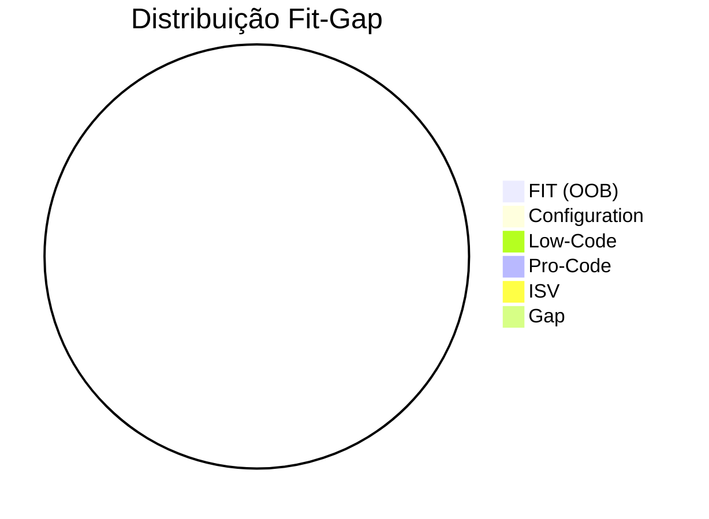

# ============================================================
# D365 DISCOVERY / FIT-GAP TEMPLATE - Avanade Method v4.29.0
# ============================================================
# Template Owner: Maria Analyst
# Purpose: Discovery e Fit-Gap Analysis para D365 CE brownfield

---

# 🔍 Discovery & Fit-Gap Analysis - [Nome do Projeto]

## 1. Contexto do Projeto

| Item | Detalhe |
|------|---------|
| **Projeto** | [Nome] |
| **Tipo** | Brownfield - Customização D365 CE existente |
| **Módulos** | [Sales / Service / Marketing / Field Service] |
| **Analista** | Maria (Avanade Method) |
| **Data** | YYYY-MM-DD |
| **Versão** | 1.0 |

---

## 2. Estado Atual (As-Is)

### 2.1 D365 Environment Atual

| Aspecto | Detalhe |
|---------|---------|
| **Versão D365** | [Online - Wave X YYYY] |
| **Licenças** | [D365 Sales Enterprise x N, Customer Service x N, etc] |
| **Power Platform** | [Power Apps per user / per app, Power Automate per user / per flow] |
| **Número de Usuários** | [Total e por módulo] |
| **Business Units** | [Qtd e estrutura] |
| **Customizações existentes** | [Qtd plugins, web resources, flows, PCF] |
| **Integrações existentes** | [Listar sistemas integrados] |
| **Data Volume** | [Registros por tabela principal] |

### 2.2 Entidades Customizadas Existentes

| Tabela | Display Name | Registros | Customizações |
|--------|-------------|-----------|---------------|
| [logical_name] | [Nome] | [~N] | [Colunas, forms, views, plugins] |

### 2.3 Integrações Existentes

| Sistema | Direção | Mecanismo | Frequência | Status |
|---------|---------|-----------|------------|--------|
| [Sistema] | [In/Out/Bidirecional] | [API/File/Service Bus] | [Real-time/Batch] | [Ativo/Inativo/Problemático] |

### 2.4 Processos de Negócio Atuais

| Processo | Módulo | Suporte D365 | Gaps |
|----------|--------|-------------|------|
| [Processo 1] | [Sales/Service/etc] | [OOB/Configurado/Manual] | [Gaps identificados] |

---

## 3. Estado Desejado (To-Be)

### 3.1 Necessidades de Negócio

| # | Necessidade | Prioridade | Stakeholder |
|---|------------|-----------|-------------|
| N1 | [Descrição da necessidade] | [Must/Should/Could] | [Quem] |

### 3.2 Processos de Negócio Desejados

| Processo | Trigger | Steps | Outcome | Automation Level |
|----------|---------|-------|---------|-----------------|
| [Processo] | [Quando inicia] | [Passos principais] | [Resultado] | [Full/Partial/Manual] |

---

## 4. Fit-Gap Analysis

### 4.1 Matriz Fit-Gap

| # | Requisito | Classificação | Abordagem | Esforço | Complexidade |
|---|-----------|--------------|-----------|---------|-------------|
| R001 | [Requisito] | **FIT** | OOB - Funcionalidade nativa | Baixo | Baixa |
| R002 | [Requisito] | **CONFIG** | Configuration - Business Rules, Views, Forms | Baixo | Baixa |
| R003 | [Requisito] | **LOW-CODE** | Power Automate / Canvas App | Médio | Média |
| R004 | [Requisito] | **PRO-CODE** | Plugin C# / PCF / Azure Function | Alto | Alta |
| R005 | [Requisito] | **ISV** | Solução de terceiro (AppSource) | Médio | Baixa |
| R006 | [Requisito] | **GAP** | Não atendido - requer análise | Alto | Alta |

### 4.2 Legenda de Classificação

| Classificação | Descrição | Esforço Típico | Quem Implementa |
|--------------|-----------|----------------|-----------------|
| 🟢 **FIT** | Funcionalidade nativa D365 | Nenhum | N/A (já existe) |
| 🔵 **CONFIG** | Configuração sem código | Baixo (horas) | Configurador / Consultor |
| 🟡 **LOW-CODE** | Power Automate, Canvas Apps, Business Rules | Médio (dias) | Citizen Dev / Consultor |
| 🟠 **PRO-CODE** | Plugins, PCF, Azure Functions, Web Resources | Alto (dias-semanas) | Desenvolvedor |
| 🟣 **ISV** | Solução de terceiro do AppSource | Médio (licença + config) | Consultor + Vendor |
| 🔴 **GAP** | Não atendido pelo stack atual | A definir | Análise adicional |

### 4.3 Resumo Fit-Gap

---

## 5. Requisitos por Módulo D365

### 5.1 Sales

| # | Requisito | Fit-Gap | Abordagem Técnica |
|---|-----------|---------|-------------------|
| S001 | [Req Sales] | [FIT/CONFIG/LOW/PRO/ISV/GAP] | [Detalhe técnico] |

### 5.2 Customer Service

| # | Requisito | Fit-Gap | Abordagem Técnica |
|---|-----------|---------|-------------------|
| CS001 | [Req Service] | [FIT/CONFIG/LOW/PRO/ISV/GAP] | [Detalhe técnico] |

### 5.3 Marketing

| # | Requisito | Fit-Gap | Abordagem Técnica |
|---|-----------|---------|-------------------|
| M001 | [Req Marketing] | [FIT/CONFIG/LOW/PRO/ISV/GAP] | [Detalhe técnico] |

### 5.4 Field Service

| # | Requisito | Fit-Gap | Abordagem Técnica |
|---|-----------|---------|-------------------|
| FS001 | [Req Field Service] | [FIT/CONFIG/LOW/PRO/ISV/GAP] | [Detalhe técnico] |

---

## 6. Análise de Impacto

### 6.1 Impacto em Entidades Existentes

| Tabela | Mudanças Necessárias | Impacto | Risco |
|--------|---------------------|---------|-------|
| [tabela] | [N novas colunas, N relações, forms, views] | [Baixo/Médio/Alto] | [Risco] |

### 6.2 Impacto em Integrações Existentes

| Integração | Impacto | Mudanças Necessárias | Risco |
|------------|---------|---------------------|-------|
| [integração] | [Nenhum/Baixo/Médio/Alto] | [Detalhe] | [Risco] |

### 6.3 Impacto em Segurança

| Mudança | Tipo | Escopo | Risco |
|---------|------|--------|-------|
| [Novo role / Mudança em permissions] | [Security Role/Field Security/BU] | [Usuários afetados] | [Risco] |

---

## 7. Licenciamento

### 7.1 Licenças Necessárias

| Componente | Licença Requerida | Já Disponível? | Custo Adicional |
|-----------|-------------------|----------------|-----------------|
| [Model-driven App] | D365 CE [Module] | [Sim/Não] | [$/mês] |
| [Canvas App] | Power Apps per user/app | [Sim/Não] | [$/mês] |
| [Power Automate] | Per user / Per flow | [Sim/Não] | [$/mês] |
| [Power Pages] | Per site / Authenticated users | [Sim/Não] | [$/mês] |
| [Azure Functions] | Consumption / Premium | [Sim/Não] | [$/mês estimado] |

### 7.2 API Limits & Entitlements

| Recurso | Limite | Uso Atual Estimado | Ação Necessária |
|---------|--------|-------------------|-----------------|
| Dataverse API requests | [6000/5min/user] | [Estimativa] | [Nenhuma/Add-on] |
| Power Automate runs | [N/day] | [Estimativa] | [Nenhuma/Add-on] |
| Storage | [N GB included] | [Uso atual + estimativa novo] | [Nenhuma/Add-on] |

---

## 8. Riscos & Dependências

### 8.1 Riscos

| Risco | Probabilidade | Impacto | Mitigação |
|-------|--------------|---------|-----------|
| [Risco 1] | [Alto/Médio/Baixo] | [Alto/Médio/Baixo] | [Ação] |

### 8.2 Dependências

| Dependência | Tipo | Owner | Status | Blocking? |
|------------|------|-------|--------|-----------|
| [Dep 1] | [Técnica/Business/Licença/Acesso] | [Quem] | [Pendente/Resolvida] | [Sim/Não] |

### 8.3 Premissas

| Premissa | Validada? | Impact se Falsa |
|----------|----------|-----------------|
| [Premissa 1] | [Sim/Não] | [Impacto] |

---

## 9. Recomendações

### 9.1 Quick Wins (Implementação Imediata)
- [ ] [Item 1 - baixo esforço, alto valor]
- [ ] [Item 2]

### 9.2 Fase 1 - Foundation (Sprint 1-2)
- [ ] [FTDCore solution setup]
- [ ] [Dataverse model base]
- [ ] [Security model base]

### 9.3 Fase 2 - Core Features (Sprint 3-6)
- [ ] [Plugins e business logic]
- [ ] [Integrações core]
- [ ] [Automação]

### 9.4 Fase 3 - Advanced (Sprint 7+)
- [ ] [PCF controls]
- [ ] [Canvas Apps]
- [ ] [Power Pages]
- [ ] [Data migration]

---

## 10. Próximos Passos

| # | Ação | Responsável | Data Prevista | Status |
|---|------|------------|--------------|--------|
| 1 | [Ação 1] | [Quem] | [Quando] | [Pendente] |
| 2 | [Ação 2] | [Quem] | [Quando] | [Pendente] |
