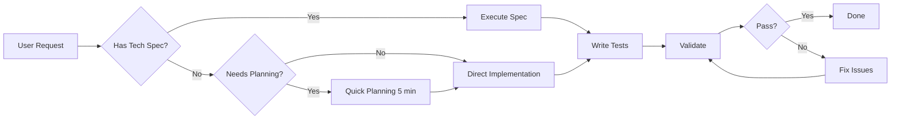

## ?? O que é este Workflow?

O **quick-dev** é um workflow Avanade Method v6 para desenvolvimento rápido SEM o planejamento completo (PRD ? Architecture ? Stories). Ideal para quick wins, utilities, bug fixes.

**Filosofia**: Fast execution quando planejamento completo é overkill

**Workflow Path**: `_avanade-method/bmm/workflows/avanade-method-quick-flow/quick-dev/workflow.md`

---

## ?? Quando Usar

### ? USE quick-dev para:
- **One-off tasks**: Scripts, utilities, tools
- **Bug fixes**: Simple corrections (not architectural changes)
- **Brownfield additions**: Add feature to well-established patterns
- **Quick wins**: Small improvements (<1 day dev time)
- **Prototypes**: Exploratory code, proof-of-concepts
- **User complaints**: "Don't want extensive planning"

### ? NÃO USE para:
- **Complex features**: >3 days dev time ? use full Avanade Method flow (PRD ? Arch ? Stories)
- **Architectural changes**: Database migration, new microservice ? use `create-architecture`
- **New products**: Greenfield projects ? use full Avanade Method flow
- **Regulatory/compliance**: High-risk features ? use full planning

---

## ?? STEP 0: Carregar Contexto FTD (OBRIGATÓRIO)

**Antes de iniciar qualquer step deste workflow:**
1. Ler `.avanade-method/config.yaml` ? `devLoadAlwaysFiles`
2. Carregar docs mandatórios:
   - `ftd-knowledge-base.md` (processos, integrações, glossário)
   - `ftd-discovery.md` (fit-gap, pain points)
   - `especificacao-simulador-notion.md` (spec do Simulador Comercial)
   - `d365-config.yaml` (ambientes, naming, stack)
3. Usar terminologia FTD (Safra, Spartan, Alçada, etc.)
4. Respeitar regras D365 CE + Power Pages + Azure Functions

---

## ?? WORKFLOW MODES

### Mode 1: Execute Tech Spec

**Trigger**: User provides tech-spec.md file  
**Process**:
1. Load tech-spec
2. Implement according to spec
3. Write tests
4. Validate against acceptance criteria

**Example**:
```
User: "Implementar tech-spec-add-dark-mode.md"
? quick-dev executes spec
```

---

### Mode 2: Direct Instructions

**Trigger**: User gives direct task  
**Process**:
1. Clarify requirements (brief Q&A)
2. Implement immediately
3. Show results
4. Optional iteration

**Example**:
```
User: "Adicionar logging em todos endpoints da API"
? quick-dev adds logging without full planning
```

---

### Mode 3: Quick Planning + Dev

**Trigger**: User wants minimal planning  
**Process**:
1. Brief discovery (5 questions max)
2. Create mini tech-spec (1-page)
3. Implement
4. Validate

**Example**:
```
User: "Preciso de export CSV"
? quick-dev asks: "Qual formato? Quais dados? Where saved?"
? Creates mini-spec
? Implements
```

---

## ?? Quick-Dev Process



---

## ?? Best Practices

### When to Choose quick-dev vs Full Avanade Method:

| Factor | quick-dev | Full Avanade Method |
|--------|-----------|---------------------|
| **Dev Time** | <1 day | >3 days |
| **Risk** | Low (easily reversible) | High (core feature) |
| **Complexity** | Simple (clear pattern) | Complex (new patterns) |
| **Scope** | Isolated change | Cross-cutting change |
| **Stakeholders** | Dev + PM | Dev + PM + Architect + UX |
| **Documentation** | Inline comments | PRD + Architecture + Stories |

### DO:
- ? Use quick-dev for utilities, scripts, bug fixes
- ? Add tests even in quick-dev (quality doesn't skip)
- ? Document code with comments (future you will thank you)
- ? Escalate to full Avanade Method if complexity grows

### DON'T:
- ? Skip tests ("it's quick" ? "skip quality")
- ? Use quick-dev for architectural changes
- ? Ignore code review (still get peer review)
- ? Skip documentation (at least README update)

---

## ?? When to STOP quick-dev and Switch to Full Avanade Method

### Red Flags (Escalate to Full Avanade Method):

1. **Scope Creep**: Started as "add button", now redesigning entire UI
2. **Architectural Impact**: Database schema change, new microservice needed
3. **Multi-Team**: Need coordination with other teams
4. **Regulatory**: Compliance, security, legal implications
5. **Time Estimate Growth**: "1 hour" ? "3 days" ? STOP, plan properly

**Escalation Path**:
```
quick-dev ? "This is more complex than expected"
? Pause quick-dev
? Create Product Brief (if greenfield)
? Create PRD
? Create Architecture
? Create Stories
? dev-story workflow (proper implementation)
```

---

## ?? Examples

### Example 1: Quick Utility Script

**Request**: "Script para limpar logs antigos (>30 dias)"

**quick-dev Process**:
```python
# Quick planning (30 seconds):
# - Logs em /var/log/app/*.log
# - Delete files older than 30 days
# - Run via cron daily

# Implementation:
#!/usr/bin/env python3
import os
import time
from pathlib import Path

LOG_DIR = "/var/log/app"
MAX_AGE_DAYS = 30
MAX_AGE_SECONDS = MAX_AGE_DAYS * 24 * 60 * 60

def cleanup_old_logs():
    """Delete log files older than MAX_AGE_DAYS."""
    current_time = time.time()
    deleted_count = 0
    
    for log_file in Path(LOG_DIR).glob("*.log"):
        file_age = current_time - log_file.stat().st_mtime
        
        if file_age > MAX_AGE_SECONDS:
            print(f"Deleting {log_file} (age: {file_age/86400:.1f} days)")
            log_file.unlink()
            deleted_count += 1
    
    print(f"Deleted {deleted_count} old log files")

if __name__ == "__main__":
    cleanup_old_logs()

# Cron entry: 0 2 * * * /usr/local/bin/cleanup_logs.py
```

**Duration**: 15 minutes  
**Documentation**: Inline comments + cron entry

---

### Example 2: Bug Fix

**Request**: "Endpoint /api/users retorna 500 quando email é null"

**quick-dev Process**:
```javascript
// 1. Identify bug (2 min):
// File: src/api/users.js, line 45
// Error: Cannot read property 'toLowerCase' of null

// 2. Fix (5 min):
app.get('/api/users', async (req, res) => {
    try {
        const email = req.query.email;
        
        // FIX: Validate email before using
        if (!email) {
            return res.status(400).json({ 
                error: "Email parameter is required" 
            });
        }
        
        const user = await User.findOne({ 
            email: email.toLowerCase() 
        });
        
        if (!user) {
            return res.status(404).json({ 
                error: "User not found" 
            });
        }
        
        res.json(user);
    } catch (error) {
        console.error("Error fetching user:", error);
        res.status(500).json({ error: "Internal server error" });
    }
});

// 3. Add test (5 min):
describe('GET /api/users', () => {
    it('should return 400 when email is missing', async () => {
        const res = await request(app).get('/api/users');
        expect(res.status).toBe(400);
        expect(res.body.error).toBe("Email parameter is required");
    });
    
    it('should return 404 when user not found', async () => {
        const res = await request(app).get('/api/users?email=nonexistent@example.com');
        expect(res.status).toBe(404);
    });
    
    it('should return user when email is valid', async () => {
        const res = await request(app).get('/api/users?email=valid@example.com');
        expect(res.status).toBe(200);
        expect(res.body.email).toBe('valid@example.com');
    });
});
```

**Duration**: 12 minutes  
**Tests**: 3 test cases added

---

## ?? Integration Points

### When to Use quick-dev in Avanade Method Flow:

- **Anytime during implementation**: One-off tasks not in stories
- **After sprint-planning**: Quick fixes between stories
- **During code-review**: Addressing review comments
- **Post-launch**: Bug fixes, small improvements

### Workflows that Call quick-dev:

- **correct-course**: May recommend quick-dev for simple corrections
- **sprint-status**: Routes to quick-dev for ad-hoc tasks
- **code-review**: Auto-fix minor issues with quick-dev

---

## ?? Related Artifacts

- **${AVANADE_WORKFLOW_GUIDE_QUICK_SPEC}**: Create tech-spec for quick-dev
- **${AVANADE_WORKFLOW_GUIDE_DEV_STORY}**: Full story implementation (compare)
- **${AVANADE_MEMORY_DEV_TIAGO}**: Code patterns, testing standards

---

## ?? References

- **Avanade Method Workflow Path**: `_avanade-method/bmm/workflows/avanade-method-quick-flow/quick-dev/`
- **Workflow Manifest Entry**: `workflow-manifest.csv` line 21
- **Command**: `avanade-method-bmm-quick-dev`
- **Owner Agent**: Barry (Quick-Flow Solo Dev)

---
