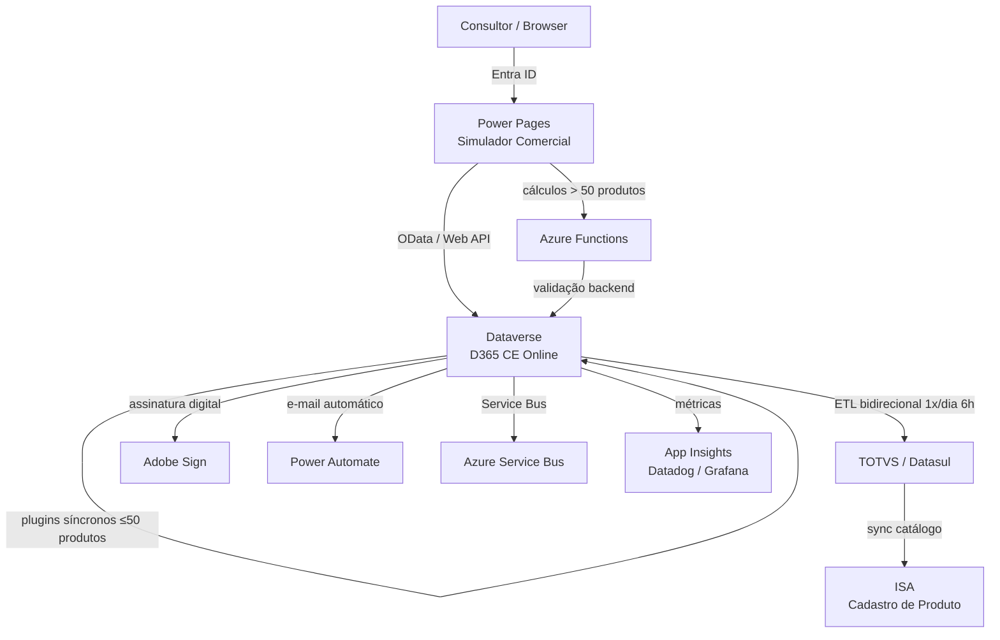

# avanade.code — FTD Educação | Dynamics 365 CE

> **Projeto de Modernização CRM** — Avanade × FTD Educação (Grupo Marista)
> Plataforma: Microsoft Dynamics 365 CE Online + Power Pages + Azure Functions

---

## Índice

- [Visão Geral](#visão-geral)
- [Sobre o Cliente](#sobre-o-cliente)
- [Stack Tecnológica](#stack-tecnológica)
- [Arquitetura](#arquitetura)
- [Estrutura do Repositório](#estrutura-do-repositório)
- [Padrões de Desenvolvimento (BCA)](#padrões-de-desenvolvimento-bca)
- [Simulador Comercial](#simulador-comercial)
- [Jornada Comercial](#jornada-comercial)
- [Ambientes](#ambientes)
- [Pipelines CI/CD](#pipelines-cicd)
- [Fluxo de Trabalho Diário](#fluxo-de-trabalho-diário)
- [Glossário FTD](#glossário-ftd)
- [Roadmap](#roadmap)
- [Times](#times)

---

## Visão Geral

Este repositório contém as customizações e extensões da plataforma **Microsoft Dynamics 365 CE Online** para a **FTD Educação S/A**, desenvolvidas seguindo os padrões **Avanade BCA (BizApps Core Accelerator) v3**.

O projeto é classificado como **Brownfield** — customizações sobre um ambiente D365 existente com mais de 1,5 anos de operação, 9 soluções segmentadas e múltiplas integrações ativas.

O objetivo central é a **modernização do processo comercial** da FTD, com foco na eliminação do principal pain point identificado: consultores levam até **3 horas** para criar uma única proposta comercial (200 produtos × 3 cliques cada).

---

## Sobre o Cliente

| Item | Detalhe |
|------|---------|
| **Cliente** | FTD Educação S/A |
| **Grupo** | Grupo Marista |
| **Indústria** | Educação / Editora / Distribuição de Livros Didáticos |
| **Histórico** | +120 anos de atuação |
| **Sede** | São Paulo, SP |
| **Filiais** | 28 centros de distribuição pelo Brasil |
| **Impacto** | ~1,5 milhão de estudantes atendidos |
| **Pico Sazonal** | Nov–Jan (adoção escolar, ~5.000 contratos/dia) |
| **Meta 2030** | Faturamento de R$ 3 bilhões (expectativa 2025: R$ 1,5 bilhão) |

### Ecossistema Digital FTD

```
FTD Educação
├── iônica          → Ambiente digital de aprendizagem
├── Lumisfera       → E-commerce (Adobe Commerce) para famílias
├── Pontue          → IA para correção de redações (adquirida)
├── Estuda.com      → Plataforma de avaliação/simulados
├── Diário Escola   → Sistema de gestão escolar (parceiro)
└── Quantbot        → Robótica/programação gamificada (Azure)
```

---

## Stack Tecnológica

| Camada | Tecnologia |
|--------|-----------|
| **CRM** | Microsoft Dynamics 365 CE Online (Sales + Customer Service) |
| **Frontend Simulador** | Power Pages (SPA, Entra ID, sem custo extra de licença) |
| **Backend Extensões** | C# Plugins (.NET), Azure Functions |
| **Automação** | Power Automate |
| **Scripting Forms** | TypeScript → transpilado via Babel/Webpack |
| **ERP** | TOTVS/Datasul (ETL bidirecional, sync 1×/dia às 6h) |
| **Produtos** | ISA (Sistema de Cadastro de Produto) |
| **Contratos** | Adobe Acrobat Sign (em migração) |
| **Monitoramento** | Datadog + Grafana + Application Insights |
| **Segredos** | Azure Key Vault (Azure Functions) / Variáveis de Ambiente (Power Automate) |
| **CI/CD** | Azure DevOps Pipelines |
| **Portal** | Canvas App (Área do Cliente — squad separada) |

---

## Arquitetura

### Visão de Alto Nível



### Apps D365 em Produção

| App | Área | Descrição |
|-----|------|-----------|
| **Spartan** | Comercial | App principal de vendas (principal foco do projeto) |
| **PNLD** | Público | Programa Nacional do Livro Didático |
| **Hub SAC** | CRC | Atendimentos ao cliente (Customer Service) |
| **Adobe Sign** | Contratos | Assinatura digital |
| **Área do Cliente** | Portal | Canvas App (tabelas Dataverse compartilhadas) |

### Solutions (9 — deploy sequencial por dependência)

| # | Solution | Tipo |
|---|----------|------|
| 1 | `FTDCore` | Base / Publisher |
| 2 | `FTDDataModel` | Entidades, campos, relacionamentos |
| 3 | `FTDPlugins` | Plugins C# |
| 4 | `FTDClientExtensions` | Web Resources TS, PCF |
| 5 | `FTDSiteMap` | Mapa do site / navegação |
| 6–9 | _Módulos funcionais_ | Configurações, flows, etc. |

---

## Estrutura do Repositório

```
code-ftd/
├── .avanade-method/            # Configurações e docs do Avanade Method
│   ├── config.yaml             # Configuração principal do projeto
│   ├── configs/
│   │   └── d365-config.yaml    # Configuração D365 com dados reais
│   ├── docs/
│   │   ├── ftd-knowledge-base.md          # Knowledge base completo
│   │   ├── ftd-resumo-completo.md         # Resumo executivo
│   │   ├── especificacao-simulador-notion.md  # Spec Simulador (501 linhas)
│   │   ├── diretriz-avanade-inventory.md  # Inventário BCA (197 docs)
│   │   └── discovery/
│   │       └── ftd-discovery.md           # Discovery com fit-gap
│   ├── standards/
│   │   └── d365-development-standards.md # Padrões de dev D365
│   └── prompts/                # Personas MCP (agentes IA)
├── docs/
│   ├── arquitetura/            # Documentação técnica de arquitetura
│   │   ├── d365-solution-architecture.md
│   │   ├── d365-data-model.md
│   │   ├── d365-integration-landscape.md
│   │   ├── padroes-desenvolvimento.md
│   │   └── stack-tecnologica.md
│   ├── discovery/              # Discovery sharded
│   ├── prd/                    # Product Requirements Documents
│   └── stories/                # User stories
├── .github/
│   └── instructions/
│       └── avanade-bca-guidelines.instructions.md  # Diretrizes BCA (obrigatório)
└── README.md
```

---

## Padrões de Desenvolvimento (BCA)

Este projeto segue os padrões **Avanade BCA (BizApps Core Accelerator) v3**. Consulte `.github/instructions/avanade-bca-guidelines.instructions.md` para a referência completa.

### Backend — C# Plugins

**Padrão obrigatório: `Plugin → Service → Repository`**

```csharp
// Plugin herda do genérico BCA — apenas orquestração
[PluginRegistration(
    EntityLogicalName = "ftd_proposal",
    Stage = PluginStage.PreOperation,
    MessageName = "Create")]
public class ProposalPreCreate : Plugin<ftd_proposal>
{
    protected override void Execute(IPluginExecutionContext context)
    {
        var service = Container.Resolve<IProposalService>();
        service.OnCreate(context.Target);
    }
}
```

| Regra | Descrição |
|-------|-----------|
| **Plugin genérico** | Herdar `Plugin<T>` (Create/Update) ou `Plugin` (Delete/RetrieveMultiple) |
| **Lógica no Service** | Business logic NUNCA no plugin — sempre em `ProposalService : IProposalService` |
| **Acesso a dados** | Via `IRepository<T>` (padrão Repository) |
| **DI** | Unity container — auto-registro por convenção: `IFoo → Foo` |
| **Registro** | SEMPRE via `[PluginRegistration]` attribute (APRT) — nunca manual |
| **Early Bound** | OBRIGATÓRIO — gerado via CLI `GenerateEarlyBound` |
| **Elevação** | `AsAdmin = true` no attribute (todo plugin) ou `.AsAdmin<T>()` no repository (query específica) |

### Frontend — TypeScript

**Padrão obrigatório: `Contract / Controller`**

```
src/
└── ftd_/scripts/
    └── sales/
        ├── proposal.main.form.contract.ts   # Entry points (onLoad/onSave) — singleton
        └── proposal.main.form.controller.ts # Lógica de negócio
```

| Regra | Descrição |
|-------|-----------|
| **TypeScript obrigatório** | TODO código frontend em TS, transpilado via Babel/Webpack |
| **Early Bound Forms** | Gerar via `config.json` + `GenerateFrontend.ps1` |
| **Fluent Rules** | `ValueRule`, `EnableRule`, `DisplayRule`, `RequiredRule` — preferência sobre event handlers manuais |
| **Cache** | `DefaultCache` + `CacheItem` com hash SHA-256 (Dataverse retorna `no-cache`) |
| **Strict equality** | `===` sempre (nunca `==`) |
| **OData** | Query Builder fluente tipo LINQ para consultas ao Dataverse |

### Naming Conventions

| Componente | Convenção | Exemplo |
|-----------|-----------|---------|
| Plugin Class | `[Entidade][Mensagem][Stage]` | `ProposalPreCreate` |
| Plugin Namespace | `FTD.Plugins.[Módulo]` | `FTD.Plugins.Sales` |
| Custom API | `ftd_[ActionName]` | `ftd_CalculateDiscount` |
| Azure Function | `FTD.Functions.[Domínio].[Nome]` | `FTD.Functions.Proposal.Calculate` |
| Web Resource | `ftd_/scripts/[módulo]/[arquivo].js` | `ftd_/scripts/sales/proposal.form.js` |
| Solution | `FTD[Módulo]` | `FTDSales`, `FTDCore`, `FTDPlugins` |
| Table (lógico) | `ftd_[entityname]` | `ftd_proposal` |
| Column (lógico) | `ftd_[columnname]` | `ftd_discountpercentage` |

### Testes

| Nível | Framework | Convenção |
|-------|-----------|-----------|
| **Backend** | MSTest + NSubstitute | `[Classe]_Método_Should_[Comportamento]_When_[Estado]` |
| **Frontend** | Jest + Should.js | `DynamicsContextMock` para simular formulários |
| **Princípio** | Shift-Left | Testar o mais cedo possível, sem necessidade de ambiente D365 |

```csharp
// Exemplo: teste de plugin seguindo padrão AAA
[TestClass]
public class ProposalServiceTests
{
    [TestMethod]
    public void ProposalService_Calculate_Should_ApplyDiscount_When_PolicyAllows()
    {
        // Arrange
        var repo = Substitute.For<IProposalRepository>();
        var sut = new ProposalService(repo);

        // Act
        var result = sut.Calculate(proposalId, discountRate: 0.15m);

        // Assert
        result.FinalPrice.Should().BeLessThan(result.ListPrice);
    }
}
```

---

## Simulador Comercial

> **O principal entregável do projeto** — Interface consultiva de negociação construída em Power Pages.

### Problema que Resolve

| Antes | Depois (Meta) |
|-------|--------------|
| Até **3 horas** para criar 1 proposta | < **15 minutos** |
| 200 produtos × 3 cliques = **600 cliques** | Adição em lote: **~5 cliques** |
| Carregamento lento do D365 | Cálculos **real-time** no frontend |
| Sem visibilidade de aprovação | Alçadas **visuais** em tempo real |

### Decisão Arquitetural

```
Power Pages (SPA) + Entra ID
    ↓
Dataverse (OData / Web API)
    ↓                    ↓
Plugin Síncrono     Azure Function
(≤ 50 produtos)     (> 50 produtos)
```

- **Frontend**: Cálculos real-time em JavaScript/PowerFX, cache heavy client-side
- **Backend**: Azure Functions para validação e cálculos pesados (proteção contra bypass)
- **Auth**: Entra ID — usuários internos, sem custo extra de licença Power Pages

### 6 Etapas do Simulador

| # | Etapa | Descrição |
|---|-------|-----------|
| 1 | **Contexto da Negociação** | Conta, Oportunidade, tipo (Contrato/Aditivo), safra, alunado por série |
| 2 | **Produtos e Serviços** | Grid principal, adição individual e em lote, filtros por LN/Coleção/Série, totalizadores real-time |
| 3 | **Benefícios, Doações, Patrocínios, Adiantamento** | Grid por tipo/série, impacto na receita em tempo real |
| 4 | **Configuração de Vendas** | Canais, logística, sublistas de produtos por modelo de venda |
| 5 | **Matriz de Serviços** | Em revisão (menos prioritário) |
| 6 | **Revisão & Compartilhamento** | Big numbers, comparativo vs proposta anterior, justificativa, config de contrato |

### MVP (Deadline: 31/Mar/2026)

- Adição **individual** de produtos (sem lote)
- Botão no Spartan → redireciona para Power Pages
- Grid de produtos com totalizadores em real-time
- Reorganização de campos nas etapas do CRM

---

## Jornada Comercial

```
Conta
  └── Contato (Representante Legal — CPF obrigatório)
        └── Oportunidade
              └── Produtos da Oportunidade
                    └── Proposta Comercial (até 28 revisões)
                          └── Aprovação (7 níveis de alçada)
                                └── Contrato
                                      └── Adobe Sign (assinatura digital)
                                            └── TOTVS/Datasul (faturamento)
```

### Linhas de Negócio

| Linha | Majoração | Lote | Observações |
|-------|-----------|------|-------------|
| **Sistema de Ensino** | ✅ | ✅ | Coleções (Trilhas ~15 materiais/série), inclui Grade (ensino médio) |
| **Didático** | ❌ | ✅ | Sub-linhas: Didático Idiomas, Didático Vendo Escola |
| **Bilíngue** | ✅ | ✅ | — |
| **Espanhol** | ✅ | ✅ | — |
| **Literatura** | ❌ | ❌ | Produtos individuais (ex: Pequeno Príncipe) |
| **APE** | ❌ | ✅ | — |

### Canais de Venda

| Canal | Descrição |
|-------|-----------|
| **FTD com Você (Lumisfera)** | E-commerce principal — escola compartilha link, famílias compram |
| **Venda Direta** | Faturamento direto para escola (invoice) |
| **Frente de Loja / Balcão Escola** | — |
| **Smart POS** | Plantão de vendas presencial (terminal de pagamento) |

### Alçadas de Aprovação (7 níveis)

| Nível | Aprovador | Critério |
|-------|-----------|---------|
| 1 | Consultor | Auto-aprovação (dentro da política comercial) |
| 2 | Coordenador | Descontos nível 1 |
| 3 | Gerente Filial | Descontos nível 2 / Estornos |
| 4 | Gerente Regional | Descontos nível 3 |
| 5 | Diretor Adjunto (DG) | Patrocínios / Adiantamentos altos |
| 6 | Diretor Superintendente | Casos críticos / Royalties |
| 7 | Presidente | Alçadas máximas (Grupo Marista) |

> ⚠️ **Lógica de resubmissão**: Se os totalizadores de preço não mudaram, pula níveis e vai direto para quem recusou.

---

## Ambientes

| Ambiente | Status | Pipeline | Observações |
|----------|--------|----------|-------------|
| **Dev** | ✅ Ativo | Plugin deploy MANUAL | Pipeline não configurado para plugins |
| **OAT (UAT)** | ✅ Ativo | Pipeline automático | Aprovador cadastrado obrigatório |
| **Produção** | ✅ Ativo | Pipeline + GMUD via SMAX | Requer aprovação de Giselle (Infra) |
| **QA** | 🔧 Criado | Pendente configuração | — |
| **Release Candidate** | 🔧 Criado | Pendente configuração | — |

> **Usuário de serviço**: `FTDMaxFlow` — proprietário de todos os Power Automate flows e conexões.  
> **Segredos**: Azure Key Vault (Azure Functions) | Variáveis de Ambiente (Power Automate).  
> **Batch updates**: executados em VM solicitada ao time de infraestrutura.

---

## Pipelines CI/CD

| Pipeline | Trigger | Função |
|----------|---------|--------|
| `build-guard` | Automático (CI) | Build frontend+backend + executa TODOS os testes unitários |
| `deploy-code` | Automático (merge PR) | Deploy artifacts para Customization Master |
| `deploy` | **MANUAL** | Full deploy para upper environments (solutions + data + pre/post steps) |
| `export-unpack` | Opcional | Exporta/desempacota solutions → cria PR automático |

> ⚠️ **Regra crítica**: O pipeline de deploy é SEMPRE manual — nunca automatizar deploy para upper environments.

---

## Fluxo de Trabalho Diário

```
1. DEVELOP
   git pull latest → generate early bound (CLI) → desenvolver → tests + coverage

2. DEPLOY LOCAL
   CLI LocalDeployment Backend|Frontend → verificar no Dev

3. CUSTOMIZAR
   make.powerapps.com → Customization Master → modificar

4. UNPACK
   CLI UnpackSolution → revisar changes no diff

5. COMMIT
   Feature branch → commit com #workitem → push

6. PR
   Título descritivo + work item linkado + reviewers
   Mínimo 1 reviewer | Guard build como pré-requisito | Comment resolution required

7. CI
   Guard build dispara automaticamente (build + testes)

8. DEPLOY MANUAL
   Pipeline deploy → upper environments
   Produção: abertura de GMUD no SMAX (Giselle)
```

### Branch Strategy

| Branch | Função |
|--------|--------|
| `dev` | Source of truth — feature branches a partir daqui |
| `master` | Branch estável (não usado para deploys diretos) |
| `feature/*` | Desenvolvimento de features (vinculado a work items) |

---

## Glossário FTD

| Termo | Significado |
|-------|-------------|
| **Safra** | Ano letivo/comercial (ex: Safra 26 = 2026) |
| **Lumisfera** | E-commerce FTD (plataforma Adobe Commerce para famílias) |
| **FTD com Você** | Nome comercial do modelo Lumisfera (B2C escola) |
| **Spartan** | App principal de vendas no Dynamics 365 |
| **Anja** | Pessoa que cadastra proposta no lugar do consultor |
| **Estabelecimento** | Filial FTD no CRM (28 no Brasil) |
| **Mantenedora** | Rede/grupo que mantém escolas (ex: Grupo Marista) |
| **Royalty/Markup** | % que a escola adiciona ao preço negociado (fica com a escola) |
| **Grade** | Produto customizado para ensino médio de escola específica |
| **Alçada** | Nível de aprovação necessário para proposta avançar |
| **GMUD** | Gestão de Mudança — processo obrigatório para deploy em produção |
| **SMAX** | Sistema de abertura de GMUDs (Giselle/Infra) |
| **Vulcano** | Ferramenta externa de aprovação — **será eliminada** |
| **ISA** | Sistema de cadastro de produto FTD |
| **PNLD** | Programa Nacional do Livro Didático (setor público) |
| **IPCA** | Índice de reajuste anual dos preços entre safras |
| **Hunter** | Consultor que prospecta novas contas |
| **Farmer** | Consultor que mantém contas existentes (carteirização) |
| **Smart POS** | Terminal de pagamento para plantão de vendas presencial |
| **Código Substituto** | Link entre produto antigo e novo entre safras |
| **FTDMaxFlow** | Usuário de serviço proprietário dos Power Automate flows |

---

## Roadmap

| Fase | Deadline | Responsável | Escopo Principal |
|------|----------|-------------|-----------------|
| **MVP** | 31/Mar/2026 | FTD | Simulador: adição individual de produtos, reorganização de campos CRM |
| **Habilitadores** | Pré-MVP | FTD + Avanade | 7 itens de base (infra, cadastros, integrações) |
| **Simulador Faxina** | Pós-MVP | Avanade | Limpeza de dados (produtos, contas, preços) |
| **Onda 1** | ~Ago/2026 | Avanade | Adição em lote, copiar proposta, benefícios/doações, motor de aprovação, ISA↔TOTVS↔CRM |
| **Onda 2 Funil** | TBD | Avanade | Funil de vendas (6 itens) |
| **Pós-Venda** | TBD | Avanade | Comissionamento, inteligência comercial (upsell, cross-sell) |
| **PNLD** | TBD | Avanade | Setor público (4 itens) |

### Pain Points Críticos a Resolver

| # | Problema | Severidade |
|---|----------|-----------|
| 1 | Consultor leva até **3h** para criar 1 proposta (200 produtos × 3 cliques) | 🔴 Crítico |
| 2 | **Dataverse em nível crítico** de storage (já passou do limite) | 🔴 Crítico |
| 3 | Tabela de produtos poluída (**1.283 registros** onde deveriam ser ~15) | 🔴 Crítico |
| 4 | **12+ tabelas de preço** (workaround de visibilidade, não pricing real) | 🟠 Alto |
| 5 | Campos duplicados Oportunidade ↔ Proposta (dados desatualizados) | 🟠 Alto |
| 6 | **50+ templates Word** para contratos (manutenção insustentável) | 🟠 Alto |
| 7 | Vulcano: aprovação externa duplicada (será eliminada) | 🟡 Médio |
| 8 | Repositório desacoplado dos PBIs (migração em andamento) | 🟡 Médio |

---

## Times

### FTD Educação

| Pessoa | Papel |
|--------|-------|
| **Julio Cesar** | Tech Lead — Squad CRM (melhorias + sustentação) |
| **Fernando** | Dev — Power Pages, Power Automate, Azure Functions |
| **Kevellin** | UX/Dev — Power Pages, protótipos |
| **Oscar de Rooij** | PO/Business Analyst — especificações, Simulador Comercial |
| **Eduardo** | Functional Consultant — demo CRM, treinamento |
| **Thiago Veiga** | Arquiteto de Integrações (time separado) |
| **Giselle** | Infraestrutura — abertura de GMUDs, aprovações pipeline |

### Avanade

| Pessoa | Papel |
|--------|-------|
| **Danilo Macedo** | Tech Lead Avanade (conhece FTD desde 2022) |
| **João Carlos Figueirôa** | Arquiteto |
| **Rodrigo Silva** | Architect |
| **Camila Moraes** | Analyst/PM |
| **Fabiana Bacini** | Scrum Master / PM |
| **Marcio Jovanello** | Manager Avanade |
| **Tercio** | Gestão de acessos |

### Cerimônias

| Dia | Reunião | Participantes |
|-----|---------|---------------|
| **Segunda** | Squad trabalho | Dev + UX + Oscar + Kevellin + Fabi |
| **Terça** | Negócio | Área de negócio |
| **Quinta** | Tecnologia | Arquitetos + Oscar + Medella + Jovanello |

---

## Documentação Técnica Obrigatória

> Todos os agentes e desenvolvedores **devem ler** os seguintes documentos antes de qualquer tarefa:

| Arquivo | Descrição |
|---------|-----------|
| `.avanade-method/docs/ftd-knowledge-base.md` | Knowledge base completo da FTD (processos, integrações, glossário) |
| `.avanade-method/docs/discovery/ftd-discovery.md` | Discovery com fit-gap analysis |
| `.avanade-method/docs/especificacao-simulador-notion.md` | Especificação completa do Simulador Comercial |
| `.avanade-method/configs/d365-config.yaml` | Configuração D365 com dados reais (pain points, ambientes) |
| `.github/instructions/avanade-bca-guidelines.instructions.md` | Diretrizes BCA de desenvolvimento Avanade (padrões obrigatórios) |
| `docs/arquitetura/d365-solution-architecture.md` | Arquitetura de solutions |
| `docs/arquitetura/d365-data-model.md` | Modelo de dados |
| `docs/arquitetura/d365-integration-landscape.md` | Mapa de integrações |
| `docs/arquitetura/padroes-desenvolvimento.md` | Padrões de desenvolvimento do projeto |

---

*avanade.code — FTD Educação | Microsoft Dynamics 365 CE | Avanade BCA v3*  
*Última atualização: 24/Março/2026*
