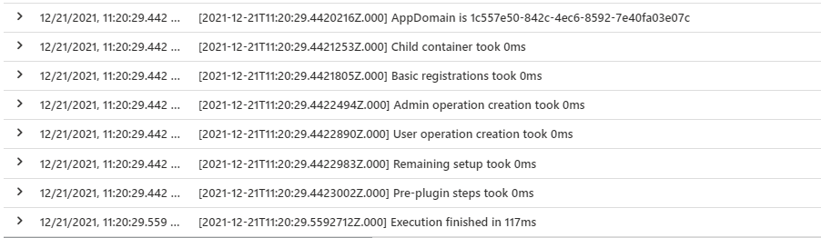

# Performance

Performance is an important topic in all of our engagements. This also applies to the BizApps Core Accelerator and the code you write with it. That's why we've invested much time in optimizing and measuring the performance of the BizApps Core Accelerator.

# Impact

The BizApps Core Accelerator provides a plugin base class which takes care of providing the building blocks which your code is being developed upon. Setting up the infrastructure occurs **once** per app domain taking around 150ms (99 percentile). 

Any subsequent invocations **do not have any measurable impact** on the plugin execution performance.

Please see below logs for details:

