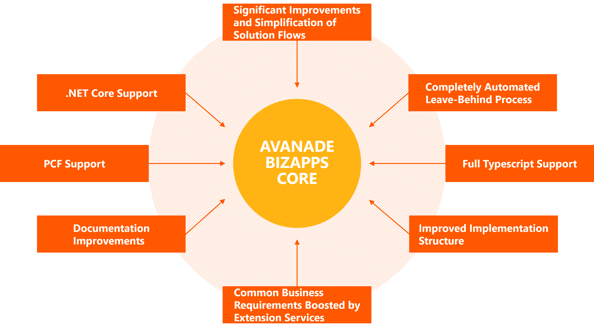

# Release Notes

The general development and solution flows have been significantly improved in version 3 with the following main objectives in mind (note that those are typically very hard to address together):

1. **Preserve and extend proven DSS Framework concepts** such as the backend and frontend code structure, libraries and unit test support, the CLI, the fully automated setup process, full-fledged and ready-to-use pipelines, automation and data handling which goes 100% automated and much more. Those accelerations are absolutely crucial for professional and industrialized development and delivery.
1. **Embrace and enrich new(-ish) out of the box platform concepts** such as Power Platform CLI (`pac.exe`). Utilizing those makes user adaption and future extensions easier, the main value-add of V3 is to provide small but effective enrichments and guardrails which are needed when scaling out to thousands of projects to avoid issues (missing or wrong metadata, naming, etc.) caused by a too high degree of freedom. The CLI and pipeline enrichment of V3 allows the full utilization of backend and frontend acceleration (for example completely streamlined webpack automation for web resources).
1. **Modular and flexible solution handling.** Functional segmentation and managed solutions are introduced as a default which shall encourage (and to some extent force) teams to think of a good solution structure from day one. (Technical slicing and unmanaged is still supported and potentially required by projects.) It is possible to define and develop each solution as completely no-code/low-code (**light-weight**) or with pro-code (add backend and/or frontend).
1. **Comitment to both high-speed and high-quality delivery**. The single version of the truth for customizations, code, configuration data and automation definitions is in the repository. This approach not only minimizes the number of required environments without sacrificing consistency, traceability and quality. By using the `pac.exe`, solutions can be built without the need of transient solutions which makes deployments faster and all steps before the commit are completely manageable via the CLI, only of course all manual customizing and solution modification steps are still done in the Dataverse environments as usual.

