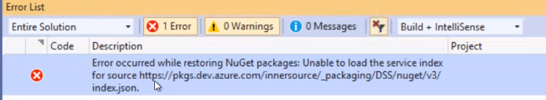
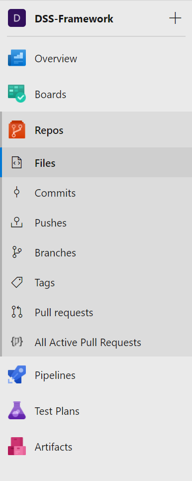
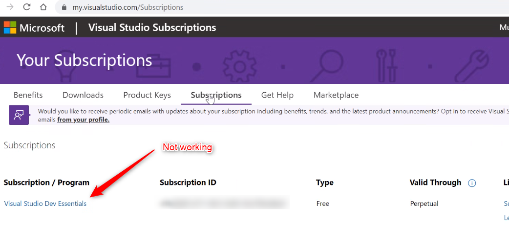

# Restore and Rebuild not working

## Problem

In case the restore/rebuild is not working, this might be related to the MSDN Subscription/License used by the colleague.

Known errors are

`Error occurred while restoring NuGet packages: Unable to load the service index for source https://pkgs.dev.azure.com/innersource/_packaging/DSS/nuget/v3/index.json`

## Solution

Open <https://innersource.visualstudio.com/DSS-Framework> and make sure you can see and access `Repos`

If this is not working/visible, navigate to <https://my.visualstudio.com/>` --> Subscriptions` and make sure you have at least Professional assigned. What will not work is `Dev Essentials`.

Align with your PM and use Self Service (https://avanade.service-now.com/) or the portal (https://avanade.sharepoint.com/sites/VisualStudioSubscriptions) to request the update.
