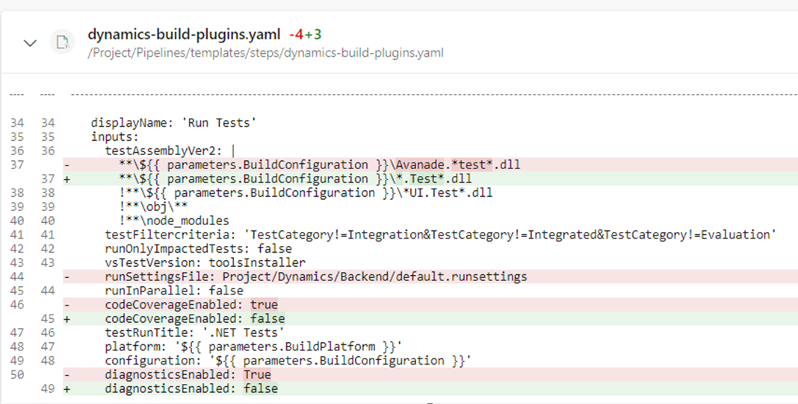

# VSTest Task not executed in Pipeline

## Error
It can happen that the VSTest to run the automated tests for the Dynamics backend (`dynamics-build-plugins.yaml`) fails silently, i.e. the task would show as green but inside the task execution no tests would be found and hence the unit test assertion would not happen.

## Solution
In one case it helped, to change the following task properties:
* **testAssemblyVer2:** The file capturing pattern did not work any longer, hence it might have to be made more generic.
* **codeCoverageEnabled:** Needed to be deactivated.
* **diagnosticsEnabled:** Needed to be deactivated.
* **runSettingsFile:** Needed to be removed.

