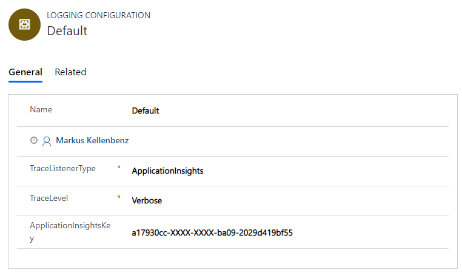
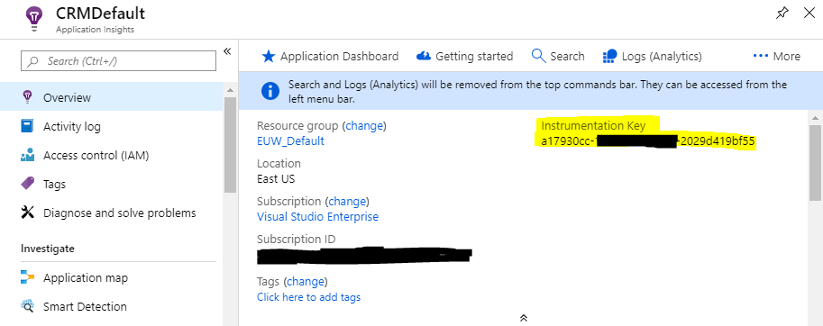

# Logging

## Configure Logging
We've integrated logging into the BizApps Core Accelerator which utilizes different logging provider. You can configure them using the `Logging Configuration` Entity, which is included in the Avanade BizApps Core Accelerator Solution. If no record exists, the logging is disabled. If you want to enable logging make sure you only create a single `Logging Configuration` record, as multiple might cause unwanted behavior.

To create this record there are many ways. The easiest one is to open an *Advanced Find* window, select the entity `Logging Configuration` and press **Result**. From there on you'll get an empty list (or a single record if you already configured logging). From there on you can create a new record or open the existing one.

The Edit Form should look something like this:

The most important parameter is the **TraceListenerType**, as it allows you to select the logging provider. The following options are currently available:

### CRMTracingService
This logging provider utilizes the `ITracingService` passed in by CRM. This allows you to log directly to CRM and later view the traces in the `Plugin-In Trace Logs` list.

### WindowsDebugOutput
This option is only applicable if you're operating an on-prem environment. Selecting this option would mean that you have access to the backend servers and are able to install/run the [DbgView](https://docs.microsoft.com/en-us/sysinternals/downloads/debugview) tool provided by Microsoft.

### Application Insights
The last option is to utilize [Azure's Application Insight](https://docs.microsoft.com/en-us/azure/azure-monitor/app/app-insights-overview). To push these messages to Azure you need the so called **Instrumentation Key** for you application insights instance. This will be displayed in the *Overview* pane of the Application Insights Instance

Just copy and paste it into the `ApplicationInsightsKey` field on the `Logging Configuration` form.

> Please note that the Application Insight is not a real time viewer. Any log statement written to Application Insight takes up to 5 minutes to be displayed.
