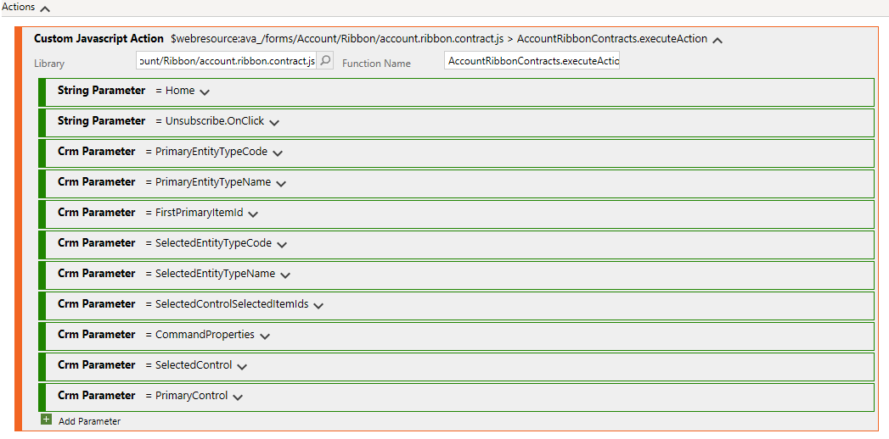

# Register Ribbon Scripts

To register ribbon rules and actions for the BizApps Core Accelerator you have to keep a few things in mind. In the following section all important steps are defined in detail.

To edit the ribbons we recommend to use the [https://www.xrmtoolbox.com/](https://www.xrmtoolbox.com/) together with the [Ribbon Workbench](https://www.develop1.net/public/rwb/ribbonworkbench.aspx) plugin, which you can download inside of the **XrmToolBox**.

## Register Ribbon Actions

To register new Ribbon buttons open up the **XrmToolBox**, connect to your instance and open the **Ribbon Workbench** plugin. It will prompt you for a solution you want to modify, where you can the targeted solution. Once the download of the solution is finished it will give you a visual overview of the current ribbon buttons in your system. You can change the current entity with the dropdown available at the top of the **Solution Elements** tab. 

This documentation won't cover the basics of creating a ribbon button, but focuses on the registration of the JavaScript functions. Please visit the [Ribbon Workbench documentation](https://ribbonworkbench.uservoice.com/knowledgebase/articles/71374-1-getting-started-with-the-ribbon-workbench) for more general information about the ribbon registration. 

As an example I've already created an *Unsubscribe* button in my Ribbon Workbench. Now I want to attach a JavaScript action and enable rule to it. To do so firstly create a **Custom JavaScript Action** and select the appropriate **Library**. When you follow the naming convention of the **BizApps Core Accelerator** the library name should be `[entityname].ribbon.contract.js`. As a function name you have to enter the `executeAction` function of your ribbon controller. Once again if you follow the default naming convention this will be `[EntityName]RibbonContracts.executeAction` (e.g. `AccountRibbonContracts.executeAction` for the `Account` entity).
Now the special part begins: As we have only a single entry point for all ribbon actions per entity we have to differenciate the different actions from each other. This is done by utilizing parameters. The first two parameters are string parameters, which together form a unique name for the action. The following picture shows all parameters you need to register. Make sure to get the order of them right!

Do not modify anything expect the first two string parameters!

## Register Ribbon Rules

Registering a custom JavaScript enable rule is pretty similar to a ribbon action. Simple change the **Function Name** from `[EntityName]RibbonContracts.executeAction` to `[EntityName]RibbonContracts.executeRule`.
