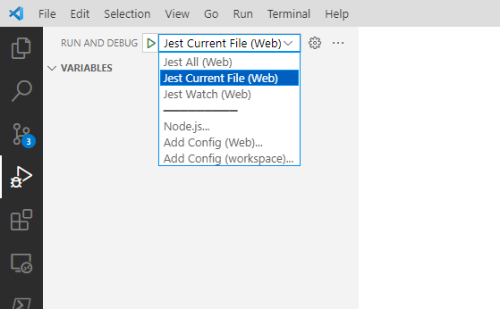

# Debugging Frontend Tests

In the following sections we'll describe how frontend unit tests can be debugged and how to use a watch mode to execute tests while writing unit tests.

## Intro

VS Code has many advantages in regards to frontend development purposes than Visual Studio. One is a native integration into Node.js processes to run and debug unit tests seemlessly inside VS Code. `Jest` as our test runner can be invoked by selecting the desired debugging type and pressing `F5`.

### Debug configurations

{ align=left }

In the `Run and Debug` tab in VS Code you can choose from different debug configurations which should be used when pressing `F5` inside of VS Code.

| Option | Description |
|--------|-------------|
|Jest All|Executes all units tests.|
|Jest Current File|Executes units tests of the current opened file.|
|Jest Watch|Executes all units tests and watches for changes in any test file. All tests within a changed file will be executed in parallel.|

Typically you will select `Jest Current File` while debugging or writing unit tests. `Jest Watch` is a decent option if you want to speed up the process of writing, debugging and executing tests. It provides the same experience as with Visual Studio Live Unit Tests.

### Launch.json

The above list of debug configurations are configured in the `launch.json` file located in the `.vscode` folder.

The below configuration shows the instructions to execute all unit tests when selecting `Jest All`.

```json
  "version": "0.2.0",
  "configurations": [
    {
      "type": "node",
      "request": "launch",
      "name": "Jest All",
      "program": "${workspaceFolder}/node_modules/.bin/jest",
      "args": [
        "--runInBand",
        "--config",
        "scripts/jest/jest.config.js",
        "--rootDir",
        "."
      ],
      "console": "integratedTerminal",
      "internalConsoleOptions": "neverOpen",
      "disableOptimisticBPs": true,
      "windows": {
        "program": "${workspaceFolder}/node_modules/jest/bin/jest",
      }
    },
```
