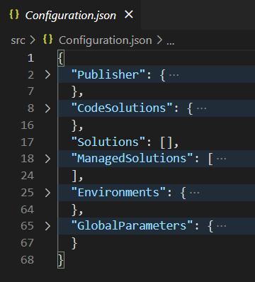

# Configuration.json

The `Configuration.json` file is the main configuration file of the **BizApps Core Accelerator** and is used by the CLI and the CI/CD pipeline. The file is already pre-populated with the values you provided in the **BizApps Platform** to make it easy for you to get started. The `Configuration.json` it typically extended via CLI (for example when a new solution is added).

??? info
    
    Manual extension is not required but can be done in certain advanced scenarios with instructions being available in this documentation.

## Overview

{ align=left }

The `Configuration.json` structure is quite simple and there are only a few top-level properties.

**Publisher**

On the top, you can see the `Publisher`, which got pre-populated from your input in the **BizApps Platform**. The publisher node specifies all the required information about your publisher, like the name and prefix. This is used as the default publisher for new solutions and this should work for projects in general. For assets, a dedicated publisher per solution is recommended as explained in [New Solution](../../How-Tos/new-solution.md).

**Solutions**

The `Solutions` property contains an array of all solutions which make your application and which you want to transport with the CI/CD pipeline. `SolutionName` contains the unique name of the solution to be able to find its unpacked folder location in `src\Dataverse\Solutions`. `Plugins` holds an array of plug-in assemblies related to the solution which are replaced before building and importing a solution. `Webresources` does the same for frontend code by holding an array of bundled `.js` files which are to be replaced during build (note that you need to add the files to [bundle.config.js](../../development/Frontend/Bundling.md) to get them into Customization Master first to be able to add them to the solution and register with forms etc.).

**Managed Solutions**
The `ManagedSolutions` array contains all solutions that you depend on. The CI/CD pipeline will pick those up and makes sure they are installed on all your environments.

**Environments**

Defines the Dataverse environments for your project with their respective connection string. It does not contain any secret values and is instead using placeholders for the username/password or clientId/clientSecret. The values for these placeholders are defined as secret variables in your Azure DevOps secure build variables library called `Dataverse Secrets`.

**Global Parameters and Environment Parameters**

The `GlobalParameters` node can be used to store non-sensitive global configuration values (like the Root Business Unit) and the `Parameters` node under each "Environment" node can be used to define non-sensitive environment-specific parameters such as Feature Toggles or URLs. The values can be used as placeholders with the syntax `"{<ParameterName>}"` in the .csv files or accessed in the pre or post steps for deployment automation (for easy to use examples see the XML).

Secrets must not be maintained inside the repository, for the handling instructions of secrets which might be necessary in the data imports or deployment steps, see [here](../next-steps/secret-handling.md).
