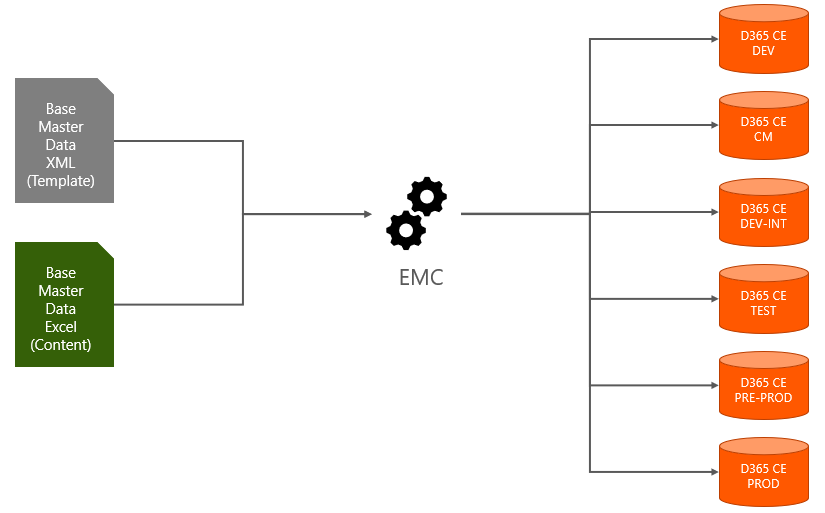
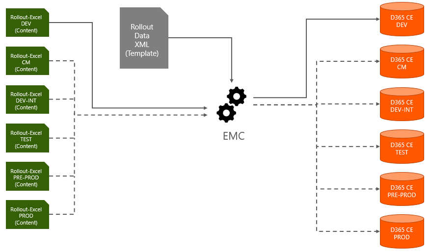
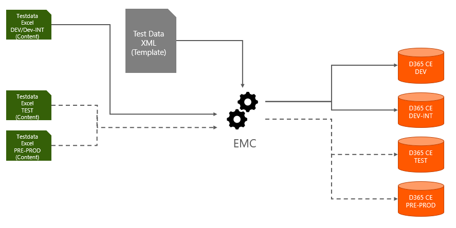

# Master Data Management Concept

For a regular CE project, the following cata configurations are required.
Avanade is using its own tool called [Entity Management Cockpit (EMC)](<https://innersource.visualstudio.com/DSS-Framework/_wiki/wikis/BizApps Core Accelerator%20Wiki/1130/CRM-Entity-Management-Cockpit-(CRMEMC)>) for managing those data sets.

## Base Master Data

The Base Master Data (BMD) contains records, required and equal in each environment.

*Samples:*

* Business Unit Root
* Duplicate Detection Rules/Conditions
* Document Templates
* Bulk Deletion Jobs
* Saved Views (User Owned by Technical User to hide it from regular users)



## Rollout Data

The Rollout Data contains records, required in all environments but which might be different in each environment.
That also means, for each environment, a specific Excel-Sheet exists but all of them are using the same XML-Mapping template.

*Samples:*

* Settings Key (Global Configuration) - E.g. API-URL which is different in Dev/Test/Prod
* Queues (not all Queues from Prod will exist in all environments)



## Test Data Foundation

The Test Data Foundations contains records used by automated or manual test suites.
For the relevant test systems different or the same content can be used.

*Samples:*

* Test Products
* Test Accounts
* Test Users incl. Securityrole assignment



## Automation

All the data should be rolled out automatically via a DevOps Pipeline, using the Avanade Deployment Tool (DPA) via the Command `ImportDataViaCrmEntityManagementCockpit` 

```xml
<?xml version="1.0" encoding="utf-8"?>
<DeploymentConfiguration xmlns="urn:AvacadoAddOn" requiresversion="1.0.0.0">
  <GlobalParameters>
    <Parameter name="DynamicsConnectionString" value="" />
    <Parameter name="DemoName" value="" />
    <Parameter name="OutputFolder" value="undefined" />
  </GlobalParameters>
  <CommandSequence>
    <CommandGroup>
      <Commands>
        <ImportDataViaCrmEntityManagementCockpit>
          <ConnectionString>{DynamicsConnectionString}</ConnectionString>
          <ImportFileLocation>Demos\{DemoName}\Data\Data.xlsx</ImportFileLocation>
          <ConfigurationXmlLocation>Demos\{DemoName}\Configuration\DataSchema.xml</ConfigurationXmlLocation>
          <CacheSize>50</CacheSize>
        </ImportDataViaCrmEntityManagementCockpit>
      </Commands>
    </CommandGroup>
  </CommandSequence>
</DeploymentConfiguration>
```
