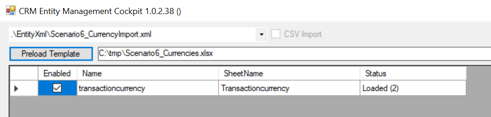
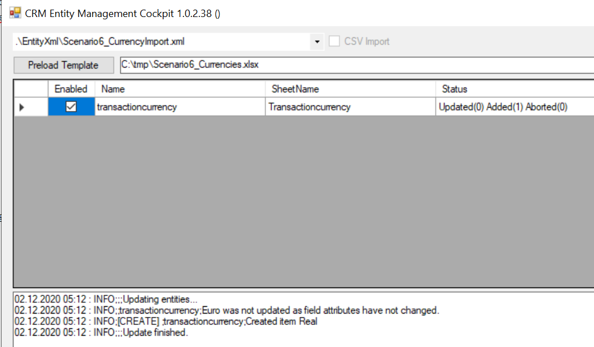
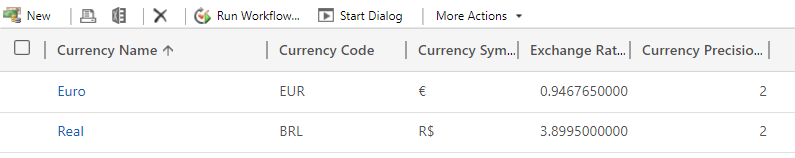
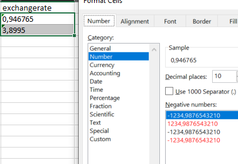

# Import of Currencies

## Initial Setup

* Get latest version of CRMEMC
* Update your connection string to system A in `CRMEMC.App.exe.config`
* Update the XML and Excel-String in `CRMEMC.App.exe.config` as described below
* Create folder `C:\tmp` and copy `/EntityXml/Scenario6_Currencies.xlsx` into `C:\tmp`

Select the import configuration (xml):

```xml
      <setting name="DefaultConfiguration" serializeAs="String">
        <value>Scenario6_CurrencyImport.xml</value>
      </setting>
```

Set your target file (xlsx) path:

```xml
      <setting name="DefaultTemplateLocation" serializeAs="String">
        <value>C:\tmp\Scenario6_Currencies.xlsx</value>
      </setting>
```

## Steps

### Import the records

To import the records you can use the User Interface of CRMEMC.
To select the target environment, configure the system url and credentials in CRMEMC.App.exe.config

Start the UI by doubleclick on CRMEMC.App.exe, and make sure the `Scenario6_CurrencyImport.xml` template is selected and the Excel file `C:\tmp\Scenario6_Currencies.xlsx` is entered accordingly. If everything looks ok, click Preload Template.

The following screen should appear (amount of records depending on your environment - The sample contains Euro and Real).



Click `Update Entities`



## Expected Results

Since the trial Organization used for creating the screenshots had Euro (€) already configured, only Real has been created as additional currency.




## Trouble Shooting

In case your exchange rate is not correct (incorrect decimal), please ensure you did use the correct Format for the Cells. Just `select your Cells --> Rightclick --> Format Cells --> Category = Number`. Decimal places, just configure as needed.


