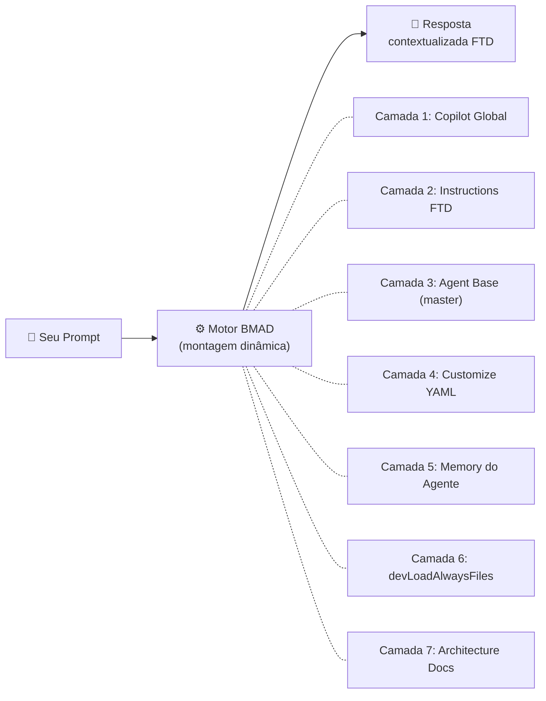
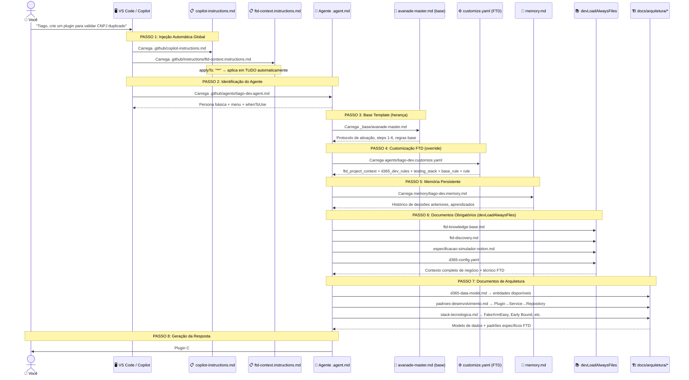
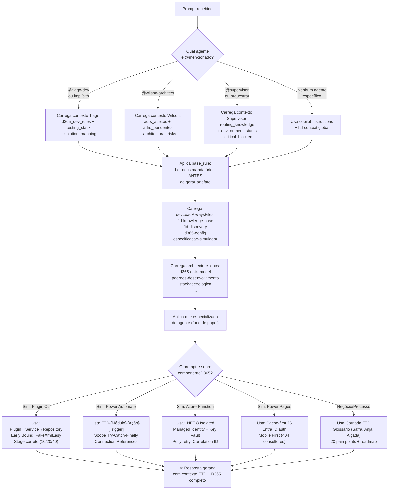
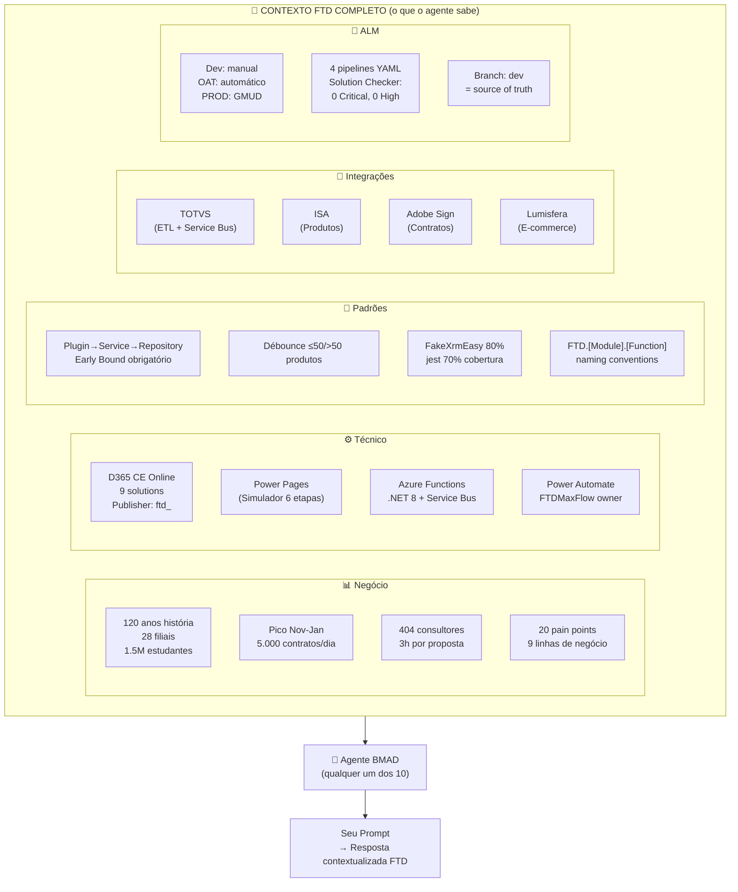

# Como Funciona o Motor BMAD
## Fluxo Completo de Prompt → Resposta no Projeto FTD Educação

**Finalidade**: Entender como sua customização e contextualização FTD é carregada e utilizada  
**Data**: 20/03/2026 | **Versão**: 1.0

---

## 1. VISÃO GERAL — O QUE É O BMAD ENGINE

O **BMAD (Breakthrough Method for Agile Delivery)** é um framework de agentes de IA onde cada "persona" (Tiago, Wilson, Maria...) é montada dinamicamente no momento em que você faz uma solicitação. **Não existe um agente carregado permanentemente** — ele é construído em tempo real, camada por camada, toda vez que você interage.



---

## 2. FLUXO PASSO A PASSO — DO PROMPT À RESPOSTA



---

## 3. MAPA DE ARQUIVOS — O QUE É CARREGADO E QUANDO

```mermaid
graph TD
    subgraph GLOBAL["🌐 CAMADA 1 — Global (sempre, automático)"]
        COP[".github/copilot-instructions.md\n✅ Lido em TODA interação Copilot"]
        FTD[".github/instructions/ftd-context.instructions.md\napplyTo: ** → aplica em qualquer arquivo aberto"]
    end

    subgraph AGENT["🤖 CAMADA 2 — Agente (ao ativar @agente)"]
        AGT[".github/agents/tiago-dev.agent.md\nIdentidade, menu, whenToUse"]
        BASE[".avanade-method/_base/avanade-master.md\nProtocolo base, steps de ativação, regras gerais"]
    end

    subgraph CUSTOM["⚙️ CAMADA 3 — Customização FTD (merge com base)"]
        CUS[".avanade-method/agents/tiago-dev.customize.yaml\n• ftd_project_context ✅ NOVO\n• d365_dev_rules ✅ NOVO\n• testing_stack ✅ NOVO\n• architecture_docs ✅ NOVO\n• base_rule original ✅ RESTAURADO\n• rule especializada ✅ NOVO"]
    end

    subgraph MEMORY["🧠 CAMADA 4 — Memória (persistente entre sessões)"]
        MEM[".avanade-method/memory/tiago-dev.memory.md\nDecisões passadas, aprendizados, contexto acumulado"]
    end

    subgraph DOCS["📚 CAMADA 5 — Conhecimento FTD (devLoadAlwaysFiles)"]
        KB["docs/ftd-knowledge-base.md\n379 linhas: glossário, stakeholders, dores, KPIs"]
        DIS["docs/discovery/ftd-discovery.md\n347 linhas: 20 pain points, fit-gap, roadmap"]
        SIM["docs/especificacao-simulador-notion.md\nSimulador Comercial: 6 etapas, regras de cálculo"]
        D365[".avanade-method/configs/d365-config.yaml\n357 linhas: entidades, soluções, decision framework"]
    end

    subgraph ARCH["🏗️ CAMADA 6 — Arquitetura (docs/arquitetura/)"]
        SA["d365-solution-architecture.md\nC4 diagrams, ambientes, pipeline ALM, segurança"]
        DM["d365-data-model.md\nEntidades, campos, ERD, gaps"]
        IL["d365-integration-landscape.md\nTOTVS, ISA, Adobe, Lumisfera, fluxos"]
        PD["padroes-desenvolvimento.md\nPlugin→Service→Repository, PCF, PA, Azure Functions"]
        ST["stack-tecnologica.md\nStack completa, ferramentas, testing, decision matrix"]
    end

    GLOBAL --> AGENT
    AGENT --> CUSTOM
    CUSTOM --> MEMORY
    MEMORY --> DOCS
    DOCS --> ARCH
    ARCH --> RESP["💬 Resposta com contexto\nFTD + D365 + Azure completo"]
```



---

## 4. O QUE CADA ARQUIVO FAZ NO SEU PROMPT

### Quando você escreve: *"Crie um plugin para validar CNPJ duplicado"*

| Arquivo carregado | O que ele contribui para a resposta |
|-------------------|-------------------------------------|
| `copilot-instructions.md` | Identifica que estamos no projeto FTD, ativa modo Avanade Method |
| `ftd-context.instructions.md` | Lembra que é brownfield D365, que existe FTDMaxFlow, que há 9 solutions |
| `tiago-dev.agent.md` | Ativa a persona Tiago: Dev Full Stack, protocolo dev-story |
| `avanade-master.md` | Impõe o protocolo: ler story → implementar → testar → marcar [x] |
| `tiago-dev.customize.yaml` | Injeta: `depth_check`, `no_magic_strings`, `early_bound: OBRIGATÓRIO`, `testing_stack.plugins: FakeXrmEasy` |
| `tiago-dev.memory.md` | Lembra decisões anteriores (ex: qual namespacing já foi usado) |
| `ftd-knowledge-base.md` | Sabe que CNPJ duplicado é pain point #3, que existem 101K contas |
| `ftd-discovery.md` | Entende o contexto: Pre-Validation Stage 10 já é padrão no projeto |
| `d365-config.yaml` | Confirma: publisher = `ftd_`, solution = `FTDCore`, filtro = `ftd_cnpj` |
| `d365-data-model.md` | Usa a entidade `Account` com campo `ftd_cnpj` que já está documentado |
| `padroes-desenvolvimento.md` | Gera: `Plugin<T> → Service → Repository`, `[CrmPluginRegistration]`, `FakeXrmEasy` tests |

**Resultado**: Um plugin gerado com o namespace correto `FTD.Plugins.Account.PreValidate`, Early Bound, depth check, ColumnSet específico para `ftd_cnpj`, `InvalidPluginExecutionException` com mensagem em PT-BR, e testes FakeXrmEasy com cobertura ≥ 80%.

---

## 5. FLUXO DE DECISÃO DO AGENTE (Motor Interno)



---

## 6. HIERARQUIA DE CONTEXTO — QUEM "GANHA" EM CONFLITO

Quando há informações conflitantes entre arquivos, esta é a ordem de **prioridade** (maior = mais autoritativo):

```
┌─────────────────────────────────────────────────────────────────┐
│  PRIORIDADE 1 (MAIS ALTO) — customize.yaml                      │
│  ftd_project_context específico do agente                       │
│  "Plugin < 2 segundos" → governa decisão de performance         │
├─────────────────────────────────────────────────────────────────┤
│  PRIORIDADE 2 — d365-config.yaml (devLoadAlwaysFiles)           │
│  Decision framework: 11 cenários documentados                   │
│  "≤50 produtos → Plugin | >50 → Azure Function"                 │
├─────────────────────────────────────────────────────────────────┤
│  PRIORIDADE 3 — avanade-master.md (base template)               │
│  Protocolo geral Avanade Method                                 │
│  Steps de ativação: 1-6                                         │
├─────────────────────────────────────────────────────────────────┤
│  PRIORIDADE 4 — ftd-context.instructions.md (global)            │
│  Contexto geral do projeto FTD                                  │
│  Brownfield, ambientes, stakeholders                            │
├─────────────────────────────────────────────────────────────────┤
│  PRIORIDADE 5 (MAIS BAIXO) — copilot-instructions.md            │
│  Regras globais do Copilot                                      │
│  Idioma, formatação, comportamento geral                        │
└─────────────────────────────────────────────────────────────────┘
```

---

## 7. VALIDAÇÃO — COMO SABER SE SUA CUSTOMIZAÇÃO ESTÁ FUNCIONANDO

### ✅ Sinais de que está funcionando corretamente

| Sinal | O que significa |
|-------|-----------------|
| Agente usa `ftd_` nos nomes de campos | Leu `d365-config.yaml` (publisher = ftd) |
| Agente menciona `FakeXrmEasy` nos testes | Leu `tiago-dev.customize.yaml` (testing_stack) |
| Agente fala em "Safra" e "Anja" corretamente | Leu `ftd-knowledge-base.md` |
| Agente avisa sobre Dataverse storage | Leu `critical_blockers` do Supervisor |
| Agente propõe `Plugin<T> → Service → Repository` | Leu `padroes-desenvolvimento.md` |
| Agente diferencia `≤50 / >50 produtos` | Leu o `debounce_rule` do Tiago |
| Agente menciona os ADRs ao tomar decisão | Leu `wilson-architect.customize.yaml` (adrs_aceitos) |
| Agente fala em "Mobile First" para UX | Leu `sofia-ux.customize.yaml` (specialist_focus) |
| Agente menciona GMUD para PROD | Leu `roberto-sm.customize.yaml` (specialist_focus) |
| Agente referencia `FTD - [X] - [Y] - [Trigger]` em flows | Leu o `namespace_pa` do Tiago |

### ❌ Sinais de problema (contexto não carregado)

| Sinal | Diagnóstico |
|-------|-------------|
| Agente usa nomes de entidade genéricos (Account sem `ftd_`) | `d365-config.yaml` não foi lido |
| Agente gera plugin sem `depth check` | `customize.yaml` não foi aplicado |
| Agente não sabe o que é "Safra" | `ftd-knowledge-base.md` não carregado |
| Agente sugere Canvas App para o Simulador | ADRs não lidos (ADR-001 diz Power Pages) |
| Agente cria secrets no `appsettings.json` | `d365_dev_rules.secrets` não aplicado |
| Agente ignora o pico sazonal Nov-Jan | `ftd-discovery.md` não carregado |

---

## 8. TESTANDO SUA CONTEXTUALIZAÇÃO — PROMPTS DE DIAGNÓSTICO

Use estes prompts para verificar se o contexto FTD está sendo aplicado corretamente:

### Teste 1: Contexto de Negócio
```
@tiago-dev O que é "Safra" no contexto FTD e como ela aparece nas entidades D365?
```
**Resposta esperada**: Citar `ftd_safra` como campo em `ftd_proposta` e `Opportunity`, explicar que é o ano letivo/comercial (ex: Safra 26 = 2026), mencionar que é usado para filtrar vigor de produtos.

---

### Teste 2: Decision Framework D365
```
@tiago-dev Preciso calcular o total de uma proposta com 200 produtos. Qual tecnologia usar e por quê?
```
**Resposta esperada**: Citar a regra de débounce (200 > 50 → Azure Function), mencionar timeout de 2min do plugin, sugerir Service Bus para processamento assíncrono.

---

### Teste 3: Padrão de Código
```
@tiago-dev Mostre a estrutura básica de um plugin D365 para criar uma proposta.
```
**Resposta esperada**: `Plugin<T> → Service → Repository`, `[CrmPluginRegistration]` com Stage correto, `ITracingService`, `if (context.Depth > 1) return;`, Early Bound, `ColumnSet` específico.

---

### Teste 4: Decisão Arquitetural
```
@wilson-architect Devo usar Canvas App ou Power Pages para o Simulador Comercial?
```
**Resposta esperada**: Citar ADR-001 (já aceito: Power Pages), não reabrir a decisão, mencionar que licença Enterprise cobre uso interno, citar Entra ID (ADR-002).

---

### Teste 5: Contexto Completo de Orquestração
```
@supervisor Quero criar uma nova feature de geração de contratos. Por onde começo?
```
**Resposta esperada**: Rotear para Maria (discovery), depois João PM (PRD), Wilson (ADR se necessário), Paula (stories), Tiago (implementação). Mencionar que contratos têm 50+ templates Word como pain point existente.

---

## 9. RESUMO VISUAL — CAMADAS DE CONTEXTO FTD



---

## 10. CONCLUSÃO — SUA CUSTOMIZAÇÃO ESTÁ FUNCIONANDO?

### ✅ O que foi implementado e garante o contexto:

| Camada | Arquivo | Conteúdo FTD | Status |
|--------|---------|--------------|--------|
| Global | `copilot-instructions.md` | Avanade Method + FTD | ✅ |
| Global | `ftd-context.instructions.md` | Contexto FTD completo | ✅ |
| Agente | `*.agent.md` (10 agentes) | Personas + menus | ✅ |
| Base | `avanade-master.md` | Protocolo de ativação | ✅ |
| Customize | `*.customize.yaml` (10 agentes) | `ftd_project_context` enriquecido | ✅ **Atualizado** |
| Memória | `*.memory.md` (10 agentes) | Histórico por agente | ✅ |
| Conhecimento | `ftd-knowledge-base.md` | 379 linhas de contexto FTD | ✅ |
| Discovery | `ftd-discovery.md` | 20 pain points, fit-gap | ✅ |
| Config | `d365-config.yaml` | 357 linhas D365 técnico | ✅ |
| Arquitetura | `docs/arquitetura/*.md` (5 docs) | Modelo de dados, integrações, padrões | ✅ **Novo** |

> [!IMPORTANT]
> Todos os 10 agentes têm `base_rule` (original) + `rule` (especializada) + `architecture_docs` + `specialist_focus` personalizados para seu papel. Isso garante que tanto a regra fundamental quanto o contexto especializado sejam aplicados em qualquer interação.

> [!TIP]
> Use os **Prompts de Diagnóstico** da seção 8 para validar se o contexto está sendo aplicado corretamente em uma nova sessão. Se o agente responde com os termos FTD corretos (Safra, Anja, débounce, FakeXrmEasy), o contexto está funcionando.

> [!WARNING]
> O contexto é **carregado em tempo real** — se o arquivo estiver quebrado (YAML inválido) ou o caminho errado, o agente pode não ter aquela camada. Execute sempre uma verificação de sintaxe YAML nos `customize.yaml` após edições.

---

*Documento criado em 20/03/2026 como referência de arquitetura do framework BMAD para o projeto FTD Educação.*
