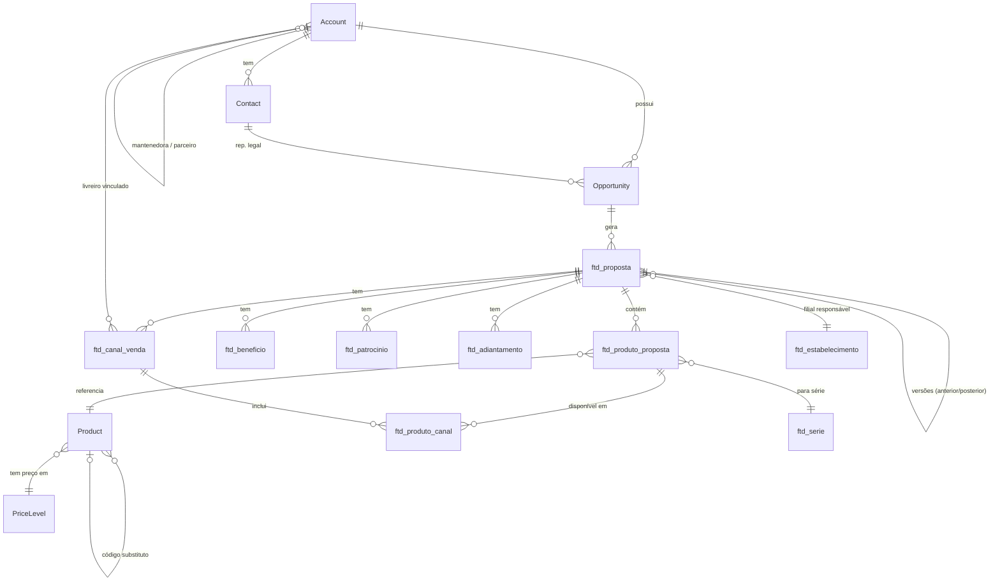

# Data Model — FTD Educação
## Dynamics 365 CE / Microsoft Dataverse

**Cliente**: FTD Educação S/A (Grupo Marista)  
**Versão**: 1.0 | **Data**: 20/03/2026  
**Status**: EM REVISÃO — modelo-alvo (inclui entidades a criar)

---

## 1. VISÃO GERAL DO MODELO DE DADOS

O Dataverse da FTD combina **entidades padrão D365 customizadas** com **entidades customizadas `ftd_*`**. O modelo suporta o processo comercial completo:

**Jornada**: `Account → Contact → Opportunity → Quote (Proposta) → Order → Invoice`

Entidades customizadas complementam o modelo padrão para os processos específicos da FTD (simulador, benefícios, integrações ERP).

---

## 2. ENTIDADES PADRÃO D365 (Em Uso)

### 2.1 Account (Conta)
**Propósito**: Escola, mantenedora, livreiro ou governo  
**Volume**: ~101.000 registros (higienização necessária)

| Campo | Tipo | Observações FTD |
|-------|------|-----------------|
| `name` | Text | Nome da Receita Federal (obrigatório) |
| `accountnumber` | Text | Código ERP (TOTVS/Datasul, sync 1x/dia às 6h) |
| `address1_*` | Address | Auto-preenchido via CEP |
| `ftd_cnpj` | Text | CNPJ com validação de duplicidade (**BLOQUEIO** se duplicado) |
| `ftd_codigo_mec` | Text | Código MEC — duplicidade gera **ALERTA** (não bloqueia) |
| `ftd_tipo_instituicao` | OptionSet | ⚠️ EM REVISÃO: mistura 3 conceitos (tipo org, rede/marca, classificação comercial) |
| `ftd_segmento` | OptionSet | **Hierarquia L1**: Privado / Público |
| `ftd_tipo_organizacional` | OptionSet | **Hierarquia L2**: Confessional, Laica, Rede, Parceiro, KA |
| `ftd_classificacao_comercial` | OptionSet | **Hierarquia L3**: KA, Regional, Especial, Regular |
| `ftd_mantenedora_id` | Lookup → Account | ⚠️ EM REVISÃO: campo reaproveitado com 3 usos simultâneos |
| `ftd_parceiro_comercial_id` | Lookup → Account | **A CRIAR**: livreiro vinculado à escola |
| `ftd_num_alunos` | Integer | Qtd de alunos (impacta cálculos de proposta. Default=1) |
| `ftd_estabelecimento_id` | Lookup → ftd_estabelecimento | Filial FTD responsável (28 filiais) |
| `ownerid` | Lookup → User | Consultor (carteirização manual) |
| Business Unit | BU | Filial FTD (controla visibilidade por security role) |

**Validações ativas (Plugins)**:
- `ftd_cnpj` único: Pre-Validation Stage 10 → `InvalidPluginExecutionException` se duplicado
- Código MEC: Pre-Validation → `SetFieldNotification` se duplicado (aviso, não bloqueio)

---

### 2.2 Contact (Contato)
**Propósito**: Representante Legal da escola (assina contratos)

| Campo | Tipo | Observações FTD |
|-------|------|-----------------|
| `parentcustomerid` | Lookup → Account | Escola vinculada |
| `ftd_cpf` | Text | **Obrigatório** quando é Representante Legal |
| `ftd_is_representante_legal` | Boolean | Flag identificador |
| `emailaddress1` | Email | Para Adobe Sign |

---

### 2.3 Opportunity (Oportunidade)
**Propósito**: Pipeline de vendas, vínculo entre conta e proposta  
⚠️ **Pendência**: 101.000+ oportunidades de 2024/anteriores **desvinculadas** de propostas — algoritmo de criação massiva necessário

| Campo | Tipo | Observações FTD |
|-------|------|-----------------|
| `parentaccountid` | Lookup → Account | Escola |
| `parentcontactid` | Lookup → Contact | Rep. Legal |
| `ftd_modelo_venda` | OptionSet | Canal principal (FTD com Você, Venda Direta, Balcão, Smart POS) |
| `ftd_safra` | Integer | Ano letivo/comercial (ex: 2026) |
| `ftd_tipo_contrato` | OptionSet | **A CRIAR**: Contrato Novo / Aditivo |
| `ftd_classificacao_negociacao` | OptionSet | **A CRIAR**: Mercado Privado (escola) / Revendedor/Livreiro / Família (B2C) |
| `ftd_entrega_primaria` | OptionSet | Tipo de entrega |
| `ftd_taxa_admin` | Decimal | Taxa de administração (afeta alçada) |
| `ftd_vigencia_inicio` | Date | Início da vigência |
| `ftd_vigencia_fim` | Date | Fim da vigência |

⚠️ **Campos a remover** (duplicados com Proposta): levantamento em progresso por Oscar — "campos vermelhos" na oportunidade.

---

### 2.4 Quote → ftd_proposta (Proposta Comercial)
**Propósito**: Proposta comercial completa — entidade central do Simulador  
⚠️ **Nota**: Entidade customizada `ftd_proposta` sobrepõe/substitui a entidade padrão `Quote` do D365 para os cenários FTD.

| Campo | Tipo | Observações FTD |
|-------|------|-----------------|
| `ftd_oportunidade_id` | Lookup → Opportunity | Vínculo oportunidade |
| `ftd_proposta_anterior_id` | Lookup → ftd_proposta | Proposta predecessor (versionamento) |
| `ftd_proposta_posterior_id` | Lookup → ftd_proposta | Proposta sucessora |
| `ftd_revisao` | Integer | Número da revisão (0 = inicial, até 27-28) |
| `ftd_status_proposta` | OptionSet | **A CRIAR**: Aberto / Ativo / Histórico |
| `ftd_estagio_proposta` | OptionSet | **A CRIAR**: Rascunho → Em Negociação → Em Aprovação → Aprovada s/ assinatura → Aprovada e assinada |
| `ftd_safra` | Integer | Ano-safra |
| `ftd_tipo` | OptionSet | **A CRIAR**: Contrato Novo / Aditivo |
| `ftd_alunado_total` | Integer | Total de alunos (impacta cálculos) |
| `ftd_taxa_admin` | Decimal | Taxa de administração |
| `ftd_valor_total` | Currency | Valor total da proposta |
| `ftd_valor_receita_liquida` | Currency | Após descontos, benefícios, royalties |
| `ftd_nivel_alcada` | Integer | Nível de aprovação calculado (1-7) |
| `ftd_justificativa_consultor` | Multiline Text | Justificativa para aprovadores |
| `ftd_timestamp_estagio_*` | DateTime | Timestamps de cada mudança de estágio |
| `ftd_tempo_manuseio` | Integer | Tempo acumulado de manuseio em minutos |
| `ftd_contrato_adobe_id` | Text | ID do agreement no Adobe Sign |

**Versionamento**:
- Apenas 1 proposta por Oportunidade pode ter Status = `Ativo`
- `Status = Histórico` quando nova revisão supera a anterior
- Link bidirecional: `ftd_proposta_anterior_id ↔ ftd_proposta_posterior_id`

---

## 3. ENTIDADES CUSTOMIZADAS FTD

### 3.1 ftd_produto_proposta (Produto da Proposta)
**Propósito**: Linha de produto dentro da proposta (junction entre proposta e produto)  
**Relação**: N:1 → ftd_proposta | N:1 → Product

| Campo | Tipo | Observações |
|-------|------|-------------|
| `ftd_proposta_id` | Lookup → ftd_proposta | Proposta pai |
| `ftd_produto_id` | Lookup → Product | Produto do catálogo |
| `ftd_linha_negocio` | OptionSet | Sistema de Ensino, Didático, Bilíngue, Espanhol, Literatura, APE |
| `ftd_quantidade_alunos` | Integer | Alunos para este produto |
| `ftd_preco_tabela` | Currency | Preço de tabela (da lista de preço) |
| `ftd_desconto_pct` | Decimal | % de desconto aplicado |
| `ftd_majoracao_pct` | Decimal | % de majoração (markup escola) |
| `ftd_preco_escola` | Currency | Preço negociado com escola |
| `ftd_preco_familia` | Currency | Preço para famílias (com majoração) |
| `ftd_royalty_pct` | Decimal | % de royalty (diferença preço negoc. vs família) |
| `ftd_tipo_produto` | OptionSet | Prateleira / Customizado Compartilhado / Customizado / Personalizado / Grade |
| `ftd_serie` | Lookup → ftd_serie | Série/segmento do aluno |
| `ftd_canal_ids` | Multiselect | Canais onde este produto está disponível |

---

### 3.2 ftd_beneficio (Benefício da Proposta)
**Propósito**: Cupons para filhos de professores (20-40% desconto)

| Campo | Tipo | Observações |
|-------|------|-------------|
| `ftd_proposta_id` | Lookup → ftd_proposta | Proposta pai |
| `ftd_serie_id` | Lookup → ftd_serie | Série vinculada |
| `ftd_desconto_pct` | Decimal | 20% ou 40% (filhos de professores) |
| `ftd_quantidade_beneficiarios` | Integer | Número de beneficiários |
| `ftd_impacto_receita` | Currency | Impacto calculado na receita |

---

### 3.3 ftd_patrocinio (Patrocínio)
**Propósito**: Investimento em infraestrutura da escola (laptops, fachada, jardim)

| Campo | Tipo | Observações |
|-------|------|-------------|
| `ftd_proposta_id` | Lookup → ftd_proposta | Proposta pai |
| `ftd_tipo_patrocinio` | OptionSet | Tecnologia, Infraestrutura, Marketing, etc. |
| `ftd_valor` | Currency | Valor do investimento |
| `ftd_descricao` | Text | Descrição do patrocínio |

---

### 3.4 ftd_adiantamento (Adiantamento de Royalty)
**Propósito**: Antecipação de royalty (melhoria de fluxo de caixa da escola)

| Campo | Tipo | Observações |
|-------|------|-------------|
| `ftd_proposta_id` | Lookup → ftd_proposta | Proposta pai |
| `ftd_percentual` | Decimal | % sobre royalties estimados |
| `ftd_valor_estimado` | Currency | Valor estimado do adiantamento |
| `ftd_data_pagamento` | Date | Previsão: maio ou agosto |

---

### 3.5 ftd_canal_venda (Canal de Venda da Proposta)
**Propósito**: Configuração de modelos de venda para a proposta (1 proposta → N canais)

| Campo | Tipo | Observações |
|-------|------|-------------|
| `ftd_proposta_id` | Lookup → ftd_proposta | Proposta pai |
| `ftd_tipo_canal` | OptionSet | FTD com Você (Lumisfera), Venda Direta, Balcão Escola, Smart POS, B2B Livreiro |
| `ftd_livreiro_id` | Lookup → Account | Livreiro vinculado (quando aplicável) |
| `ftd_config_logistica` | OptionSet | Parâmetros de entrega/logística |
| `ftd_ativo` | Boolean | Canal habilitado na proposta |

---

### 3.6 ftd_produto_canal (Sublista: Produto × Canal)
**Propósito**: Quais produtos estão disponíveis em qual canal de venda

| Campo | Tipo | Observações |
|-------|------|-------------|
| `ftd_produto_proposta_id` | Lookup → ftd_produto_proposta | Produto da proposta |
| `ftd_canal_venda_id` | Lookup → ftd_canal_venda | Canal |
| `ftd_disponivel` | Boolean | Disponível neste canal |

---

### 3.7 ftd_estabelecimento (Filial FTD)
**Propósito**: 28 filiais de distribuição — controle regional de preços e aprovações

| Campo | Tipo | Observações |
|-------|------|-------------|
| `ftd_nome` | Text | Nome da filial |
| `ftd_uf` | OptionSet | Estado |
| `ftd_tabela_preco_id` | Lookup → PriceLevel | Tabela de preço regional |
| `ftd_gerente_id` | Lookup → User | Gerente responsável |

---

### 3.8 ftd_serie (Série / Segmento Escolar)
**Propósito**: EF1, EF2, EM, Infantil, etc. — determina quais produtos são aplicáveis

| Campo | Tipo | Observações |
|-------|------|-------------|
| `ftd_codigo` | Text | Código padronizado (a normalizar) |
| `ftd_nome` | Text | Nome exibido (maiúsculas vs minúsculas: problema atual) |
| `ftd_nivel` | OptionSet | Infantil, Fundamental I, Fundamental II, Médio |
| `ftd_linha_negocio` | OptionSet | Linha de negócio principal |

---

### 3.9 ftd_log_integracao (Log de Integração)
**Propósito**: Tabela genérica reutilizável para registro de execuções de integrações

| Campo | Tipo | Observações |
|-------|------|-------------|
| `ftd_sistema_origem` | Text | TOTVS, ISA, Adobe, Lumisfera |
| `ftd_sistema_destino` | Text | CRM, TOTVS, etc. |
| `ftd_operacao` | Text | CreateAccount, SyncProduct, etc. |
| `ftd_status` | OptionSet | Sucesso, Falha, Em Andamento |
| `ftd_payload_entrada` | Multiline Text | Dados recebidos (log) |
| `ftd_payload_saida` | Multiline Text | Dados enviados (log) |
| `ftd_mensagem_erro` | Multiline Text | Detalhes do erro (quando falha) |
| `ftd_duracao_ms` | Integer | Duração em milissegundos |
| `ftd_correlation_id` | Text | ID de correlação (rastreabilidade) |

---

## 4. PRODUTOS E CATÁLOGO

### Product (Produto) — Entidade Padrão D365 Customizada

**Situação atual**: 1.283 registros quando deveria retornar ~15 por linha de negócio (sem metadados de filtro)

| Campo | Tipo | Status | Observações |
|-------|------|--------|-------------|
| `name` | Text | Existente | Nome do produto |
| `productnumber` | Text | Existente | SKU/código |
| `ftd_linha_negocio` | OptionSet | Existente | ⚠️ Desalinhada com ISA/TOTVS |
| `ftd_is_prateleira` | Boolean | **A CRIAR** | Flag: prateleira vs customizado |
| `ftd_tipo_produto` | OptionSet | **A CRIAR** | Prateleira / Customizado Compartilhado / Customizado / Personalizado / Grade |
| `ftd_serie_ids` | Multiselect | **A CRIAR** | Séries compatíveis |
| `ftd_safra` | Integer | **A CRIAR** | Ano de vigência |
| `ftd_componente` | OptionSet | **A CRIAR** | Livro Aluno, Livro Professor, Digital, Kit |
| `ftd_produto_base_id` | Lookup → Product | **A CRIAR** | Produto base (para variações) |
| `ftd_codigo_substituto_id` | Lookup → Product | Existente | Link produto antigo → novo (entre safras) |
| `ftd_isa_familia_id` | Text | **A CRIAR** | ID família ISA (sincronização) |
| `ftd_ativo_safra` | Boolean | **A CRIAR** | Disponível na safra atual |

### PriceLevel (Lista de Preço) — Situação Atual

**Situação atual**: 12+ listas de preço (workaround de visibilidade, preço é único na prática)  
**Modelo-alvo**: máximo 5 listas

| Lista | Segmento | Status |
|-------|----------|--------|
| Escola Privada | B2B Escola particular | A consolidar |
| Escola Pública / PNLD | B2B Governo | A consolidar |
| Livreiro Privado | B2B Livreiro | A consolidar |
| E-commerce Aberto | B2C (Lumisfera Aberto) | A consolidar |
| Customizados | Produtos não-prateleira | A consolidar |
| ...7+ outras | Workarounds regionais | A ELIMINAR |

⚠️ **Bloqueado por**: resultado da consultoria de pricing (esperado final mar/2026)

---

## 5. DIAGRAMA DE RELACIONAMENTOS (ERD)

---

## 6. GAPS DE MODELO DE DADOS

### 🔴 Críticos (Bloqueiam MVP ou Onda 1)

| Gap | Impacto | Ação |
|-----|---------|------|
| Produtos sem metadados (flag prateleira, série, componente, safra) | Adição em lote impossível | Criar campos + script de migração |
| Status/Estágio da proposta não existe (3 campos confusos hoje) | UX do Simulador comprometida | Criar `ftd_status_proposta` + `ftd_estagio_proposta` |
| Oportunidades desvinculadas de propostas (2024-) | BIs incorretos, sem funil | Algoritmo criação massiva |
| campo `tipo_de_instituicao` mistura 3 conceitos | Segmentação impossível | Criar hierarquia 3 campos |

### 🟠 Importantes (Bloqueiam Onda 1)

| Gap | Impacto | Ação |
|-----|---------|------|
| 12+ tabelas de preço (workaround) | Manutenção insustentável | Aguardar consultoria pricing → consolidar para ≤5 |
| Livreiros não cadastrados no CRM | Pede Livreiro não pode ser eliminado | Criar estrutura de Account para livreiros |
| Campo `mantenedora` com 3 usos | Dados inconsistentes | Criar campo separado para parceiro comercial |
| Variações de produto não modeladas | Produto grade/customizado inadequado | Criar entidade ftd_variacao_produto ou campo base |

---

## 7. PRÁTICAS DE NOMENCLATURA

| Tipo | Padrão | Exemplo |
|------|--------|---------|
| Entidade customizada | `ftd_nomedaentidade` | `ftd_proposta` |
| Campo customizado | `ftd_nomedocampo` | `ftd_cnpj` |
| Namespace Plugin | `FTD.Plugins.{Entity}.{Action}` | `FTD.Plugins.Account.PreCreate` |
| Option Set global | `ftd_nomedooption` | `ftd_tipo_produto` |

---

*Gerado com base em: knowledge-base FTD, discovery (Mar/2026), especificação Simulador Notion, transcrições onboarding, d365-config.yaml v4.29.0*
