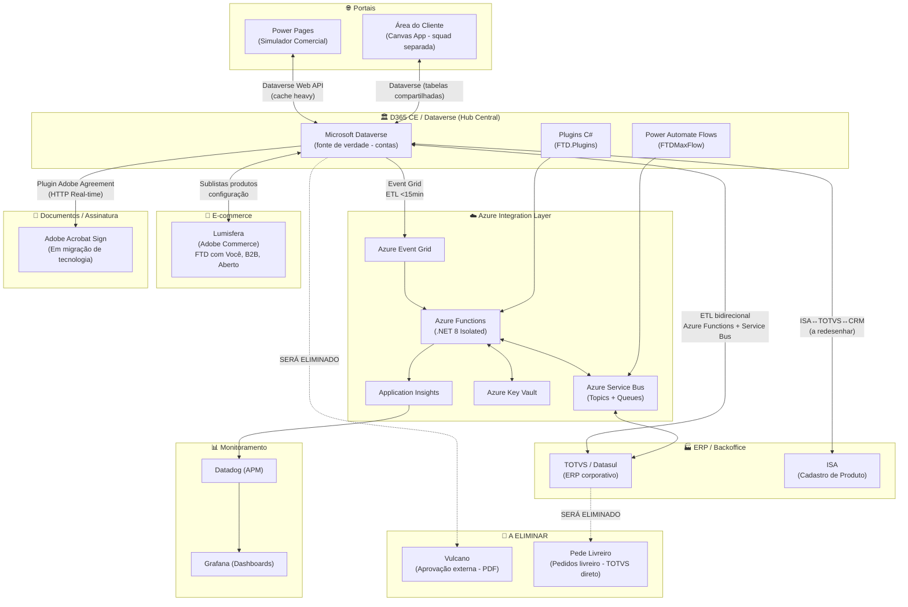
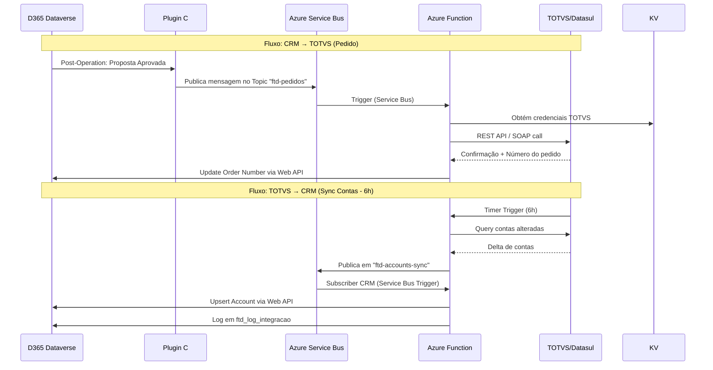
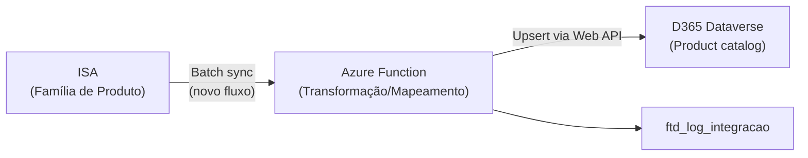
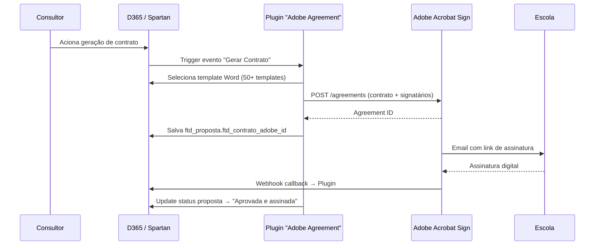
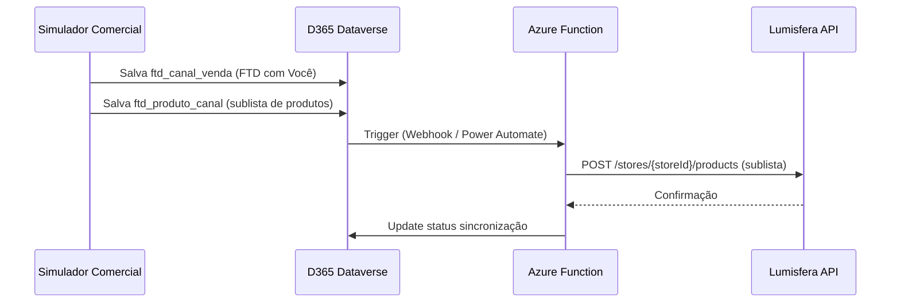
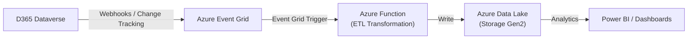

# Integration Landscape — FTD Educação
## Mapa de Integrações: D365 CE + Power Platform + Azure

**Cliente**: FTD Educação S/A (Grupo Marista)  
**Versão**: 1.0 | **Data**: 20/03/2026

---

## 1. VISÃO GERAL DO ECOSSISTEMA DE INTEGRAÇÕES



---

## 2. INTEGRAÇÕES DETALHADAS

### 2.1 TOTVS / Datasul (ERP)
**Status**: ✅ Ativo  
**Tipo**: ETL bidirecional  
**Padrão**: Azure Functions (orquestração) + Azure Service Bus (mensageria async)

#### Dados sincronizados

| Dado | Direção | Frequência | Observações |
|------|---------|------------|-------------|
| Contas (CNPJ, Razão Social) | TOTVS → CRM | 1x/dia às 6h | Código ERP = chave de vínculo |
| Código ERP da conta | TOTVS → CRM | 1x/dia às 6h | `accountnumber` no Dataverse |
| Pedidos | CRM → TOTVS | Near real-time (<5min Service Bus) | Pós-aprovação/assinatura |
| Faturamento | TOTVS → CRM | Near real-time (<5min Service Bus) | Histórico de compras |
| Estoque | TOTVS → CRM | Near real-time ou batch | Disponibilidade de produtos |
| Financeiro | TOTVS → CRM | Batch | Royalties, adiantamentos pagos |

#### Problemas conhecidos

| Problema | Impacto | Status |
|---------|---------|--------|
| Cadastro duplo obrigatório (criar em CRM + TOTVS) | Retrabalho, inconsistência | 🔴 Em andamento |
| Sem owner da informação definido | Race condition de dados | 🟠 Sendo endereçado (CRM = fonte de verdade) |
| CNPJ desalinhado entre sistemas | Match incorreto de contas | 🟠 Higienização necessária |

#### Arquitetura técnica



#### SLAs

| Operação | SLA | Tecnologia |
|---------|-----|-----------|
| Sync contas | 1x/dia às 6h | Timer Trigger Azure Function |
| Pedidos | < 5 minutos | Service Bus Topic → Azure Function |
| Faturamento | < 5 minutos | Service Bus Topic → Azure Function |

---

### 2.2 ISA (Sistema de Cadastro de Produto)
**Status**: ✅ Ativo (a redesenhar)  
**Tipo**: ISA → TOTVS → CRM  
**Padrão**: Batch (frequência a definir)

#### Situação atual
- ISA é o sistema mestre de catálogo de produtos
- Fluxo atual: ISA exporta para TOTVS → TOTVS sincroniza com CRM
- **Problema**: 3 taxonomias incompatíveis

| Conceito | ISA | TOTVS | CRM |
|----------|-----|-------|-----|
| Agrupamento de produto | Família de Produto | Família Comercial | Linha de Negócio |
| Nível de detalhe | Alto (1.283+ SKUs) | Médio | Baixo (~9 linhas) |
| Quem mantém | Time ISA | Time TOTVS | FTD CRM |

#### Redesenho necessário (Onda 1 — Avanade)



**Pendência**: Reunião de brainstorm com Júlio, Fernando e Mônica para alinhar estrutura + definir o que pode ser alterado nas tabelas-core do TOTVS (restrição: TOTVS não permite novos campos facilmente).

---

### 2.3 Adobe Acrobat Sign
**Status**: ✅ Ativo (em migração de tecnologia)  
**Tipo**: Plugin D365 → Adobe Sign API (HTTP Real-time)  
**Padrão**: Plugin Adobe Agreement no CRM

#### Fluxo atual



#### Problemas
- 50+ templates Word para contratos — manutenção insustentável
- Processo de seleção de template: manual (consultor baixa, copia/cola, salva PDF)
- Tecnologia em vias de mudar (Adobe Sign → nova plataforma a definir)
- Modularização de contratos depende de revisão com jurídico

---

### 2.4 Lumisfera (Adobe Commerce E-commerce)
**Status**: ✅ Ativo  
**Tipo**: Configuração bidirecional  
**Padrão**: API Lumisfera + Power Automate / Azure Function

#### Lojas Lumisfera

| Loja | Modelo | Vínculo CRM |
|------|--------|------------|
| **Lumisfera Aberto** | B2C — famílias compram no e-commerce aberto | Compras diretas ao TOTVS (sem CRM) |
| **Lumisfera Vende Escola** | B2C — escola orienta famílias | Vinculada à proposta CRM "FTD com Você" |
| **Lumisfera B2B Funcionário** | B2B — descontos para funcionários FTD | Parcial |
| **Lumisfera B2B Livreiros** | B2B — livreiros têm conta + proposta CRM | **Novo** — substituirá Pede Livreiro |

#### Integração CRM → Lumisfera



---

### 2.5 Azure Data Lake (Analytics / BI)
**Status**: ✅ Ativo  
**Tipo**: Eventual consistency (Event Grid)  
**SLA**: < 15 minutos

#### Fluxo



**Objetivo**: Dashboards de pipeline, propostas, histórico comercial, métricas de sucesso do projeto.

---

### 2.6 Área do Cliente (Portal Escolas)
**Status**: ✅ Ativo (squad separada)  
**Tipo**: Canvas App sobre as mesmas tabelas Dataverse  
**Padrão**: Dataverse Connector direto

| Funcionalidade | Status |
|---------------|--------|
| Visualizar proposta (link online) | ✅ |
| Comentar por seção | ✅ |
| Aprovar proposta (1 clique) | ✅ |
| Recusar com motivo | ✅ |
| Navegar entre versões | ✅ |

⚠️ **Compartilha as mesmas tabelas Dataverse** — mudanças no modelo de dados impactam a squad da Área do Cliente. Coordenação obrigatória.

---

### 2.7 Monitoramento (Datadog + Grafana + Application Insights)

| Ferramenta | Uso | Dados |
|-----------|-----|-------|
| **Datadog** | APM (Application Performance Monitoring) | Plugins, Web Resources, tempo de resposta D365 |
| **Grafana** | Dashboards operacionais | Métricas agregadas de throughput e latência |
| **Application Insights** | Telemetria Azure Functions | Logs estruturados, traces, custom metrics |

**Padrão de log**: Correlation ID propagado em todas as chamadas cross-system para rastreabilidade end-to-end.

---

## 3. INTEGRAÇÕES A ELIMINAR

### 3.1 Vulcano (SERÁ ELIMINADO)
**Status**: 🚫 A eliminar — Onda 1 (Avanade)  
**Motivo**: Duplicação do processo de aprovação

**Processo atual (ineficiente)**:
```
Proposta aprovada no CRM →
Admin imprime CRM + TOTVS → monta PDF →
Sobe no Vulcano → Aprova novamente
```

**Processo futuro (Power Automate nativo)**:
```
Proposta aprovada no Simulador →
Power Automate envia para aprovadores (Teams/Outlook) →
4 alçadas aprovam diretamente no D365
```

---

### 3.2 Pede Livreiro (SERÁ ELIMINADO)
**Status**: 🚫 A eliminar — Onda 1 (Avanade)  
**Motivo**: Livreiros passarão a ter conta no CRM

**Processo atual**: Livreiro usa sistema separado "Pede Livreiro" → envia diretamente para TOTVS  
**Processo futuro**: Livreiro tem **Account no CRM** + Proposta + Lumisfera B2B Livreiros

---

## 4. QUADRO RESUMO DE INTEGRAÇÕES

| Sistema | Direção | Frequência | Padrão Técnico | Status | Prioridade |
|---------|---------|------------|----------------|--------|-----------|
| TOTVS/Datasul | ↔ Bidirecional | Contas: 1x/dia às 6h; Pedidos: <5min | Azure Functions + Service Bus | ✅ Ativo | Manter + melhorar |
| ISA | ← Leitura | Batch (a definir) | Azure Function ETL | ✅ Ativo | Redesenhar (Onda 1) |
| Adobe Sign | → Escrita | Real-time (evento) | Plugin CRM + HTTP | ✅ Ativo | Migrar de tecnologia |
| Lumisfera | ↔ Bidirecional | Configuração / evento | Azure Function + Power Automate | ✅ Ativo | Expandir (B2B Livreiro) |
| Azure Data Lake | → Escrita | < 15min (Event Grid) | Event Grid → Azure Function | ✅ Ativo | Manter |
| Área do Cliente | ↔ Bidirecional | Real-time | Dataverse Connector direto | ✅ Ativo | Coordenar |
| Monitoramento | ← Leitura | Contínuo | Datadog / App Insights | ✅ Ativo | Manter |
| **Vulcano** | Manual | Por demanda | PDF manual | 🚫 A eliminar | Onda 1 |
| **Pede Livreiro** | Unidirecional | Por demanda | TOTVS direto | 🚫 A eliminar | Onda 1 |

---

## 5. PADRÕES DE INTEGRAÇÃO (DECISÃO FRAMEWORK)

| Cenário | Tecnologia | Motivo |
|---------|-----------|--------|
| Integração API externa — real-time | Azure Function HTTP Trigger | Isolamento, retry, circuit breaker |
| Integração API externa — async | Azure Function + Service Bus Trigger | Desacoplado, resiliente, dead-letter |
| Processamento pesado (>50 produtos) | Azure Function + Service Bus | Sem timeout 2min plugin |
| Fluxo de aprovação multi-step | Power Automate Approvals | UI nativa Teams/Outlook, auditável |
| Notificação e sync simples | Power Automate Cloud Flow | Visual, low-code, retry nativo |
| Evento de negócio D365 → externo | Dataverse Webhook → Service Bus | Confiável, at-least-once |

---

## 6. SEGURANÇA DE INTEGRAÇÕES

| Mecanismo | Uso | Tecnologia |
|----------|-----|-----------|
| **Managed Identity** | Azure Functions → Dataverse | Azure AD App Registration (sem secrets) |
| **Azure Key Vault** | Azure Functions → sistemas externos | Tokens TOTVS, URLs, API Keys |
| **Variáveis de Ambiente D365** | Power Automate → Dataverse | Não usa Key Vault (environment-level) |
| **Connection References** | Power Automate → conectores | Não connections diretas |
| **Entra ID** | Power Pages Simulador | Autenticação interna sem custo extra |

⚠️ **Sem API Management**: atualmente não há gateway centralizado. Quando o volume de integrações crescer na Onda 1, avaliar Azure API Management (ver ADR-008 pendente).

---

## 7. PERFORMANCE DAS INTEGRAÇÕES

### Pico Sazonal (Novembro a Janeiro)
- Volume: **5-10x** do volume normal
- **~5.000 contratos/dia** no pico

| Requisito | Configuração |
|---------|-------------|
| Azure Functions | Auto-scale configurado (Premium Plan recomendado para cold start) |
| Service Bus | Partitioning habilitado para throughput no pico |
| Dataverse throttling | Respeitar 6.000 requests/5min por usuário |
| Bulk operations | `ExecuteMultipleRequest` quando possível |
| Retry policy | Polly exponential backoff em todas as Azure Functions |

---

*Gerado com base em: knowledge-base FTD, discovery (Mar/2026), especificação Simulador Notion, transcrições onboarding 9-12/Mar, d365-config.yaml v4.29.0*
