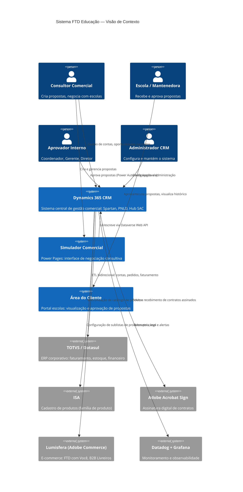
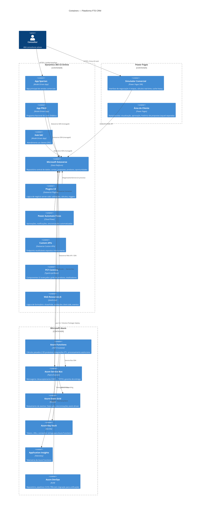
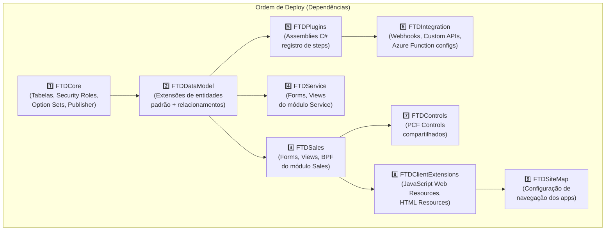
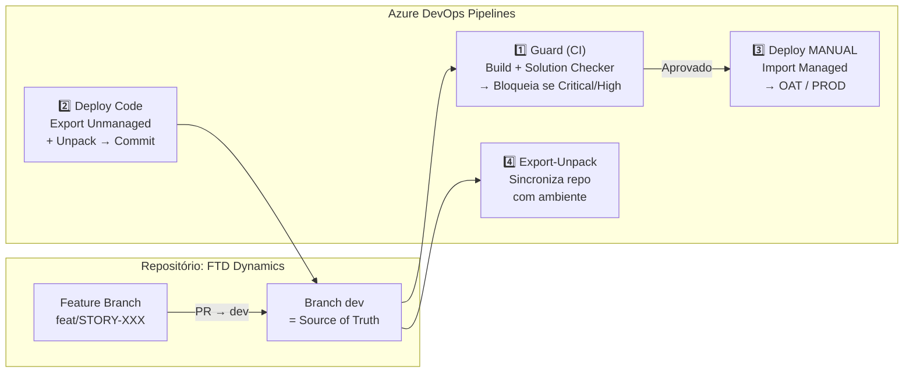
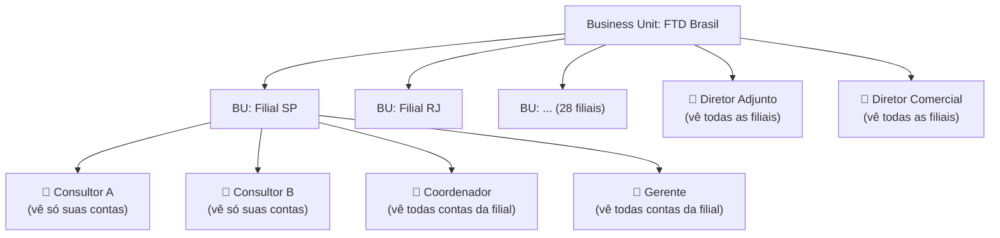
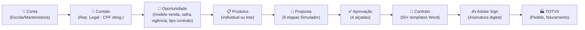

# Arquitetura de Solução — FTD Educação
## Dynamics 365 CE + Power Platform + Azure

**Cliente**: FTD Educação S/A (Grupo Marista)  
**Projeto**: Modernização CRM — Transformação CX  
**Tipo**: Brownfield  
**Versão**: 1.0  
**Data**: 20/03/2026  
**Autores**: Avanade (João Carlos Figueirôa, Rodrigo Silva — Arquitetos)

---

## 1. VISÃO GERAL

### 1.1 Contexto do Cliente

A **FTD Educação S/A**, parte do **Grupo Marista**, é uma das maiores editoras e distribuidoras de materiais didáticos do Brasil, com +120 anos de história, 28 filiais nacionais e impacto em ~1,5 milhão de estudantes.

- **Pico sazonal**: Novembro a Janeiro (adoção escolar), com até **5.000 contratos/dia**
- **Processo crítico**: Criação de propostas comerciais para escolas públicas e privadas
- **Pain point central**: Consultor leva até **3 horas** para criar 1 proposta (200 produtos × 3 cliques)

### 1.2 Objetivos Arquiteturais

1. Modernizar a jornada comercial completa via **Simulador Comercial** (Power Pages)
2. Eliminar ferramentas legadas externas (Vulcano, Pede Livreiro)
3. Estabelecer CRM D365 como **fonte de verdade** para contas
4. Racionalizar integrações com TOTVS, ISA, Lumisfera, Adobe Sign
5. Garantir escalabilidade para pico sazonal (5-10x volume normal)

---

## 2. DIAGRAMA DE CONTEXTO (C4 — Level 1)

---

## 3. DIAGRAMA DE CONTAINERS (C4 — Level 2)

---

## 4. APLICATIVOS D365

| App | Área | Usuários | Módulo D365 |
|-----|------|----------|-------------|
| **Spartan** | Comercial | Consultores, Anjas, Coordenadores, Gerentes, Diretores | Sales |
| **PNLD** | Setor Público | Consultores PNLD (NÃO criam contas) | Sales |
| **Hub SAC** | CRC (Atendimento) | Atendentes, Supervisores | Customer Service |
| **Adobe Sign** | Contratos | Consultores, Jurídico | Extensão ISV |
| **Área do Cliente** | Portal | Representantes legais de escolas | Power Pages (squad separada) |

---

## 5. SOLUTIONS ARCHITECTURE (9 Soluções)

**Estratégia**: Segmentação por tipo de componente. Deploy em sequência com patches. Managed solutions para OAT e PROD; Unmanaged para DEV.

**Publisher**: `ftd` (prefixo `ftd_` para todos os componentes customizados)

---

## 6. AMBIENTES E PIPELINE

### 6.1 Ambientes D365

| Ambiente | Nome | Status | Pipeline | Observações |
|----------|------|--------|----------|-------------|
| **DEV** | FTD-Dev | ✅ Ativo | ❌ Manual | Plugin deploy manual. Source of truth = branch `dev` |
| **Build** | FTD-Build | ✅ Implícito | ✅ Automático | Export → Pack Managed → Solution Checker |
| **OAT (UAT)** | FTD-OAT | ✅ Ativo | ✅ Automático | Import Managed. Aprovador no pipeline |
| **QA** | FTD-QA | 🔧 Criado | ❌ Não conf. | Pendente configuração pipeline |
| **RC** | FTD-RC | 🔧 Criado | ❌ Não conf. | Pendente configuração pipeline |
| **PROD** | FTD-Prod | ✅ Ativo | ✅ Manual (GMUD) | Requer GMUD via SMAX. Aprovação infra by Giselle |

### 6.2 Pipeline ALM (4 YAMLs Azure DevOps)

**Fluxo de trabalho**: `Customization Master → pac unpack → commit #workitem → PR → guard build → deploy manual`

**Batch projects**: Executados em VM separada (não na máquina do dev). Solicitado ao time de infra.

---

## 7. MODELO DE SEGURANÇA

**Regras confirmadas (Marcel - 16/Mar/2026)**:
- Consultores: visibilidade **somente suas próprias contas** (Owner = Consultor)
- Coordenadores/Gerentes: visibilidade da **filial inteira** (Business Unit)
- Diretores: visibilidade **nacional** (Parent BU)
- Consultores PNLD: **NÃO criam contas** — apenas administram/compartilham existentes

**Usuário de serviço**: `FTDMaxFlow` — propietário de todos os Power Automate flows e conexões. Acesso restrito a Julio, Fernando e Thiago.

⚠️ **Risco**: Limite de conexões do FTDMaxFlow para child flows — investigar múltiplos service accounts ou Managed Identity.

---

## 8. PROCESSO COMERCIAL — JORNADA COMPLETA

### Etapas da Proposta (Simulador Comercial — Power Pages)

| Etapa | Nome | MVP | Responsável |
|-------|------|-----|-------------|
| 1 | Contexto da Negociação | ✅ Em dev | FTD |
| 2 | Produtos e Serviços | ✅ MVP (adição individual) | FTD → Avanade (lote) |
| 3 | Benefícios, Doações, Patrocínio, Adiantamento | 📅 Pós-MVP | Avanade |
| 4 | Configuração de Vendas (Canais) | 📅 Pós-MVP | Avanade |
| 5 | Matriz de Serviços | 🔄 Em revisão | Avanade |
| 6 | Revisão e Compartilhamento / Aprovação | 📅 Pós-MVP | Avanade |

---

## 9. ALÇADAS DE APROVAÇÃO (Power Automate)

| Nível | Aprovador | Gatilho (exemplos) |
|-------|-----------|-------------------|
| **1** | Consultor (auto-aprovação) | Dentro dos limites padrão |
| **2** | Coordenador + Gerente | % royalty, % adiantamento, taxa admin acima do limite N1 |
| **3** | + Diretor Adjunto | Regras mais elevadas de desconto/patrocínio |
| **4** | + Diretor Comercial (Quintela) | Casos extremos (hoje: regras mal definidas → tudo cai aqui) |

⚠️ **Situação atual**: Regras de alçada sendo revistas pela equipe comercial (Mônica). Motor de aprovação será entregue independentemente das regras.

**Tecnologia**: Power Automate Cloud Flows com Approvals nativo (UI Teams/Outlook). **Vulcano será ELIMINADO**.

---

## 10. ROADMAP DE ENTREGAS

| Fase | Deadline | Responsável | Escopo |
|------|----------|-------------|--------|
| **MVP Simulador** | 31/Mar/2026 | FTD | Adição individual de produtos (Power Pages Etapas 1+2) |
| **Habilitadores** | Pré-MVP | FTD+Avanade | 7 itens de base: environments, pipelines, security roles, cadastros |
| **Simulador Faxina** | Pós-MVP | Avanade | Limpeza de dados: produtos (1.283→15), preços (12+→5), contas |
| **Onda 1** | ~Ago/2026 | Avanade | Lote, copiar proposta, benefícios, aprovação, migrar Pede Livreiro |
| **Onda 2 — Funil** | TBD | Avanade | Funil de vendas, higienização 101K contas |
| **Pós-Venda** | TBD | Avanade | Comissionamento, inteligência comercial |
| **PNLD** | TBD | Avanade | Setor público (4 itens específicos) |

---

## 11. ARCHITECTURE DECISION RECORDS (ADRs)

| ADR | Decisão | Status |
|-----|---------|--------|
| ADR-001 | Power Pages (não Canvas App) para Simulador Comercial | ✅ Aceito |
| ADR-002 | Entra ID (não Azure AD B2C) para autenticação Power Pages | ✅ Aceito |
| ADR-003 | Débounce: ≤50 produtos → Plugin Sync; >50 → Azure Function | ✅ Aceito |
| ADR-004 | Cache heavy client-side (JavaScript) para mínimo de roundtrips Dataverse | ✅ Aceito |
| ADR-005 | CRM como source of truth para contas (vs TOTVS) — alinhamento Jovanello | ✅ Em formalização |
| ADR-006 | Azure Service Bus para integração assíncrona D365 ↔ TOTVS | ✅ Aceito |
| ADR-007 | Eliminar Vulcano — migrar aprovação para Power Automate nativo D365 | ✅ Aceito |

> **Nota**: Ver `.avanade-method/templates/adr-template.md` para template formal de ADR.

---

## 12. RISCOS ARQUITETURAIS

| # | Risco | Impacto | Probabilidade | Mitigação |
|---|-------|---------|--------------|-----------|
| R1 | Dataverse storage crítico (já passou do limite) | 🔴 Crítico | ✅ Ocorrendo | Escalar com arquiteto infra imediatamente + análise de dados para arquivamento |
| R2 | Cadastro de produtos não limpo a tempo (MVP) | 🟠 Alto | 🟡 Média | Adição individual não depende de lote — MVP seguro; lote depende da limpeza |
| R3 | Resistência dos 404 consultores ao Simulador | 🟠 Alto | 🟡 Média | Validação UX com 4 grupos focais + rollout gradual por filial |
| R4 | Limite de conexões FTDMaxFlow | 🟡 Médio | 🟡 Média | Investigar múltiplos service accounts ou Managed Identity para flows |
| R5 | Pipeline concorrido com outras áreas (fila) | 🟡 Médio | 🟠 Alta | Slots de deploy reservados + comunicação antecipada |
| R6 | QA e RC environments não configurados | 🟡 Médio | ✅ Ocorrendo | Configurar antes da Onda 1 (Avanade) |
| R7 | Regras de alçada ainda indefinidas | 🟡 Médio | ✅ Ocorrendo | Entregar motor independente das regras; parametrizar depois |

---

*Gerado automaticamente com base em: transcrições de onboarding (9-12/Mar/2026), especificação Simulador Notion, refinamento de processo (16/Mar/2026), d365-config.yaml v4.29.0*
