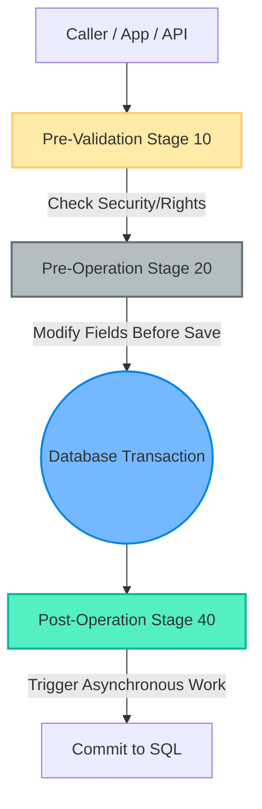
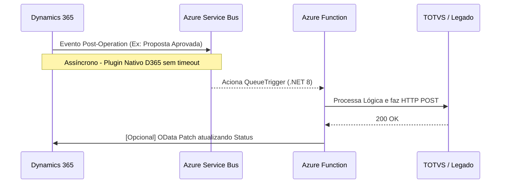
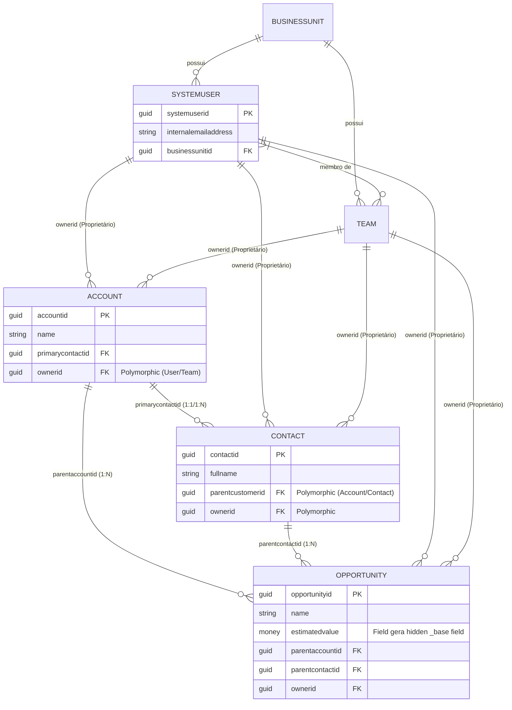
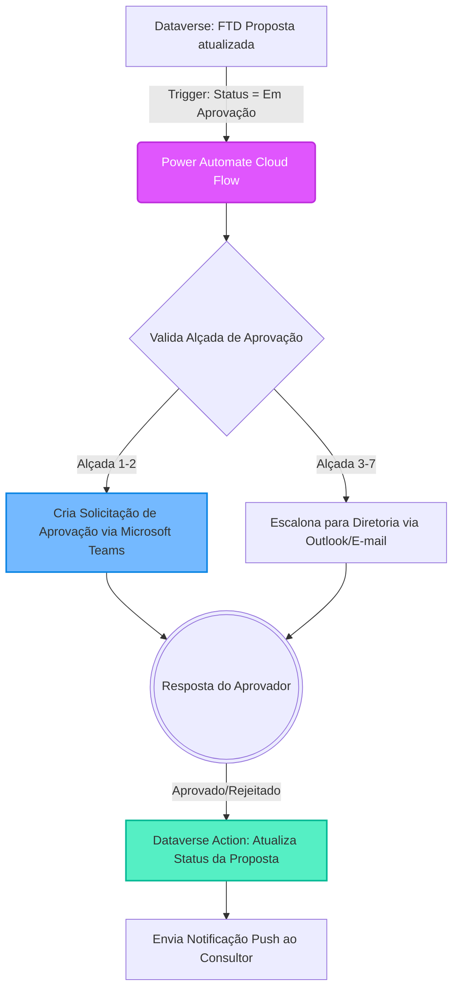

# Baseline Arquitetural: Padrões e Referências Microsoft

**Data de Atualização:** 26 de Março de 2026
**Objetivo:** Este documento define as "Leis da Física" do ecossistema Microsoft (Dynamics 365, Power Platform, Azure). É a base de referência para coibir propostas de design irreais ou que causem "throttling" (estrangulamento de recursos) no ambiente Brownfield do cliente FTD.

Nenhum desenvolvedor corporativo, analista ou Agente de IA (BMAD) deve gerar user stories, tarefas ou códigos de arquitetura que violem os limites oficiais descritos aqui.

## 1. Limites do Dataverse (Sistema Central)

### 1.1 O Event Execution Pipeline do Dynamics 365
Compreender onde injetar a lógica é vital. Plugins e fluxos de Power Automate respondem a um *Pipeline* imutável de eventos:

*   **Regra de Ouro (Pre-Operation):** Regras de validação e autocompletar campos que vão para o banco DEVEM rodar no `Stage 20 (Pre-Operation)`. Isso evita uma re-chamada de `Update()` implícita, otimizando a API em 50%.
*   **Regra de Ouro (Post-Operation):** Lógicas que dependem de IDs já criados (como criação de Child Records) DEVEM rodar no `Stage 40 (Post-Operation)`. Se for muito pesado, o plugin deve ser registrado como *Asynchronous*.

### 1.2 Limites de Tempo de Execução e Throttling
* **Timeout Rígido de Sandbox (2 Minutos):** Qualquer WebApi ou Plugin (Síncrono ou Assíncrono) registrado no Dataverse falhará (Timeout Exception) se a transação ultrapassar **120 segundos**. 
* **Regra FTD:** Transações em massa (ex: salvar 200 itens de um Simulador Comercial) **nunca** devem ser processadas em um único Plugin Síncrono. Subdividir ou delegar para fora (Azure).

### 1.2 Limites de Proteção de API (Throttling / API Limits)
* A Microsoft impõe limites rigorosos de chamadas de API (Service Protection API Limits). Fazer requisições pesadas em loops for-each simultâneos gera a falha `429 Too Many Requests`.
* **Lock de Tabelas (Deadlocks):** Atualizações paralelas excessivas no mesmo registro-pai (Ex: Salvar múltiplos *Itens de Proposta* que rodam um plugin de "Soma do Total na Proposta", bloqueando a *Proposta*) causam Deadlocks no banco SQL subjacente do Dataverse.

## 2. Padrões de Integração com Front-End (Power Pages)

### 2.1 Limitações da API Web OData (Portais)
* **O Problema `Promise.all`:** No Power Pages via JavaScript, enviar um bloco de transações usando `Promise.all()` com centenas de registros simultâneos para a API OData irá estrangular (Throttling) o processador principal do Portal na camada de rede.
* **Solução Microsoft Recomendada:** Usar a Action `ExecuteMultipleRequest` ou rotear cargas estressantes de UI pesadas para APIs extenas customizadas caso a API nativa não comporte. 
* **Regra FTD:** A captura dos dados no Simulador Comercial ocorre no Cache/Memória do navegador (JS/Tablet). No "Salvar", envia-se um Batch consolidado.

### 2.2 Segurança e Acesso
* **Table Permissions:** Todos os acessos via Liquid ou JS OData no Power Pages exigem configurações granulares de escopo. Nunca sugerir "permissão global" aos agentes de UX/Dev (Account, Contact, Parent, Self). 
* **Web Roles:** Controle de interface sempre amarrado via Web Roles.

## 3. Padrões de Integração Assíncrona (O Padrão Ouro de Azure)

O ecossistema FTD usa intensamente Integrações. A Microsoft define padrões rígidos para evitar gargalos entre o D365 e sistemas legados (Lumisfera, TOTVS):

### 3.1 Padrão D365 -> Azure (Assíncrono via Service Bus)
* A recomendação oficial não é "Plugins rodando HTTP Externo direto em alta volumetria" devido ao risco de bloquear threads de UI e consumir cotas do CRM.
* O padrão é configurar os **Service Endpoints (Dataverse)** integrados de forma nativa ao **Azure Service Bus**.

* **Por que esse é o padrão ouro?** Se a Azure Function falhar (ex: TOTVS fora do ar), a mensagem retorna para o Service Bus (Dead-letter). A transação no Dataverse fica intacta e o usuário final não sofre uma tela de "Crash".

### 3.2 Power Automate vs Lógicas Pesadas
* **Power Automate Limits:** Não utilizar fluxos do Cloud (Power Automate) para Loops volumosos complexos de negócios. Fluxos em Power Automate têm limites de Action Request Rate severos (Licenciamento D365). 
* A abordagem para grandes volumes é via **ADR-003**: Delegação de lotes grandes (>50 registros) exclusivamente para o Azure Functions, preservando a licença da conta de serviço `FTDMaxFlow` e previnindo falhas silenciosas de fluxo.

## 4. Identidade e Autenticação (Security By Design)

* Integração D365/Azure NUNCA deve ser arquitetada ou descrita em histórias usando `User Credentials` simples.
* A exigência base da nuvem é o uso de **Application Users (App Registrations no Entra ID)** com Server-to-Server (S2S) Auth.
* Este ponto aborda a premissa de risco do FTD identificada pelo Arquiteto, e todas as User Stories devem presumir esteira segura sem *hardcoded secrets*.

## 5. Melhores Práticas de Desenvolvimento Backend (Plugins C#)

### 5.1 O Princípio `IOrganizationService`
* **Thread Safety:** NUNCA declare variáveis no nível da classe global em um Plugin (exceto literais de configuração). Plugins na infraestrutura da Microsoft são instanciados e cacheados em servidor. Variáveis de classe causam o temido erro de *Cross-Thread Data Contamination* (Usuário A vê dados da Sessão B).
* Instancie as interfaces de serviço `IOrganizationService` sempre dentro do escopo do método `Execute(IServiceProvider)`.

### 5.2 Gerenciamento do Contexto Compartilhado
* Sempre utilize `SharedVariables` do `IPluginExecutionContext` se precisar trafegar objetos entre um plugin no *Stage 20* para outro no *Stage 40* (dentro da mesma transação SQL). Não faça reads/queries no banco para buscar algo que existia milissegundos antes no pipeline de eventos. 

### 5.3 FetchXML vs QueryExpression vs LINQ
* **QueryExpression:** Permite paginação dinâmica, ideal para queries altamente complexas onde os filtros mudam.
* **FetchXML:** Uso otimizado para agregações complexas (`groupby`, `sum`), essencial na Etapa 3 do Simulador para obter somatórias de itens vinculados.
* **LINQ for D365:** Apenas recomendado em coleções estáticas pequenas. Cuidado absoluto: ele causa chamadas N+1 ocultas ao Dataverse se não for usado com as cláusulas `Select()` imediatas.

## 6. O Common Data Model (Dataverse / D365 Native Entities)

Para que a Inteligência Artificial e os Analistas modelem User Stories sem recriar a roda, é imperativo utilizar as tabelas, tipos e relacionamentos nativos do **Common Data Model (CDM)** providos pela Microsoft antes de propor qualquer entidade customizada (`ftd_`).

### 6.1 Tabelas Nativas Nucleares e Diagrama MER (Core Entities)
O diagrama abaixo ilustra o núcleo de vendas e relacionamentos padrão do *Common Data Model*. Qualquer modelagem FTD deve orbitar, estender ou se relacionar com essas entidades antes de criar estruturas isoladas.

* **Account (`account`):** Representa as Escolas ou Redes de Ensino (B2B). Nunca criar uma tabela "ftd_escola".
* **Contact (`contact`):** Representa Diretores, Professores, Anjas (B2C ou B2B Contacts).
* **Opportunity (`opportunity`):** Representa a Negociação/Funil de Vendas inicial.
* **User (`systemuser`) & Team (`team`):** Representa os Consultores e áreas de retaguarda do FTD.
* **Business Unit (`businessunit`):** Unidades de negócio ou divisões regionais.

### 6.2 Relacionamentos Nativos e Lookups Padrão
Sempre que uma tarefa sugerir um vínculo, os seguintes relacionamentos nativos devem ser aproveitados:
* **Lookup de Contato Primário (`primarycontactid`):** Campo nativo na tabela `account` que aponta para o diretor/decisor principal (`contact`). Não criar `ftd_contato_principal`.
* **Lookup de Cliente Pai (`parentcustomerid`):** Campo *Polimórfico* no `contact` ou `opportunity` que pode apontar para uma Conta ou um Contato.
* **Owner (`ownerid`):** Campo polimórfico nativo em todos os registros criados por usuários. Aponta para `systemuser` ou `team`.
* **Regarding (`regardingobjectid`):** Campo nas tabelas de Atividade (E-mail, Task, PhoneCall) que liga a atividade com qualquer entidade habilitada (Conta, Proposta, etc.).

### 6.3 Tipos de Campos e Regras de Modelagem
* **Choice / OptionSet:** Sempre que os valores forem finitos (Ex: "Status" ou "Tipo de Aditivo"). Preferencialmente *Global Choices* se o mesmo conjunto de opções se repetir no D365.
* **Currency (Moeda):** Ao instanciar um campo de moeda (Ex: Valor Total da Proposta), o Dataverse cria automaticamente um campo "Base" (ex: `ftd_valortotal_base`). O código nunca deve escrever direto no campo `_base`.
* **Lookup vs GUID:** Um campo *Lookup* no front-end é visual, mas no banco (e em transações WebApi/Plugin) ele é uma `EntityReference` exigindo o GUID e o Logical Name (`account`, `ftd_proposta`).
* **Regras de Cascata (Cascading Rules):** Em um relacionamento 1:N (Ex: Conta para Múltiplas Propostas FTD). Se a conta-pai for deletada ou reatribuída (Assign), as regras nativas de "Cascade Delete" ou "Cascade Assign" influenciam silenciosamente a base. User stories de exclusão devem mencionar os impactos de cascata.

## 7. Arquitetura e Padrões de Power Automate (Cloud Flows)

Para fluxos de negócio que exigem automação assíncrona leve (aprovações, notificações, envio de e-mails), o Power Automate é a ferramenta oficial. Desenvolvedores e IAs não devem propor Plugins em C# para tarefas nativas do Automate, da mesma forma que não devem usar o Automate para alta volumetria de dados.

### 7.1 Diagrama Lógico de Integração e Aprovação Padrão
O diagrama abaixo ilustra a arquitetura homologada pelo Avanade BCA para fluxos de aprovação de propostas comerciais, em harmonia com o Dataverse.

### 7.2 Governança e ALM (Application Lifecycle Management)
* **Connection References:** NUNCA criar conexões baseadas em credenciais de usuários nomeados (Ex: `paula@ftd.com.br`). Todos os fluxos de automação na Solution de produção devem carregar a *Connection Reference* apontando para a conta de Serviço homologada (`FTDMaxFlow`).
* **Environment Variables:** Parâmetros mutáveis como URLs de sistemas terceiros ou configurações de negócio (Ex: % de alçada dinâmico) devem ser desacoplados usando `Environment Variables` para facilitar o pipeline no Azure DevOps (CI/CD) sem quebrar fluxos em produção.
* **Filter Queries no Trigger:** Sempre que usar o conector do Dataverse "When a row is modified", é mandatório preencher o *Select Columns* e o *Filter Rows* (usando OData query). Qualquer fluxo sem esse filtro gera "Ruído" de execução e consome cota de APIs da plataforma desnecessariamente.
* **Child Flows:** Se um bloco lógico se repetir muito (ex: Calcular juros de Mora do TOTVS), não duplique a lógica em 5 fluxos. Crie um Fluxo "Filho" HTTP-Trigado ou Call-Action e invoque-o do Fluxo Pai.
