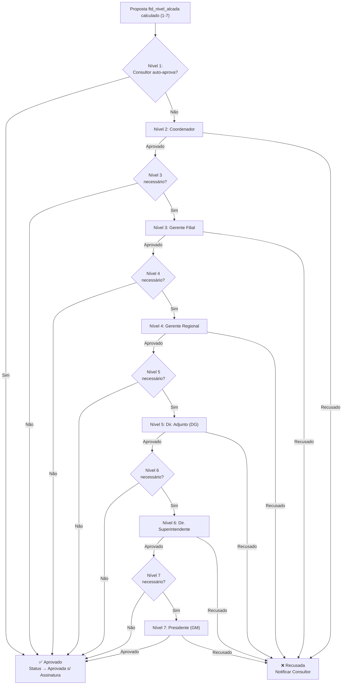

# Padrões de Desenvolvimento — FTD Educação
## Avanade BCA Guidelines v3 + D365 CE

**Cliente**: FTD Educação S/A (Grupo Marista)  
**Versão**: 1.0 | **Data**: 20/03/2026  
**Referência completa**: `.github/instructions/avanade-bca-guidelines.instructions.md`  
**Inventário BCA**: `.avanade-method/docs/diretriz-avanade-inventory.md` (197 docs)

---

## 1. PRINCÍPIOS GERAIS

1. **Early Bound obrigatório** — nunca magic strings para entidades e campos
2. **Shift-Left Testing** — testes escritos junto com o código, nunca depois
3. **Plugin < 2 segundos** — execução total sob carga de pico
4. **TypeScript obrigatório** — zero JavaScript sem tipagem em código novo
5. **Security by design** — sem credenciais hardcoded, sem exposição de PII em logs
6. **Naming convention FTD** — prefixo `ftd_` em tudo customizado
7. **Nunca editar solução Default** — sempre soluções segmentadas (FTDCore, FTDSales, etc.)

---

## 2. BACKEND — PLUGINS C#

### 2.1 Padrão Arquitetural: Plugin\<T\> → Service → Repository

```csharp
// Estrutura obrigatória Avanade BCA
namespace FTD.Plugins.Proposta
{
    // 1. Plugin: entry point, apenas orquestra
    [CrmPluginRegistration(
        MessageNameEnum.Create,
        "ftd_proposta",
        StageEnum.PreOperation,
        ExecutionModeEnum.Synchronous,
        FilteringAttributes: "ftd_status_proposta,ftd_nivel_alcada",
        Step Name: "FTD.Plugins.Proposta.PreCreate - Validar Proposta")]
    public class PreCreateValidarProposta : PluginBase<Entity>
    {
        private readonly IPropostaService _proposstaService;

        public PreCreateValidarProposta()
        {
            // DI via Unity container
            _proposstaService = Container.Resolve<IPropostaService>();
        }

        protected override void ExecuteBusinessLogic(
            ILocalPluginContext localContext)
        {
            var context = localContext.PluginExecutionContext;
            var target = context.InputParameters["Target"] as Entity;

            // 2. Delega para Service (lógica de negócio)
            _proposstaService.ValidarCriacao(target, localContext.OrganizationService,
                localContext.TracingService);
        }
    }
}

// 2. Service: lógica de negócio
public class PropostaService : IPropostaService
{
    private readonly IPropostaRepository _repository;

    public PropostaService(IPropostaRepository repository)
    {
        _repository = repository;
    }

    public void ValidarCriacao(Entity proposta, IOrganizationService service,
        ITracingService trace)
    {
        trace.Trace("PropostaService.ValidarCriacao: iniciando");

        // Regras de negócio aqui
        var oportunidade = _repository.GetOportunidade(
            proposta.GetAttributeValue<EntityReference>("ftd_oportunidade_id")?.Id ?? Guid.Empty,
            service);

        if (oportunidade == null)
            throw new InvalidPluginExecutionException(
                "Oportunidade não encontrada. A proposta deve estar vinculada a uma oportunidade.");

        trace.Trace("PropostaService.ValidarCriacao: concluído com sucesso");
    }
}

// 3. Repository: acesso a dados
public class PropostaRepository : IPropostaRepository
{
    public Entity GetOportunidade(Guid oportunidadeId, IOrganizationService service)
    {
        if (oportunidadeId == Guid.Empty) return null;

        // Early Bound + ColumnSet específico (NUNCA new ColumnSet(true))
        var columnSet = new ColumnSet(
            Opportunity.Fields.Name,
            Opportunity.Fields.ftd_safra,
            Opportunity.Fields.ftd_tipo_contrato);

        return service.Retrieve(Opportunity.EntityLogicalName, oportunidadeId, columnSet);
    }
}
```

### 2.2 Stages de Plugin — Quando Usar

| Stage | Quando Usar | FTD Exemplos |
|-------|------------|-------------|
| **Pre-Validation (10)** | Validação que bloqueia a operação antes de tudo | Validar CNPJ duplicado em Account |
| **Pre-Operation (20)** | Modificar dados antes de persistir | Calcular nível de alçada da Proposta |
| **Post-Operation (40) Sync** | Lógica após salvar, dentro da transação | Criar vínculo proposta anterior/posterior |
| **Post-Operation (40) Async** | Notificações, logs, sync não crítico | Log em ftd_log_integracao |

### 2.3 Regras Obrigatórias de Plugin

```csharp
// ✅ CORRETO: Depth check
if (context.Depth > 1) return;

// ✅ CORRETO: Tracing service para TUDO
trace.Trace($"[{nameof(PreCreateValidarProposta)}] Iniciando. Target: {target.Id}");

// ✅ CORRETO: InvalidPluginExecutionException para erros de negócio
throw new InvalidPluginExecutionException(
    OperationStatus.Failed,
    "CNPJ duplicado encontrado no sistema. Operação bloqueada.");

// ✅ CORRETO: Filtering attributes para limitar execução
// Apenas executa se ftd_status_proposta ou ftd_nivel_alcada forem alterados
FilteringAttributes: "ftd_status_proposta,ftd_nivel_alcada"

// ✅ CORRETO: ColumnSet específico
var cols = new ColumnSet(Account.Fields.ftd_cnpj, Account.Fields.Name);

// ❌ PROIBIDO: ColumnSet(true) - retorna TODOS os campos
var cols = new ColumnSet(true); // NUNCA!

// ❌ PROIBIDO: GUID hardcoded
var tipoPrivado = new Guid("a1b2c3d4-..."); // NUNCA!

// ✅ CORRETO: GUID em constante nomeada
public static class FtdOptionSets
{
    public static class TipoProposta
    {
        public const int ContratoNovo = 100000000;
        public const int Aditivo = 100000001;
    }
}
```

### 2.4 Débounce: Plugin vs Azure Function (Regra FTD)

```
≤ 50 produtos → Plugin síncrono (Pre/Post-Operation Stage 20/40)
> 50 produtos → Azure Function via Service Bus (async, sem timeout)
```

**Motivo**: Plugins têm timeout de 2 minutos. Propostas com 200 produtos precisam de Azure Function.

### 2.5 Testes de Plugin (FakeXrmEasy)

```csharp
[TestClass]
public class PreCreateValidarPropostaTests
{
    [TestMethod]
    public void QuandoCNPJDuplicado_DeveBloquearOperacao()
    {
        // Arrange
        var ctx = new XrmFakedContext();
        ctx.Initialize(new List<Entity>
        {
            new Account { Id = Guid.NewGuid(),
                ["ftd_cnpj"] = "12.345.678/0001-99" }
        });

        var plugin = new PreCreateValidarProposta();
        var target = new Account { ["ftd_cnpj"] = "12.345.678/0001-99" };

        // Act + Assert
        Assert.ThrowsException<InvalidPluginExecutionException>(() =>
            ctx.ExecutePluginWithTarget(plugin, target));
    }

    [TestMethod]
    public void QuandoCNPJValido_DeveProsseguir() { ... }

    // Cobertura mínima: 80%
}
```

---

## 3. FRONTEND — PCF CONTROLS (TypeScript)

### 3.1 Padrão: Contract/Controller

```typescript
// ✅ CORRETO: Contract interface para tipagem
interface IFtdProdutosGridProps {
    proposalId: string;
    onProductsChanged: (products: IProduct[]) => void;
    isReadOnly: boolean;
}

// ✅ CORRETO: Controller pattern
export class FtdProdutosGridController {
    private readonly _service: IPropostaService;

    constructor(service: IPropostaService) {
        this._service = service;
    }

    public async loadProducts(proposalId: string): Promise<IProduct[]> {
        return await this._service.getProductsByProposal(proposalId);
    }
}

// ✅ CORRETO: PCF component com lifecycle correto
export class FtdProdutosGridControl
    implements ComponentFramework.StandardControl<IInputs, IOutputs> {

    private _container: HTMLDivElement;
    private _controller: FtdProdutosGridController;
    private _notifyOutputChanged: () => void;

    public init(
        context: ComponentFramework.Context<IInputs>,
        notifyOutputChanged: () => void,
        state: ComponentFramework.Dictionary,
        container: HTMLDivElement
    ): void {
        this._container = container;
        this._notifyOutputChanged = notifyOutputChanged;
        this._controller = new FtdProdutosGridController(
            new PropostaService(context.webAPI));
        this.renderComponent(context);
    }

    public updateView(context: ComponentFramework.Context<IInputs>): void {
        this.renderComponent(context);
    }

    public getOutputs(): IOutputs {
        return { selectedProductIds: this._selectedIds };
    }

    public destroy(): void {
        ReactDOM.unmountComponentAtNode(this._container);
    }
}
```

### 3.2 Regras PCF Obrigatórias

| Regra | Detalhe |
|-------|---------|
| TypeScript strict mode | `"strict": true` no tsconfig.json |
| Sem `any` desnecessário | Tipar **TUDO** |
| Cleanup em `destroy()` | Event listeners, timers, ReactDOM.unmount |
| Bundle < 5MB | Lazy loading para dependências grandes |
| Cobertura mínima | 70% (Jest) |
| Responsive | Web + Tablet + Phone |
| Accessibility | Aria labels, keyboard navigation |

---

## 4. FRONTEND — JAVASCRIPT WEB RESOURCES

### 4.1 Padrão de Namespace

```javascript
// ✅ CORRETO: Namespace FTD.[Module].[Function]
var FTD = FTD || {};
FTD.Proposta = FTD.Proposta || {};

FTD.Proposta.OnLoad = function(executionContext) {
    "use strict";
    const formContext = executionContext.getFormContext();
    FTD.Proposta._inicializarCampos(formContext);
};

FTD.Proposta._inicializarCampos = function(formContext) {
    const statusProposta = formContext.getAttribute("ftd_status_proposta");
    if (!statusProposta) return; // Null check obrigatório

    const valor = statusProposta.getValue();
    FTD.Proposta._configurarVisibilidade(formContext, valor);
};

// ❌ PROIBIDO: variável global sem namespace
var statusProposta; // NUNCA!
function onLoad() { } // NUNCA sem namespace!

// ❌ PROIBIDO: Xrm.Page (deprecated)
Xrm.Page.getAttribute("name"); // NUNCA!

// ✅ CORRETO: formContext via executionContext
const formContext = executionContext.getFormContext();
formContext.getAttribute("name").getValue();
```

### 4.2 Regras JS Web Resources

| Regra | Detalhe |
|-------|---------|
| Namespace obrigatório | `FTD.[Module].[Function]` |
| Sem variáveis globais | IIFE ou module pattern |
| `formContext` sempre via `executionContext` | Nunca `Xrm.Page` |
| Async/await para Web API calls | Nunca sync XMLHttpRequest |
| `setAttribute setVisible/setRequired` para UI | Nunca DOM manipulation direta |
| Sem `alert()` | Usar `formContext.ui.setFormNotification()` |

---

## 5. POWER AUTOMATE CLOUD FLOWS

### 5.1 Naming Convention

```
FTD - [Módulo] - [Ação] - [Trigger]

Exemplos:
✅ FTD - Proposta - EnviarAprovacao - QuandoStatusMuda
✅ FTD - Account - SincronizarTOTVS - AgendadoDiario
✅ FTD - MatrizServicos - Processar - QuandoSolicitado
❌ Aprovação_Flow (sem prefixo FTD, sem padrão)
❌ flow1 (sem significado)
```

### 5.2 Estrutura Obrigatória

```
Scope "Try" {
    // Ações principais
    Scope "Catch" {
        // Run after: Failed, TimedOut, Skipped
        → Compose: CorrelationId + ErrorMessage
        → Send Email/Teams: notificação falha
        → Create: ftd_log_integracao (status = Falha)
        → Terminate: status = Failed (se fatal)
    }
    Scope "Finally" {
        // Sempre executa
        → Update: ftd_log_integracao (duração)
    }
}
```

### 5.3 Regras Power Automate

| Regra | Detalhe |
|-------|---------|
| Connection References | Não connections diretas |
| Variáveis no topo | Initialize variables no início do flow |
| Error handling obrigatório | Scope Try-Catch-Finally em TODOS os flows |
| Run-after configurado | failure/timeout/skipped para ações críticas |
| Retry policy | Em HTTP actions (3 retries, 60s interval) |
| Concurrency control | Apply-to-each com concurrency = 1 para dados sensíveis |
| Paginação | Handle de resultados > 100 registros |
| Naming variables | `varNomeDescritivo` (camelCase) |
| FTDMaxFlow | Proprietário do flow + todas as connections |

### 5.4 Fluxo de Aprovação 4 Alçadas (Padrão FTD)



---

## 6. AZURE FUNCTIONS (.NET 8 Isolated Worker)

### 6.1 Estrutura Obrigatória

```csharp
// Program.cs — DI e configuração
var host = new HostBuilder()
    .ConfigureFunctionsWorkerDefaults()
    .ConfigureServices((context, services) =>
    {
        services.AddSingleton<IPropostaService, PropostaService>();
        services.AddSingleton<IDataverseClient, DataverseClient>();
        services.AddSingleton<ITotvsClient, TotvsClient>();

        // Key Vault (Managed Identity — sem secrets em appsettings)
        var keyVaultUri = context.Configuration["KeyVaultUri"];
        services.AddAzureKeyVaultClient(new Uri(keyVaultUri));

        // Polly — retry policy padrão
        services.AddHttpClient<ITotvsClient>()
            .AddTransientHttpErrorPolicy(policy =>
                policy.WaitAndRetryAsync(3, retry =>
                    TimeSpan.FromSeconds(Math.Pow(2, retry))));

        // Application Insights
        services.AddApplicationInsightsTelemetryWorkerService();
    })
    .Build();

// Function: HTTP Trigger (integração real-time)
public class SincronizarPropostaFunction
{
    private readonly IPropostaService _service;
    private readonly ILogger<SincronizarPropostaFunction> _logger;

    public SincronizarPropostaFunction(
        IPropostaService service,
        ILogger<SincronizarPropostaFunction> logger)
    {
        _service = service;
        _logger = logger;
    }

    [Function("SincronizarProposta")]
    public async Task<HttpResponseData> Run(
        [HttpTrigger(AuthorizationLevel.Function, "post")] HttpRequestData req)
    {
        // Correlation ID para rastreabilidade
        var correlationId = req.Headers.GetValues("X-Correlation-ID")
            .FirstOrDefault() ?? Guid.NewGuid().ToString();

        using var scope = _logger.BeginScope(
            new Dictionary<string, object> { ["CorrelationId"] = correlationId });

        _logger.LogInformation("SincronizarProposta iniciado. CorrelationId={CorrelationId}",
            correlationId);

        try
        {
            var body = await req.ReadFromJsonAsync<PropostaRequest>();
            // Idempotency check ANTES de processar
            if (await _service.JaFoiProcessado(body!.PropostaId, correlationId))
            {
                _logger.LogWarning("Mensagem duplicada detectada. CorrelationId={CorrelationId}",
                    correlationId);
                var okResponse = req.CreateResponse(HttpStatusCode.OK);
                await okResponse.WriteStringAsync("Já processado (idempotente)");
                return okResponse;
            }

            await _service.Sincronizar(body, correlationId);

            var response = req.CreateResponse(HttpStatusCode.OK);
            await response.WriteAsJsonAsync(new { success = true, correlationId });
            return response;
        }
        catch (ValidationException ex)
        {
            _logger.LogWarning(ex, "Validação falhou. CorrelationId={CorrelationId}",
                correlationId);
            var errorResponse = req.CreateResponse(HttpStatusCode.BadRequest);
            await errorResponse.WriteAsJsonAsync(new { error = ex.Message, correlationId });
            return errorResponse;
        }
        catch (Exception ex)
        {
            _logger.LogError(ex, "Erro crítico. CorrelationId={CorrelationId}", correlationId);
            var errorResponse = req.CreateResponse(HttpStatusCode.InternalServerError);
            await errorResponse.WriteAsJsonAsync(new { error = "Erro interno", correlationId });
            return errorResponse;
        }
    }
}
```

### 6.2 Regras Azure Functions

| Regra | Detalhe |
|-------|---------|
| Managed Identity | Autenticação ao Dataverse e sistemas externos |
| Key Vault | Secrets NUNCA em appsettings.json ou código |
| Correlation ID | Propagado em TODAS as chamadas cross-system |
| Polly retry | Exponential backoff (3 retries por default) |
| Circuit Breaker | Para APIs externas críticas (TOTVS, Adobe) |
| Idempotência | Verificar se mensagem já foi processada (Service Bus = at-least-once) |
| Dead-letter | Configurar para Service Bus triggers |
| Application Insights | ILogger + custom metrics para KPIs de negócio |
| Timeout | Configurar explicitamente para HTTP calls externas |
| Dataverse throttling | Respeitar 6.000 req/5min — batch com ExecuteMultiple |

---

## 7. POWER PAGES (SIMULADOR COMERCIAL)

### 7.1 Padrão: SPA com Cache Heavy

```javascript
// ✅ PADRÃO: Cache-first para dados que mudam pouco
class PropostaCache {
    static #instance = null;
    #cache = new Map();

    static getInstance() {
        if (!PropostaCache.#instance) {
            PropostaCache.#instance = new PropostaCache();
        }
        return PropostaCache.#instance;
    }

    async getProdutos(linhaDeNegocio) {
        const key = `produtos_${linhaDeNegocio}`;
        if (this.#cache.has(key)) {
            return this.#cache.get(key); // Cache hit — sem roundtrip Dataverse
        }

        const produtos = await DataverseApi.fetchProdutos(linhaDeNegocio);
        this.#cache.set(key, produtos);
        return produtos;
    }

    invalidate(key) {
        this.#cache.delete(key);
    }
}

// ✅ PADRÃO: Cálculo real-time no frontend (JavaScript)
class CalculadoraProposta {
    static calcularTotais(produtos) {
        let totalFTD = 0;
        let totalEscola = 0;
        let totalFamilia = 0;
        let royaltyTotal = 0;
        let alcalada = 1;

        for (const produto of produtos) {
            const precoFTD = produto.precoTabela * (1 - produto.descontoPct / 100);
            const precoFamilia = precoFTD * (1 + produto.majoracaoPct / 100);
            const royalty = (precoFamilia - precoFTD) * produto.quantidadeAlunos;

            totalFTD += precoFTD * produto.quantidadeAlunos;
            totalFamilia += precoFamilia * produto.quantidadeAlunos;
            royaltyTotal += royalty;
        }

        // Alçada calculada dinamicamente — regras FTD
        alcalada = CalculadoraAlcada.calcular({ totalFTD, royaltyTotal, ...outros });

        return { totalFTD, totalEscola, totalFamilia, royaltyTotal, alcalada };
    }
}
```

### 7.2 Regra de Débounce (Validação Backend)

```javascript
// ≤ 50 produtos → Plugin síncrono (chamada bloqueante)
// > 50 produtos → Azure Function via Service Bus (async, polling)

async function salvarProdutos(produtos, proposalId) {
    if (produtos.length <= 50) {
        // Plugin via Dataverse Action (síncrono)
        return await DataverseApi.executeAction(
            "ftd_SalvarProdutosProposta",
            { proposalId, produtos });
    } else {
        // Azure Function (assíncrono) + polling para status
        const jobId = await AzureApi.startBatchJob({ proposalId, produtos });
        return await pollJobStatus(jobId);
    }
}
```

### 7.3 Autenticação Power Pages

- **Provider**: Entra ID (Azure AD)
- **Usuários**: Internos FTD (404 consultores + gestores)
- **Licenciamento**: Sem custo adicional (licença Enterprise)
- **Confirmado**: Microsoft confirmou licenciamento OK para uso interno
- **Session**: Gerenciada pelo Power Pages nativo

---

## 8. ALM — PIPELINE CI/CD

### 8.1 Fluxo de Desenvolvimento

```
1. Feature Branch (feat/STORY-XXX) criado a partir de `dev`
2. Desenvolvimento local → DEV environment (plugin deploy manual)
3. Customization Master → pac pcf push / pac solution publish
4. pac solution export --unmanaged → Solution Packager unpack
5. git commit -m "feat(STORY-XXX): descrição" → push
6. Pull Request para `dev`
7. Guard Pipeline (CI) → Build + Solution Checker
   → Se Critical/High violations: PR BLOQUEADO
8. Code Review (Carla QA + Desenvolvedor)
9. Merge para `dev`
10. Deploy Pipeline MANUAL → OAT (aprovador no pipeline)
11. Business validation em OAT
12. Para PROD: GMUD via SMAX → Deploy Pipeline MANUAL com aprovação infra
```

### 8.2 Solution Checker (Quality Gate Obrigatório)

| Tipo | Limite | Ação |
|------|--------|------|
| Critical | **0** | Bloqueia deploy |
| High | **0** | Bloqueia deploy |
| Medium | ≤ 10 | Aviso (não bloqueia) |
| Low | Sem limite | Informativo |

### 8.3 Testing Strategy (Shift-Left)

| Tipo | Tecnologia | Cobertura Mínima | Quando |
|------|-----------|-----------------|--------|
| Plugin Unit Tests | FakeXrmEasy + MSTest | **80%** | Junto com código |
| PCF Unit Tests | Jest + React Testing Library | **70%** | Junto com código |
| Azure Function Unit Tests | xUnit + Moq | **80%** | Junto com código |
| Integration Tests | Postman/Newman (API) | Smoke | Em pipeline OAT |

**Regra**: Nunca marcar task como concluída se os testes não estiverem escritos e passando 100%.

---

## 9. SEGURANÇA E COMPLIANCE

### 9.1 Dados Sensíveis

| Dado | Classificação | Proteção |
|------|--------------|---------|
| CPF de Rep. Legal | PII/LGPD | Criptografia em repouso, acesso restrito |
| CNPJ de escola | Dados públicos | Validação de duplicidade apenas |
| Dados financeiros (preços, royalties) | Confidencial | Security roles segmentadas por BU/filial |
| Tokens/API Keys | Secrets | Azure Key Vault exclusivamente |
| Logs de integração | Operacional | Sem PII nos trace logs (Plugin/Function) |

### 9.2 LGPD — Pendências

⚠️ **Requisitos LGPD específicos ainda não formalizados** (ver gap no discovery).  
Ações necessárias:
- [ ] Identificar dados pessoais armazenados (CPF, e-mail, endereço)
- [ ] Mapear finalidade de uso para cada dado pessoal
- [ ] Implementar mecanismo de exclusão/anonimização
- [ ] Audit trail para acesso a dados sensíveis

---

## 10. CHECKLIST DE CONFORMIDADE (Referência Rápida)

### Plugin C# ✅

- [ ] Herda de PluginBase\<T\>
- [ ] `[CrmPluginRegistration]` attribute correto
- [ ] Depth check: `if (context.Depth > 1) return;`
- [ ] Filtering attributes limitando execução
- [ ] ITracingService em todo o logging
- [ ] InvalidPluginExecutionException para erros de negócio
- [ ] ColumnSet específico (nunca `new ColumnSet(true)`)
- [ ] Early Bound entities
- [ ] Sem GUID hardcoded (usar constantes)
- [ ] FakeXrmEasy unit tests com ≥ 80% cobertura

### Power Automate ✅

- [ ] Nome: `FTD - [Module] - [Action] - [Trigger]`
- [ ] Scope Try-Catch-Finally
- [ ] Connection References (não connections diretas)
- [ ] Variables inicializadas no topo
- [ ] Run-after configurado para failure/timeout/skipped
- [ ] Log em ftd_log_integracao

### Azure Function ✅

- [ ] Managed Identity (sem secrets em código)
- [ ] Key Vault para todos os secrets
- [ ] Correlation ID propagado
- [ ] Polly retry (3 retries exponential)
- [ ] Idempotency check
- [ ] Application Insights configurado
- [ ] xUnit + Moq com ≥ 80% cobertura

### Power Pages ✅

- [ ] Entra ID authentication
- [ ] Cache heavy implementado
- [ ] Cálculos real-time no frontend (JavaScript)
- [ ] Validação backend (Azure Function para >50 produtos)
- [ ] Mobile First (responsive)
- [ ] Sem dados sensíveis em sessionStorage não criptografado

---

*Referências: `.github/instructions/avanade-bca-guidelines.instructions.md` | `.avanade-method/docs/diretriz-avanade-inventory.md` (197 docs BCA)*
