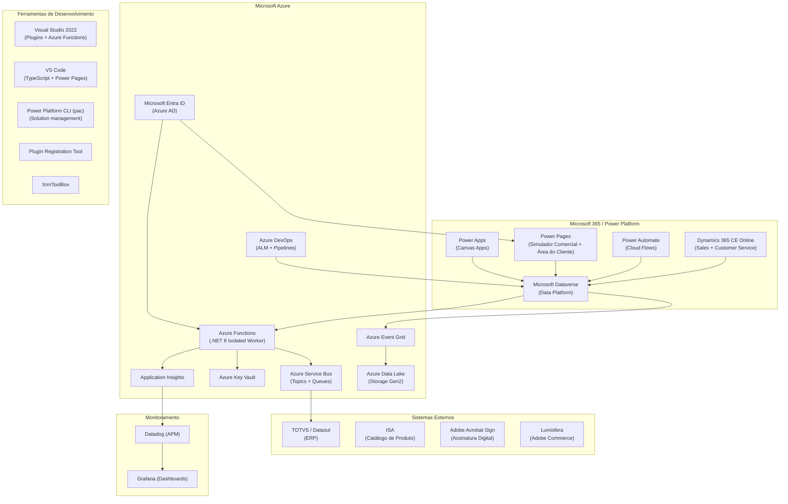

# Stack Tecnológica — FTD Educação
## Dynamics 365 CE + Power Platform + Azure + Integrações

**Cliente**: FTD Educação S/A (Grupo Marista)  
**Versão**: 1.0 | **Data**: 20/03/2026  
**Equipe**: Avanade (João Carlos Figueirôa, Rodrigo Silva — Arquitetos)

---

## 1. VISÃO GERAL DA STACK



---

## 2. PLATAFORMA PRINCIPAL

### 2.1 Dynamics 365 Customer Engagement (Online)

| Atributo | Detalhe |
|---------|---------|
| **Versão** | D365 CE 9.x (Cloud — Microsoft Managed) |
| **Deployment** | SaaS Online (sem infraestrutura própria) |
| **Módulos ativos** | Sales, Customer Service |
| **Módulos limitados** | Marketing, Field Service |
| **UI Framework** | Unified Interface (UCI) |
| **Licenciamento** | Enterprise (inclui Entra ID para Power Pages internos) |
| **Tenant** | Microsoft 365 / Azure AD FTD Educação |

**Aplicativos D365 em produção**:

| App | Módulo | Usuários Principais |
|-----|--------|-------------------|
| Spartan | Sales | 404 consultores, anjas, coordenadores, gerentes |
| PNLD | Sales | Consultores setor público |
| Hub SAC | Customer Service | Atendentes CRC |
| Adobe Sign | ISV Extension | Consultores (assinatura contratos) |
| Área do Cliente | Canvas App / Power Pages | Escolas (squad separada) |

---

### 2.2 Microsoft Dataverse

| Atributo | Detalhe |
|---------|---------|
| **Papel** | Data platform central — fonte de verdade |
| **Armazenamento** | ⚠️ CRÍTICO: já passou do limite (higienização urgente) |
| **Solutions** | 9 soluções segmentadas (deploy sequencial, numeradas) |
| **Publisher** | `ftd` (prefixo `ftd_` em tudo customizado) |
| **Security Model** | RBAC — By Business Unit (28 filiais) |
| **APIs disponíveis** | Web API (OData) + Dataverse SDK (.NET) |
| **Custom APIs** | Actions expostas internamente para consumo cross-system |
| **Webhooks** | Eventos Dataverse → Azure Service Bus / Azure Function |

---

## 3. BACKEND — LINGUAGENS E FRAMEWORKS

### 3.1 C# — Plugins Dataverse

| Atributo | Detalhe |
|---------|---------|
| **Versão .NET** | .NET Framework 4.6.2+ (Sandbox Dataverse) |
| **Padrão** | Plugin\<T\> → Service → Repository com DI (Unity) |
| **Atribute** | `[CrmPluginRegistration]` obrigatório |
| **Early Bound** | Obrigatório — gerado via `pac modelbuilder` |
| **Tracing** | `ITracingService` para todo logging |
| **Erros** | `InvalidPluginExecutionException` para erros de negócio |
| **Limites** | Timeout: 2min; Profundidade: 8 níveis; Msg: 256KB |
| **Isolation** | Sandbox (sem filesystem, sem registry) |
| **Testing** | FakeXrmEasy + MSTest — cobertura mínima 80% |
| **Tools** | Plugin Registration Tool (PRT), XrmToolBox |

### 3.2 C# — Azure Functions

| Atributo | Detalhe |
|---------|---------|
| **Versão .NET** | .NET 8 (Isolated Worker — recomendado) |
| **Hosting** | Azure Functions Premium Plan (avoid cold start no pico) |
| **Triggers** | HTTP, Service Bus, Timer, Event Grid |
| **Auth** | Managed Identity + Azure AD App Registration |
| **Secrets** | Azure Key Vault (nunca appsettings.json) |
| **Resiliência** | Polly (retry + circuit breaker) |
| **DI** | `HostBuilder` + `ConfigureServices` |
| **Logging** | `ILogger<T>` → Application Insights |
| **Observability** | Structured logging + Correlation ID propagado |
| **Testing** | xUnit + Moq — cobertura mínima 80% |
| **Dataverse** | `Microsoft.PowerPlatform.Dataverse.Client` (CDS SDK) |

### 3.3 TypeScript — PCF Controls

| Atributo | Detalhe |
|---------|---------|
| **Versão** | TypeScript 5.x (strict mode obrigatório) |
| **Framework** | React (opcional, recomendado para grids complexos) |
| **Padrão** | Contract/Controller pattern |
| **Build** | `pac pcf init → npm run build → pac pcf push` |
| **Bundle limit** | < 5MB |
| **Testing** | Jest + React Testing Library — cobertura mínima 70% |
| **Lint** | ESLint com regras Avanade |

### 3.4 JavaScript — Web Resources

| Atributo | Detalhe |
|---------|---------|
| **Versão** | ES2020+ |
| **Padrão** | Namespace `FTD.[Module].[Function]` — IIFE ou module |
| **API** | `Xrm.WebApi` para CRUD, `formContext` para UI |
| **Proibido** | `Xrm.Page` (deprecated), `alert()`, sync XMLHttpRequest |
| **Testing** | Jest (em processo de adoção) |

### 3.5 Power Fx — Canvas Apps

| Atributo | Detalhe |
|---------|---------|
| **Uso** | Área do Cliente (Canvas App — squad separada) |
| **Dados** | Dataverse Connector nativo |
| **Equipe** | Squad separada FTD (Kevellin) |

### 3.6 Liquid — Power Pages

| Atributo | Detalhe |
|---------|---------|
| **Uso** | Templates Power Pages (Simulador Comercial) |
| **Padrão** | Liquid templates + JavaScript (cache heavy + real-time calc) |
| **Auth** | Entra ID (Microsoft interno — sem custo extra) |
| **Arquitetura** | SPA (Single Page Application no MVP) |
| **Backend calls** | Dataverse Web API (mínimo possível — cache first) |
| **Cálculos** | JavaScript real-time no frontend (sem delay UX) |
| **Validação** | Azure Function para operações >50 produtos |

---

## 4. AUTOMAÇÃO — POWER AUTOMATE

| Atributo | Detalhe |
|---------|---------|
| **Tipo** | Cloud Flows (não Desktop Flows) |
| **Naming** | `FTD - [Módulo] - [Ação] - [Trigger]` |
| **Owner** | Usuário de serviço `FTDMaxFlow` (acesso restrito: Julio, Fernando, Thiago) |
| **Auth** | Connection References (não connections diretas) |
| **Error handling** | Scope Try-Catch-Finally obrigatório em TODOS |
| **Approvals** | Power Automate Approvals nativo (Teams + Outlook) |
| **Triggers principais** | Dataverse (Create/Update/Delete), Schedule, HTTP |
| **Variáveis de ambiente** | Para configurações por environment (não Key Vault) |
| **⚠️ Risco** | Limite de conexões do FTDMaxFlow (investigar Managed Identity) |

---

## 5. INTEGRAÇÃO — AZURE MESSAGING

### 5.1 Azure Service Bus

| Atributo | Detalhe |
|---------|---------|
| **Tier** | Standard ou Premium (Premium recomendado no pico) |
| **Padrão** | Topics/Subscriptions (pub/sub) para múltiplos subscribers |
| **Garantia** | At-least-once delivery |
| **Partitioning** | Habilitado para throughput no pico sazonal |
| **Dead-letter** | Configurado com alerta Datadog |
| **Sessions** | Para processamento ordenado quando necessário |

**Topics FTD (a confirmar)**:
- `ftd-proposta-eventos` (propostas aprovadas, status changes)
- `ftd-accounts-sync` (sync de contas TOTVS → CRM)
- `ftd-produtos-batch` (processamento de lote >50 produtos)
- `ftd-pedidos` (pedidos CRM → TOTVS)

### 5.2 Azure Event Grid

| Atributo | Detalhe |
|---------|---------|
| **Uso** | Data Lake sync (<15min eventual consistency) |
| **Padrão** | Event forwarding para múltiplos subscribers |
| **Fonte** | Webhooks Dataverse → Event Grid |

---

## 6. SEGURANÇA

### 6.1 Azure Key Vault

| Atributo | Detalhe |
|---------|---------|
| **Uso** | Azure Functions exclusivamente (Power Automate usa variáveis de ambiente) |
| **Auth** | Managed Identity (sem secrets configurados nas functions) |
| **Secrets** | Tokens TOTVS, Adobe Sign API Key, Lumisfera credentials, URLs externas |
| **Rotation** | Automática (recomendado para tokens de longa duração) |

### 6.2 Microsoft Entra ID (Azure AD)

| Atributo | Detalhe |
|---------|---------|
| **Power Pages** | Autenticação interna (consultores com licença Enterprise) |
| **Azure Functions** | App Registration + Managed Identity |
| **D365** | Azure AD nativo (Enterprise SSO) |
| **MFA** | Recomendado para todos os usuários com acesso a dados financeiros |

---

## 7. ALM — TOOLS & PIPELINES

### 7.1 Controle de Versão

| Ferramenta | Uso |
|-----------|-----|
| **Azure DevOps Repos** | Repositório "FTD Dynamics" (org: FTD Educação) |
| **Branch strategy** | Feature branches → `dev` (source of truth) |
| **master** | Existe mas não é usado para deploys (legacy) |
| **⚠️ Problema** | Repo desacoplado dos PBIs (migração em andamento) |

### 7.2 Power Platform CLI

```bash
# Autenticação
pac auth create --url https://ftd-dev.crm.dynamics.com --kind CdsServicePrincipal

# Export unmanaged + unpack
pac solution export --path ./solutions --name FTDSales --managed false
pac solution unpack --zipfile ./solutions/FTDSales.zip --folder ./src/FTDSales

# Deploy managed
pac solution import --path ./solutions/FTDSales_managed.zip

# PCF Control
pac pcf init --namespace FTD --name ProdutosGrid --template field
pac pcf push

# Model builder (Early Bound)
pac modelbuilder build --outputDirectory ./src/FTD.Plugins/EarlyBound
```

### 7.3 Ferramentas de Desenvolvimento

| Ferramenta | Uso | Quem usa |
|-----------|-----|---------|
| **Visual Studio 2022** | Plugins C# + Azure Functions | Devs Avanade + FTD |
| **VS Code** | TypeScript + Power Pages + YAML | Devs + UX |
| **Power Platform CLI (pac)** | Solution management, PCF, Model Builder | Todos os devs |
| **Plugin Registration Tool (PRT)** | Registro de plugin steps no Dataverse | Devs backend |
| **XrmToolBox** | FetchXML Builder, Bulk Data Operations, etc. | Todos |
| **Configuration Migration Tool** | Migração de dados de configuração entre envs | Admins |
| **Solution Packager** | Pack/Unpack de solutions para source control | Pipeline |
| **Postman / Newman** | API integration tests | QA + Devs |

### 7.4 Azure DevOps Pipelines (4 YAMLs)

| Pipeline | Trigger | Ação |
|---------|---------|------|
| **Guard (CI)** | PR para `dev` | Build + Solution Checker. Bloqueia se Critical/High violations. |
| **Deploy Code** | Manual / Post-merge | Export Unmanaged + Unpack → Commit no repo |
| **Deploy MANUAL** | Manual (com aprovação) | Import Managed → OAT ou PROD |
| **Export-Unpack** | Manual | Sincroniza repo com ambiente DEV |

---

## 8. OBSERVABILIDADE

| Ferramenta | Nível | Dados Monitorados |
|-----------|-------|------------------|
| **Datadog (APM)** | Aplicação | Plugins D365, Web Resources, tempos de resposta, erros |
| **Grafana** | Infraestrutura | Dashboards operacionais, alertas de negócio |
| **Application Insights** | Azure Functions | Traces, logs estruturados, custom metrics, p95 latency |
| **D365 Plugin Profiler** | Plugins | Debug de plugins em produção (quando necessário) |

**Métricas críticas de performance**:
- Tempo de carregamento telas críticas: p95 < ?s (a definir com Oscar)
- Tempo de recálculo totalizadores: p95 < 200ms (real-time frontend)
- Taxa de sucesso integrações: > 99.5%
- Latência sincronização TOTVS: < 5 minutos (Service Bus)

---

## 9. TESTING STRATEGY

| Tipo | Stack | Cobertura Mínima | Execução |
|------|-------|-----------------|---------|
| Plugin C# Unit | FakeXrmEasy + MSTest | **80%** | Local + Guard Pipeline |
| PCF Unit | Jest + React Testing Library | **70%** | Local + Guard Pipeline |
| Azure Functions Unit | xUnit + Moq | **80%** | Local + Guard Pipeline |
| JS Web Resources | Jest (em adoção) | Mínimo global | Recomendado |
| Integration Tests | Postman / Newman | Smoke (critical paths) | OAT pipeline |
| UAT / Acceptance | Manual + automated | Business scenarios | OAT environment |
| Performance | Load testing (a definir) | Pico sazonal | Pré-PROD |

**Shift-Left**: Testes escritos **junto com o código** — nunca depois. Task não é concluída sem testes passando 100%.

---

## 10. MATRIZ DE DECISÃO TECNOLÓGICA

| Necessidade | Tecnologia Escolhida | Alternativas Avaliadas | Motivo |
|------------|---------------------|----------------------|--------|
| Simulador Comercial (frontend) | **Power Pages** | Canvas App, Custom Page D365 | Responsivo, single codebase, licença inclusa, liberdade de layout |
| Auth Simulador | **Entra ID** | Azure AD B2C, Local Auth | Usuários internos com licença Enterprise, sem custo extra |
| Cálculos real-time proposta | **JavaScript frontend** | Plugin (sync), Azure Function | Performance instantânea, UX sem delay |
| Validação backend (>50 produtos) | **Azure Function** | Plugin (timeout 2min) | Sem limite de tempo, escalável, isolado |
| Débounce ≤50 produtos | **Plugin síncrono** | Power Automate | Simplicidade, dentro do limite 2min |
| Fluxo de aprovação | **Power Automate Approvals** | Vulcano (eliminar), Custom | UI nativa Teams/Outlook, auditável, retry |
| Integração async TOTVS | **Azure Service Bus + Function** | Power Automate HTTP | Desacoplado, resiliente, dead-letter, escalável |
| Eventos para Data Lake | **Azure Event Grid** | Service Bus, Logic Apps | Roteamento eficiente, multiple subscribers |
| Secrets management | **Azure Key Vault** | Environment variables | Segurança, rotation automática |
| Source control + CI/CD | **Azure DevOps** | GitHub | Já em uso pela FTD, integrado com D365 Build Tools |

---

## 11. GAPS E TECNOLOGIAS A AVALIAR

| Item | Status | Recomendação |
|------|--------|-------------|
| **Azure API Management** | ❌ Ausente | Avaliar para Onda 1 — governança de integrações múltiplas (ISA, TOTVS, Adobe) |
| **Infrastructure as Code (Bicep)** | ❌ Ausente | Criar templates Bicep para Azure Functions, Service Bus, Key Vault |
| **Adobe Sign → Nova tecnologia** | 🔄 Em avaliação | Definir substituto antes da Onda 1 |
| **RPA (Desktop Flows)** | ❌ Não em uso | Avaliar apenas se houver necessidade de integração com sistemas desktop legados |
| **Azure AI / Copilot** | 📅 Futuro | "Muito longe" — maturidade de dados insuficiente (Oscar, onboarding) |
| **Power BI Embedded** | 📅 A definir | Analytics do Data Lake precisam de frontend — avaliar Power BI Embedded no Simulador |

---

## 12. GLOSSÁRIO TÉCNICO

| Termo | Tecnologia | Significado |
|-------|-----------|-------------|
| **pac** | Power Platform CLI | Ferramenta CLI para gerenciar solutions, PCF, model builder |
| **PRT** | Plugin Registration Tool | Tool para registrar plugins, steps e webhooks no Dataverse |
| **Early Bound** | D365 / C# | Entidades fortemente tipadas geradas a partir do modelo Dataverse |
| **Solution Checker** | Power Platform | Análise estática de solutions — detecta problemas de performance e segurança |
| **FTDMaxFlow** | Power Automate | Usuário de serviço proprietário de todos os flows |
| **Managed Solution** | D365 ALM | Solution para deploy em produção — imutável |
| **Unmanaged Solution** | D365 ALM | Solution para desenvolvimento — editável |
| **Webhook** | Dataverse | Notificação HTTP de evento do Dataverse para sistema externo |
| **Custom API** | D365 | Endpoint reutilizável no Dataverse (substitui Custom Action) |
| **PCF** | Power Apps | PowerApps Component Framework — componentes React/TS no D365 |
| **BU** | D365 | Business Unit — unidade organizacional que controla visibilidade |
| **GMUD** | FTD | Gestão de Mudança — processo obrigatório para deploy em PROD |
| **SMAX** | FTD | Sistema de abertura de GMUDs |
| **pac modelbuilder** | Power Platform CLI | Gera classes Early Bound a partir do modelo Dataverse |
| **FakeXrmEasy** | Testing | Framework de mocking para testes unitários de plugins D365 |
| **Polly** | .NET | Biblioteca de resiliência: retry, circuit breaker, timeout |

---

*Gerado com base em: d365-config.yaml v4.29.0, d365-context.yaml, ftd-knowledge-base.md, avanade-bca-guidelines, transcrições de onboarding (Mar/2026)*
