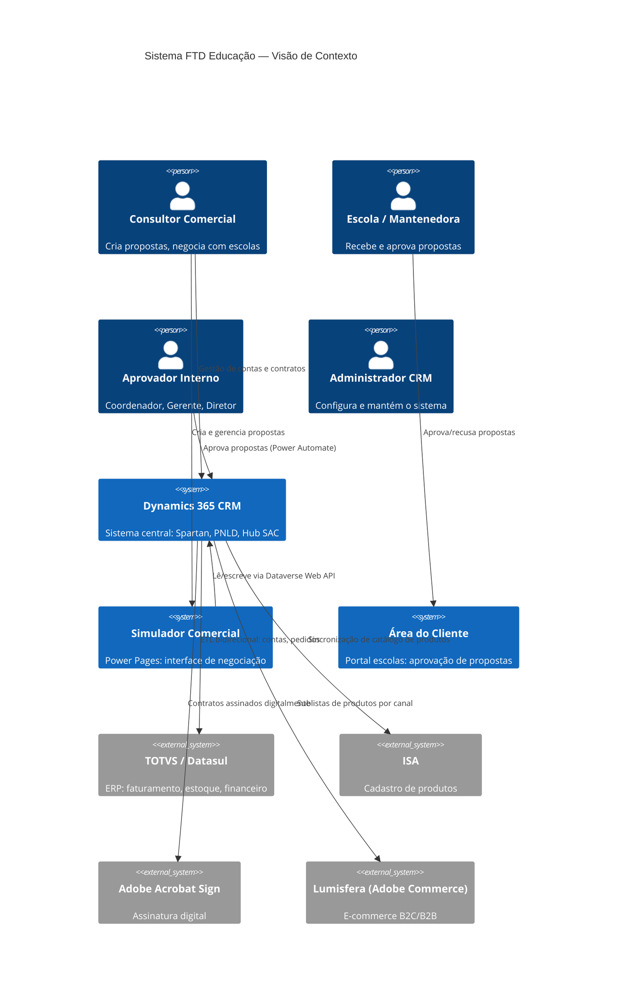
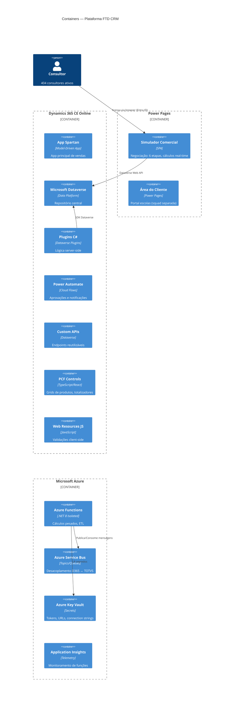

# Arquitetura de Solução — FTD Educação

> [← Voltar ao Início](./Home.md)

**Versão**: 1.0 | **Data**: 20/03/2026  
**Autores**: João Carlos Figueirôa, Rodrigo Silva (Avanade Architects)

---

## 1. Diagrama de Contexto (C4 — Level 1)



---

## 2. Diagrama de Containers (C4 — Level 2)



---

## 3. Decisões Arquiteturais

### 3.1 Tabela de Decisões

| Decisão | Escolha | Alternativas Descartadas | Motivo |
|---------|---------|--------------------------|--------|
| **Frontend Simulador** | Power Pages | Canvas App, Custom Page | Responsivo, liberdade de layout, licença inclusa, single codebase |
| **Autenticação** | Entra ID (Azure AD) | Portal externo | Usuários internos com licença Enterprise, sem custo extra |
| **Cálculos real-time** | JavaScript no frontend | Plugin síncrono a cada mudança | Performance, UX sem delay perceptível |
| **Validação backend** | Azure Functions | Apenas plugin | Proteção contra bypass, >50 produtos sem timeout |
| **Estratégia de débounce** | ≤50 → plugin sync; >50 → Azure Fn | Sempre async | Respeitar limite de 2 min de plugins |
| **Cache** | Client-side cache pesado | Sem cache | Minimizar roundtrips ao Dataverse (sem-cache por padrão) |
| **Integração ERP** | Consumir endpoints do time Veiga | CRM expõe APIs diretas | CRM não expõe APIs — time de integração separado |

### 3.2 Regra de Débounce: Plugin vs Azure Function

```
≤ 50 produtos → Plugin síncrono (Pre/Post-Operation, Stage 20/40)
> 50 produtos → Azure Function via Service Bus (assíncrono, sem timeout de 2 min)
```

> **Motivo**: Plugins têm timeout de 2 minutos. Propostas com 200 produtos precisam de Azure Function.

---

## 4. Soluções D365 (9 Soluções Segmentadas)

As soluções são numeradas com ordem de dependência para deploy sequencial:

| Ordem | Solution | Conteúdo |
|-------|----------|----------|
| 1 | **FTDCore** | Data model: entidades, campos, relationships |
| 2 | **FTDSecurity** | Security roles, field security profiles |
| 3 | **FTDPlugins** | Todos os plugins C# |
| 4 | **FTDFlows** | Power Automate flows |
| 5 | **FTDClientExtensions** | PCF controls, Web resources |
| 6 | **FTDSiteMap** | Navigation, App Modules |
| 7-9 | (+ outras ~3) | Módulos específicos (PNLD, SAC, etc.) |

**Regras de soluções**:
- Deploy SEMPRE em ordem numérica (dependência)
- Upper environments: soluções **managed** (nunca unmanaged)
- Trabalham com **patches** para releases incrementais
- **NUNCA** editar a solução Default

---

## 5. Fluxos de Dados Principais

### 5.1 Fluxo: Simulador → CRM → TOTVS

```
Consultor (Browser)
    → Power Pages Simulador
        → Dataverse Web API (leitura de produtos, contas)
        → Plugin C# (validação, cálculo de alçada)
        → Dataverse (persiste ftd_proposta)
            → Power Automate (fluxo de aprovação)
                → Aprovadores notificados (Teams/Email)
                    → Proposta Aprovada
                        → Azure Function (gera pedido)
                            → Service Bus
                                → TOTVS/Datasul (faturamento)
```

### 5.2 Fluxo: Integração de Dados (ETL 6h)

```
TOTVS/Datasul  ──[ETL 1x/dia às 6h]──▶  CRM D365
ISA (Produtos) ──[sync periódico]──────▶  Dataverse (Product catalog)
```

---

## 6. Segurança e Observabilidade

| Aspecto | Solução |
|---------|---------|
| **Autenticação** | Entra ID (usuários internos) |
| **Secrets** | Azure Key Vault (para Azure Functions) — Power Automate usa variáveis de ambiente |
| **Security Roles** | Por BU/Filial (controla visibilidade de contas) |
| **Logs** | ITracingService (plugins) + Application Insights (Azure Fn) |
| **Monitoramento** | Datadog + Grafana + Azure Application Insights |
| **Alertas** | Datadog (SLA, erros de integração, volume pico) |

---

## 7. Escalabilidade para Pico Sazonal

**Período crítico**: Novembro a Janeiro (adoção escolar)

- Pico: até **5.000 contratos/dia**
- Volume normal: ~500 contratos/dia
- Fator de pico: 10x volume normal

**Estratégias**:
- Cache client-side no Simulador (reduz queries ao Dataverse)
- Azure Functions auto-scale (isolado process)
- Service Bus para desacoplar picos de processamento
- Plugin timeout protection (débounce >50 produtos → Azure Function)

---

*Referências: [docs/arquitetura/d365-solution-architecture.md](../docs/arquitetura/d365-solution-architecture.md) | [docs/arquitetura/stack-tecnologica.md](../docs/arquitetura/stack-tecnologica.md)*
